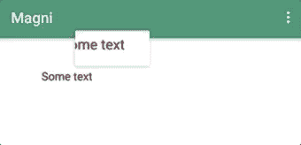
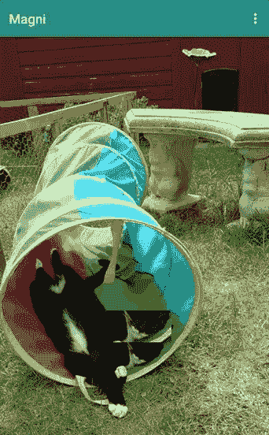

# 探索 Android P:放大镜

> 原文：<https://medium.com/google-developer-experts/exploring-android-p-magnifier-ddfd06bdecbe?source=collection_archive---------2----------------------->


在 Google I/O 上，围绕最新版本的 Android p 发布了许多新公告。其中一项公告是新的[放大镜](https://developer.android.com/reference/android/widget/Magnifier.html#show(float,%20float))功能，该功能将使查看和选择放大镜当前显示的内容变得更加容易。在本文中，我们将快速了解这个放大镜是什么，以及如何在我们的应用程序中的视图组件上使用它。

现在，如果你还没有看到 Android P 中新的[放大镜](https://developer.android.com/reference/android/widget/Magnifier.html#show(float,%20float))组件，那么这是它目前的样子:


这是一个非常简单的触摸，但它对其预期功能的影响将是巨大的。在 Android 上选择特定的文本从来都不是最简单的事情——你的手指盖住文本，你就能清楚地看到你选择的是什么，我们都经历过这种情况！这个新工具不仅使这变得更容易，而且当涉及到可访问性时，这个特性也使文本相关的任务变得更简单。我甚至可以看到用户在阅读内容时利用这个工具来关注文本。

现在最棒的事情是[放大镜](https://developer.android.com/reference/android/widget/Magnifier)自动适用于所有扩展 TextView 组件的视图——所以在大多数情况下，我们不需要在我们的应用程序中做任何改变，因为用户将能够直接从框中放大文本内容。问题是，在某些情况下，我们希望允许内容的放大，但这可能不会扩展 TextView 类。幸运的是，框架为我们提供了这样的能力。

当我们想要创建一个[放大镜](https://developer.android.com/reference/android/widget/Magnifier.html#show(float,%20float))实例时，我们只需调用类构造函数，将引用传递给我们提供放大的视图:

```
val magnifier = Magnifier(someView)
```

在这一点上，我们的放大镜被附加到视图上，但是实际上并没有对它做什么，所以我们需要添加一些逻辑来在屏幕上显示它。为此，我们将在视图上设置一个触摸监听器:

```
someView.setOnTouchListener {view, motionEvent **->** when (motionEvent.*action*) {
        MotionEvent.*ACTION_DOWN* -> {
            magnifier.show(motionEvent.*x*, motionEvent.*y*)
        }
        MotionEvent.*ACTION_MOVE* -> {
            magnifier.show(motionEvent.*x*, motionEvent.*y*)
        }
        MotionEvent.*ACTION_UP* -> {
            magnifier.dismiss()
        }
    }
    true
}
```

现在，当检测到**按下**事件时，我们要调用放大镜 [show()](https://developer.android.com/reference/android/widget/Magnifier.html#show(float,%20float)) t 函数—该函数用于在屏幕上向用户显示放大镜。这个函数调用有两个参数:

*   **xPosInView** —用于放大镜中心点的水平坐标
*   **yPosInView** —放大镜中心点的纵坐标

当我们调用这个函数时，放大镜将使用给定的坐标来显示放大镜实例中给定位置的视图内容。你会注意到，每次检测到 **ACTION_MOVE** 事件时，我们也会再次调用这个函数 *—* 这是因为当用户在屏幕上移动手指时，我们希望用触摸位置的最新坐标来更新放大镜。

**注意:**放大镜也有一个 [update()](https://developer.android.com/reference/android/widget/Magnifier.html#update()) 函数，它强制放大镜更新其内容。但是，这不需要任何参数，只使用最初传递给 show()函数的坐标。

最后，当我们检测到 **ACTION_UP** 事件时，我们只需调用放大镜解散()函数，这样放大镜就从窗口中移除了。

但是我们为什么要这么做呢？嗯，我们可能是在绘制文本，而不是在文本视图中显示它。在这种情况下，系统不会为我们提供开箱即用的放大镜。因此，在这些情况下，您会希望提供一个放大镜，以便用户仍然可以利用它给我们带来的优势:



老实说，您可能已经创建了一些其他视图，您认为放大镜会对这些视图有用。就像前面一样，当使用放大镜构造函数时，将实例传递到视图中，放大镜将被附加到视图中。



我希望这篇短文分享了一些关于 Android P 中新放大镜类的有用信息。你对这个新类有什么想法？您将如何在您的应用程序中使用它？请保持联系，分享你对此的想法和评论！

[](https://twitter.com/hitherejoe) [## 乔·伯奇(@hitherejoe) |推特

### 乔伯奇的最新推文(@hitherejoe)。Android Lead &高级工程师@Buffer。谷歌开发专家…

twitter.com](https://twitter.com/hitherejoe)