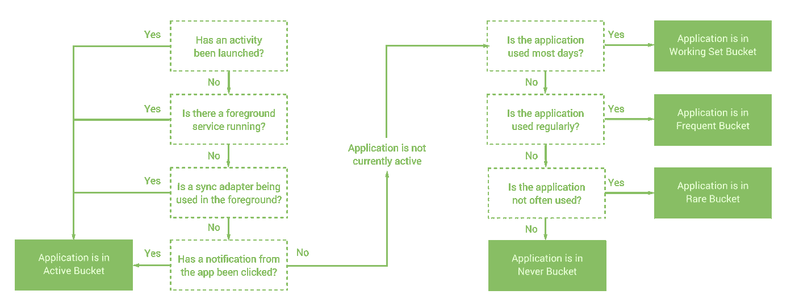
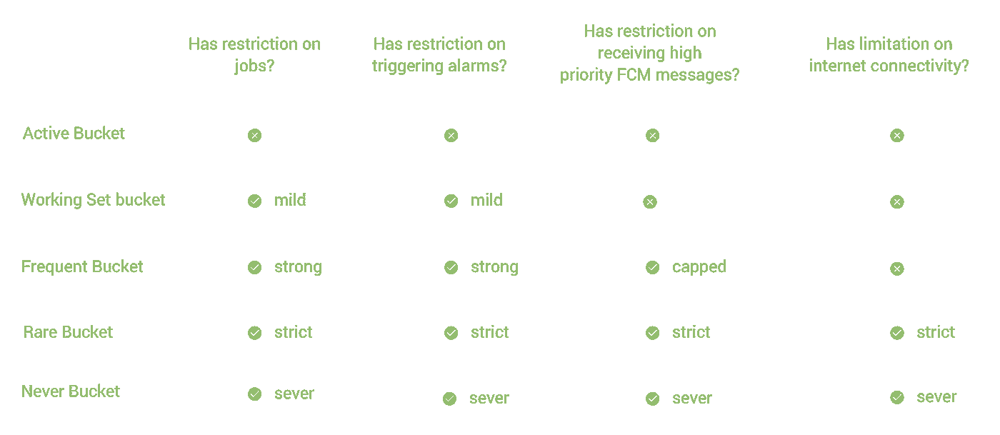

# 探索 Android P:优先级桶

> 原文：<https://medium.com/google-developer-experts/exploring-android-p-priority-buckets-d34d12059d36?source=collection_archive---------2----------------------->

在 Google I/O 上，围绕最新版本的 Android p 发布了许多新公告。其中一个公告是优先级桶，这是 Android 的一个电池管理更新，系统将根据有问题的应用程序最近的使用频率和使用频率来区分资源的优先级。在本文中，我们将快速探究这些桶是什么，以及它们将如何在这些情况下影响我们的应用程序的行为。

这些新的优先级桶旨在允许系统更智能地在应用程序之间分配资源——如果有一个你很少使用的应用程序试图在你使用你经常使用的密集型应用程序的过程中做一些后台工作，为什么你会希望后台服务能够启动并对你当前正在做的事情造成干扰？另一方面，如果能够屏蔽来自一个你很少使用也没有真正关心的应用程序的所谓高优先级消息，同时仍然能够接收你经常使用的应用程序的消息，那就太好了。出于这些目的以及更多目的，我们现在有了优先级存储桶的概念，它将我们的应用程序分组到五个不同的存储桶中的一个，每个存储桶都有系统强加的不同操作规则。应用程序将属于以下五个类别之一:

*   **活动** —用户当前正在使用的应用程序。这将是在前台的东西，有一些系统级的进程运行或以某种方式进行交互。**注意:**如果一个应用没有启动器活动，那么它可能永远不会被放入这个桶中。
*   **工作集** —一个当前没有使用但经常运行的应用程序，可能大多数时间都在运行。例如，即使时间很短，你也可能一天打开几次 Twitter 应用。
*   **频繁** —当前不使用但有时一周都打开的应用程序。例如，如果你一周跑步 3 次，那么你用来追踪跑步的应用程序就属于这种情况。
*   **稀有** —设备上很少使用的应用。比如你可能只有去度假的时候才会用到的搭车共享 app。
*   **从不** —已经安装但从未启动的应用。

现在，一旦一个应用程序被分配到一个存储桶，并不意味着它将永远呆在那里。这些存储桶是动态的，这意味着系统将根据最近的行为重新分配应用存储桶。例如，如果你的用户从来不经常使用你的应用程序，然后发现一些有价值的东西逐渐增加了他们的使用，那么你的应用程序就会向上移动。如果在设备上可用，那么系统将使用机器学习来确定应用的频率，然后根据这些预测将这些应用放入桶中。否则，应用程序将根据最近的使用情况被分类到桶中。通过**用法**有几样东西可以算作这个，比如:

*   打开应用程序的用户
*   与通知操作交互的用户。显示随后被取消的通知对应用程序存储桶状态没有任何影响。

因此，我们现在知道我们的应用程序将落入这些桶中的一个——但是这对我们到底意味着什么呢？这些桶中的每一个都有它自己的由系统强制执行的单独行为。

虽然这些限制仅在设备使用电池供电时适用，但重要的是要了解这些限制，并优化您的应用，使其仍能在这些情况下正常工作。首先，如果您的应用程序属于**活动**阶段，那么就没有任何限制，所以您不需要担心在这些情况下应用程序的行为会发生变化。

另一方面，当您的应用程序进入**工作集**桶时，就会有一些轻微的限制。在这种情况下，任何正在运行的作业最多可延迟 2 小时，任何正在触发的警报最多可延迟 6 分钟。接下来，当我们的应用程序移动到**频繁**桶中时，注册的作业可能会延迟 8 小时，警报可能会延迟 30 分钟——这与之前的桶相比有了很大的提升。此时，对于高优先级 FCM 消息也有限制，因为频繁的应用程序一天只能接收 10 条这样的消息。最后，当我们的应用程序落入**罕见的**桶中时，作业最多可以延迟 24 小时，警报最多可以延迟 2 小时。高优先级通知也下降到每天 5 个的限制，并且现在引入了网络限制，这意味着网络操作最多可以推迟 24 小时。

**注意:**重要的是要知道，如果一个应用程序被分割成不同的包，那么这些包可能都属于不同的优先级。不要依赖于包之间会出现相同的行为，因为这是不可能的。

如果您希望检查您的应用程序对于一个用户来说处于哪个桶中，那么您可以使用[getappstandbybutket()](https://developer.android.com/reference/android/app/usage/UsageStatsManager#getAppStandbyBucket())函数来完成。虽然您的应用程序应该以一种在所有情况下都是最佳的方式构建，但是这个函数在时间很重要的情况下会很方便。例如，在某个时间段内，发布到 API 的某个东西可能是至关重要的——如果某个应用程序在**稀有**桶中，那么为此安排一个作业可能没有意义，因为它可能会被推迟 24 小时。

记住这一点，重要的是不要试图改变应用程序的行为来在包之间移动应用程序。首先，不同的设备制造商可能会改变优先级存储桶的工作方式，因此您永远无法依赖应用程序放置位置的决定因素。其次，您不应该仅仅为了通过优先级桶向上移动而强制提示用户重新获得交互性，例如，试图通过高优先级通知重新获得交互以试图恢复桶状态将是一种糟糕的做法。如果你的通知提供了价值，那很好——但是不要滥用系统来提升级别。此外，您可能会达到您的高优先级配额，并且在当天的剩余时间内无法显示任何进一步的通知。

我希望这能让你对新的优先级桶以及它们如何操作有所了解。如果你对这个话题有任何问题或意见，请联系我们🙂

 [## 乔·伯奇(@hitherejoe) |推特

### 乔伯奇的最新推文(@hitherejoe)。Android Lead &高级工程师@Buffer。谷歌开发专家…

twitter.com](https://twitter.com/hitherejoe)