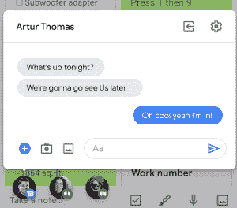
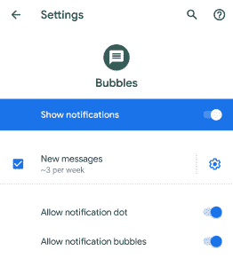

# 探索安卓 Q:泡泡

> 原文：<https://medium.com/google-developer-experts/exploring-android-q-bubbles-952d1c3be850?source=collection_archive---------1----------------------->


几周前，我们看到了 Android Q 测试版的发布

这个版本的 Android 带来了一系列令人兴奋的变化，我们需要让我们的应用程序做好准备。在这一组文章中，我将深入其中的每一篇，以便我们为应用程序做好充分准备！

正如 Android Q 的 [beta(版本 2)发行说明中所概述的，我们看到了所谓的气泡的引入。这些气泡旨在改善多任务处理，并为应用程序提供一种统一的方式来提供这种功能——尽管一些应用程序已经提供了这种功能(如 facebook messenger)，但这种系统级功能将为用户创造更一致的体验，并使开发人员更容易实现这种功能。](https://android-developers.googleblog.com/2019/04/android-q-beta-2-update.html?m=1)



在 Google 提供的[示例应用中，你可以看到一个简单的消息应用已经实现了这个功能。虽然这个和上面的截图显示了消息传递风格的交互，但气泡可用于提供对各种内容类型的访问，使您能够改善用户的多任务处理体验。例如，你可以弹出一个待办事项列表，用户可以快速恢复来标记一些事情，甚至](https://github.com/googlesamples/android-Bubbles)

气泡功能由通知相关类中的一些变化组成。通知 API 有两个核心变化，首先，通知构建器类有一个名为 [setBubbleMetaData()的新方法。](https://developer.android.com/reference/android/app/Notification.Builder#setBubbleMetadata(android.app.Notification.BubbleMetadata))这采用了新的 [BubbleMetadata](https://developer.android.com/reference/android/app/Notification.BubbleMetadata) 类的一个实例，该类将用于在所选气泡的浮动窗口中显示所需的应用程序内容。

```
Notification.Builder(context, YOUR_NOTIFICATION_CHANNEL)
    .setBubbleMetadata(someBubbleMetaData)
```

您会注意到，在构建通知时，我们会传入一个通知通道引用。这里要注意的一件重要事情是 NotificationChannel 类现在有了一个 [canBubble()](https://developer.android.com/reference/android/app/NotificationChannel.html#canBubble()) 方法——这允许我们检查我们的应用程序是否能够利用通知气泡。这是因为用户可以在应用程序的系统设置部分禁用通知气泡。NotificationChannel 还有一个 [setAllowBubbles()](https://developer.android.com/reference/android/app/NotificationChannel#setAllowBubbles(boolean)) 方法，我们可以用它来设置通道在提交给通知管理器之前是否支持气泡。



**注意:**notification manager 类中还添加了一个 [areBubblesAllowed()](https://developer.android.com/reference/android/app/NotificationManager.html#areBubblesAllowed()) 方法。在显示气泡之前，应该检查 NotificationChannel 类中的 this 和 then canBubble()方法。

现在我们已经有了通知生成器，并且已经检查过我们实际上可以为我们的应用程序显示气泡，是时候创建气泡元数据了。我们首先利用[构建器](https://developer.android.com/reference/android/app/Notification.BubbleMetadata.Builder.html)来构建我们的 BubbleMetaData。

```
Notification.BubbleMetadata.Builder()
```

然后，我们可以使用 [setAutoExpandBubble()](https://developer.android.com/reference/android/app/Notification.BubbleMetadata.Builder.html#setAutoExpandBubble(boolean)) 来声明气泡内容是否会在创建时自动扩展，前提是给定的应用程序当前位于前台。指南规定，如果用户请求显示气泡，这应该只分配给**true**——这是有意义的，因为对于用户来说，气泡突然从任何地方弹出可能是一种意想不到的行为。

接下来，我们可以使用 [setDeleteIntent()](https://developer.android.com/reference/android/app/Notification.BubbleMetadata.Builder.html#setDeleteIntent(android.app.PendingIntent)) 来分配一个意图，当用户移除气泡时应该使用这个意图。另一方面， [setIntent()](https://developer.android.com/reference/android/app/Notification.BubbleMetadata.Builder.html#setIntent(android.app.PendingIntent)) 可用于分配一个在气泡打开时使用的意图。完成后，意图的内容将显示在气泡的浮动窗口中。当显示该气泡时，相应的通知将保留在系统栏中。但是，我们可以利用构建器的[setSuppressInitialNotification()](https://developer.android.com/reference/android/app/Notification.BubbleMetadata.Builder.html#setSuppressInitialNotification(boolean))方法来声明通知不应该显示在系统栏中。当使用 setAutoExpandBubble()时，使用这种方法是有意义的，因为在这种情况下，是用户触发了气泡的启动，所以通知没有任何作用。

我们还可以为 BubbleMetadata 设置一些与显示相关的值。首先，我们可以使用 [setDesiredHeight()](https://developer.android.com/reference/android/app/Notification.BubbleMetadata.Builder.html#setDesiredHeight(int)) 为通过 setIntent()属性显示的内容指定一个高度。我们还可以使用 [setIcon()](https://developer.android.com/reference/android/app/Notification.BubbleMetadata.Builder.html#setIcon(android.graphics.drawable.Icon)) 和 [setTitle()](https://developer.android.com/reference/android/app/Notification.BubbleMetadata.Builder.html#setTitle(java.lang.CharSequence)) 来定制所显示气泡的外观。

在这篇文章中，我们快速浏览了 Android Q 中的新泡泡功能，以及我们如何在自己的应用中实现它。我非常期待应用程序利用这一点，以及它将为平台带来的一致体验。你会利用泡泡吗？或者你对泡泡有什么疑问吗？如果有，请随时联系我们！

当你在这里的时候，我正在做的一个副业项目被提名为威比奖。[非常感谢您在这里的投票](https://vote.webbyawards.com/PublicVoting#/2019/apps-mobile-and-voice/general-voice/education-reference)！

[](https://vote.webbyawards.com/PublicVoting#/2019/apps-mobile-and-voice/general-voice/education-reference) [## 威比奖人民之声需要你

### 我刚刚参加了威比奖人民之声的投票。你也应该。

vote.webbyawards.com](https://vote.webbyawards.com/PublicVoting#/2019/apps-mobile-and-voice/general-voice/education-reference)