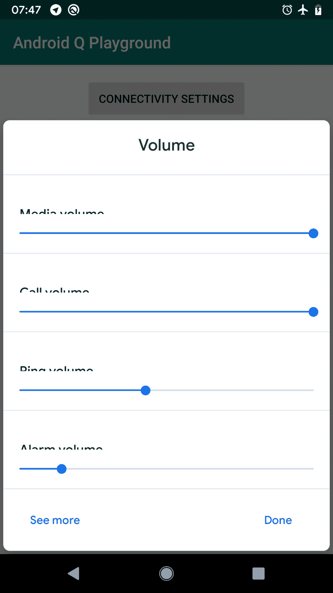

# 探索 Android Q:设置面板

> 原文：<https://medium.com/google-developer-experts/exploring-android-q-settings-panels-d308525b8345?source=collection_archive---------3----------------------->


> 他的文章最初发表在 https://joebirch.co/的 T2

它在这里！我们最近看到了 Android Q 测试版的发布🎉这个版本的 Android 带来了一系列令人兴奋的变化，我们需要让我们的应用程序做好准备。在我的下一组文章中，我将深入研究每一个问题，这样我们就可以为我们的应用做好充分准备了！

**注意:**你可以在这里找到这篇文章的代码[。](https://github.com/hitherejoe/Android-Q-Playground/tree/master)

正如 Android Q 的[测试版发行说明](https://developer.android.com/preview/features#settings-panels)中概述的，我们看到引入的新功能之一是所谓的设置面板。这些允许我们启动面板，显示我们应用程序中常用的设置——这意味着用户可以切换设置，而不必切换上下文，更不用说找到他们想要访问的设置了。这项新功能让我们可以访问三个不同的设置面板，所有这些面板都可以通过简单的 startActivity()调用来启动。


其中的每一个都为用户提供了配置这些东西的设置的方法。这些设置面板需要很少的代码来启动，我们可以用一行代码来完成:

```
startActivity(Intent(panel))
```

我们传递给这个 intent 实例的 panel 参数是对 Panel 类中定义的字符串值的引用。

# 互联网连接

在实例化我们的意图时，我们可以通过传入**ACTION _ INTERNET _ CONNECTIVITY**值来启动 internet connectivity 面板:

```
Settings.Panel.ACTION_INTERNET_CONNECTIVITY
```

正如您在下面的屏幕截图中看到的，这使我们的用户能够快速:

*   切换飞行模式
*   切换 Wifi 连接
*   更改他们的 Wifi 网络连接
*   导航至连接设置

在以下情况下，显示此面板可能会很方便:

*   提示用户连接到你的 wifi 网络(虽然，Q 提供了一些额外的功能，我们将在另一篇文章中介绍)
*   检测连接问题，提示用户检查他们的设置


# 卷

也许你的应用程序处理某种形式的媒体播放或通话——在这种情况下，你可能会以某种方式处理音频。在这种情况下，您可以通过使用 **ACTION_VOLUME** 值来使用音量面板:

```
Settings.Panel.ACTION_VOLUME
```

“音量”面板显示几个不同的音量选项:

*   媒体音量
*   通话音量
*   环形体积
*   报警音量

**注意:**目前看起来每个音量设置的文本被截断了



# 国家足球联盟

如果你的应用使用了 NFC 技术，那么你也可以使用 NFC 面板。这可以通过使用 **ACTION_NFC** 值来完成:

```
Settings.Panel.ACTION_NFC
```

这只是向用户显示 NFC 设置。对于我来说，在我的设备上，我只是看到了一个启动 NFC 偏好设置屏幕的开关，也许在未来这将会有所不同，或者使我们的副本更加清晰。


结束这篇文章，设置面板看起来像是要为我们的用户提供快速方便地更改常用设置的方法，同时保持在我们的应用程序的上下文中。虽然它们可能不会在每个应用程序中都有一席之地，但我相信许多应用程序将能够找到让用户更容易流动的用例。

目前，看起来 startActivityForResult()没有返回任何额外的数据(尽管在官方示例中使用了这一点)。最好能返回某种形式的结果(用户是否取消了表单，或者切换了某种动作)。虽然我们的应用程序应该观察某些状态，但拥有这些信息会使这种实现更简单。

无论如何，设置面板是对 Android 系统的一个很好的补充，我很高兴能投入到下一个功能中去！

[](https://twitter.com/hitherejoe) [## 乔·伯奇(@hitherejoe) |推特

### 乔伯奇的最新推文(@hitherejoe)。Android Lead @Buffer。谷歌开发专家为@Android，@GooglePay &…

twitter.com](https://twitter.com/hitherejoe)