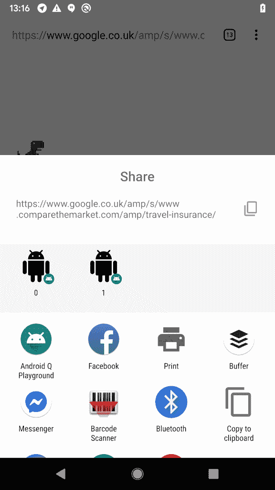

# 探索 Android Q:分享快捷方式

> 原文：<https://medium.com/google-developer-experts/exploring-android-q-sharing-shortcuts-a59e3b4821da?source=collection_archive---------2----------------------->


> 这篇文章最初发布在[https://joebirch.co/](https://joebirch.co/)

几周前，我们看到了 Android Q 测试版的发布

这个版本的 Android 带来了一系列令人兴奋的变化，我们需要让我们的应用程序做好准备。在这一组文章中，我将深入其中的每一篇，以便我们为应用程序做好充分准备！

**注:**你可以在这里找到这篇文章[的代码。](https://github.com/hitherejoe/Android-Q-Playground/tree/master)

正如 Android Q 的[测试版发行说明](https://developer.android.com/preview/features#settings-panels)所述，我们看到的变化之一是 Android 的直接分享功能的工作方式发生了一些变化。Direct Share API 允许开发人员提供我们希望通过 share sheet 共享内容的直接收件人，无论是您最喜欢的消息应用程序中的联系人还是电子邮件，这都为您提供了一种直接与他们共享内容的快捷方式。然而，尽管这个特性非常简洁，但它的执行却从来没有那么顺利。最大的问题之一是加载这些联系人的延迟——请查看下面的示例屏幕共享:


信用:[马克斯·布朗利](https://www.youtube.com/channel/UCBJycsmduvYEL83R_U4JriQ)

你会注意到这里有一个直接股票期权加载的延迟。每当我打开股票单时，这种情况也经常发生在我身上。很多时候，我会不小心与联系人分享一些东西，而不是与应用程序分享，因为在延迟之后，更多的选项被加载，并将我最初的选择推得更低。为了改善 share sheets 提供的体验，我们现在可以使用一种新方法，称为共享快捷方式。这改变了应用程序为共享提供这些直接选项的方式，这意味着当打开共享表时，它们将被更快地检索到，消除了以前会出现的一些笨拙。

要做到这一点，我们需要提供一个将在运行时使用的共享目标列表。这种实现方式非常类似于我们在应用程序中使用的快捷方式 API，它允许用户轻松访问我们应用程序的功能。类似于我们如何声明静态应用程序快捷方式，定义这些共享快捷方式首先要在我们的 **res/xml** 目录中声明一个共享目标。这里，我们用嵌套的 share-target 声明了一个 shortcuts 元素——这个目标用于定义:

*   **目标类**:用于声明共享活动被调用时要发起的活动
*   **Mime type** :应该显示共享目标的数据类型。
*   **类别名称**:共享类别的名称，这也将在配置共享目标时以编程方式使用。当涉及到共享目标时，可以定义多个类别。

例如，如果我有一个名为 **ShareActivity** 的活动处理纯文本共享，那么定义它的 **shortcuts xml** 文件将如下所示:

```
<?xml version="1.0" encoding="utf-8"?>
<shortcuts xmlns:android="http://schemas.android.com/apk/res/android">
    <share-target android:targetClass="co.joebirch.androidqplayground.ShareActivity">
        <data android:mimeType="text/plain" />
        <category android:name="co.joebirch.androidqplayground.category.TEXT_SHARE_TARGET" />
    </share-target>
</shortcuts>
```

定义好之后，我们需要在应用程序清单文件中创建对共享快捷方式的引用:

```
<activity android:name=".MainActivity">
    ... <meta-data android:name="android.app.shortcuts"
               android:resource="@xml/share_shortcuts" />
</activity>
```

接下来，我们需要将我们的快捷方式添加到系统[快捷方式管理器](https://developer.android.com/reference/android/content/pm/ShortcutManager)中，这样系统就知道我们的快捷方式，并且可以在系统共享表中显示它们。这里我们将使用 [ShortcutInfoCompat](https://developer.android.com/reference/android/support/v4/content/pm/ShortcutInfoCompat) 类的构建器，这将帮助我们创建显示在共享表中的快捷方式。

```
ShortcutInfoCompat.Builder(context, Integer.toString(id))
    .setShortLabel(id.toString())
    .setIcon(IconCompat.createWithResource(context, R.drawable.ic_android_black_24dp))
    .setIntent(Intent(Intent.ACTION_DEFAULT))
    .setLongLived()
    .setCategories(setOf(CATEGORY_TEXT_SHARE_TARGET))
    .setPerson(
        Person.Builder()
            .setName(id.toString())
            .build()
    )
    .build()
```

虽然你以前可能使用过这个类来创建应用程序的快捷方式，但是你会注意到，从 Android Q:

*   **setCategories** :虽然构建器的这一功能之前已经可用，但如果您使用共享快捷方式，现在需要进行设置。这是为了让系统能够过滤掉违反共享意图的行为。
*   **setLongLived** :当一个快捷方式被设置为长期有效时，意味着即使在它作为动态快捷方式被删除后，系统服务仍然可以从缓存中访问它。
*   **setPerson** :可以用来设置与该快捷方式关联的 [Person](https://developer.android.com/reference/android/app/Person) 实例。虽然这不是共享快捷方式所必需的属性，但它有助于系统在共享表中提供适当的建议。注意:还有一个 **setPersons** builder 函数，可以用来添加多个人员实例。

请注意，这些共享目标可能仍需要在您的应用程序中更新，因为这可能不是一次性添加它们的情况。例如，您可能正在使用一个消息应用程序，在该应用程序中，用户添加了一个可以聊天的新朋友，或者甚至想要根据用户经常与谁共享内容来更改共享快捷方式。

一旦我们有了快捷方式，我们就可以使用快捷方式管理器来添加快捷方式:

```
ShortcutManagerCompat.addDynamicShortcuts(context, shortcuts)
```

你会注意到这里我们使用的是 [ShortcutManagerCompat](https://developer.android.com/reference/android/support/v4/content/pm/ShortcutManagerCompat) 类，而不是我们之前使用的 [ShortcutManager](https://developer.android.com/reference/android/content/pm/ShortcutManager) 。 [ShortcutManagerCompat](https://developer.android.com/reference/android/support/v4/content/pm/ShortcutManagerCompat) 来自 AndroidX，在使用 DirectShare API 时为我们提供了向后兼容性，我们以前会用它来代替共享快捷方式。然而，如果我们想要利用 [ShortcutManagerCompat](https://developer.android.com/reference/android/support/v4/content/pm/ShortcutManagerCompat) ，那么我们必须向将要处理共享意图的活动添加一些额外的元数据。

```
<activity android:name=".ShareActivity">
    <intent-filter>
        <action android:name="android.intent.action.SEND" />
        <category android:name="android.intent.category.DEFAULT" />
        <data android:mimeType="text/plain" />
    </intent-filter> <meta-data
            android:name="android.service.chooser.chooser_target_service"
            android:value="androidx.sharetarget.ChooserTargetServiceCompat" /></activity>
```

我们现在可以运行我们的应用程序，调用共享操作，并看到我们的共享快捷方式显示在共享表中:



另一个需要注意的重要事情是，这些本质上仍然是 app 快捷方式。因此，当我们使用 ShortcutManager(或 ShortcutManagerCompat)添加它们时，即使它们已被添加为共享目标，当长按应用程序图标时，它们仍会从应用程序启动器中显示。

虽然不是所有的应用程序都可以使用新的共享快捷方式功能，但如果你是 Android 用户，这肯定会改善 Android 系统的体验。如果您正在开发一个目前使用 DirectShare API 的应用程序，那么迁移到这种新方法对您来说是最有利的。当设备运行 Android Q 时，使用快捷管理器的共享目标将被置于比通过 DirectShare API 添加的目标更高的优先级。如果其他应用程序已经实现了这种新的方法，那么你将面临快捷方式对用户隐藏的风险。

本文概述了我们如何在应用程序中实现共享快捷方式的新方法，以及这样做时需要注意的一些事情。这些变化会影响你的应用吗？你对上面提到的任何事情有疑问吗？请不要忘记你的任何想法！

[](https://twitter.com/hitherejoe) [## 乔·伯奇(@hitherejoe) |推特

### 乔伯奇的最新推文(@hitherejoe)。Android Lead @Buffer。谷歌开发专家为@Android，@GooglePay &…

twitter.com](https://twitter.com/hitherejoe)