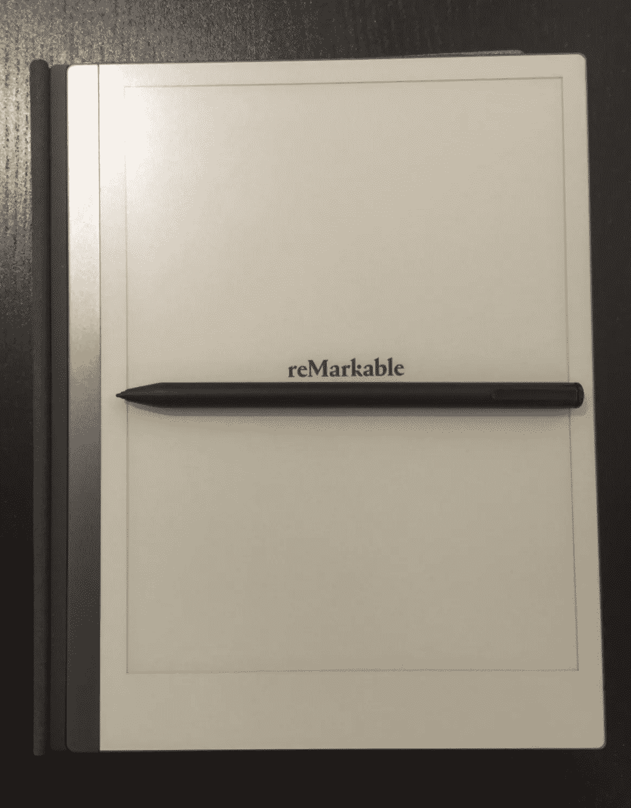

# 探索仅使用 CSS 的数字艺术

> 原文：<https://medium.com/compendium/exploring-digital-art-with-css-only-d730c5f51bc6?source=collection_archive---------2----------------------->

先说纯 CSS 是什么意思。听起来确实如此，只用 HTML divs 和 CSS 就能让东西出现在浏览器中。所以没有代码，没有库，没有依赖，超级简单，对吗？

很明显，我不是在谈论全功能的 web 应用程序(尽管我已经看到一些被模仿到令人难以置信的程度)。大多数 CSS 专用代码笔和项目都是自我施加的挑战和艺术项目，作为一名前端开发人员和艺术家，这是我一直想尝试的事情。

CSS 一直是我最喜欢的前端开发部分，但在如此多的将预制组件复制粘贴到模板中并使用 flex box 进行调整的实现之后，事情开始变得有点乏味。虽然我喜欢把时间花在观看关于又酷又方便的 CSS 技巧的视频上，但我发现在我的逻辑繁重的基于简单 UI 的 web 应用程序构建的世界中，我并不真的需要它们。

那么，对此有什么办法呢？走完全相反的方向，去掉逻辑，抛弃聪明高效的“尽可能少的 CSS”的心态，挑选一些东西去创造，看看会有什么东西出现😎

## **动机**

在我深入 CSS 部分之前，我想花点时间解释一下是什么激发了我最终尝试其中一个项目的动机。

它始于其中的一个。非凡的。我最近买了一个，用于整合我创建的 15 亿个笔记和待办事项列表，到目前为止，我很好地使用了它，但没过多久，我就把它带回家，看看我可以用它创建什么样的艺术(如果我们彼此诚实，就在同一天)。

My week one of owning a reMarkable

所以我用灰度画了一些我认为漂亮的东西，我唯一的想法是“*这难道不是一个有点可笑的艺术媒介*”(无意双关)。然后我记得在网上偶然发现了一个只有 CSS 的艺术画廊，心想“*那肯定是一个更可笑的艺术媒介*”(完全是一语双关)。

那么，有什么比将一幅出色的草图移植到纯 CSS 中，看看哪一幅更可笑更好的方式来探索荒谬呢？

那这要怎么做呢？我将向你展示我的草图和 CSS 的制作过程，因为我的最终作品融合了从每个世界借来的技术。

## 处理

对于卓越的素描，这个过程非常简单，就像一个纸笔素描。如果您愿意，您可以在这里亲自尝试一下:

[http://www . super coloring . com/drawing-tutorials/how-to-draw-a-realistic-giraffe](http://www.supercoloring.com/drawing-tutorials/how-to-draw-a-realistic-giraffe)

构造对象用于辅助粗略的构造轮廓。用一个强有力的轮廓描绘出构造轮廓，然后移除构造线(这实际上是非常了不起的，因为任何被擦除的东西都会被发送到一个未知的维度，而不是在你美丽的图上变成一个灰色的污点)。

最后是添加细节。通常我会加入细线、阴影和纹理，但由于这是我第一次将纯 CSS 艺术融入其中，我选择了“硬通”选项。

整个过程花了我大约 45 分钟。

现在。我的 CSS 进程完全是一只不同的野兽(但仍然是一只长颈鹿),简单地说花了 45 分钟，有点长。

总的来说，我主要在 div 上使用边界半径属性，同时使任意数量的边透明以获得曲线。此外，我添加了旋转和缩放变换属性，几乎所有的东西都可以快速调整。

我的大多数 CSS 选择器最终看起来如下。绝对是一种冗长的方法，但是如果我最终会有数百行 CSS 代码，我宁愿它是清晰的而不是聪明的，但是这只是我的想法。

第一眼看上去，我决定我必须画出 60 条以上的线来完全覆盖我的草图。出于某种原因，我继续这个项目，并着手寻找一种方法来组织所有这些线。

The dreaded box giraffe

总体思路是构建嵌套的 div，最高级别的父对象是长颈鹿头部、颈部、身体、尾巴的容器，每条腿一个。

我们不需要像草图那样的完整的构造轮廓，但我认为包括最初的构造对象是值得的，这样我就可以把东西相对地放在我想要的地方，以避免以后一堆微小的修改。

## 开始吧

我将提供几个例子，并解释我是如何创造长颈鹿的头的，之后我们将跳到结尾，因为就像一些艺术一样，在最初的工具和技术被弄清楚之后，项目剩下的 90%只是重复，直到完成。

Clip-path div for solid colored objects

Transparent bordered divs for curved lines

正如我之前所说的，我坚持使用第二种技术来创建曲线，并简单地在线本身和父容器上使用变换和旋转来玩一个非常奇怪的“连接点”的游戏。

对于长颈鹿的斑点和颜色，我使用这个优秀的工具为 div 创建自定义的多边形裁剪路径:

[https://bennettfeely.com/clippy/](https://bennettfeely.com/clippy/)

仅供参考，你也许可以用这个工具画出许多曲线和奇怪的形状，但是你需要记住，你不能依靠使用边框属性来勾画形状。

这样你就可以从一个矩形物体中裁剪出一个奇怪的形状，只有当你提供背景色的时候你才能看到它。最后警告，在我写这篇文章的时候，firefox 中有一个奇怪的现象，div 的外部边框仍然可见。这显然可以通过增加边框半径来解决，但我只是选择暂时切换到 chrome。

我决定在开始创建之前几乎不做任何研究，我唯一的遗憾是不知道是否有一种聪明的方法来处理有拐点的曲线而不求助于 svg。

I shall name him Grumps

最后，我需要 20 行来创建头部，还需要额外的 5 格来着色。通过大量的复制和粘贴 CSS 选择器，我完成了大约 450 行 CSS，但是头部是最复杂的部分，我预计身体的其他部分会更简单和快速。

最终的结果是一个看起来有点暴躁的长颈鹿脑袋，但是你知道，如果你的身体也不见了，你会很生气的。

## 反光

那么谁会赢得这场最荒谬的战争呢？玩笑归玩笑，问题本身肯定是赢家。

对我来说，创造的宣泄是享受过程，而过程是由创造者定义的。

我看不出把艺术打出来和在纸上画草图(不管是不是数码的)有什么区别。同样，用炭笔创作照片般逼真的图像，或者决定面包和可靠的烤面包机或手电筒是可行的方法(如果你不明白我要说的是什么，就用谷歌搜索“烤面包艺术”)。

重点是，如果你想找到重点，你可能已经错过了。

如果你问我为什么不添加一些代码并打开 canvas 和 WebGL，或 D3，或 three.js 的大门，那么我会回答“我用 CSS 这样做是因为我可以，因为我想这样做”，在这个思考过程中，我不是一个人。

我在这里展示的可能是仅使用 CSS 所能实现的最小的小土豆，我鼓励你看看让我大开眼界的视频，它充满了人们创造疯狂而美丽的东西。

[https://www.youtube.com/watch?v=CG__N4SS1Fc](https://www.youtube.com/watch?v=CG__N4SS1Fc)

现在离开我的艺术思考一大步，仍然有一些关于我的两个“实现”之间的利弊的观点。

显然，在某种程度上为此而制作的东西上绘图会更快，比如卓越，但我可以通过颜色和动画的方式用我的 CSS 长颈鹿探索更多。

所以，让我们再加入一些东西，创造一些你在非凡的画布上无法创造的东西。想象一下我的小长颈鹿朋友在落日的背景下散步。听起来很棒？嗯，我想是的，所以这就是我打算添加到这个项目，使我的土豆只是稍微大一点点。

为此，我需要添加大约一百万个独特的 CSS 动画。这是一个更技术性的冒险，所以我们将停止艺术演讲，你可以和我一起参加这个旅程的第二部分，我们将从我的长颈鹿朋友的完成版本开始，做一个全面的动画技术潜水。

直到那时，和平，欢呼，快乐的“编码”！😎