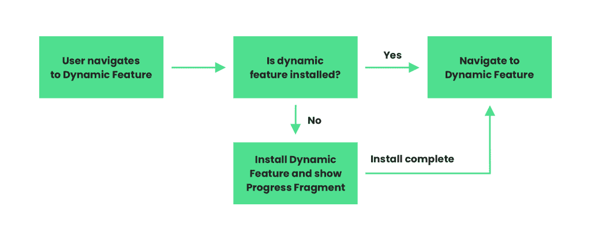
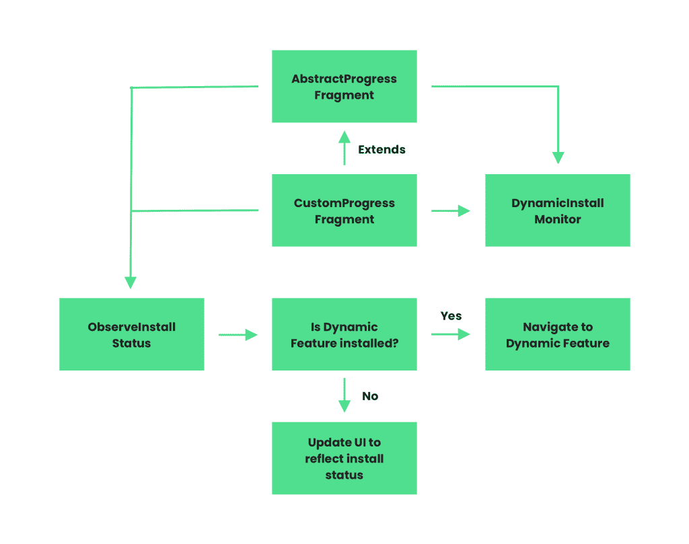
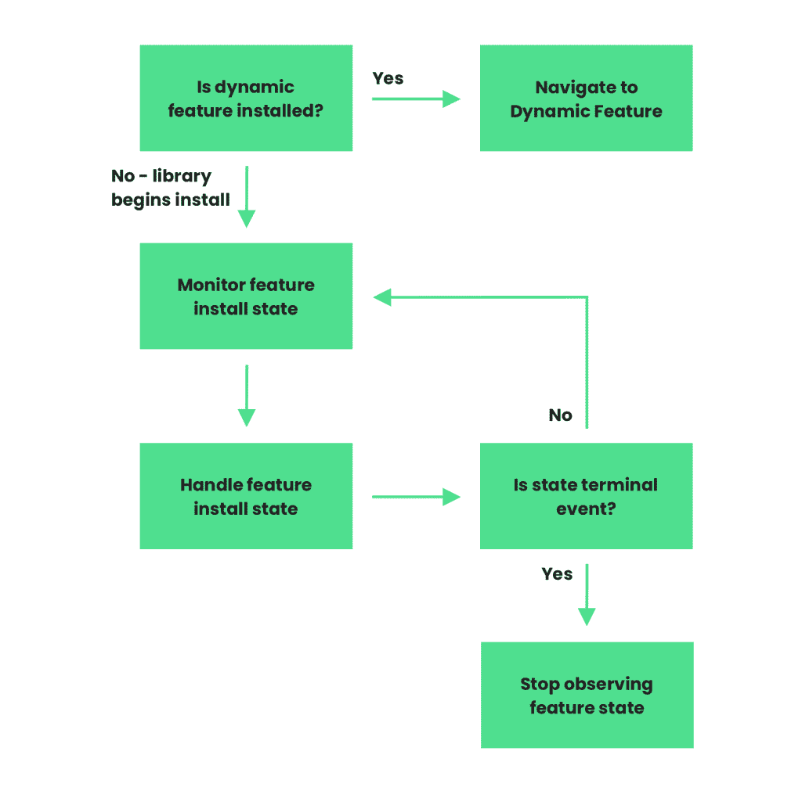
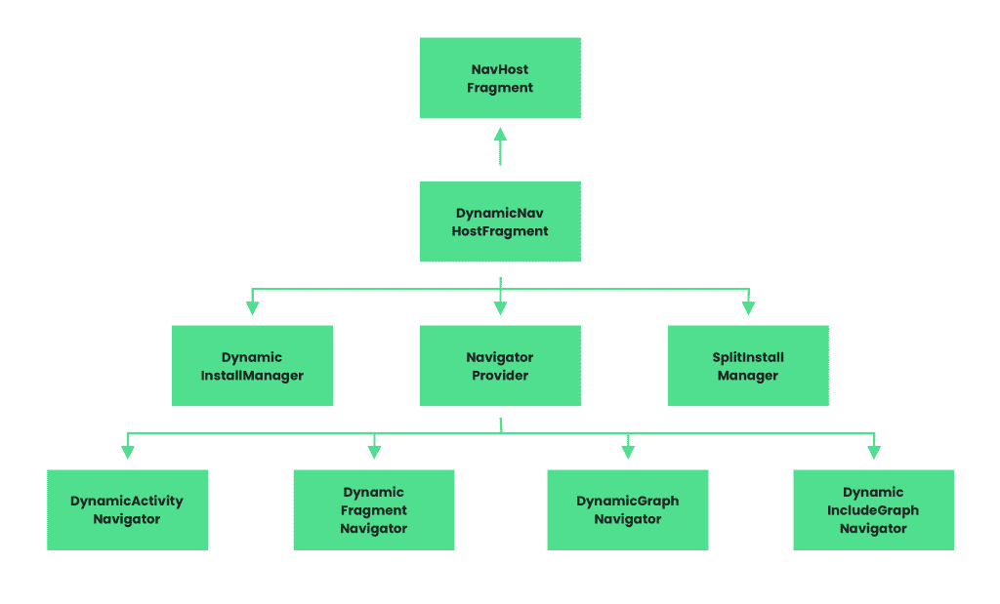
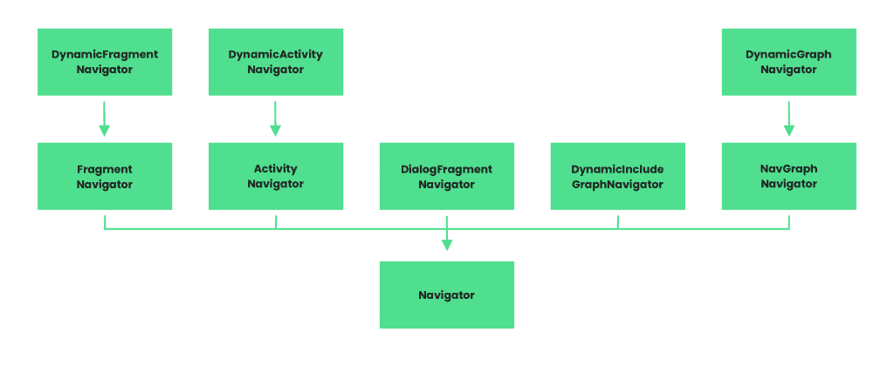
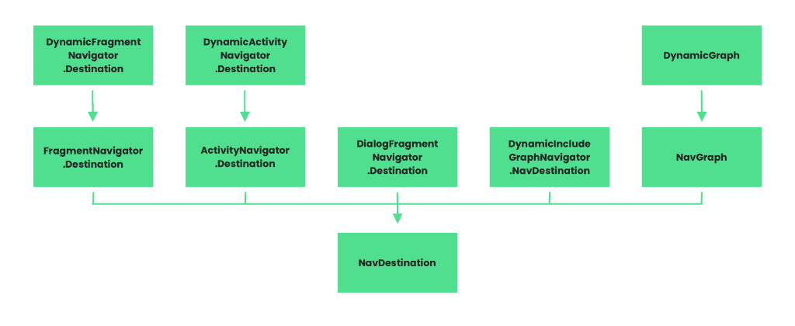

# 探索 Android 上的动态功能导航

> 原文：<https://medium.com/google-developer-experts/exploring-dynamic-feature-navigation-on-android-c803bdbbca9b?source=collection_archive---------0----------------------->


自从在 Android 上引入了[导航组件](https://developer.android.com/guide/navigation/navigation-getting-started)之后，导航我们应用程序的不同部分变得更加容易实现。我们已经能够更好地将导航逻辑从我们的活动和片段中分离出来，并且能够更容易地测试这些路径。然而，导航组件只允许我们使用 Android 应用程序或库模块中包含的组件来实现这些事情——这些不是我们的 Android 项目支持的唯一模块类型，开发人员一直渴望导航组件包含更多的模块类型。例如，当在我们的应用程序中使用[动态特性模块](https://developer.android.com/guide/app-bundle/dynamic-delivery#customize_delivery)时，不能通过使用导航组件导航到这些模块。在这些情况下，新的动态功能导航库从导航组件扩展而来，允许我们执行涉及动态功能模块中定义的目的地的导航。

虽然能够使用导航库执行动态功能导航非常有用，但可能会出现一个大问题——如果导航时动态功能实际上没有安装在设备上，该怎么办？幸运的是，新的动态导航库提供了一些类来帮助我们解决这方面的问题。因为这些模块既可以随初始应用程序下载一起提供，也可以在需要时安装，所以我们不能像处理应用程序的其他部分一样导航到这些组件。除了导航时没有安装动态功能之外，如果该功能仍在下载，或者在导航到之前下载失败，该怎么办？当谈到这些情况时，有许多不同的状态需要考虑。幸运的是，新的动态特性导航组件旨在简化这一过程，不仅处理动态特性的导航，还处理动态特性可能处于的不同安装状态。

在这篇文章中，我们将深入动态特性导航库，不仅了解如何在我们的应用程序中使用它，还了解它的组件是如何工作的。

**注意:**本文中的一些概念将引用导航组件。如果您对提到的任何概念不熟悉，那么查看导航组件的[指南/文档是值得的。](https://developer.android.com/guide/navigation/navigation-getting-started)

> *此文原帖于*[*【joebirch.co】*](https://joebirch.co/2020/02/21/exploring-the-android-11-developer-preview-permission-changes/)

# 导航至动态要素目标

在我们开始使用这个库之前，我们需要继续将依赖项添加到我们的应用程序中。值得注意的是，该库仍处于 alpha 阶段——因此，如果您有机会使用它，那么这是向开发人员提供反馈的好时机。

```
implementation "androidx.navigation:navigation-dynamic-features-
    fragment:2.3.0-alpha03"
```

如果我们以前使用导航组件库，我们的主机片段应该是这样的:

```
<androidx.fragment.app.FragmentContainerView
    android:id="@+id/nav_host_fragment"
    android:name="androidx.navigation.fragment.NavHostFragment"
    app:defaultNavHost="true"
    app:navGraph="@navigation/main_nav" />
```

当谈到动态导航器时，我们需要为新的 DynamicNavHostFragment 进行切换。这个导航主机类允许我们使用在动态功能模块中定义的目的地来处理导航。

```
<androidx.fragment.app.FragmentContainerView
    android:id="@+id/nav_host_fragment"
 **android:name="androidx.navigation.dynamicfeatures**
 **.fragment.DynamicNavHostFragment"**
    app:defaultNavHost="true"
    app:navGraph="@navigation/main_nav" />
```

现在我们的导航主机正在使用 DynamicNavHostFragment 类，我们可以继续将我们的第一个导航目的地从我们的功能模块添加到我们的图中。

```
<navigation xmlns:android="http://schemas.android.com/apk/res/android"
    xmlns:app="http://schemas.android.com/apk/res-auto"
    android:id="@+id/main_nav"
    app:startDestination="@id/mainFragment">

    <fragment
        android:id="@+id/mainFragment"
        android:name="co.joebirch.navigationsample.MainFragment" >

</navigation>
```

此时，我们有了导航图，以及定义为 mainFragment 引用的 **startDestination** 。声明后，我们现在要继续向我们的图表添加一个目的地——我们的第一个目的地将来自一个动态特征模块。让我们继续将它添加到我们的导航图中。

```
<navigation xmlns:android="http://schemas.android.com/apk/res/android"
    xmlns:app="http://schemas.android.com/apk/res-auto"
    android:id="@+id/main_nav"
    app:startDestination="@id/mainFragment">

    <fragment
        android:id="@+id/mainFragment"
        android:name="co.joebirch.navigationsample.MainFragment" />

    <fragment
        app:moduleName="feature_one"
        android:id="@+id/featureOneFragment"
        android:name="co.joebirch.feature_one.FeatureOneFragment" />

</navigation>
```

我们在这里添加了 id 为 **featureOneFragment** 的目的地。您会注意到，我们在片段目的地上设置了三个不同的属性:

*   **moduleName**–这是我们的导航目的地所在模块的名称。当定位目的地时，库将查看这个模块的内部，充当导航图和特定目的地之间的粘合剂。与应用程序/库模块导航相比，这是一项重要的附加功能。
*   **id**–导航目的地的 id
*   **名称**–用于该导航目的地的片段的名称

有了这些定义，我们的图现在有足够的信息来定位被用作目的地的片段——现在我们需要实际配置到它的导航。说到这一点，这种方法看起来非常类似于我们为应用程序和库模块导航配置导航组件的方式。

首先，我们将继续向 mainFragment 添加一个操作，这样我们就可以导航到我们的功能模块目的地:

```
<fragment
    android:id="@+id/mainFragment"
    android:name="co.joebirch.navigationsample.MainFragment" >

        <action
            android:id="
                @+id/action_mainFragment_to_featureOneFragment"
            app:destination="@id/featureOneFragment" />

</fragment>
```

从我们的代码中，我们现在可以使用一个**导航控制器**引用来触发这个动作，并执行它所定义的导航:

```
findNavController().navigate(
    R.id.action_mainFragment_to_featureOneFragment)
```

# 包括来自动态特征模块的图形

此时，我们已经使用导航图为动态功能模块添加了导航，但是在某些情况下，我们可能需要配置稍微复杂一些的导航。例如，我们可能有一个动态特性模块，它定义了自己的导航图——这需要从我们上面定义的导航图中引用。假设我们在第二个动态特征模块中定义了以下导航图:

```
<navigation    
    xmlns:android="http://schemas.android.com/apk/res/android"
    xmlns:app="http://schemas.android.com/apk/res-auto"
    app:startDestination="@id/secondFeatureFragmentOne">

    <fragment
        android:id="@+id/secondFeatureFragmentOne"
        android:name="co.joebirch.navigationsample.
            feature_two.FeatureTwoFragmentOne">

        <action
            android:id="@+id/action_secondFeatureFragmentOne
                _to_secondFeatureFragmentTwo"
            app:destination="@id/secondFeatureFragmentTwo" />
    </fragment>

    <fragment
        android:id="@+id/secondFeatureFragmentTwo"
        android:name="co.joebirch.navigationsample.
            feature_two.FeatureTwoFragmentTwo" />

</navigation>
```

在这个动态特性模块中，假设我们让它定义了自己的导航图——不管这个图是否比这个图更复杂，这有助于保持它的责任。现在，我们要将它作为我们最初定义的全局导航图的一部分，这样我们就可以导航到这个新图中定义的片段。如果我们回到主导航图，我们可以添加以下信息:

```
<include-dynamic
    android:id="@+id/featureNav"
    app:moduleName="secondFeature"
    app:graphResName="second_feature_nav"
    app:graphPackage="co.joebirch.navigationsample.feature_two" />
```

导航库中已经有了 **include** 标签，允许我们从项目中的标准库模块添加导航图。动态特性导航库添加了这个新的 **include-dynamic** 标签，该标签可用于从动态特性模块中添加对导航图的引用。该标签有四个可以定义的属性:

*   **id**–导航图的 id
*   **moduleName**–图形所在模块的名称
*   **graph resname**–用于图形的资源标识符
*   **图形包**–图形文件所在的包

将这个 **include-dynamic** 标签添加到我们原来的 **main_nav** 图中，我们现在可以在上面执行导航操作。让我们在我们的图形中替换**action _ main fragment _ to _ featureone fragment**动作，以便我们可以导航到包含在我们的 **include-dynamic** 标记中的图形。

```
<action
    android:id="@+id/action_mainFragment_to_featureNav"
    app:destination="@id/featureNav" />
```

这样，当我们从导航控制器中触发**action _ main fragment _ to _ featureNav**动作时，将显示 feature nav 图表中的 startDestination，并从该图表中获取任何后续导航行为。

# 在导航期间处理动态特征安装

虽然能够使用导航库执行动态功能导航非常有用，但可能会出现一个大问题——如果导航时设备上没有安装动态功能，该怎么办？幸运的是，动态特性导航库提供了一些类，可以帮助我们解决这方面的问题。

当导航到一个动态功能模块时，如我们图中目的地的**模块**属性所定义的，库将首先检查该功能是否安装在设备上。如果安装，将导航到目的地。否则，将显示进度片段，同时将安装动态功能，并且一旦安装完成，用户将被导航到目的地。



当出现安装过程中显示的进度片段时，它将为我们处理整个安装过程，包括任何加载、成功或出现的错误状态。这个进度片段是以 **DefaultProgressFragment** 类的形式——它从 **AbstractProgressFragment** 类扩展而来。虽然这个默认片段为我们处理一切，但我们可能希望提供我们自己的定制实现，以便在安装过程中使用。但是，强烈建议使用 DefaultProgressFragment，除非您需要为这部分流添加扩展功能，或者在缺省情况之外定制进度 UI。

当涉及到提供我们自己的进度片段时，它需要扩展 **AbstractProgressFragment** 类，这意味着我们将需要实现以下方法:

*   **onCancelled()** —当用户取消安装过程时调用
*   **on failed(error code:Int)**—当动态功能安装失败时调用，错误由提供的错误代码指示
*   **onProgress(status: Int，bytesDownloaded: Long，bytesTotal: Long)** —每当有关于动态特性安装的进度更新时调用。这里，bytesDownloaded 表示到目前为止已经下载的字节数，bytesTotal 表示需要下载的总字节数。最后，状态将是[SplitInstallSessionStatus](https://developer.android.com/reference/com/google/android/play/core/splitinstall/model/SplitInstallSessionStatus)值之一，可用于确定动态特性安装的当前状态。

一旦我们有了定制的进度片段，我们可以使用**app:progress destination**属性将它设置为处理我们安装进度的目标 ID。



# 监控动态功能安装

在某些情况下，我们可能希望为我们的动态特性实现一个非阻塞的安装流程——例如，与其显示 AbstractProgressFragment 的某种形式，我们可能希望将用户保持在他们所处的当前上下文中。这种方法可以帮助用户获得更平滑的体验，并消除任何可能来自进度屏幕的阻塞体验。

在 AbstractProgressFragment 类中，有一些内部机制在监控动态特性的安装状态，通过 **onProgress()** 覆盖将这些信息传递回我们的片段实现。这是使用 DynamicInstallMonitor 类处理的，它实际上可供我们在这个进度片段之外使用——这意味着我们可以允许用户从导航中触发安装，在他们继续当前任务的同时监视进度状态，并在安装完成后导航它们(处理过程中的任何其他状态，如错误)。



我们可以从创建对该监视器的新引用开始:

```
val installMonitor = DynamicInstallMonitor()
```

在我们开始任何监控之前，我们首先要进行导航。这样做时，我们需要传入 DynamicExtras 类的一个实例。这个类本质上充当了一个容器，让我们在处理动态特性的导航时传递属性。要构建该类的实例，我们可以使用相应的构建器来完成:

```
val dynamicExtras = DynamicExtras.Builder()
    .setInstallMonitor(installMonitor)
    .build()
```

构建器目前允许我们设置两种不同的参考:

*   **installMonitor** —用于监控动态特性当前安装状态的引用
*   **destinationExtras** —任何导航器。我们希望为导航传递的额外内容

现在我们有了对 DynamicExtras 的引用，我们可以继续在导航控制器上执行导航:

```
findNavController().navigate(
    destinationId,
    null,
    null,
    dynamicExtras
)
```

一旦我们触发了这个导航操作，我们需要立即检查我们的动态特性的安装状态。我们之前实例化的安装监视器实例允许我们使用其 isInstallRequired 字段来检查这一点，这将返回:

*   **假** —意味着不需要安装，我们可以继续执行导航
*   **真** —需要安装动态特性，这意味着我们需要观察安装状态，并在安装完成后执行导航。

此时，如果需要安装，那么我们需要观察安装状态。当安装过程自动发生时，我们检查这个安装状态，以便我们知道是否观察动态特性的安装状态。我们的 installMonitor 参考公开了一个 LiveData <splitinstallsessionstate>实例，它允许我们观察安装状态何时改变。然后，我们可以使用这个状态的值来描述应该在我们的 UI 中显示什么。最后，一旦状态表示一个终止状态，我们需要移除我们的观察者，因为不再需要观察。</splitinstallsessionstate>

```
installMonitor.status.observe(viewLifecycleOwner, 
   Observer { state ->
   when (state.status()) {
       SplitInstallSessionStatus.INSTALLED -> { }
       SplitInstallSessionStatus.REQUIRES_USER_CONFIRMATION -> {
           // Larger feature downloads require user confirmation
           splitInstallManager.startConfirmationDialogForResult(
                state,
                this,
                REQUEST_CODE_INSTALL_CONFIRMATION
           )
       }
       SplitInstallSessionStatus.FAILED -> {}
       SplitInstallSessionStatus.CANCELED -> {}
       ...
   } if (state.hasTerminalStatus()) {
       installMonitor.status.removeObservers(viewLifecycleOwner)
   }
})
```

我们可以在上面看到，流在任何时候都可能处于一系列状态，同时这取决于您计划在这里显示的 UI，动态交付的 [UX 指南](https://developer.android.com/guide/app-bundle/ux-guidelines)将有助于处理上述每个状态。

# 在后台

现在我们知道了如何在我们的应用中处理动态功能导航，我想看看事情是如何在引擎盖下工作的。

在上面的章节中，我们提到了这个 DynamicNavHostFragment 类——这个新类实际上是从用于非动态特征导航的 [NavHostFragment](https://developer.android.com/reference/androidx/navigation/fragment/NavHostFragment) 扩展而来的。DynamicNavHostFragment 这样做是为了覆盖 NavHostFragment 的 **onCreateNavController()** 函数，使用其中的新类集合来提供动态导航的功能。



如果我们从顶部开始，我们有 NavHostFragment 类——这在当前的导航库中已经可用，所以我不想对此做太多介绍。如果你还不熟悉它，这个类被用来作为导航图中显示内容的容器。如果您在上面的图表中注意到了，DynamicNavHostFragment 是动态导航库中的一个新类，它充当动态功能的导航主机——该类扩展了原始的 NavHostFragment，因此许多功能都是从该基类继承的。新的主机片段类实际上只覆盖了基类中的一个方法，onCreateNavController 方法。该覆盖用于在初始化期间配置导航逻辑的一些额外部分。

在这个 onCreateNavController 方法中，我们可以看到正在配置一组新的导航处理类。在此 onCreateNavController 过程中，所提供导航控制器的 NavigatorProvider 由动态导航所需的其他提供程序填充。

```
override fun onCreateNavController(navController: NavController) {
    super.onCreateNavController(navController) ...
    val navigatorProvider = navController.navigatorProvider
    navigatorProvider += DynamicActivityNavigator(
        requireActivity(), installManager) val fragmentNavigator = DynamicFragmentNavigator(
        requireContext(), childFragmentManager, id, installManager)
    navigatorProvider += fragmentNavigator val graphNavigator = DynamicGraphNavigator(
        navigatorProvider,
        installManager
    )
    ...
    navigatorProvider += graphNavigator
    navigatorProvider += DynamicIncludeGraphNavigator(
        requireContext(), navigatorProvider,         
        navController.navInflater, installManager)
}
```

如果我们看看默认的导航组件，我们可以看到有一个从 Navigator 抽象类扩展而来的类集合，这个类用于定义在应用程序中导航的机制。从这里扩展的类需要实现定义的方法，以便为定义的组件构建导航图。当涉及到动态特性导航时，这些原始类被重用来帮助实现动态导航。事实上，每个组件导航器都从其对应的导航器类扩展而来，覆盖 navigate()函数来处理动态特性导航的新需求。



例如，我们可以跳转到 DynamicActivityNavigator 类，并通过使用 DynamicInstallManager 来查看它处理导航的方式的不同:

```
override fun navigate(
   destination: ActivityNavigator.Destination,
   args: Bundle?,
   navOptions: NavOptions?,
   navigatorExtras: Navigator.Extras?
): NavDestination? {
   val extras = navigatorExtras as? DynamicExtras
   if (destination is Destination) {
       val moduleName = destination.moduleName
       if (moduleName != null &&
           installManager.needsInstall(moduleName)) {
           return installManager.performInstall(
               destination, args, extras, moduleName)
       }
   }
   return super.navigate(
       destination,
       args,
       navOptions,
       if (extras != null) {
           extras.destinationExtras 
       } else {
           navigatorExtras
       }
   )
}
```

与我们之前在这篇文章中看到的非常相似，对吗？检查功能是否可用，然后根据该状态处理导航的相同流程。如果没有这个新的 navigator 类，导航组件将无法处理动态特性的这些不同状态。

从导航组件中，您可能会想起 NavDestination 的概念，该类用于表示导航图中的单个节点，然后将这些节点(目的地)拼凑在一起，以创建表示应用程序导航流的图。导航组件中的每个导航器类都有自己的 NavDestination 实现。当涉及到动态特性和它们的导航器时，完全相同。



如果我们再次使用 DynamicActivityNavigator 作为示例，我们可以看到该类的目的地是从初始 ActivityNavigator 扩展而来的。目的地类别。这个目的地的定义被用来存放包含动态特性的模块名，这是最初的实现所不支持的。当导航到这个活动时，可以在 DynamicActivityNavigator 类的 navigate()方法中使用它。

```
class Destination : ActivityNavigator.Destination {
    var moduleName: String? = null constructor(navigatorProvider: NavigatorProvider) :   
        super(navigatorProvider)constructor(
        activityNavigator: 
            Navigator<out ActivityNavigator.Destination>
    ) : super(activityNavigator) override fun onInflate(context: Context, attrs: AttributeSet) {
        super.onInflate(context, attrs)
        context.withStyledAttributes(attrs, 
            R.styleable.DynamicActivityNavigator) {
            moduleName = 
                getString(
                    R.styleable.DynamicActivityNavigator_moduleName)
        }
    }
}
```

然后，导航组件以与之前相同的方式使用这些目的地类。这里，动态特征导航建立在已经存在的基础上，以扩展动态导航的功能。

正如我们从动态功能导航的源代码中可以看到的那样，导航组件的许多现有功能都是在的基础上构建的，以添加对通过动态功能导航的支持。这允许开发人员使用我们已经熟悉的导航方法，不仅在源代码中，而且在我们的项目中促进重用。

— -

在这篇文章中，我们学习了如何使用动态功能导航库来导航我们的功能模型——不管它们在用户设备上的安装状态如何。使用这个库允许我们实现无摩擦的导航流程，将大部分艰苦工作转移到这个库上，让我们专注于构建优秀的应用程序。虽然我们没有深入研究它是如何工作的，但我们已经从较高的层面了解了它是如何工作的，以及如何重用原始导航组件的代码。

综上所述，我期待看到您将如何使用这个库在您的应用程序中进行动态特性导航！如果你有任何关于如何使用它的问题，或者你想分享的想法，请在评论中联系我们🙌

感谢[本·韦斯](https://medium.com/u/65fe4f480b1c?source=post_page-----c803bdbbca9b--------------------------------)、[阿什戴维斯](https://medium.com/u/4842ea54f33e?source=post_page-----c803bdbbca9b--------------------------------) & [瓦贾哈特·卡里姆](https://medium.com/u/de373fc05086?source=post_page-----c803bdbbca9b--------------------------------)对这篇文章的评论和反馈🙌