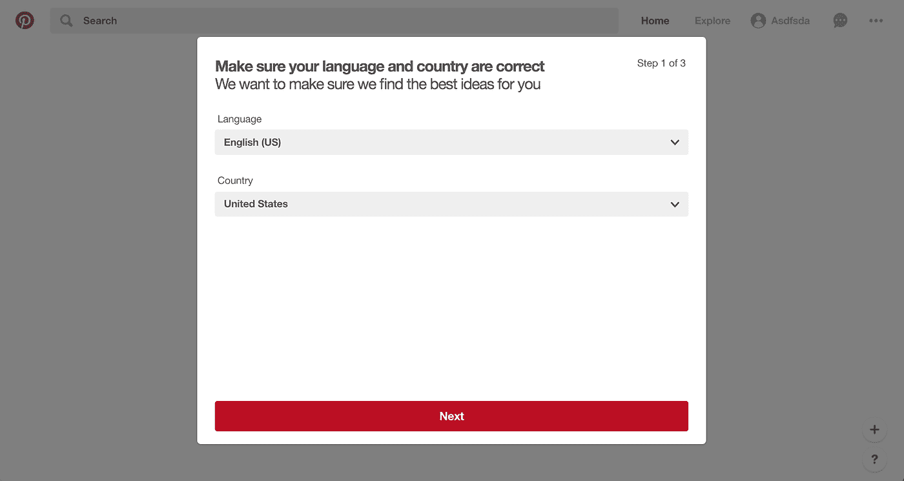

# 探索有效的用户信号

> 原文：<https://medium.com/pinterest-engineering/exploring-effective-user-signals-585507d8e926?source=collection_archive---------1----------------------->

Sophia Feng |软件工程师，成长

作为一个可视化发现工具，我们关注的一个关键领域是在适当的时候为用户提供相关的推荐。这意味着为我们每月 2 亿活跃用户中的每一个人提供个性化的想法，无论他们的兴趣或位置如何，并使用信号使他们的体验更好。例如，如果一个 Pinner 关注主题“饼干”，很可能他们对烘焙感兴趣，因此我们可以为烘焙其他东西提供建议。或者，如果 Pinner 隐藏了肉类食谱，我们可以使用该信号来推荐更多的植物性食谱。

2017 年末，增长激活团队(负责新用户激活)加倍努力更好地理解信号，以改善新用户体验。从那以后，我们已经在我们的平台上启动了 20 多个实验。通过这些实验的成功和失败，我们学到了一些关于使用信号的重要事情，我们将在本帖中分享，包括:

*   缩短入职流程以提供快速体验并不一定更好。
*   当信息与明确的价值联系在一起时，用户更容易接受分享信息(例如，如果我们知道用户是女性，我们可以在搜索中提供更相关的结果，并在美容和时尚等领域进行推荐)。
*   最大限度地减少未知信号改善了整体家庭饲料的经验。
*   信号收集是一个机会，可以让用户了解我们的产品，以及信号将如何为他们带来价值。

## **引入性别步骤**

*Users who go through this flow of signup via Google may not have gender signals collected*

我们关注的第一个主要信号是性别，因为它在我们的推荐系统如何决定提供哪些引脚方面发挥了作用。尽管这个信号很重要，但我们意识到，在注册谷歌账户的用户中，很大一部分人没有性别。

*Add a step to collect gender in the sign up flow (after Google authentication)*

我们的第一个方法是在 Google 账户认证和实际注册用户之前增加一个额外的步骤，将他们转移到新用户入职流程中。

*The additional signup step shown after user has authenticated via Google*

通过这种治疗，我们看到新用户激活增加了大约 7 %,这表明了性别信号的积极影响。不幸的是，我们也看到谷歌注册下降了 30%。我们怀疑，从用户的角度来看，传统的社交网络注册，在认证一个帐户后，它会出现在“产品中”，而不是在注册页面上。在我们的例子中，询问用户性别的额外步骤不仅不合时宜，而且会让用户感到困惑。结果，有意向注册的用户中途放弃了。

## **适时采集信号**

*Add a gender step in new user onboarding to educate user on and to collect signal*

为了避免注册下降，同时提高激活率，性别步骤必须在正确的时间触发，我们必须教育用户为什么分享是有帮助的。我们通过重新设计一个全新的性别步骤进行迭代，作为注册后新用户入职流程的一部分。新用户入职流程传统上有两个简单的步骤(即主题选择和浏览器扩展步骤)，因为用户往往会在较长的入职时间内离开。随着步骤的增加，我们期望看到实验数据的下降。

*First new user onboarding step user sees after completing sign up*

我们并不惊讶地看到实验仪表板上的激活和参与指标增加，因为上一次迭代证明了性别对个性化内容的重要性。令人惊讶的是，尽管增加了一个额外的步骤，新用户入职流程完成率仍增长了 11%。从这个实验中，我们了解到信号收集的时机是至关重要的。脱离上下文的收集会破坏用户的体验。

## **教育用户**

从之前的 Google 认证实验中，我们想探究为什么更短的入职流程不一定更好。具体来说，我们想知道指标的增加是主要来自性别步骤的存在(不一定来自收集新的信号)，还是来自性别信号本身改善了用户的主题推荐和家庭反馈。我们对通过脸书注册的用户应用了同样的待遇(尽管我们倾向于通过脸书 API 了解更多与他们相关的信号)。与谷歌的实验类似，我们看到入职流程完成增加了 8%，尽管这一用户群的性别覆盖率为 100%。这证实了性别步骤本身对用户体验有重大影响。

为了帮助教育用户为什么分享他们喜欢的性别是有帮助的，该步骤解释说，这个信号“帮助我们向[你]用户显示更多相关的内容。”因为它与一个明确的价值联系在一起，用户更容易接受提供这些信息。我们将这种学习应用于所有其他注册方式(如脸书、谷歌、电子邮件)以及我们的平台(iOS、Android、Web)，并看到了类似的成功案例。

## **下一步**

在看到性别方面的巨大成功后，我们问自己还有哪些信号有助于用户分享，以便在注册后立即看到更多个性化的想法。我们已经开始探索其他信号，如国家、地区和年龄，确保在每次信号体验中，我们教育用户提供这些信息的价值

我们不断看到新信号实验的巨大成功。增加的信号覆盖范围意味着我们在主题排名和广告定位之外的个性化方面有更多的优势。最重要的是，我们的研究表明，我们可以在不干扰用户的情况下扩大信号覆盖范围。相反，我们可以将信号收集作为教育用户的机会，并最终使他们的 Pinterest 体验更加个性化和愉快。

鸣谢:特别感谢 Shana Hu(设计师)、Phebe Huang(产品经理)、Victoria Kwong(软件工程师)、Yize Li(软件工程师)、Akul Kapoor(软件工程师)和 Kennan Davison(实习生)。