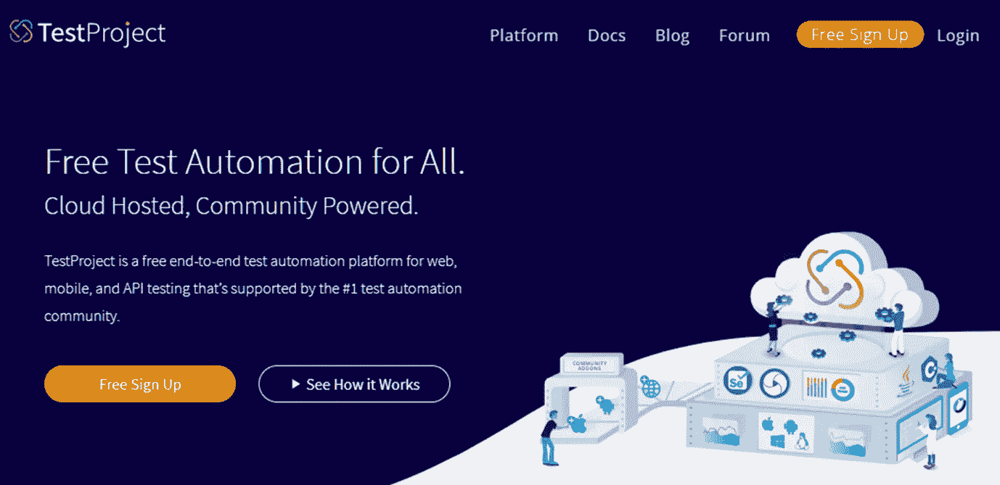
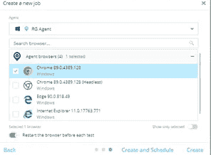

# 使用 TestProject 探索端到端测试自动化

> 原文：<https://medium.com/version-1/exploring-end-to-end-test-automation-with-testproject-337a4204e72a?source=collection_archive---------1----------------------->

作为一名软件测试工程师，在过去的 7 年中，我在监管应用程序方面积累了丰富的经验，我发现时间限制和产品质量在交付新项目时扮演着重要的角色。目前，公司正在转向新的自动化工具，这些工具涉及较少的编码工作。如果你正在寻找一个，那么 TestProject 可能是快速学习的最好工具，它是由社区驱动的，有一个完全免费的永久计划。

TestProject 是一个端到端的自动化工具，它提供了自动化 Web、API 和移动应用程序的能力。它为用户提供了强大的记录和回放功能，以及一个开发人员 SDK，并能够根据需要使用和创建插件来扩展这些功能。TestProject 构建在 Selenium 和 Appium 等开源自动化工具之上，但它消除了为需要测试的每个平台和浏览器管理和安装驱动程序的复杂性。通过安装一个可执行文件，您可以使用计算机上的所有浏览器和设备，并且可以立即开始记录、创建和执行测试。

为什么选择 TestProject？

当您试图创建测试自动化时，选择正确的工具是很重要的。在选择工具时，有几个因素需要考虑，所以让我们看看为什么您可能会使用 TestProject 的几个原因。

**易于入门:**test project recorder 是一个强大且易于使用的记录和回放工具，它可以帮助您以最小的学习曲线开始进行测试。

**全团队协作:**当整个团队可以在同一个平台上一起工作时，测试自动化工作得最好。TestProject 使得团队成员之间共享测试变得简单明了。

可扩展性:有一个共享插件库，可以帮助你扩展 TestProject 的默认功能。作为一个团队，你也可以创建自己的插件来简化你正在做的工作。

**集成到现有的工作流中:** TestProject 有一个 API，您可以使用它在现有的持续集成工作流中运行。它还有一个开发人员 SDK，允许您创建测试或将现有的测试导入到平台中

**跨浏览器跨平台:**可以创建和运行移动测试(Android 和 iOS)，TestProject 可以安装在任何平台上(Windows、Linux 或 MacOS)。只需要一个简单的安装，就可以立即在所有连接的平台和浏览器上进行测试。

**可靠的技术:** TestProject 使用 Selenium 和 Appium 等可靠且经过验证的技术，以一种健壮且易于理解的方式与网页进行交互。

**免费**！就您所获得的特性和能力而言，TestProject 提供的免费永久计划在测试自动化领域是无与伦比的。TestProject 是一个功能强大、功能全面的产品，任何人都可以免费使用。在 TestProject，我们相信要回馈测试社区，所以我们尽一切努力确保测试人员可以使用这个工具。

**支持的语言:**测试项目支持 Java、C#、Python 语言。

**支持的操作系统:** TestProject 代理可以安装在包括 Windows、Linux、macOS 在内的所有主流操作系统上，支持 Docker。

**使用 TestProject 的好处:**

*   TestProject 是一个端到端的自动化工具，它提供了自动化 Web、API 和移动应用程序的能力。
*   这是一个永远免费的开源工具。
*   TestProject 是同类中第一个社区驱动的测试自动化框架。
*   TestProject 也是第一个为敏捷团队设计的免费 SaaS 测试自动化开发框架。
*   TestProject 具有先进的内置记录功能。
*   TestProject 智能记录仪还内置了人工智能驱动的自我修复技术。
*   它无缝地支持 iFrames、Popups 和动态元素。
*   通过内置的自适应等待技术，它可以自动处理 web 应用程序加载时间的偏差。
*   TestProject 可以与其他工具集成，如 Q Test、Sauce Labs、Browser Stack、Slack。
*   设计新测试集时现有测试的可重用性。
*   在 TestProject 中参数化是可能的。
*   TestProject 中提供了优秀的内置测试报告。
*   优秀的文件夹结构来创建和维护不同类型的测试。
*   用户可以创建一个作业来运行回归测试套件或测试用例集，并设置运行每个作业的时间，用户可以在作业开始和结束时向特定的人发送电子邮件。
*   测试项目核心团队对所有问题的大力支持。
*   用户可以在 CI/CD 流程中使用 TestProject，并与 Jenkins 集成。

**安装过程:**

1.  导航到[https://test project . io](https://testproject.io)Url。

2.用 TestProject 创建一个帐户。

3.导航到代理选项卡->用户选择操作系统以下载帐户中的代理。

4.代理开始下载过程。

5.下载代理后，在您的系统中安装测试项目代理。

6.单击“完成”按钮完成安装。

7.导航回 TestProject 帐户并注册代理。

8.点击下面截图中的注册代理。

9.为代理提供一个特定的名称。

10.代理将显示在 TestProject 帐户中的代理选项卡下。

**有助于日常基础测试的不同特性:**

**1** 。**建立一个作业**:用户可以为一个项目建立一个作业，这个项目有一组测试用例，需要每天或者在每次发布之后运行。

点击 TestProject 仪表板屏幕右侧的 add a job。

选择应用程序类型。

输入作业的名称。

现在创建一个新工作。

单击“创建和计划”按钮。

作业创建成功。

只要作业在计划时间运行，用户就可以通过电子邮件发送作业结果。

用户可以将任何测试用例拖到下面的作业和列表中。

**2。内置报告功能:**

用户可以通过下面的链接下载详细的报告，并可以看到每个步骤的状态，其中附有截图。

**3。Monitor:** 用户可以监控所有当前正在运行或计划运行的测试。

**测试用例创建:**

点击屏幕上的新测试按钮。

选择测试用例类型。

输入测试用例详细信息。

选择 web 应用程序。

选择记录选项，测试将保存在云中。

点击开始录制选项。

现在开始记录测试——对于每个元素，用户可以做不同的动作和验证。

现在开始记录签到元素。

测试用例将显示在仪表板页面中。

**结论:**

对于所有的手工测试人员来说，这是用较少的编码知识学习测试自动化的最好工具。通过使用这一工具，我们可以节省时间、成本并交付高质量的产品。

这个工具是开源的，安装简单，支持端到端的自动化测试，没有任何限制。

如果有人有兴趣了解这个工具的更多信息。查看链接:[https://testproject.io/](https://testproject.io/)

