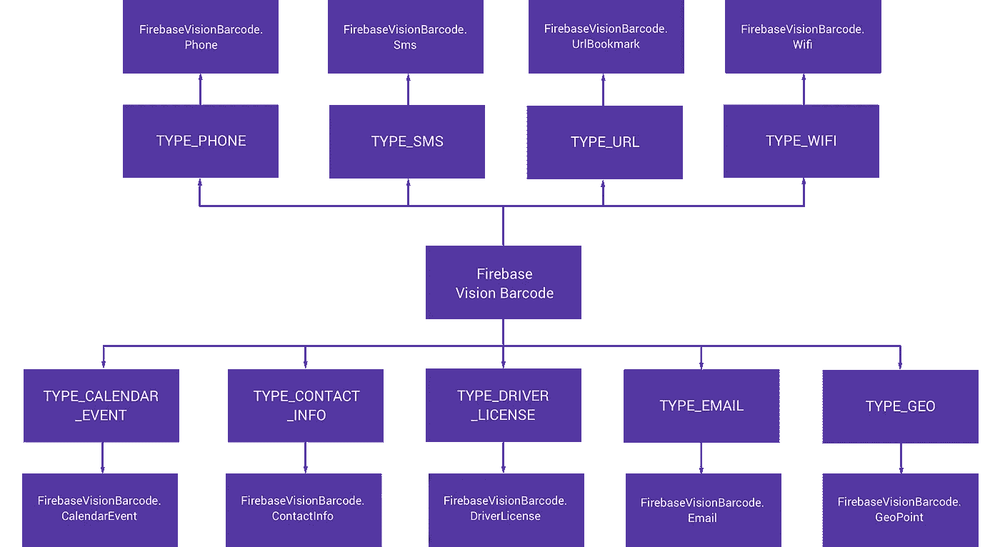
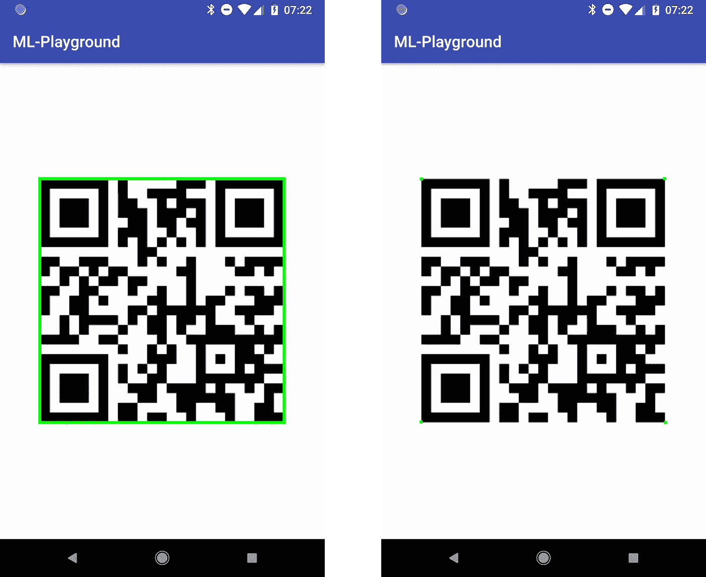

# 探索 Android 上的 Firebase MLKit:条形码扫描(第三部分)

> 原文：<https://medium.com/google-developer-experts/exploring-firebase-mlkit-on-android-barcode-scanning-part-three-cc6f5921a108?source=collection_archive---------1----------------------->


在今年的 Google I/O 上，我们看到了 Firebase MLKit 的推出，这是 Firebase 套件的一部分，旨在让我们的应用程序能够更轻松地支持智能功能。随之而来的是条形码扫描功能，使我们能够扫描条形码和 QR 码，从现实世界中检索数据，并在我们的应用程序中对其进行操作。在这篇文章中，我想深入探讨如何在我们的应用程序中实现这个特性。

当我第一次开始研究 Ml Kit 时，我承认条形码扫描功能是我最不感兴趣的功能，但在有机会阅读和使用它之后，我开始发现它是 Ml Kit 套件中经过深思熟虑的一部分。事实上，我对条形码有所了解，首先，ML 套件的条形码扫描部分支持以下条形码格式:


我要诚实地承认，我最初并不知道有这么多不同类型的条形码(我肯定这也不是全部)。如果您需要支持其中的一些(或全部)，那么 ML 工具包的条形码扫描部分将为您处理所有这些。

现在，可能是时候回答人们心中的一个问题了，但是为什么呢？条形码看起来原始而简单，但这才是重点！条形码是可以获取的，但是很多——我自己过去曾经开玩笑说“哦，不要再有一个二维码了！”，但它们的优点是不需要任何特殊或强大的硬件来读取，独立于平台，可以通过许多不同的方式读取(如相机、条形码扫描仪等)。这使得世界各地的许多不同用户和设备都可以访问条形码，无论设备有多低端，因为我们只需要一个摄像头或一些读取条形码数据的方法。

这对你的应用程序来说是个好消息，因为它 Firebase Ml Kit 现在使这个功能变得更加简单。如果您已经在使用第三方 SDK，或者要求您的用户使用另一个应用程序来实现条形码扫描功能，那么您现在可以利用 Firebase 来为您做到这一点。

在开始使用 MLKit 的条形码特性之前，我们需要先将依赖项添加到我们的项目级 build.gradle 文件中:

```
implementation 'com.google.firebase:firebase-ml-vision:16.0.0'
```

现在，如果您希望在应用程序安装时下载 MLKit 的条形码扫描部分，那么您可以在清单文件的应用程序标记中添加以下代码片段。否则，MLKit 库的条形码扫描部分将在应用程序需要时下载。

```
<meta-data
      android:name="com.google.firebase.ml.vision.DEPENDENCIES"
      android:value="barcode" />
```

现在我们已经完成了上面的工作，我们准备将条形码扫描添加到我们的应用程序中。我们可以检索为我们处理识别过程的 [VisionBarcodeDetector](https://firebase.google.com/docs/reference/android/com/google/firebase/ml/vision/barcode/FirebaseVisionBarcodeDetector) 类的实例:

```
val detector = FirebaseVision.getInstance().visionBarcodeDetector
```

当进行识别时，我们可以**选择**配置我们希望在识别过程中支持的条形码格式。这是通过一个[FirebaseVisionBarcodeDetectorOptions](https://firebase.google.com/docs/reference/android/com/google/firebase/ml/vision/barcode/FirebaseVisionBarcodeDetectorOptions.Builder)实例来完成的。我们可以使用类生成器创建一个新的实例:

```
val options = FirebaseVisionBarcodeDetectorOptions.Builder()
        .setBarcodeFormats(
                FirebaseVisionBarcode.*FORMAT_QR_CODE*,
                FirebaseVisionBarcode.*FORMAT_AZTEC*)
        .build()
```

现在我们已经定义了这个选项，我们可以使用 FirebaseVision 实例的 get 函数传入我们的 options 实例:

```
val detector = FirebaseVision.getInstance().getVisionBarcodeDetector(options)
```

既然我们已经建立了选项，我们可以继续在我们的识别流程中使用它们。我们希望使用这些选项来创建一个 [FirebaseVisionImage](https://firebase.google.com/docs/reference/android/com/google/firebase/ml/vision/common/FirebaseVisionImage) 的实例——这是一个保存图像数据的类，为识别过程做好准备。现在，我们需要这个实例，然后才能执行任何形式的识别，为了创建这个实例，我们需要使用我们的图像数据，这可以通过以下五种方式之一来完成:


## 位图

首先，我们可以使用一个位图实例创建一个 [FirebaseVisionImage](https://firebase.google.com/docs/reference/android/com/google/firebase/ml/vision/common/FirebaseVisionImage) 的实例。我们可以通过将一个**直立**位图传递到 fromBitmap()函数中来实现——这将返回一个 [FirebaseVisionImage](https://firebase.google.com/docs/reference/android/com/google/firebase/ml/vision/common/FirebaseVisionImage)

```
val image = FirebaseVisionImage.fromBitmap(bitmap);
```

## 媒体。图像

我们也可以通过媒体来实现。图像实例—这可能发生在从设备的摄像头捕捉图像时。这样做时，我们必须传递这个图像的实例以及它的旋转，所以这必须在调用 fromMediaImage()函数之前进行计算。

```
val image = FirebaseVisionImage.fromMediaImage(mediaImage,    
                rotation);
```

## 字节缓冲器

也可以使用 ByteBuffer 创建实例。为此，我们必须首先创建一个 FirebaseVisionImageMetadata 的实例。这包含构建视觉图像所需的数据，例如旋转和测量。

```
FirebaseVisionImageMetadata metadata = new 
    FirebaseVisionImageMetadata.Builder()
        .setWidth(1280)
        .setHeight(720)
        .setFormat(FirebaseVisionImageMetadata.IMAGE_FORMAT_NV21)
        .setRotation(rotation)
        .build();
```

然后，我们可以将它与 ByteBuffer 一起传递，以创建实例:

```
val image = FirebaseVisionImage.fromByteBuffer(buffer, metadata);
```

## ByteArray

从 ByteArray 创建图像的方式与 ByteBuffer 相同，只是我们必须使用 fromByteArray()函数:

```
val image = FirebaseVisionImage.fromByteArray(byteArray, metadata);
```

## 文件

通过使用上下文和期望的 URI 调用 fromFilePath()函数，可以从文件创建视觉图像实例。

```
val image: FirebaseVisionImage?
try {
    image = FirebaseVisionImage.fromFilePath(context, uri);
} catch (IOException e) {
    e.printStackTrace();
}
```

用于检索 FirebaseVisionImage 实例的方法将取决于您的应用程序以及您处理图像的方式。无论如何，此时您应该可以访问 FirebaseVisionImage 类的一个实例。此时，我们的 VisionBarcodeDetector 也已配置就绪，现在我们可以继续使用这个 FirebaseBarcodeDetector 实例来检测图像中的条形码。这可以通过调用 detectInImage()函数，传入我们的 FirebaseVisionImage 实例来实现:

```
detector.detectInImage(image)
    .addOnSuccessListener **{** // Task succeeded!
        for (barcode in **it**) {
            // Do something with barcode
        }
    **}** .addOnFailureListener **{** // Task failed with an exception
    **}**
```

现在，如果这个调用成功，那么我们将得到一个 [FirebaseVisionBarcode](https://firebase.google.com/docs/reference/android/com/google/firebase/ml/vision/barcode/FirebaseVisionBarcode) 实例的列表。如果未检测到条形码，则此栏将为空，因此如果出现这种情况，您需要处理此栏。否则，我们可以访问一组条形码，我们现在需要用它们来做一些事情。对于每个 [FirebaseVisionBarcode](https://firebase.google.com/docs/reference/android/com/google/firebase/ml/vision/barcode/FirebaseVisionBarcode) 实例，我们可以访问一组可以在这里使用的属性:

*   **getBoundingBox()** —返回一个 Rect 实例，该实例包含已识别条形码的边界框。
*   **getCornerPoints()** —返回条形码每个角的坐标。
*   **getRawValue()** —以原始格式返回条形码值
*   **getDisplayValue()** —以可读格式返回条形码值
*   **getValueType()** —返回条形码的格式类型

我们从中获取的属性中最重要的部分是条形码的值类型。这为我们提供了条形码的格式，然后描述了我们可以从 [FirebaseVisionBarcode](https://firebase.google.com/docs/reference/android/com/google/firebase/ml/vision/barcode/FirebaseVisionBarcode) 实例中获取的数据类型。条形码可表示为 9 种不同的数据类型( **TYPE_** )，每种类型都有一个数据对象，其中包含条形码数据的相关信息:



让我们来看看从条形码中读取时，它们都有什么，以及我们如何从我们的条形码实例中访问它们:

## **FirebaseVisionBarcode。CalendarEvent(类型 _ 日历 _ 事件)**

*   [getDescription](https://firebase.google.com/docs/reference/android/com/google/firebase/ml/vision/barcode/FirebaseVisionBarcode.CalendarEvent.html#getDescription()) () —返回事件的描述
*   [getStart](https://firebase.google.com/docs/reference/android/com/google/firebase/ml/vision/barcode/FirebaseVisionBarcode.CalendarEvent.html#getStart()) ()-返回 [FirebaseVisionBarcode 的一个实例。活动开始的日历日期时间](https://firebase.google.com/docs/reference/android/com/google/firebase/ml/vision/barcode/FirebaseVisionBarcode.CalendarDateTime.html)
*   [getEnd](https://firebase.google.com/docs/reference/android/com/google/firebase/ml/vision/barcode/FirebaseVisionBarcode.CalendarEvent.html#getEnd()) () —返回 [FirebaseVisionBarcode 的一个实例。活动结束的日历日期时间](https://firebase.google.com/docs/reference/android/com/google/firebase/ml/vision/barcode/FirebaseVisionBarcode.CalendarDateTime.html)
*   [获取位置](https://firebase.google.com/docs/reference/android/com/google/firebase/ml/vision/barcode/FirebaseVisionBarcode.CalendarEvent.html#getLocation()) () —返回事件的位置
*   [getOrganizer](https://firebase.google.com/docs/reference/android/com/google/firebase/ml/vision/barcode/FirebaseVisionBarcode.CalendarEvent.html#getOrganizer()) () —返回事件的组织者
*   [getStatus](https://firebase.google.com/docs/reference/android/com/google/firebase/ml/vision/barcode/FirebaseVisionBarcode.CalendarEvent.html#getStatus()) () —返回事件的状态
*   [getSummary](https://firebase.google.com/docs/reference/android/com/google/firebase/ml/vision/barcode/FirebaseVisionBarcode.CalendarEvent.html#getSummary()) () —返回 ven 的摘要

```
when (valueType) {
    FirebaseVisionBarcode.*TYPE_CALENDAR_EVENT* -> {
        val description = barcode.*calendarEvent*?.*description* val start = barcode.*calendarEvent*?.*start* val end = barcode.*calendarEvent*?.*end* val organizer = barcode.*calendarEvent*?.*organizer* val summary = barcode.*calendarEvent*?.*summary* val status = barcode.*calendarEvent*?.*status* val location = barcode.*calendarEvent*?.*location* }
}
```

## FirebaseVisionBarcode。联系人信息

*   [getAddresses](https://firebase.google.com/docs/reference/android/com/google/firebase/ml/vision/barcode/FirebaseVisionBarcode.ContactInfo.html#getAddresses()) () —返回一个 [FirebaseVisionBarcode 列表。联系人的地址](https://firebase.google.com/docs/reference/android/com/google/firebase/ml/vision/barcode/FirebaseVisionBarcode.Address.html)实例
*   [getEmails](https://firebase.google.com/docs/reference/android/com/google/firebase/ml/vision/barcode/FirebaseVisionBarcode.ContactInfo.html#getEmails()) () —返回 [FirebaseVisionBarcode 列表。联系人的电子邮件](https://firebase.google.com/docs/reference/android/com/google/firebase/ml/vision/barcode/FirebaseVisionBarcode.Email.html)
*   [getName](https://firebase.google.com/docs/reference/android/com/google/firebase/ml/vision/barcode/FirebaseVisionBarcode.ContactInfo.html#getName()) () —返回 [FirebaseVisionBarcode 的一个实例。联系人的姓名](https://firebase.google.com/docs/reference/android/com/google/firebase/ml/vision/barcode/FirebaseVisionBarcode.PersonName.html)
*   [getOrganization](https://firebase.google.com/docs/reference/android/com/google/firebase/ml/vision/barcode/FirebaseVisionBarcode.ContactInfo.html#getOrganization()) () —返回联系人的组织
*   [getPhones](https://firebase.google.com/docs/reference/android/com/google/firebase/ml/vision/barcode/FirebaseVisionBarcode.ContactInfo.html#getPhones()) () —返回 [FirebaseVisionBarcode 的列表。联系人的电话](https://firebase.google.com/docs/reference/android/com/google/firebase/ml/vision/barcode/FirebaseVisionBarcode.Phone.html)
*   [getTitle](https://firebase.google.com/docs/reference/android/com/google/firebase/ml/vision/barcode/FirebaseVisionBarcode.ContactInfo.html#getTitle()) () —返回联系人的头衔
*   [getUrls](https://firebase.google.com/docs/reference/android/com/google/firebase/ml/vision/barcode/FirebaseVisionBarcode.ContactInfo.html#getUrls()) () —返回联系人的 URL 数组

```
when (valueType) {
    FirebaseVisionBarcode.*TYPE_CONTACT_INFO* -> {
        val addresses = barcode.*contactInfo*?.*addresses* val emails = barcode.*contactInfo*?.*emails* val phones = barcode.*contactInfo*?.*phones* val names = barcode.*contactInfo*?.*name* val organization = barcode.*contactInfo*?.*organization* val title = barcode.*contactInfo*?.*title* val urls = barcode.*contactInfo*?.*urls* }
}
```

## FirebaseVisionBarcode。驾驶执照(类型 _ 驾驶执照)

*   [获取地址城市](https://firebase.google.com/docs/reference/android/com/google/firebase/ml/vision/barcode/FirebaseVisionBarcode.DriverLicense.html#getAddressCity()) () —返回许可地址的城市
*   [获取地址状态](https://firebase.google.com/docs/reference/android/com/google/firebase/ml/vision/barcode/FirebaseVisionBarcode.DriverLicense.html#getAddressState()) () —返回许可地址的状态
*   [getAddressStreet](https://firebase.google.com/docs/reference/android/com/google/firebase/ml/vision/barcode/FirebaseVisionBarcode.DriverLicense.html#getAddressStreet()) () —返回许可地址的街道
*   [getAddressZip](https://firebase.google.com/docs/reference/android/com/google/firebase/ml/vision/barcode/FirebaseVisionBarcode.DriverLicense.html#getAddressZip()) () —返回许可证地址的邮政编码
*   [getBirthDate](https://firebase.google.com/docs/reference/android/com/google/firebase/ml/vision/barcode/FirebaseVisionBarcode.DriverLicense.html#getBirthDate()) () —返回许可证持有者的出生日期
*   getDocumentType ()-返回文档类型(驾照或身份证)
*   [getExpiryDate](https://firebase.google.com/docs/reference/android/com/google/firebase/ml/vision/barcode/FirebaseVisionBarcode.DriverLicense.html#getExpiryDate()) () —返回许可证的到期日期
*   [getFirstName](https://firebase.google.com/docs/reference/android/com/google/firebase/ml/vision/barcode/FirebaseVisionBarcode.DriverLicense.html#getFirstName()) () —返回许可证持有者的名字
*   [getMiddleName](https://firebase.google.com/docs/reference/android/com/google/firebase/ml/vision/barcode/FirebaseVisionBarcode.DriverLicense.html#getMiddleName()) () —返回许可证持有者的中间名
*   [getLastName](https://firebase.google.com/docs/reference/android/com/google/firebase/ml/vision/barcode/FirebaseVisionBarcode.DriverLicense.html#getLastName()) () —返回许可证持有人的姓氏
*   [getGender](https://firebase.google.com/docs/reference/android/com/google/firebase/ml/vision/barcode/FirebaseVisionBarcode.DriverLicense.html#getGender()) () —返回许可证持有者的性别
*   [获取发布日期](https://firebase.google.com/docs/reference/android/com/google/firebase/ml/vision/barcode/FirebaseVisionBarcode.DriverLicense.html#getIssueDate()) () —返回许可证的发布日期
*   [getIssuingCountry](https://firebase.google.com/docs/reference/android/com/google/firebase/ml/vision/barcode/FirebaseVisionBarcode.DriverLicense.html#getIssuingCountry()) () —返回许可证的发行国
*   [getLicenseNumber](https://firebase.google.com/docs/reference/android/com/google/firebase/ml/vision/barcode/FirebaseVisionBarcode.DriverLicense.html#getLicenseNumber()) () —返回许可证号

```
when (valueType) {
    FirebaseVisionBarcode.*TYPE_DRIVER_LICENSE* -> {
        val city = barcode.*driverLicense*?.*addressCity* val state = barcode.*driverLicense*?.*addressState* val street = barcode.*driverLicense*?.*addressStreet* val zip = barcode.*driverLicense*?.*addressZip* val birthDate = barcode.*driverLicense*?.*birthDate* val document = barcode.*driverLicense*?.*documentType* val expiry = barcode.*driverLicense*?.*expiryDate* val firstName = barcode.*driverLicense*?.*firstName* val middleName = barcode.*driverLicense*?.*middleName* val lastName = barcode.*driverLicense*?.*lastName* val gender = barcode.*driverLicense*?.*gender* val issueDate = barcode.*driverLicense*?.*issueDate* val issueCountry = barcode.*driverLicense*?.*issuingCountry* val licenseNumber = barcode.*driverLicense*?.*licenseNumber* }
}
```

## FirebaseVisionBarcode。电子邮件(电子邮件类型)

*   [getAddress](https://firebase.google.com/docs/reference/android/com/google/firebase/ml/vision/barcode/FirebaseVisionBarcode.Email.html#getAddress()) () —返回电子邮件使用的电子邮件地址
*   [getBody](https://firebase.google.com/docs/reference/android/com/google/firebase/ml/vision/barcode/FirebaseVisionBarcode.Email.html#getBody()) () —返回电子邮件的正文
*   getSubject () —返回电子邮件的主题
*   [getType](https://firebase.google.com/docs/reference/android/com/google/firebase/ml/vision/barcode/FirebaseVisionBarcode.Email.html#getType()) () —返回电子邮件的类型(家庭、工作、未知)

```
when (valueType) {
    FirebaseVisionBarcode.*TYPE_EMAIL* -> {
        val type = barcode.*email*?.*type* val address = barcode.*email*?.*address* val body = barcode.*email*?.*body* val subject = barcode.*email*?.*subject* }
}
```

## FirebaseVisionBarcode。地理点(类型 _ 地理)

*   [get lat](https://firebase.google.com/docs/reference/android/com/google/firebase/ml/vision/barcode/FirebaseVisionBarcode.GeoPoint.html#getLat())()-返回相应地理点的纬度
*   [getLng](https://firebase.google.com/docs/reference/android/com/google/firebase/ml/vision/barcode/FirebaseVisionBarcode.GeoPoint.html#getLng()) () —返回相应地理点的经度

```
when (valueType) {
    FirebaseVisionBarcode.*TYPE_GEO* -> {
        val lat = barcode.*geoPoint*?.*lat* val lng = barcode.*geoPoint*?.*lng* }
}
```

## FirebaseVisionBarcode。电话(电话类型)

*   [getNumber](https://firebase.google.com/docs/reference/android/com/google/firebase/ml/vision/barcode/FirebaseVisionBarcode.Phone.html#getNumber()) () —返回相应电话实例的号码
*   [getType](https://firebase.google.com/docs/reference/android/com/google/firebase/ml/vision/barcode/FirebaseVisionBarcode.Phone.html#getType()) () —返回电话的类型(传真、家庭、移动、工作、未知)

```
when (valueType) {
    FirebaseVisionBarcode.*TYPE_PHONE* -> {
        val number = barcode.*phone*?.*number* val type = barcode.*phone*?.*type* }
}
```

## FirebaseVisionBarcode。短信(短信类型)

*   [getMessage](https://firebase.google.com/docs/reference/android/com/google/firebase/ml/vision/barcode/FirebaseVisionBarcode.Sms.html#getMessage()) () —返回给定短信的消息
*   [getPhoneNumber](https://firebase.google.com/docs/reference/android/com/google/firebase/ml/vision/barcode/FirebaseVisionBarcode.Sms.html#getPhoneNumber()) () —返回与给定短信相关的电话号码

```
when (valueType) {
    FirebaseVisionBarcode.*TYPE_SMS* -> {
        val message = barcode.*sms*?.*message* val number = barcode.*sms*?.*phoneNumber* }
}
```

## FirebaseVisionBarcode。UrlBookmark (TYPE_URL)

*   [getTitle](https://firebase.google.com/docs/reference/android/com/google/firebase/ml/vision/barcode/FirebaseVisionBarcode.UrlBookmark.html#getTitle()) () —返回给定书签的标题
*   getUrl () —返回给定书签的 Url

```
when (valueType) {
    FirebaseVisionBarcode.*TYPE_URL* -> {
        val title = barcode.*url*?.*title* val url = barcode.*url*?.*url* }
}
```

## FirebaseVisionBarcode。无线网络(无线网络类型)

*   [getEncryptionType](https://firebase.google.com/docs/reference/android/com/google/firebase/ml/vision/barcode/FirebaseVisionBarcode.WiFi.html#getEncryptionType()) () —返回给定网络的加密类型(开放、WEP 或 WPA)
*   [获取密码](https://firebase.google.com/docs/reference/android/com/google/firebase/ml/vision/barcode/FirebaseVisionBarcode.WiFi.html#getPassword()) () —返回给定 WIFI 网络的密码
*   [getSsid](https://firebase.google.com/docs/reference/android/com/google/firebase/ml/vision/barcode/FirebaseVisionBarcode.WiFi.html#getSsid()) () —返回给定 WIFI 网络的 Ssid

```
when (valueType) {
    FirebaseVisionBarcode.*TYPE_WIFI* -> {
        val ssid = barcode.*wifi*?.*ssid* val password = barcode.*wifi*?.*password* val type = barcode.*wifi*?.*encryptionType* }
}
```

除了从条形码中检索到的与条形码格式相关的数据之外，如前所述，我们还可以访问诸如条形码边界和边角等内容。在下图中，我获取了扫描请求返回的 **FirebaseVisionBarcode** 实例的 boundingBox 属性。使用边界框的属性，我可以在最初传递给扫描仪的条形码图像上画出这些边界。你可以在你的应用程序中使用这些界限来做类似的事情——这样做可以让你的用户知道他们试图扫描的条形码已经被你的应用程序中当前正在进行的扫描操作成功识别。

不过，有时你可能不想显示围绕整个条形码的整个边界框——在这种情况下, **FirebaseVisionBarcode** 也返回我们一个 **cornerPoints** 属性。在这种情况下，您可以简单地使用这些角点将这些点绘制到画布上。你也可以用它在条形码上画出某种形式的自定义轮廓，这种轮廓可能只延伸到条形码上的某一点。



哇，使用 MLKit 进行条形码扫描真是太棒了，不是吗！从这篇文章中，我希望您能够看到 Firebase 为我们的应用程序简化了扫描过程。你有什么想法？如果您有任何意见或问题，请联系我们🙂

[](https://twitter.com/hitherejoe) [## 乔·伯奇(@hitherejoe) |推特

### 乔伯奇的最新推文(@hitherejoe)。Android Lead &高级工程师@Buffer。谷歌开发专家…

twitter.com](https://twitter.com/hitherejoe)