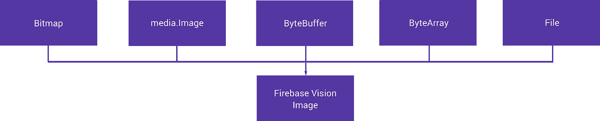

# 探索 Android 上的 Firebase MLKit:人脸检测(第二部分)

> 原文：<https://medium.com/google-developer-experts/exploring-firebase-mlkit-on-android-face-detection-part-two-de7e307c52e0?source=collection_archive---------1----------------------->


在今年的 Google I/O 上，我们看到了 Firebase MLKit 的推出，这是 Firebase 套件的一部分，旨在让我们的应用程序能够更轻松地支持智能功能。随之而来的是面部识别功能，让我们能够识别面部以及这些面部的“标志”(鼻子、眼睛等)和表情。在这篇文章中，我想深入探讨如何在我们的应用程序中实现这个特性。

在我们的应用程序中有很多情况下，我们可能希望利用人脸检测。也许你想进行面部验证，给照片加标签或者给相机添加滤镜——有很多可能性。现在这一功能已经成为 MLKit 库的一部分，将它添加到我们的应用程序中不会有很多障碍。说到面部识别，MLKit 允许我们检测以下特征:

*   鼻子底部的坐标
*   嘴右侧的坐标
*   嘴左侧的坐标
*   嘴底部的坐标
*   脸在微笑的概率
*   右眼睁开的概率
*   左眼睁开的概率
*   检测到的人脸的边界
*   被检测面的旋转角度
*   被检测面部的倾斜角度

哇，这是一个非常好的数据列表，我们可以检索检测到的人脸！现在，需要注意的是，MLKit 的人脸识别功能**仅作为设备上识别功能**提供，您无法在云端执行人脸识别。就用户的个人数据而言，这可能是一件好事，但也很重要，因为它降低了实现它的复杂性。

MLKit 人脸识别包含三个核心概念:


首先，**面部跟踪**是基于面部特征跟踪面部的概念。如果识别出一张人脸，那么它可以跨图像(甚至视频帧)再次被识别。这本身不是面部识别，而是识别中的一个概念，允许我们在媒体的一些过程中跟踪面部。

还有不同的**地标**点组成一张脸。这些东西包括单眼(无论是左眼还是右眼)、右脸颊、嘴巴的左侧——所有这些都是已识别人脸上的标志，所有这些都可以使用 MLKit 进行识别。可以检测到的界标取决于面部的欧拉 Y 角(当面部转向左侧时为正 Y 角，当面部转向右侧时为负 Y 角)。基于这些值，我们可以检测到以下内容:


您可以看到，当头部从一侧转到另一侧时，可用于检测的特征会发生变化。这一点值得记住——重要的是欧拉角可以从已识别的人脸中获得，因此可以提示用户将头转向所需的方向，以改善识别过程。**注:**这些欧拉角只有在探测器处于**精确**模式下才可用。

最后，**分类**是分析一个特定特征是否存在于一张脸上的概念。例如，在 MLKit 的情况下，我们可以检查面部微笑的概率。这一分类过程只适用于正面人脸，即具有小欧拉 Y 角的人脸。

在开始使用 MLKit 的人脸识别功能之前，我们需要先将依赖项添加到我们的项目级 build.gradle 文件中:

```
implementation 'com.google.firebase:firebase-ml-vision:16.0.0'
```

现在，如果您希望在应用程序安装时下载 MLKit 的人脸识别部分，那么您可以在清单文件的应用程序标记中添加以下代码片段。否则，MLKit 库的人脸识别部分将在您的应用程序中需要时下载。

```
<meta-data
      android:name="com.google.firebase.ml.vision.DEPENDENCIES"
      android:value="face" />
```

现在我们已经完成了上面的工作，我们准备将人脸识别添加到我们的应用程序中。说到面部识别，我们可以为识别过程配置一些不同的选项。这是通过一个[firebasevisionfacededetectoroptions](https://firebase.google.com/docs/reference/android/com/google/firebase/ml/vision/face/FirebaseVisionFaceDetectorOptions.Builder)实例来完成的。我们可以使用类生成器创建一个新的实例:

```
val options = FirebaseVisionFaceDetectorOptions.Builder()
```

然后可以用一组不同的属性进行配置:

*   **检测模式**——用于说明识别过程应该偏向速度还是准确度，可以设置为**ACCURATE _ MODE**或 FAST _ MODE。这默认为 FAST_MODE。

```
.setModeType(FirebaseVisionFaceDetectorOptions.*ACCURATE_MODE*).setModeType(FirebaseVisionFaceDetectorOptions.*FAST_MODE*)
```

*   **界标检测** —用于声明识别过程是否应识别面部界标，如鼻子、眼睛、嘴巴等。这默认为 NO_LANDMARKS *。*

```
.setLandmarkType(FirebaseVisionFaceDetectorOptions.*ALL_LANDMARKS*).setLandmarkType(FirebaseVisionFaceDetectorOptions.NO*_LANDMARKS*)
```

*   **特征分类** —用于声明识别过程是否应该对面部特征进行分类，例如面部是否在微笑或眼睛是否睁开。这默认为 NO_CLASSIFICATIONS。

```
.setClassificationType(FirebaseVisionFaceDetectorOptions.*ALL_CLASSIFICATIONS*).setClassificationType(FirebaseVisionFaceDetectorOptions.*NO_CLASSIFICATIONS*)
```

*   **最小面部尺寸** —用于定义待检测面部的最小尺寸(相对于给定图像)。该值默认为 0.1f。

```
.setMinFaceSize(0.15f)
```

*   **启用面部跟踪** —用于声明是否应为面部分配 ID，以便在图像间跟踪面部。这默认为假。

```
.setTrackingEnabled(true).setTrackingEnabled(false)
```

将所有这些放在一起，您将会有大致如下的内容:

```
val options = FirebaseVisionFaceDetectorOptions.Builder()
        .setModeType(FirebaseVisionFaceDetectorOptions.*FAST_MODE*)
        .setLandmarkType(
            FirebaseVisionFaceDetectorOptions.*ALL_LANDMARKS*)      
        .setClassificationType(
            FirebaseVisionFaceDetectorOptions.*ALL_CLASSIFICATIONS*)
        .setMinFaceSize(0.15f)
        .setTrackingEnabled(true)
        .build()
```

如果您没有用构建器设置任何选项，那么它们将被设置为上面提到的默认值。

既然我们已经建立了选项，我们可以继续在我们的识别流程中使用它们。我们希望使用这些选项来创建一个 [FirebaseVisionImage](https://firebase.google.com/docs/reference/android/com/google/firebase/ml/vision/common/FirebaseVisionImage) 的实例——这是一个保存图像数据的类，为识别过程做好准备。现在，我们需要这个实例，然后才能执行任何形式的识别，为了创建这个实例，我们需要使用我们的图像数据，这可以通过以下五种方式之一来完成:



## 位图

首先，我们可以使用一个位图实例创建一个 [FirebaseVisionImage](https://firebase.google.com/docs/reference/android/com/google/firebase/ml/vision/common/FirebaseVisionImage) 的实例。我们可以通过将一个**直立**位图传递到 fromBitmap()函数中来实现——这将返回一个 [FirebaseVisionImage](https://firebase.google.com/docs/reference/android/com/google/firebase/ml/vision/common/FirebaseVisionImage)

```
val image = FirebaseVisionImage.fromBitmap(bitmap);
```

## 媒体。图像

我们也可以通过媒体来实现。图像实例—这可能发生在从设备的摄像头捕捉图像时。这样做时，我们必须传递这个图像的实例以及它的旋转，所以这必须在调用 fromMediaImage()函数之前进行计算。

```
val image = FirebaseVisionImage.fromMediaImage(mediaImage,    
                rotation);
```

## 字节缓冲器

也可以使用 ByteBuffer 创建实例。为此，我们必须首先创建一个 FirebaseVisionImageMetadata 的实例。这包含构建视觉图像所需的数据，例如旋转和测量。

```
FirebaseVisionImageMetadata metadata = new 
    FirebaseVisionImageMetadata.Builder()
        .setWidth(1280)
        .setHeight(720)
        .setFormat(FirebaseVisionImageMetadata.IMAGE_FORMAT_NV21)
        .setRotation(rotation)
        .build();
```

然后，我们可以将它与 ByteBuffer 一起传递，以创建实例:

```
val image = FirebaseVisionImage.fromByteBuffer(buffer, metadata);
```

## ByteArray

从 ByteArray 创建图像的方式与 ByteBuffer 相同，只是我们必须使用 fromByteArray()函数:

```
val image = FirebaseVisionImage.fromByteArray(byteArray, metadata);
```

## 文件

通过使用上下文和期望的 URI 调用 fromFilePath()函数，可以从文件创建视觉图像实例。

```
val image: FirebaseVisionImage?
try {
    image = FirebaseVisionImage.fromFilePath(context, uri);
} catch (IOException e) {
    e.printStackTrace();
}
```

用于检索 FirebaseVisionImage 实例的方法将取决于您的应用程序以及您处理图像的方式。无论如何，此时您应该可以访问 FirebaseVisionImage 类的一个实例。接下来我们需要做的是检索`[FirebaseVisionFaceDetector](https://firebase.google.com/docs/reference/android/com/google/firebase/ml/vision/face/FirebaseVisionFaceDetector)`类的一个实例——这个类用于在我们给定的图像中查找 [FirebaseVisionFace](https://firebase.google.com/docs/reference/android/com/google/firebase/ml/vision/face/FirebaseVisionFace.html) 的任何实例。

```
val detector = FirebaseVision.getInstance()
        .getVisionFaceDetector(options);
```

现在，我们可以不带任何选项调用 getVisionFaceDetector()函数，该类将使用默认选项。或者，我们可以传入我们之前创建的 firebasevisionfacededetectoroptions 实例:

```
val options = FirebaseVisionFaceDetectorOptions.Builder()
        .setModeType(FirebaseVisionFaceDetectorOptions.*FAST_MODE*)
        .setLandmarkType(
            FirebaseVisionFaceDetectorOptions.*ALL_LANDMARKS*)      
        .setClassificationType(
            FirebaseVisionFaceDetectorOptions.*ALL_CLASSIFICATIONS*)
        .setMinFaceSize(0.15f)
        .setTrackingEnabled(true)
        .build()
```

既然我们的检测器已经配置好了，我们可以继续使用这个 FirebaseVisionFaceDetector 实例来检测图像中的人脸。这可以通过调用 detectInImage()函数，传入我们的 FirebaseVisionImage 实例来实现:

```
val result = detector.detectInImage(image)
        .addOnSuccessListener **{** 
        **}** .addOnFailureListener **{** **}**
```

在**addonfailulelistener**中，我们将处理人脸检测中的错误，并让用户知道我们无法完成操作。另一方面， **addOnSuccessListener** 我们将可以访问我们所请求的数据。

在这个监听器中，我们将收到一个**列表< FirebaseVisionFace >** 实例——我们可以遍历这个列表来检索每个检测到的人脸的数据。这是我在面部检测过程中运行的一张图片，以及从中检索到的数据:


**注意:**这张图片没有展示所有的识别功能。

我们可以在这里看到一组不同的数据，让我们来分解一下:

## FirebaseVisionFace.boundingBox

使用我们的 face 实例，我们得到了一个边界框，它表示检测到的人脸的边界。这是以一个 [Rect](https://developer.android.com/reference/android/graphics/Rect.html) 实例的形式，所以可以用来很容易地在画布上绘制盒子。

```
val bounds = face.*boundingBox*
```

我们还可以根据面部是否倾斜来检索面部的旋转——如果是，我们可以使用这些来改变我们处理 FirebaseVisionFace 实例提供给我们的其他属性的方式。

```
val rotationY = face.*headEulerAngleY*
val rotationZ = face.*headEulerAngleZ*
```

## firebasevisionface . lefteyeopenprobability

我们可以使用 face 实例上的 **leftEyeOpenProbability** 属性来检索脸部左眼睁开的概率。我们必须首先使用 *FirebaseVisionFace 检查该属性是否未被计算。UNCOMPUTED_PROBABILITY* 字段，那么我们可以检索概率值:

```
if (face.*leftEyeOpenProbability* !=
        FirebaseVisionFace.*UNCOMPUTED_PROBABILITY*) {
    val leftEyeOpenProb = face.*leftEyeOpenProbability
}*
```

这里返回的值将是介于 0.0 和 1.0 之间的概率。

## firebasevisionface . rightyeopenprobability

我们可以使用我们的 face 实例上的**rightyeopenprobability**属性来检索人脸睁开右眼的概率。我们必须首先使用 *FirebaseVisionFace 检查属性是否未被计算。UNCOMPUTED_PROBABILITY* 字段，那么我们可以检索概率值:

```
if (face.right*EyeOpenProbability* !=
        FirebaseVisionFace.*UNCOMPUTED_PROBABILITY*) {
    val rightEyeOpenProb = face.right*EyeOpenProbability
}*
```

这里返回的值将是介于 0.0 和 1.0 之间的概率。

## FirebaseVisionFace.smilingProbability 概率

我们可以使用 face 实例上的 **smilingProbability** 属性来检索脸部微笑的概率。我们必须首先使用 *FirebaseVisionFace 检查属性是否未被计算。UNCOMPUTED_PROBABILITY* 字段，那么我们可以检索概率值:

```
if (face.*smilingProbability* !=   
        FirebaseVisionFace.*UNCOMPUTED_PROBABILITY*) {
    val smileProb = face.*smilingProbability*
}
```

这里返回的值将是介于 0.0 和 1.0 之间的概率。

## FirebaseVisionFaceLandmark。左嘴巴

我们可以通过检索 **FirebaseVisionFaceLandmark 来检索嘴巴左侧的位置。来自视觉人脸实例的 LEFT_MOUTH** 地标。

```
val leftMouth = face.getLandmark(    
        FirebaseVisionFaceLandmark.*LEFT_MOUTH*)leftMouth?.let {
    val leftMouthPos = leftMouth.*position*
}
```

## FirebaseVisionFaceLandmark。右口

我们可以通过检索 **FirebaseVisionFaceLandmark 来检索嘴右侧的位置。来自视觉面实例的 RIGHT_MOUTH** 地标。

```
val rightMouth = face.getLandmark(    
        FirebaseVisionFaceLandmark.RIGHT*_MOUTH*)rightMouth?.let {
    val rightMouthPos = rightMouth.*position*
}
```

## FirebaseVisionFaceLandmark。底部 _ 口

我们也可以通过检索 **FirebaseVisionFaceLandmark 来检索嘴底部的位置。来自视觉面实例的 BOTTOM_MOUTH** 标志。

```
val bottomMouth = face.getLandmark(    
        FirebaseVisionFaceLandmark.BOTTOM*_MOUTH*)bottomMouth?.let {
    val bottomMouthPos = bottomMouth.*position*
}
```

## FirebaseVisionFaceLandmark。左耳

我们可以通过检索 **FirebaseVisionFaceLandmark 来检索左耳的位置。来自视觉人脸实例的 LEFT_EAR** 地标。

```
val leftEar = face.getLandmark(    
        FirebaseVisionFaceLandmark.*LEFT_EAR*)leftEar?.let {
    val leftEarPos = leftEar.*position*
}
```

## FirebaseVisionFaceLandmark。右耳

我们可以通过检索 **FirebaseVisionFaceLandmark 来检索右耳的位置。来自视觉人脸实例的右耳**标志。

```
val rightEar = face.getLandmark(    
        FirebaseVisionFaceLandmark.RIGHT*_EAR*)rightEar?.let {
    val rightEarPos = rightEar.*position*
}
```

## FirebaseVisionFaceLandmark。左脸颊

我们可以通过检索 **FirebaseVisionFaceLandmark 来检索左脸颊的位置。来自视觉人脸实例的 LEFT_CHEEK** 地标。

```
val leftCheek = face.getLandmark(    
        FirebaseVisionFaceLandmark.*LEFT_CHEEK*)leftCheek?.let {
    val leftCheekPos = leftCheek.*position*
}
```

## FirebaseVisionFaceLandmark。右脸颊

我们可以通过检索 **FirebaseVisionFaceLandmark 来检索右脸颊的位置。来自视觉人脸实例的 RIGHT_CHEEK** 地标。

```
val rightCheek = face.getLandmark(    
        FirebaseVisionFaceLandmark.RIGHT*_CHEEK*)rightCheek?.let {
    val rightCheekPos = rightCheek.*position*
}
```

## FirebaseVisionFaceLandmark。鼻子底部

我们还可以通过检索 **FirebaseVisionFaceLandmark 来检索鼻子底部的位置。来自视觉面实例的 NOSE_BASE** 地标。

```
val noseBase = face.getLandmark(    
        FirebaseVisionFaceLandmark.NOSE_BASE)noseBase?.let {
    val noseBasePos = noseBase.*position*
}
```

如果我们决定启用面部跟踪，那么我们可能想要检索检测到的面部的 ID——我们可以使用面部实例的 **trackingId** 来这样做。我们可以首先检查这不等于 [INVALID_ID](https://firebase.google.com/docs/reference/android/com/google/firebase/ml/vision/face/FirebaseVisionFace.html#INVALID_ID) 值(如果我们不跟踪人脸，这是返回的值),然后检索实际值:

```
if (face.*trackingId* != FirebaseVisionFace.*INVALID_ID*) {
    val faceId = face.*trackingId* }
```

现在，如果我们在执行视觉分析的图像中有多个人脸，会发生什么呢？就像我之前提到的，我们得到了一个**列表< FirebaseVisionFace >** 实例——这意味着我们可以简单地遍历这些面，并对每个面执行所需的操作。这是我在这个过程中看到的一张包含多张面孔的图片:


你可以看到，除了一个低头看着笔记本电脑的人之外，大多数人脸都被检测到了。我们还可以看到，并非所有的特征都被检测到——我运行了与第一张图片完全相同的代码，但这可能与照片中人脸的角度和焦点有关(我认为这是一种预期行为！).

既然游戏中有多个面，我们可以很容易地处理每个面的不同属性，因为我们得到了单独的视觉面实例。如果我们通过 ID 来跟踪人脸，那么人脸的管理也会变得更加简单。

需要注意的是，当您完成识别过程时，您应该调用**firebasevisionfacedevictor**实例上的 close()来释放它的资源。

哇，用 MLKit 进行人脸识别真是太棒了，不是吗！从这篇文章中，我希望您已经能够看到 Firebase 为我们的应用程序做出了多么简单的认可。你有什么想法？如果您有任何意见或问题，请联系我们🙂

[](https://twitter.com/hitherejoe) [## 乔·伯奇(@hitherejoe) |推特

### 乔伯奇的最新推文(@hitherejoe)。Android Lead &高级工程师@Buffer。谷歌开发专家…

twitter.com](https://twitter.com/hitherejoe)