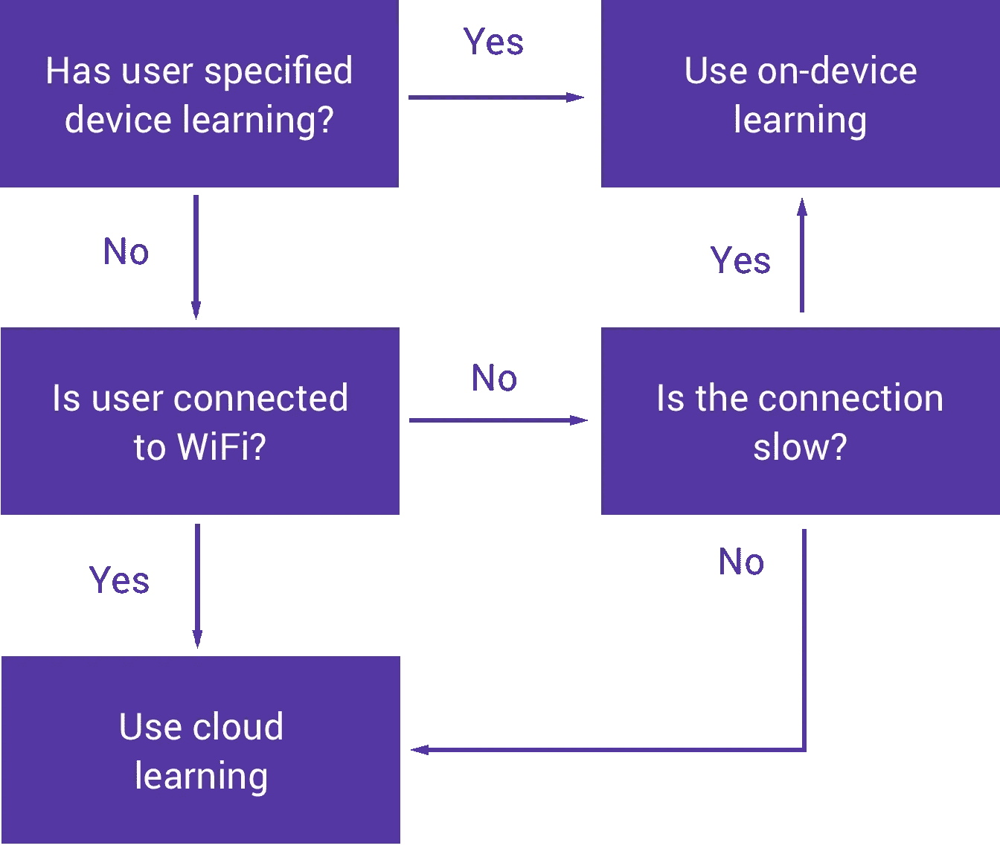

# 探索 Android 上的 Firebase ml kit:ml kit 简介(第一部分)

> 原文：<https://medium.com/google-developer-experts/exploring-firebase-mlkit-on-android-introducing-mlkit-part-one-98fcfedbeee0?source=collection_archive---------3----------------------->


在今年的 Google I/O 上，我们看到了 Firebase MLKit 的推出，这是 Firebase 套件的一部分，旨在让我们的应用程序能够更轻松地支持智能功能。SDK 目前附带了一系列应用程序中通常需要的预定义功能，无论您是否熟悉机器学习，您都可以在您的应用程序中实现这些功能。

现在，Firebase ML Kit 为我们提供的已经可以使用各种机器学习技术来实现自己。Firebase ML 的特点是，除了在某种形式的包装器下提供这些功能之外，它还在单个 SDK 中采用这些技术并提供它们的功能。


虽然我们可以在没有 Firebase ML 的情况下实现这些功能，但我们无法实现的一些原因可能是:

*   缺乏机器学习知识可能会阻碍我们实现这些功能——也许我们发现它势不可挡，或者只是没有时间在这些领域提升
*   找到超级准确和训练有素的机器学习模型不仅很困难，同时也很难选择使用哪些模型，然后为您的平台进行优化。
*   为云访问托管 ML 模型也可能给 ML 实现带来困难。将它打包到你的应用程序中有时是一种更直接的方法，但这本身也有一些缺点。

考虑到这些，可能很难知道从哪里开始。这是 Firebase ML Kit 的主要目标之一——让我们的 Android 和 iOS 应用程序的机器学习更容易被开发人员访问，并在更多的应用程序中可用。目前，ML 试剂盒能够:

*   识别文本
*   识别地标
*   人脸识别
*   扫描条形码
*   标签图像

为了能够利用这些功能，我们需要做的就是将我们想要的数据传递给 SDK，作为回报，我们将根据我们正在使用的 ML 套件的部分接收数据。返回的数据将取决于所使用的机器学习能力，您只需要从返回给您的响应中提取数据。

如果以上其中一项不能满足您的机器学习要求，Firebase MLKit 可以让您上传自己的定制 tensorflow lite 模型，这样您就不必担心这些模型的托管或向您的用户设备提供这些模型。

Firebase ML 的一个好处是，它在设备和云上都提供了机器学习能力，这允许你有创造力，并注意如何以及何时使用机器学习。例如，一些操作可能是密集的，所以我们必须记住这一点——幸运的是，我们可以选择是使用设备上的学习还是云学习来获得大多数 firebase ML 功能。Firebase MLKit 中的设备上 API 旨在快速工作，即使在没有网络连接的情况下也能够提供结果。另一方面，基于云的 API 利用谷歌云平台机器学习技术来提供更高水平的准确性



An example of thinking about when to use on-device and cloud-based learning

例如，我们可能希望基于许多不同的因素来使用基于设备的或基于云的。这里左侧的图只是一个例子，但是用户可能能够指定他们想要使用的学习方法，或者我们可能会根据设备的连接性以及连接质量来确定方法。如果你决定沿着这些路线做一些事情，那么让 Firebase 为你提供决定学习结果的来源的能力是非常好的。

尽管如此，我们实际上并不能控制通过 MLKit 获得的所有认可。正如您从下面的总结中看到的，并非所有功能都可以在设备上使用，就像有些功能在云上也不可用一样。


一旦[为你的项目](https://firebase.google.com/docs/android/setup)添加了 Firebase，要开始使用 MLKit，你需要开始为你的项目添加基础视觉依赖。

```
implementation 'com.google.firebase:firebase-ml-vision:15.0.0'
```

每种 ML 功能都需要这种依赖，有些需要额外的独立的依赖，但是我们将在本系列文章中讨论这些。

此时，您的应用程序将拥有视觉工具。这是您从应用程序向模型提供输入数据的地方，也许这将是条形码扫描或人脸识别等的内容，然后 MLKit 将根据这些数据提供一些结果值，然后您可以将这些数据应用到您的应用程序。

默认情况下，对于设备上培训，ML 模型将在您的应用程序第一次使用它时下载。但是，如果您希望在安装时下载所需的模型，那么您可以通过将以下元数据添加到您的清单中来实现:

```
<meta-data
    android:name="com.google.firebase.ml.vision.DEPENDENCIES"
    android:value="barcode, face, other_model_names..." />
```

这实际上取决于你的应用。如果 ML 模型是你的应用程序体验的核心部分，那么这是有意义的，否则模型应该按需下载。

我希望这是对 Firebase MLKit 的一个很好的介绍，我很高兴能与您一起探索每个功能。在接下来的几周里，我们将深入探讨这些问题，敬请关注。同时，欢迎在下面留下任何问题或评论🙂

[](https://twitter.com/hitherejoe) [## 乔·伯奇(@hitherejoe)在推特上

### Android Lead &高级工程师@Buffer。@Android 的谷歌开发者专家。讲师@caster_io。公共演讲人…

twitter.com](https://twitter.com/hitherejoe)