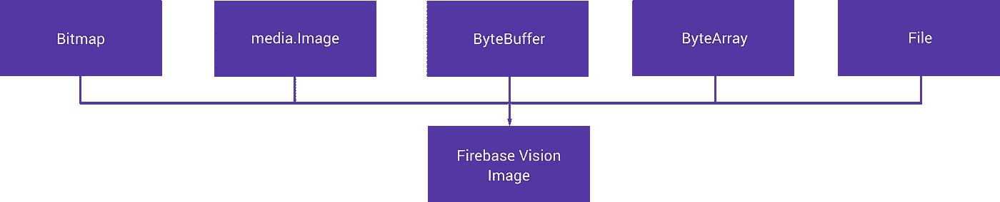
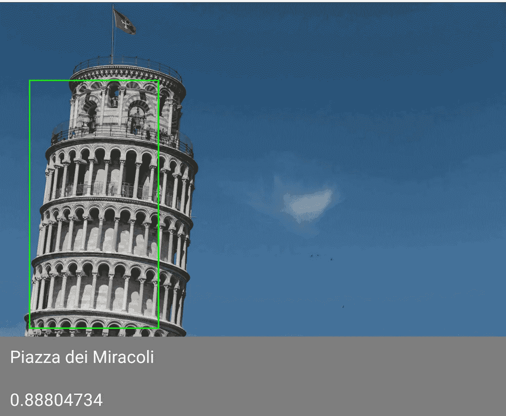
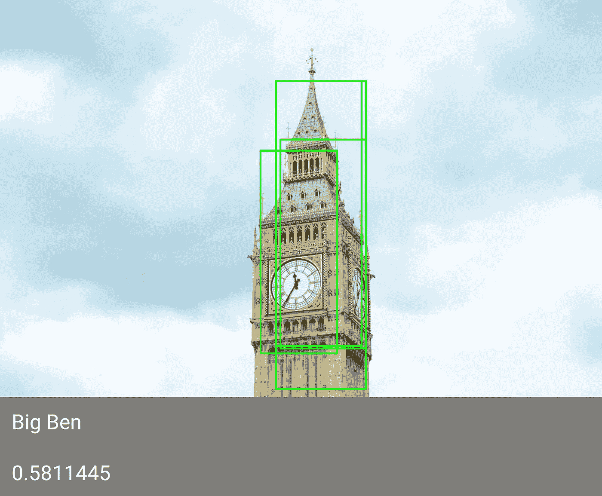
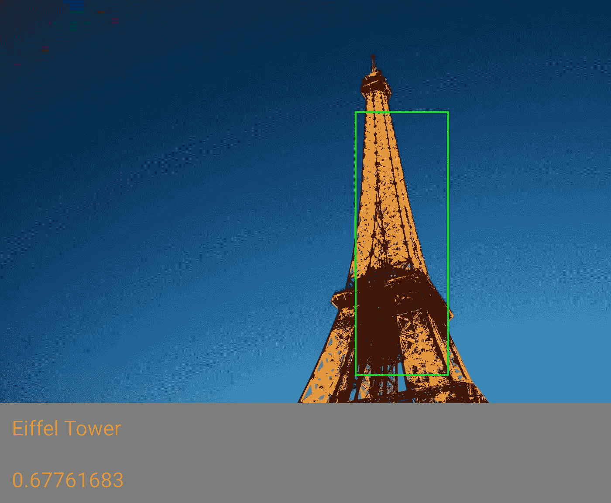
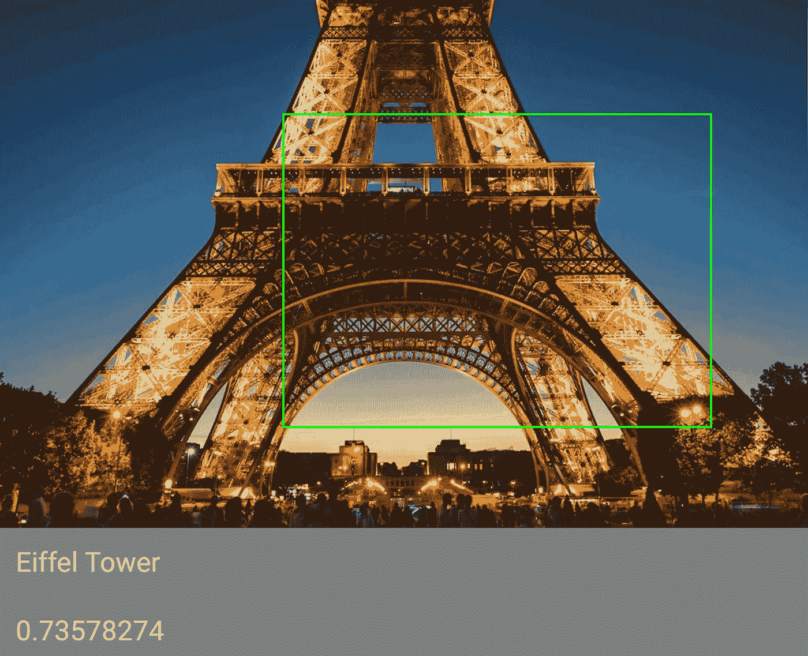

# 探索 Android 上的 Firebase MLKit:地标检测(第四部分)

> 原文：<https://medium.com/google-developer-experts/exploring-firebase-mlkit-on-android-landmark-detection-part-four-5e86b8deac3a?source=collection_archive---------1----------------------->


在今年的 Google I/O 上，我们看到了 Firebase MLKit 的推出，这是 Firebase 套件的一部分，旨在让我们的应用程序能够更轻松地支持智能功能。随之而来的是地标识别特性，它使我们能够检测输入提要中的已知地标，以便在屏幕上向用户显示这些地标信息。在这篇文章中，我想深入探讨如何在我们的应用程序中实现这个特性。

地标识别可能并不适用于所有应用，但当需要时，它可能是一个难以实现的功能——在这些情况下，有许多不同的事情需要考虑和分析。虽然我们可能知道设备的位置，但分析图像中的结构仍然是一项困难的任务。然而，Firebase MLKit 中这一功能的目的是使我们作为开发人员的这一过程更加简单。使用地标识别功能，我们可以将一个图像实例传递给 Firebase MLKit 视觉参考，并返回有关该识别的数据，以便在我们的应用程序中使用。

我们为什么要这么做？地标识别有多种用途。例如，我们可能在应用程序中进行图像标记，并希望通过标记这些图像中的地标/位置来平滑这一过程。也许我们的图像应用程序利用了图像元数据，我们希望通过提供地标数据来扩展这些数据。或者，我们分享应用程序的内容，发送消息或进行视频通话，我们希望通过在这些体验中提供这些额外数据来进一步个性化这些体验。我敢肯定，这种功能还有很多其他的使用案例，也许你在亲自体验过这个 API 之后就会发现🙂

**注意:**要知道 MLKit 地标识别只作为云功能提供，意味着不能进行离线识别。这是因为需要 Google Cloud Vision API 来执行识别过程。

在开始使用 MLKit 的地标识别特性之前，我们需要先将依赖项添加到我们的项目级 build.gradle 文件中:

```
implementation 'com.google.firebase:firebase-ml-vision:16.0.0'
```

现在，我们需要做的下一件事是启用云视觉 API，因为这是使用这一识别功能所必需的。首先，我们需要将我们的 Firebase 项目升级到 Blaze 计划，这是因为云识别 API 只适用于付费计划。Blaze 是一个现收现付的计划，所以如果你想试用这个 API，你可以在试用完成后随时降级这个计划。

**注意:**您可以免费使用识别程序多达 1000 次。


Upgrading your Firebase project to the Blaze plan

接下来，我们需要在 Google API 控制台中为我们的 Firebase 项目启用云视觉 API。


Enabling the Cloud Vision API for your chosen firebase project in the Google API Console

现在这已经完成了，我们可以在我们的 Firebase 项目中使用 Cloud Vision API。在利用地标识别之前，您必须这样做，直到您这样做，detectInImage()函数将返回一个错误，指出您需要在 firebase 项目中启用计费。

在进行识别时，识别器将使用默认的识别模型(称为**稳定**)，该模型将为我们返回流程的前 10 个结果。然而，我们可以通过提供一个用于识别过程的[FirebaseVisionCloudDetectorOptions](https://firebase.google.com/docs/reference/android/com/google/firebase/ml/vision/cloud/FirebaseVisionCloudDetectorOptions)实例来定制它:

```
val options = FirebaseVisionCloudDetectorOptions.Builder()
      .setModelType(FirebaseVisionCloudDetectorOptions.*LATEST_MODEL*)
      .setMaxResults(15)
      .build()
```

通过这种方式，我们可以定制在对图像进行识别时希望收到的结果的最大数量。您可能希望最小化通过请求返回的结果，或者允许返回更大的数量，以便您可以分析更大范围的结果。

既然我们已经建立了选项，我们可以继续在我们的认可流程中使用它们。我们希望使用这些选项来创建一个 [FirebaseVisionImage](https://firebase.google.com/docs/reference/android/com/google/firebase/ml/vision/common/FirebaseVisionImage) 的实例——这是一个保存图像数据的类，为识别过程做好准备。现在，我们需要这个实例，然后才能执行任何形式的识别，为了创建这个实例，我们需要使用我们的图像数据，这可以通过以下五种方式之一来完成:



## 位图

首先，我们可以使用一个位图实例创建一个 [FirebaseVisionImage](https://firebase.google.com/docs/reference/android/com/google/firebase/ml/vision/common/FirebaseVisionImage) 的实例。我们可以通过将一个**直立**位图传递到 fromBitmap()函数中来实现——这将返回一个 [FirebaseVisionImage](https://firebase.google.com/docs/reference/android/com/google/firebase/ml/vision/common/FirebaseVisionImage)

```
val image = FirebaseVisionImage.fromBitmap(bitmap);
```

## 媒体。图像

我们也可以通过媒体来实现。图像实例—这可能发生在从设备的摄像头捕捉图像时。这样做时，我们必须传递这个图像的实例以及它的旋转，所以这必须在调用 fromMediaImage()函数之前进行计算。

```
val image = FirebaseVisionImage.fromMediaImage(mediaImage,    
                rotation);
```

## 字节缓冲器

也可以使用 ByteBuffer 创建实例。为此，我们必须首先创建一个 FirebaseVisionImageMetadata 的实例。这包含构建视觉图像所需的数据，例如旋转和测量。

```
FirebaseVisionImageMetadata metadata = new 
    FirebaseVisionImageMetadata.Builder()
        .setWidth(1280)
        .setHeight(720)
        .setFormat(FirebaseVisionImageMetadata.IMAGE_FORMAT_NV21)
        .setRotation(rotation)
        .build();
```

然后，我们可以将它与 ByteBuffer 一起传递，以创建实例:

```
val image = FirebaseVisionImage.fromByteBuffer(buffer, metadata);
```

## ByteArray

从 ByteArray 创建图像的方式与 ByteBuffer 相同，只是我们必须使用 fromByteArray()函数:

```
val image = FirebaseVisionImage.fromByteArray(byteArray, metadata);
```

## 文件

通过使用上下文和期望的 URI 调用 fromFilePath()函数，可以从文件创建视觉图像实例。

```
val image: FirebaseVisionImage?
try {
    image = FirebaseVisionImage.fromFilePath(context, uri);
} catch (IOException e) {
    e.printStackTrace();
}
```

既然我们有了想要分析的图像实例，我们就可以执行地标识别了。无论我们是否提供选项的实例，我们都可以准备 FirebaseVision 检测器。如果我们使用默认选项，我们可以简单地按原样检索实例:

```
val detector = FirebaseVision.getInstance()
        .*visionCloudLandmarkDetector*
```

否则，我们可以在检索检测器时传入我们的选项引用:

```
val detector = FirebaseVision.getInstance()
        .getVisionCloudLandmarkDetector(options)
```

接下来，我们只需要在我们的检测器实例上调用 detectInImage()函数，传入对我们之前准备的图像的引用:

```
detector.detectInImage(image)
    .addOnSuccessListener **{** // Task succeeded!
        for (landmark in **it**) {
            // Do something with landmark
        }
    **}** .addOnFailureListener **{** // Task failed with an exception
    **}**
```

现在，如果这个调用成功，那么我们将得到一个[FirebaseVisionCloudLandmark](https://firebase.google.com/docs/reference/android/com/google/firebase/ml/vision/cloud/landmark/FirebaseVisionCloudLandmark)实例的列表。如果没有检测到地标，那么这将是空的，因此如果出现这种情况，您需要处理它。否则，我们可以访问我们现在需要做一些事情的地标集合。对于每个[FirebaseVisionCloudLandmark](https://firebase.google.com/docs/reference/android/com/google/firebase/ml/vision/cloud/landmark/FirebaseVisionCloudLandmark)实例，我们可以访问一组可以在这里使用的属性:

*   **getBoundingBox()** —检索包含已识别地标的图像区域

```
val bounds = landmark.*boundingBox*
```

*   **getLandmark()** —检索检测到的地标的名称

```
val landmarkName = landmark.*landmark*
```

*   **getConfidence()** —检索给定结果与提供的图像匹配的置信度

```
val confidence = landmark.*confidence*
```

*   **getLocations()** —检索一个[firebasevisionlating](https://firebase.google.com/docs/reference/android/com/google/firebase/ml/vision/common/FirebaseVisionLatLng)实例的列表，该列表表示诸如地标位置和照片拍摄位置之类的位置。

```
val locations = landmark.*locations*
```

*   **getEntityId()** —检索识别过程的给定 Id

```
val entityId = landmark.*entityId*
```

如果我们通过这个识别流程运行一些图像，我们可以看到我们从一些众所周知的地标得到的结果:



看起来 MLKit 对它的结果很有信心。我已经使用边界框在识别的地标周围绘制，然后简单地显示了下面的 landmarkName 和 confidence 属性。让我们试着在识别器里放一张大本钟的照片:



对这个不太有信心，我们还可以看到有多个已经检测到的地标实例。因为我正在循环通过地标，所以地标的最后一个实例被用于显示置信度。让我们再试一次，但只看第一个结果:


这里稍微好一点，这里只有一个边界框也更容易。在这里，您可能要做的是从已识别的地标获取所有结果，并操纵置信度集合，以在您的应用程序中为该地标做出置信度决定。

最后，让我们运行另一个图像:



我想运行这个，这样我们就可以测试一下，如果我们只显示部分图像，MLKit 是否还能识别这个著名的地标:



现在我知道这个地标非常有名，所以这可能是为什么仍然有一个部分图像的高可信度，但很高兴看到它仍然有能力在这种状态下识别地标(实际上它更有信心地标是埃菲尔铁塔！).

我希望通过这篇文章，您能够了解什么是 Firebase MLKit 地标识别，以及我们如何设置它，以便在我们的应用中使用它。如果这是一个您可以(或确实)利用的特性，那么在您的应用程序中尝试一下地标识别绝对是值得的。不幸的是，这需要一个 Firebase 的付费帐户，但根据使用情况，这对一些人来说可能不是问题。

我很想知道你是如何使用这个 API 的——如果你有任何想法、问题或评论，请联系我们🙂

[](https://twitter.com/hitherejoe) [## 乔·伯奇(@hitherejoe) |推特

### 乔伯奇的最新推文(@hitherejoe)。Android 主管和高级工程师。@缓冲。谷歌开发专家…

twitter.com](https://twitter.com/hitherejoe)