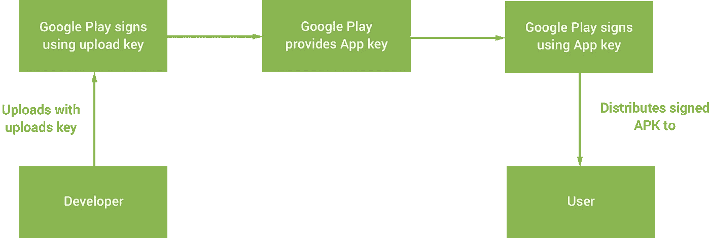
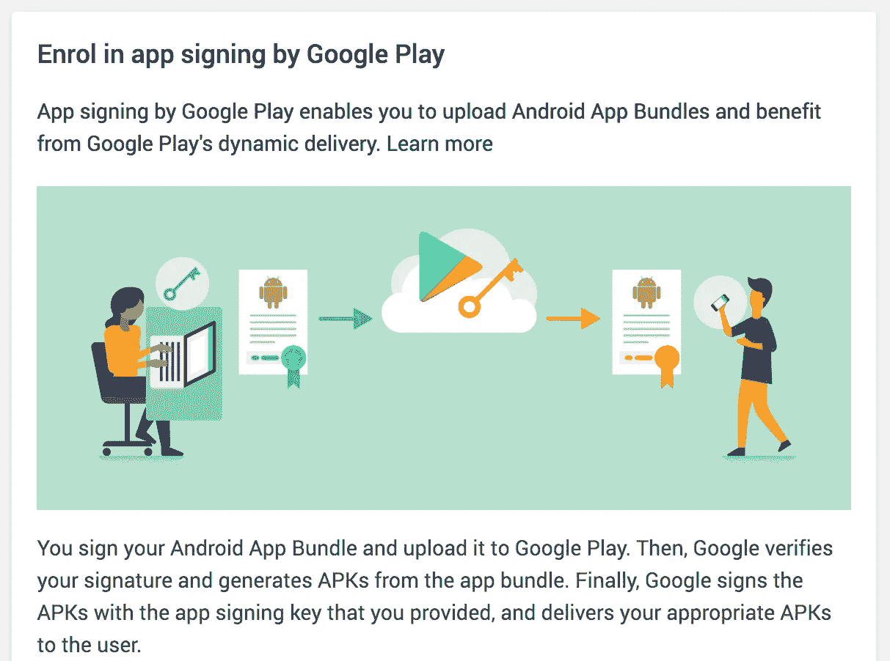
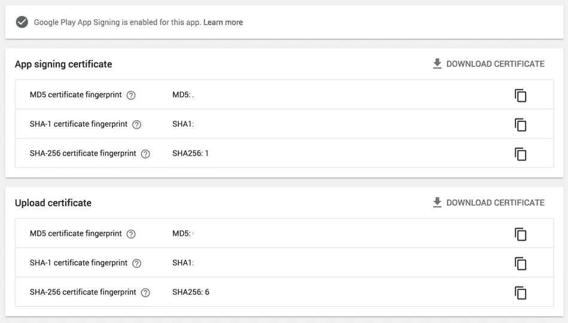
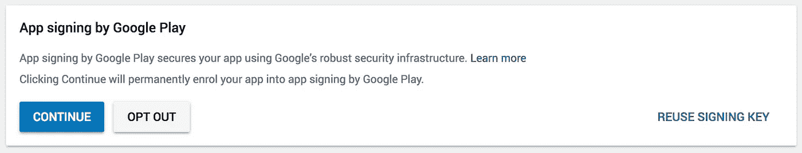

# 探索 Google Play 应用程序签名

> 原文：<https://medium.com/google-developer-experts/exploring-google-play-app-signing-b4d296f4ee9?source=collection_archive---------0----------------------->


在分发我们的 Android 应用程序时，我们总是被要求使用密钥库为我们的应用程序签署我们的 APKs 这使我们能够确保只有我们应用程序的开发人员能够将更新的 APK 上传到 play 控制台。然而，因为这个密钥库充当了我们应用程序生命周期的指纹——如果它发生了任何事情，那么我们就遇到了一点棘手的情况。由于当前签名流程带来的缺点，Google Play 应用程序签名旨在帮助事情变得更顺利。在这篇文章中，我想深入这个应用程序签名方法，以便我们可以将它集成到我们的应用程序中。

[](http://eepurl.com/dIKgiT)

应用程序签名是一个可供开发者使用的新流程，它允许我们将我们发布的 apk 的签名卸载到 Google 上。一旦我们为 Play Console 提供了我们的应用程序签名密钥，我们就可以上传我们的 APK，谷歌将在将其交付给我们的用户之前为我们签名。

虽然当前签署 apk 的方式是可行的，但还是有一些缺陷，这些缺陷常常会给开发人员带来些许恐惧:

*   如果您丢失了您的密钥，那么这将阻止您更新您的应用程序。也许你的电脑出了故障，你的备份丢失了，或者它只是以某种方式被放错了地方——任何你的密钥丢失的情况都意味着你将无法更新你的应用程序。
*   您的密钥可能会被怀有恶意的人泄露—在这种情况下，拥有密钥的人可以更新您的应用程序，并且因为没有办法撤销这种访问，所以您无法做太多事情来重新获得对您的密钥的访问。

当使用 Google 应用程序签名时，巨大的优势是 Google 为我们的应用程序管理签名密钥——这意味着我们可以减轻完全负责我们的密钥库的压力。对于应用程序签名，有两种不同的密钥用于签名流程:

*   **应用签名密钥**—Google 在发布 APK 前使用的密钥
*   **上传键** —开发者将 APK 上传到游戏控制台的键

正如你所看到的，开发人员仍然需要保留他们自己的**上传密钥**的副本，以便在上传 apk 时使用——现在的不同之处在于，这个**上传密钥**不负责发布版本的签名，它只是用来标识进行上传的开发人员。因为这不是用于签署应用程序发布 APK 的唯一密钥，这意味着它可以随时被 Google 替换。因此，如果一个**上传密钥**丢失、受损或由于任何原因不再拥有上传权限，那么谷歌可以撤销这个密钥并生成一个新的供使用。

综上所述，您可以将上传密钥视为权威密钥，而不是主密钥——它允许开发人员将 apk 上传到 Play 控制台，但不能分发它们，该角色属于**应用签名密钥**的权限范围。



如果你正在为你的应用程序上传 apk，那么这个过程是完全可选的，欢迎你继续管理你自己的密钥——记住你将不能利用应用程序签名带来的任何优势。例如，如果您的签名密钥丢失或泄露，您将无法再为您的应用程序上传更新的 apk。

当谈到 Android 应用程序捆绑格式时，应用程序签名是一个强制性的过程。这是因为当涉及到应用捆绑包时，Google Play 需要能够在分发之前为你签署 APKs 所以当密钥由开发者管理时，没有办法能够执行这个流程。

不管您使用的是 APKs 还是 App Bundle 格式，让我们看看如何在我们自己的应用程序中设置应用程序签名。

# 移植现有应用

在本例中，我们将了解 Play Console 中现有应用程序的已启用应用程序签名。在我们开始之前，重要的是要注意，一旦你选择加入应用程序签名，你**就不能切换回手动密钥管理**——所以确保你肯定想在启用它之前进行切换。如果你不确定，也许可以在一个示例应用程序上尝试一下以确保万无一失(这正是我所做的！).

首先，我们需要导航到控制台中的应用程序签名部分。这个可以在**发布管理** > **App 签约**下的导航抽屉里找到。当您进入此页面时，将会看到应用程序签名的服务条款，您需要接受这些条款才能继续。



在此屏幕上，您会注意到有三个选项可以设置应用签名，我们将使用第二个选项**，您尚未导出您的应用签名密钥**，用于导出和上传我们的签名密钥。

## 配置应用签名密钥


您需要从下载 Play Encrypt Private Key 工具(以一个 **jar** 文件的形式)开始，它将用于在上传之前加密您的密钥。下载后，您会在安装过程中看到需要运行的命令，看起来有点像这样:

```
java -jar pepk.jar — keystore=**your.keystore** — alias=**your_alias**— output=**some_file_name** —-encryptionkey=**your_encryption_key**
```

在这里，您将执行我们之前下载的 pepk.jar 文件，并将一些信息作为参数传递。

*   首先，我们必须提供我们希望加密的**密钥库**的路径。
*   接下来，我们提供用于访问我们正在加密的**密钥库**的别名。
*   然后，我们为**输出**参数提供一个期望的文件名，这将是为我们生成的文件的名称
*   最后，在此过程中，播放控制台显示的代码中提供了加密密钥值。

当您运行此命令时，会要求您输入密钥库密码。输入后，将生成应用程序签名密钥，并放在给定的输出路径中。此时，您可以使用设置过程中的给定按钮上传密钥。

## 配置上传密钥

就在您点击注册按钮之前，您可能会注意到一个可选部分，它为您的应用程序签名密钥提供了**增强的安全性**——这是指我们之前刷过的**上传密钥**和用于生成该密钥的密钥库。虽然这可能感觉与以前管理密钥没有什么变化，但这种做法的要点是允许上传过程使用不同于签名过程的密钥。上传密钥不是 Android 安全模型的一部分，所以它不能用于签署 apk，只能上传它们。

生成上传密钥是一个单步过程。我们可以为我们的上传过程创建一个新的密钥库，然后使用下面的命令生成上传所需的 **pem** 文件。

```
keytool -export -rfc -keystore **upload-keystore.jks** -alias **upload** -file **upload_certificate.pem**
```

一旦生成，您将能够将此文件上传到控制台的请求位置。


点击“注册”后，将会重新加载应用程序签名屏幕，并向您显示应用程序签名设置的成功通知:



您还会注意到，这里有一组指纹可用于签名和上传证书，如果需要的话，可以下载。

现在，如果您的上传密钥丢失或泄露，您可以使用与上面相同的步骤创建一个新的**上传密钥**，并通过[表格](https://support.google.com/googleplay/android-developer/contact/otherbugs)联系 Google 以提供一个新的上传密钥。请注意，只有帐户所有者才能提出此请求。


# 为新应用程序签名

如果您正在创建一个新的应用程序，那么整个过程并不适用于您，因为默认情况下会为您启用**应用程序签名**！当访问新应用程序的 play console 的 **App Releases** 部分时(一旦您上传了 APK)，您将看到以下消息:



虽然这里的大部分工作已经为我们完成，但我们可以使用几个选项来配置我们的密钥。首先，如果您选择不使用**继续**关闭消息，您可以通过点击左侧显示的按钮**退出应用程序签名的**。

但是，您也可以选择重复使用签名密钥，这意味着 Google Play 为您的另一个项目使用的**签名密钥**也可以用于您正在创建的这个新项目。然而，这可能会带来安全风险，就好像无论出于什么原因，您的帐户受到威胁，那么依赖于受威胁密钥的所有应用程序都可能处于危险之中。

在本文中，我们了解了什么是应用程序签名，以及如何将其集成到我们的上传/发布流程中。把这个放在适当的位置可以让你把安全的责任从你的团队中移除，让谷歌来处理这方面的事情——保护你的密钥不被丢失或泄露。如果您有任何关于应用程序签名的问题，或分享您自己的经验，请联系我们！

[](https://twitter.com/hitherejoe) [## 乔·伯奇(@hitherejoe) |推特

### 乔伯奇的最新推文(@hitherejoe)。Android Lead @Buffer。谷歌开发专家为@Android，@GooglePay &…

twitter.com](https://twitter.com/hitherejoe)