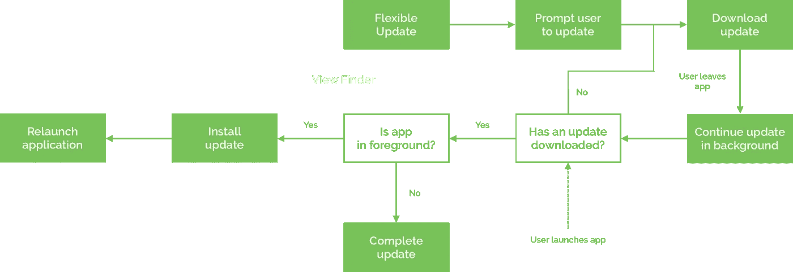

# 探索 Android 上的应用内更新

> 原文：<https://medium.com/google-developer-experts/exploring-in-app-updates-on-android-57f1aee011cb?source=collection_archive---------0----------------------->


> 这最初发布在 joebirch.co 上:

[](https://joebirch.co/2019/05/07/exploring-in-app-updates-on-android/) [## 探索 Android 上的应用内更新

### 我敢肯定，你经常需要发送某种形式的紧急应用程序更新，也许…

joebirch.co](https://joebirch.co/2019/05/07/exploring-in-app-updates-on-android/) 

我相信经常会有这样的时候，你需要发送某种形式的紧急应用程序更新——可能存在安全问题或一些错误，给用户带来了很多问题。以前，我们需要在 Google play 商店推出新的更新，并等待我们的用户收到更新。如果他们没有安装自动更新，我们依靠用户访问 play store 来更新我们的应用程序。在本周的 Google I/O 大会上，我们看到了 Play 核心库的应用内更新。在这篇文章中，我们将学习更多关于这个附加的东西，以及如何在我们的应用中使用它。

Play Core 库支持 API 级别 21 及以上，现在允许我们向用户提供应用内更新，这意味着当用户在我们的应用环境中时，我们可以显示应用更新可用。Play Core 库为我们提供了两种不同的方式来提示我们的用户有可用的更新——或者使用灵活的方法或立即的方法。


**灵活的**方法向用户显示升级对话框，但在后台执行更新的下载。这意味着用户可以在下载更新的同时继续使用我们的应用程序。对于更重要的应用程序更新，我们可以利用**即时**流程——这是一个阻塞 UI，用于提示用户更新应用程序，不允许继续使用，直到应用程序更新并重启。

# 检查更新是否可用

在我们开始之前，我们将首先检查是否有来自 play store 的更新。执行此操作的代码如下所示:

```
val updateManager = AppUpdateManagerFactory.create(this)
updateManager.appUpdateInfo.addOnSuccessListener {
    if (it.updateAvailability() == UpdateAvailability.UPDATE_AVAILABLE &&
        it.isUpdateTypeAllowed(AppUpdateType.IMMEDIATE)) { }
}
```

我们首先创建一个 [AppUpdateManager](https://developer.android.com/reference/com/google/android/play/core/appupdate/AppUpdateManager.html) 类的实例——它将负责处理我们的应用程序信息。使用它，我们将获取一个 [AppUpdateInfo](https://developer.android.com/reference/com/google/android/play/core/appupdate/AppUpdateInfo.html) 实例——这需要发出一个远程请求来这样做，这就是为什么你可以看到我们访问上面的**结果**属性。这个 [AppUpdateInfo](https://developer.android.com/reference/com/google/android/play/core/appupdate/AppUpdateInfo.html) 包含一个数据集合，可以用来决定我们是否应该触发更新流。

首先，它有一个方法 [availableVersionCode()](https://developer.android.com/reference/com/google/android/play/core/appupdate/AppUpdateInfo.html#availableVersionCode()) —如果有一个更新当前可用或者正在更新，它将返回那个版本值。除此之外，还有一个 [updateAvailability()](https://developer.android.com/reference/com/google/android/play/core/appupdate/AppUpdateInfo.html#updateAvailability()) 方法，它返回一个表示更新状态的值。这可以是:

*   未知的
*   更新 _ 可用
*   更新进行中
*   开发者 _ 触发 _ 更新 _ 进行中

我们首先要检查它是否等于 **UPDATE_AVAILABLE，**，然后通过使用 [isUpdateTypeAllowed()](https://developer.android.com/reference/com/google/android/play/core/appupdate/AppUpdateInfo.html#isUpdateTypeAllowed(int)) 函数来确保所需的更新类型受到支持——传入 AppUpdateType 类型(即时或灵活)以确保我们想要使用的更新类型受到支持。

现在我们已经有了确定应用程序更新是否可用所需的信息，我们将想要触发更新流程。我们可以通过使用 [AppUpdateManager](https://developer.android.com/reference/com/google/android/play/core/appupdate/AppUpdateManager.html) 类附带的 startUpdateFlowForResult()方法来做到这一点。当我们调用这个函数时，我们只需要传递:

*   我们之前检索的 AppUpdateInfo 实例
*   我们想要触发的 AppUpdateType(即时或灵活)
*   当前组件的上下文
*   请求代码，以便可以在调用组件中捕获取消/失败

```
updateManager.startUpdateFlowForResult(
    appUpdateInfo,
    AppUpdateType.IMMEDIATE,
    this,
    REQUEST_CODE_UPDATE)
```

调用此**startUpdateFlowForResult()**方法将触发 startActivityForResult()调用，并启动应用程序更新流程。在某些情况下，请求应用程序更新可能会被用户取消(ActivityResult。 **RESULT_CANCELLED** )，甚至失败(ActivityResult。**结果 _ 输入 _ 应用 _ 更新 _ 失败**。在这些情况下，我们可以在活动/片段的 onActivityResult()中捕获结果，并相应地处理结果。

```
override fun onActivityResult(
    requestCode: Int, 
    resultCode: Int, 
    data: Intent
) {
    if (requestCode === REQUEST_CODE_UPDATE) {
        if (requestCode != RESULT_OK) {

        }
    }
}
```

# 即时应用内更新

使用 AppUpdateType 可以触发即时应用内更新。即时价值——如前所述，这将为用户触发一个阻塞的 UI 流，直到他们更新了应用程序。这意味着该用户界面将在应用程序下载和安装的整个过程中显示，直到整个更新过程完成。当用户在更新过程中离开你的应用时，更新将继续下载，然后在后台安装。但是，如果用户在更新过程完成之前离开并返回到您的应用，您需要确保我们继续更新过程。


为此，我们需要检查 updateAvailability()是否返回了**DEVELOPER _ trigged _ UPDATE _ IN _ PROGRESS**状态。如果是这样，那么我们需要触发更新流，以便更新过程可以继续。如果您不实现流程的这一部分，那么用户将能够继续使用您的应用程序，而不会立即更新生效。

```
override fun onResume() {
    super.onResume()
    val updateManager = AppUpdateManagerFactory.create(this)
    updateManager.appUpdateInfo
        .addOnSuccessListener {
            if (it.updateAvailability() == 
                UpdateAvailability.DEVELOPER_TRIGGERED_UPDATE_IN_PROGRESS) {
                updateManager.startUpdateFlowForResult(
                    it,
                    IMMEDIATE,
                    this,
                    REQUEST_CODE_UPDATE)
            }
        }
    }
}
```

对于即时更新，我们不需要做任何进一步的工作。一旦下载了更新，实现将自动重启我们的应用程序，这样就可以安装更新。

# 灵活的应用内更新

使用 AppUpdateType 可以触发灵活的应用内更新。灵活的价值—如前所述，这将触发一个流程，向用户显示一个升级弹出窗口，并在后台执行更新的下载/安装，同时用户可以继续使用该应用程序。



为此，我们首先启动一个**灵活**更新的应用更新流程:

```
updateManager.startUpdateFlowForResult(
    appUpdateInfo, 
    AppUpdateType.FLEXIBLE, 
    this, 
    REQUEST_CODE_UPDATE)
```

因为这都是在后台发生的，而不是像即时更新那样创建一个阻塞的 UI，我们需要添加一些监控，以便我们可以检查更新安装的状态。为此，我们将使用[InstallStateUpdatedListener](https://developer.android.com/reference/com/google/android/play/core/install/InstallStateUpdatedListener.html)，它将在灵活安装的状态改变时接收回调。这包含一个回调 onStateUpdated()，它将传递给我们一个 InstallState 类的实例。由此我们可以利用:

**installStatus()** —返回一个代表当前更新状态的 **InstallStatus** 值。这可以是以下之一:

*   未知的
*   要求 _UI_INTENT
*   悬而未决的
*   下载
*   下载
*   安装
*   安装
*   不成功的
*   取消

**installErrorCode()** —返回一个代表安装错误状态的 **InstallErrorCode**

*   无错误
*   无错误部分允许
*   错误 _ 未知
*   错误 _ API _ 不可用
*   错误无效请求
*   错误安装不可用
*   错误 _ 安装 _ 不允许
*   错误 _ 下载 _ 不存在
*   错误 _ 内部错误

**packageName()** —返回安装状态适用的软件包名称

虽然这里有很多关于安装状态和安装错误代码的选项，但在处理状态时，这给了我们很大的灵活性。例如，如果我们向用户显示一些特定的 UI 来通知他们当前的状态，那么我们可以根据当前的状态定制其中的内容。

```
val listener = InstallStateUpdatedListener {
    // Handle install state
}
```

我们也可以让我们的活动实现这个接口，这样回调就可以在活动本身中被覆盖。

现在我们有了侦听器，我们可以使用 **registerListener()** 方法用 out **AppUpdateManager** 实例注册它。使用完 listener 后，我们需要确保使用 unregisterListener()方法来删除任何不再需要时触发的回调。

```
val updateManager = AppUpdateManagerFactory.create(this)
updateManager.registerListener(listener)...updateManager.unregisterListener(listener)
```

一旦我们检测到 InstallStatus 代表下载状态，我们需要重新启动应用程序，以便可以安装更新。虽然即时更新方法为您处理这一点，但在灵活更新的情况下，我们需要手动触发这一点。为了手动触发此更新，我们需要使用 AppUpdateManager 实例中的 **completeUpdate()** 方法。调用此函数时，将从 play core 库中显示一个全屏 UI，应用程序将在后台重新启动，以便可以安装更新。然后，应用程序将重启，并应用更新。

```
appUpdateManager.completeUpdate()
```

当从后台调用时，应用程序仍将被更新，但不会显示全屏 UI，并且一旦更新完成，应用程序也不会重新启动。

但是，如果更新是在应用程序处于前台时进行的，那么用户有可能会在更新下载和安装之前离开并返回我们的应用程序。在这种情况下，当我们的 activity 点击 onResume()时，我们将需要从 AppUpdateManager 中检查状态，以便我们可以确定是否需要完成更新过程。我们可以通过检查 InstallStatus 是否处于下载状态来确定这一点。如果是这样，我们可以继续调用 completeUpdate()方法来完成更新过程。

```
updateManager.appUpdateInfo
    .addOnSuccessListener {appUpdateInfo ->
        if (appUpdateInfo.installStatus() == InstallStatus.DOWNLOADED) {
            updateManager.completeUpdate()
        }
    }
```

从这篇文章中，我们了解了 play 核心库提供的应用内更新的新方法。我很高兴在我工作的应用程序中使用它，我真的相信这将极大地改善我们的用户和开发者在 android 应用程序开发方面的一系列体验。如果您对 play 核心库或应用内更新有任何疑问，请联系我们。

在我的下一篇文章中，我将讨论 Android 上的 CameraX Jetpack 库。请在 Twitter 上关注我，以便随时了解这款游戏何时发布！

[](https://twitter.com/hitherejoe) [## 乔·伯奇(@hitherejoe) |推特

### 乔伯奇的最新推文(@hitherejoe)。Android Lead @Buffer。GDE 为@Android、@actionsongoogle、@FlutterIO &…

twitter.com](https://twitter.com/hitherejoe)