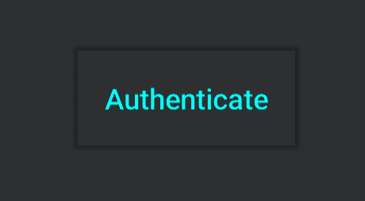

# 探索 Jetpack 撰写:按钮

> 原文：<https://medium.com/google-developer-experts/exploring-jetpack-compose-button-4cfb8355e50?source=collection_archive---------0----------------------->


在 Android Studio 4.0 Canary 1 中，我们可以开始探索 Jetpack compose，这是一种以声明方式为 Android 应用程序构建 UI 的新方法。为了开始使用 jetpack compose，[官方开发者网站](https://developer.android.com/jetpack/compose/tutorial)上有一个很棒的教程。在这一系列文章中，我想深入研究每一个可用的组件，探索我们如何在我们的应用程序中利用它们。

> 这最初是在我的[个人博客](https://joebirch.co/2019/10/24/exploring-jetpack-compose-button/)上发布的

在本文中，我们将从按钮组件开始，这是我们在大多数应用程序中可能会用到的东西。假设我们正在为应用程序的身份验证屏幕创建一个按钮——这里我们将创建一个新的**按钮**组件。按钮是一个可组合的组件——有两个函数可以用来构建它。第一个采用了 **text** (用于声明按钮上显示的文本)、 **onClick** (用于处理按钮上的点击事件)和 **style** (用于处理按钮的样式)属性。

```
[@Composable](http://twitter.com/Composable)
fun Button(
    text: String,
    onClick: (() -> Unit)? = null,
    style: ButtonStyle = ContainedButtonStyle()
)
```

在这里我们可以看到，至少我们需要为按钮提供一个**文本**值，其他属性被赋予默认值。让我们继续创建一个带有一些文本和 onClick 处理程序的简单按钮:

```
Button(text = “Authenticate”, onClick = {
    // handle button click
})
```


在 Android Studio 的预览部分，我们可以看到我们的按钮显示，如上。在某些情况下，我们可能希望更多地定制按钮的实际内容，在这些情况下，我们可能希望利用其他按钮函数，该函数允许我们传入可组合子元素的集合来代替文本属性:

```
@Composable
fun AuthenticationButton() {
    Button(onClick = {
        // handle button click
    }, children = {
        Text(text = “Authenticate”)
    })
}
```

如果您希望在按钮内部显示附加内容，这将非常有用。虽然上面的例子只显示了一个文本组件——这将允许你定制文本组件以适应你的应用程序的外观，或者甚至在按钮内的文本旁边显示一个图标。

# 按钮样式

我们希望使用的每个按钮样式的核心是 **ButtonStyle** 类。每个样式本质上都是一个函数，用于返回 ButtonStyle 类的一个实例，每个类都为该样式类型提供所需的属性，同时强制其他属性。


基本的 ButtonStyle 类可以分配给你所创建的按钮的样式，但是如果这样做的话，你至少需要为**颜色**和**形状**属性提供一个值。当您需要完全控制按钮组件的外观时，ButtonStyle 是一个很好的地方。

```
@Immutable
data class ButtonStyle(
    val color: Color,
    val shape: Shape,
    val border: Border? = null,
    val elevation: Dp = 0.dp,
    val paddings: EdgeInsets = ButtonPaddings,
    val textStyle: TextStyle? = null,
    val rippleColor: Color? = null
)
```

Button 组件还为我们提供了一组助手函数，这些函数可用于提供特定类型的 ButtonStyle 实例。在大多数情况下，这些在您的应用程序中就足够了，所以让我们来看看如何使用其中的每一个。

# 文本按钮样式

文本按钮本质上是一个没有背景形状或边框的按钮，它只包含按钮组件中的文本组件。



当我们想要编写一个文本按钮时，我们使用相同的按钮组件，但是使用 TextButtonStyle 作为样式属性。对于 TextButtonStyle，我们可以设置**内容颜色**(文本的颜色)或**形状**(按钮的形状)。

```
@Composable
fun AuthenticationButton() {
    Button(text = “Authenticate”, onClick = {
        // handle button click
    }, style = TextButtonStyle(contentColor = Color.Cyan))
}
```

如果我们深入到 TextButtonStyle 的源代码，我们可以看到我们可以提供这个 **shape** 和 **contentColor** 属性。但是，对于正在创建的 ButtonStyle，有一个用于该样式的默认集合。例如，颜色(按钮的背景色)，我们不能改变这些。TextButtonStyle 为属性强制执行那些声明的值——这对于颜色是有意义的，因为我们创建一个文本按钮，它不应该有一个背景色分配给它。

```
fun TextButtonStyle(
    shape: Shape = +themeShape { button },
    contentColor: Color? = +themeColor { primary }
) = ButtonStyle(
    color = Color.Transparent,
    shape = shape,
    paddings = TextButtonPaddings,
    textStyle = TextStyle(color = contentColor),
    rippleColor = contentColor
)
```

# 包含的按钮样式

内含按钮是我们在应用程序中经常看到的标准按钮样式，如果您没有提供使用的样式，它也是应用于按钮组件的默认样式。


但是，我们也可以为 ContainedButtonStyle 的实例提供我们自己的属性值，以实现更具体的样式。对于 ContainedButtonStyle，我们可以设置**颜色**(这是按钮本身的颜色)**高度**(按钮的形状)**形状**(按钮的形状)和 **rippleColor** (按下时涟漪效果的颜色)。

```
@Composable
fun AuthenticationButton() {
    Button(
        text = “Authenticate”, onClick = {
            // handle button click
        }, style = ContainedButtonStyle(
            color = Color.White, 
            rippleColor = Color.DarkGray,
            elevation = Dp(4f)
        )
    )
}
```

如果我们深入到 ContainedButtonStyle 的源代码，那么我们可以看到这个样式是如何组成的。我们上面提到的每个属性都有默认值，使用从我们的应用程序主题中获得的颜色。因此，因为 ContainedButtonStyle 是默认的按钮样式，默认情况下，我们的按钮将使用这种样式呈现，同时在流程中使用我们的应用程序主题。

```
fun ContainedButtonStyle(
    color: Color = +themeColor { primary },
    shape: Shape = +themeShape { button },
    elevation: Dp = 2.dp,
    rippleColor: Color? = null
) = ButtonStyle(
    color = color,
    shape = shape,
    elevation = elevation,
    rippleColor = rippleColor
)
```

# 轮廓按钮样式

outline 按钮样式可用于显示与所包含的按钮相似的按钮，不同之处在于使用一个笔画来勾勒按钮的主体。


当我们想要组成一个有轮廓的按钮组件时，我们使用相同的按钮组件，而不是使用 OutlinedButtonStyle 作为样式属性。对于 OutlinedButtonStyle，我们可以设置**内容颜色**(这是文本的颜色)**颜色**(按钮的颜色)**边框**(用于笔画边框的颜色)和**高度**(按钮的高度)。

```
@Composable
fun AuthenticationButton() {
    Button(
        text = “Authenticate”, onClick = {
            // handle button click
        }, style = OutlinedButtonStyle(
            color = Color.White, 
            contentColor = Color.DarkGray,
            border = Border(Color.DarkGray, Dp(4f)),
            elevation = Dp(4f)
        )
    )
}
```

如果我们深入到 OutlinedButtonStyle 的源代码，那么我们可以看到这个样式是如何组成的。我们上面提到的每个属性都有默认值，使用从我们的应用程序主题中获得的颜色。因此，我们可以传入 OutlinedButtonStyle 的一个实例，而不需要这些属性值，我们的主题将用于相应地定制样式。

```
fun OutlinedButtonStyle(
    border: Border = Border(+themeColor { onSurface.copy(alpha =    
        OutlinedStrokeOpacity) }, 1.dp),
        color: Color = +themeColor { surface },
        shape: Shape = +themeShape { button },
        elevation: Dp = 0.dp,
        contentColor: Color? = +themeColor { primary }
    ) = ButtonStyle(
        color = color,
        shape = shape,
        border = border,
        elevation = elevation,
        textStyle = TextStyle(color = contentColor),
        rippleColor = contentColor
    )
```

从这篇文章中，我们学习了如何在我们的 jetpack compose UI 中呈现按钮组件，以及如何使用可用的 ButtonStyle 实现定制它们的外观和感觉。

如果有任何关于如何使用按钮组件的问题，请联系我们。否则，我会在下一篇 Jetpack 撰写文章中看到你！

[](https://twitter.com/hitherejoe) [## 乔·伯奇

### 乔伯奇的最新推文(@hitherejoe)。Android Lead @Buffer。GDE 为@Android、@actionsongoogle、@FlutterIO &…

twitter.com](https://twitter.com/hitherejoe)