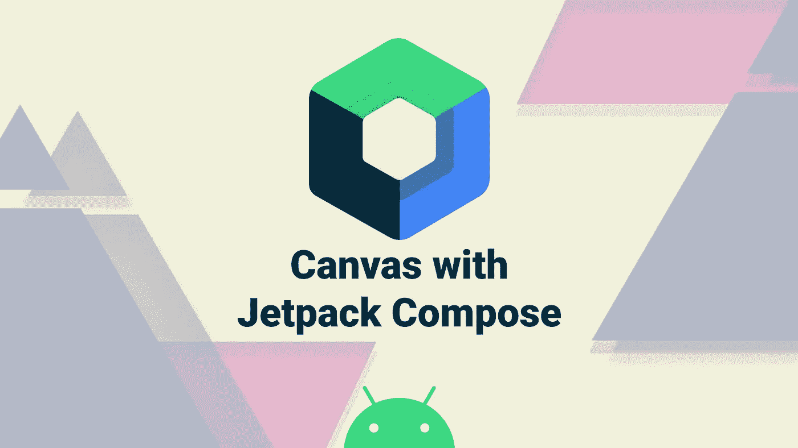
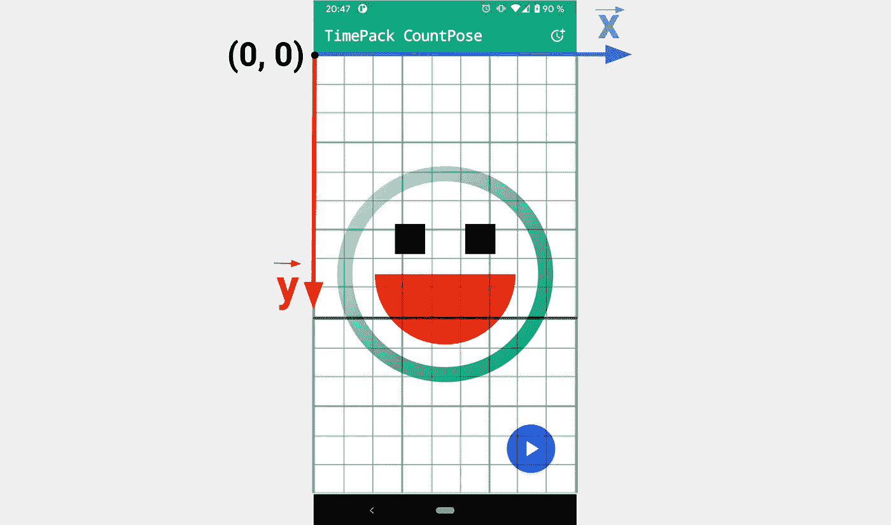
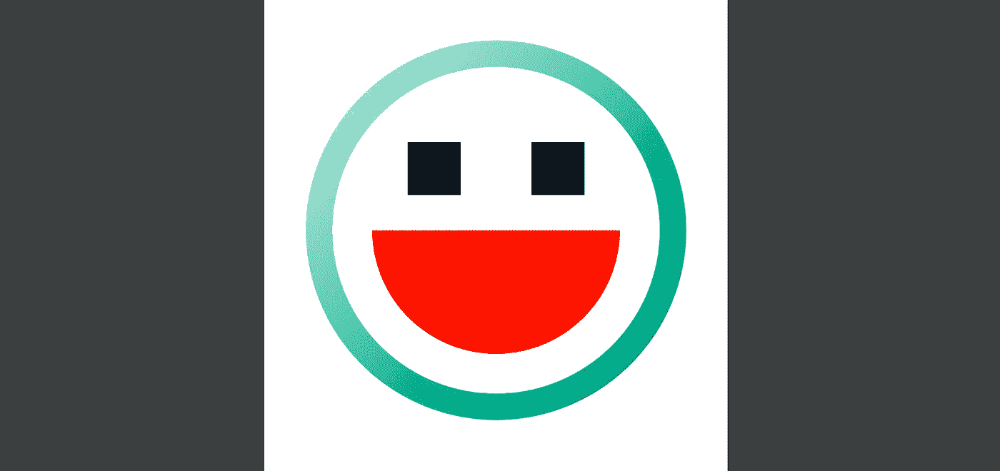
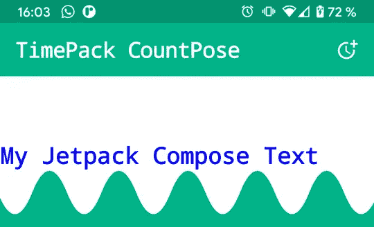

# 探索 Jetpack 合成画布:绘画的力量

> 原文：<https://medium.com/google-developer-experts/exploring-jetpack-compose-canvas-the-power-of-drawing-8cc60815babe?source=collection_archive---------1----------------------->

在这篇文章中，我将分享我用 Jetpack Compose 使用 Canvas 的经验，Jetpack Compose 是 Google 新推出的 UI 工具包。Android Dev Challenge #2 让我有机会了解大量关于 [**Canvas**](https://developer.android.com/reference/kotlin/androidx/compose/ui/graphics/Canvas) 的事情，以及如何利用它以一种非常好的方式绘制形状或文本并制作动画。

大多数代码示例都基于下面的项目:

 [## Oleur/TimePack-CountPose

### TimePack CountPose 是一个计时器应用程序，用于展示 Jetpack 与 Canvas Composable 的合成动画。

github.com](https://github.com/Oleur/TimePack-CountPose) 

> 免责声明:代码示例基于 Compose 1.0.0-beta02。API 方法可能会在不久的将来发生变化。

# 使用画布的第一步

如果你熟悉 Android 视图画布的方法，你就不会迷失在 Jetpack Compose 的方法中。所有的函数名称都是相同的，其中一些甚至在处理**路径** API 时更加明确，例如**:*relativeQuadraticBezierTo()***而不是 ***rQuadto()*** 来绘制一段路径。

如果你不熟悉原生的 Android Canvas，我强烈推荐你看一下丽贝卡弗兰克斯的这篇文章。

 [## 在 Android 画布🖼上开始绘画

### 了解如何使用 Android Canvas 类

medium.com](/over-engineering/getting-started-with-drawing-on-the-android-canvas-621cf512f4c7) 

对于 Jetpack Compose，有一个可组合组件，它是 UI 组件库的一部分，名为 **Canvas** ，用于释放应用程序中的绘图能力。我们将画一个简单形状(圆形、弧形和矩形)的笑脸来展示它的能力。

画布上的***onDraw***lambda 让我们可以访问**绘图范围**。这个范围允许我们在画布上画出任何我们想要的东西。记住画布的原点( *x=0，y=0* )位于左上角。

Canvas with x-y axis and origin at top left

为了绘制笑脸的头部，我们将使用笔画样式绘制一个圆。如果我们让样式为空，默认情况下它会被填充。所有绘制方法都接受一种 [**颜色**](https://developer.android.com/reference/kotlin/androidx/compose/ui/graphics/Color) 或一种 [**画笔**](https://developer.android.com/reference/kotlin/androidx/compose/ui/graphics/Brush) (用于用颜色列表添加渐变)。为了设置半径，我们可以使用**绘图范围**提供的 ***尺寸*** 访问当前绘图环境的尺寸，以便根据组件的尺寸计算可缩放的半径。中心属性接受一个 [**偏移**](https://developer.android.com/reference/kotlin/androidx/compose/ui/geometry/Offset) 来设置图形在画布中的位置。

然后，我们用单色画出嘴巴的弧线，同样我们也画出眼睛的矩形。现在，我们笑脸可以显示在屏幕上了:

在 **DrawScope** 中有很多方法可以在画布上绘图，下面是当前函数的一个例子:

*   ***draw circle()***//*在给定坐标处画一个圆*
*   ***draw arc()***//*绘制一个缩放到适合给定矩形的圆弧*
*   ***draw image()***//*在画布中绘制 image bitmap*
*   ***draw points()***//*绘制一系列点*
*   ***draw path()***//*用给定的颜色绘制路径*

还有更多…现在让我们看看如何将我们添加到画布上的图画制作成动画。

# 带画布的动画

现在我们已经有了基础，让我们看看如何进一步实现和动画更复杂的绘图。在 Android 开发挑战#2 中，我决定开发一个波浪动画，它缓慢地转换到底部，具有动态的波浪宽度，在时间结束时变平。

**DrawScope** 提供了一个非常好的 API 来直接制作画布的动画。您可以应用平移、旋转或缩放变换。对于计时器波动画，我们将进行实际的平移变换。

首先，我们定义两种类型的**来实现目标动画。首先，我们将一个无限动画设置在一个从 0 到 1 的浮点数上，以便通过***remember infinifountation()***得到一个无限波浪效果。然后我们使用 ***animateFloat()*** 和相关的规范来公开动画的值。**

**对于所有有限的动画，我们将直接使用 **AnimationState** 函数，如***animatefloatstate()、animateColorAsState()…***来设置目标值和定义动画规格。**

**现在我们已经定义了动画状态，我们可以实现波浪动画了。为了绘制 wave 本身，我们将使用一个 [**路径**](https://developer.android.com/reference/kotlin/androidx/compose/ui/graphics/Path) ，这将允许我们添加**贝塞尔曲线段**到我们的路径中，就像正弦函数一样。然后，一旦绘制完成，我们需要用 **DrawScope** 提供的***translate()***lambda 对其进行包装，并传递 AnimateState 的值对顶部像素进行动画处理。**

**这是完整的动画！**

**Timer wave animation with Jetpack Compose Canvas**

# **使用原生画布绘制文本**

**目前，您不能直接在 Jetpack 撰写画布上绘制文本。为此，您必须从 Android 框架访问原生画布，以便在其上绘制一些文本。在 Canvas 组件的***onDraw***lambda 上，可以调用函数***drawinto Canvas***用 **nativeCanvas** 访问底层 Canvas(如果可以复用一些你在之前的 Android 应用中实现的绘制逻辑，会很有帮助)。然后，你可以像 ***drawText()*** 或者 **drawVertices()** 这样调用所有与原生画布相关的方法。**

**要对文本应用样式，必须使用**绘制**对象。由于我们使用的是原生画布，所以我们不能直接使用 ***drawText()*** 函数从 Jetpack Compose 中使用 **Paint** 。为了获得一个本地画图实例，我们可以调用方法***asframework Paint()***来处理一个 **android.graphics.Paint** 。**

**下面的代码片段展示了如何在本机画布上绘制一个简单的文本:**

**下面是它在示例应用程序上的样子:**

****

**Draw text with Jetpack Compose Canvas**

**您可以使用所有的 Jetpack 合成画布变换(平移、旋转、缩放……)并将 ***drawIntoCanvas*** 包装，这样您就可以在所绘制的内容上添加动画。**

**Add transformations to the native canvas**

**在画布上画画可能会开启许多设计的可能性！你可以很容易地添加简单的，但是如果你想实现复杂的路径绘制，你可能最终会实现复杂的数学算法。Jetpack Compose Canvas 提供了很多功能，所以请明智地使用它。**

**非常感谢 [Annyce Davis](https://twitter.com/brwngrldev) 的评论和很好的反馈。👏**

**如果你有任何问题，请不要犹豫，在推特上联系我🤓**