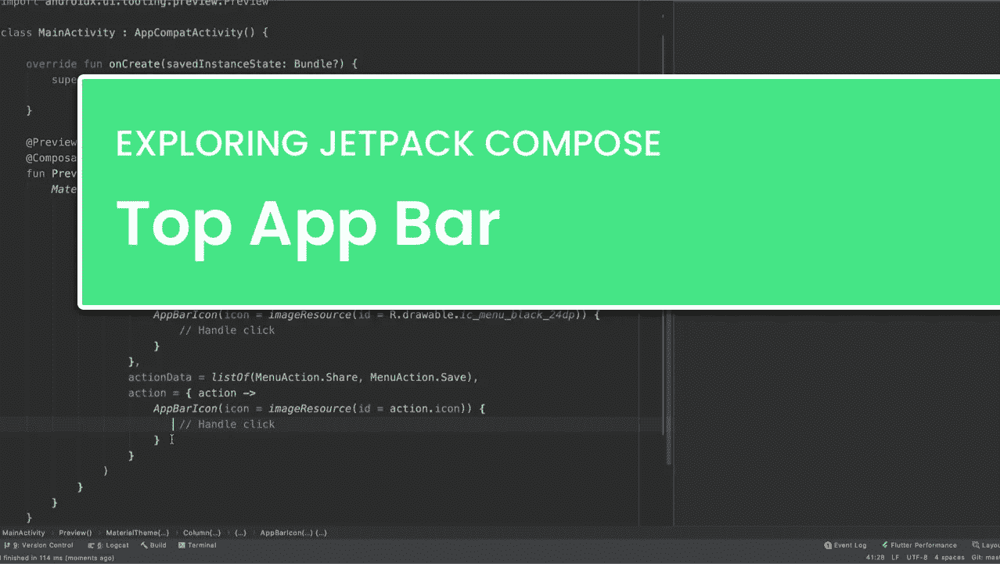
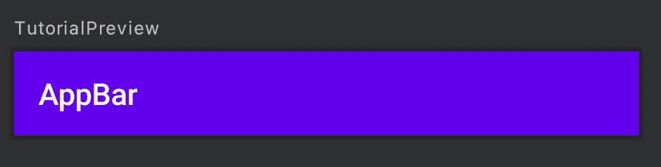
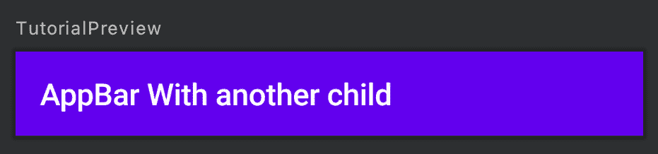
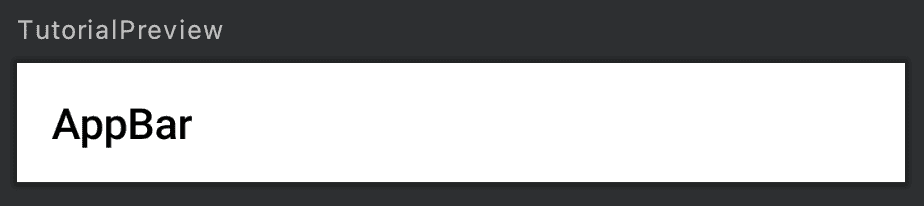
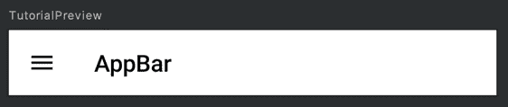
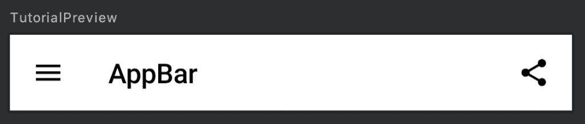

# 探索 Jetpack 撰写:TopAppBar

> 原文：<https://medium.com/google-developer-experts/exploring-jetpack-compose-topappbar-c8b79893be34?source=collection_archive---------0----------------------->



> 这篇文章最初发布于[joebirch.co](https://joebirch.co/)

在我们应用程序的许多屏幕中，我们很可能在 Android 应用程序中使用工具栏/应用程序栏。当使用 Jetpack Compose 构建应用程序时，我们将需要重新创建这个组件。在本文中，我们将看看[顶部应用程序栏](https://material.io/develop/android/components/app-bar-layout/)组件，它允许我们这样做。

如果你想通过这个媒介了解顶级应用程序栏，这篇博文有一个支持视频:

TopAppBar 组件通常用作我们屏幕的标题——显示导航标题以及菜单组件或我们应用程序设计所需的任何其他装饰。在 Jetpack Compose 中，可以通过两个不同的函数创建该组件。第一个有三个参数:

*   **标题** —在应用程序栏中显示的标题。这是**所要求的**
*   **颜色** —用于工具栏背景的颜色。可选，如果没有提供，那么将使用主题原色。
*   **导航图标** —显示在应用程序栏开始处的图标

```
@Composable
fun TopAppBar(
    title: @Composable() () -> Unit,
    color: Color = MaterialTheme.colors().primary,
    navigationIcon: @Composable() (() -> Unit)? = null
)
```

让我们来看一下如何构建我们自己的 TopAppBar——如上所述，我们必须至少提供一个标题来这样做:

```
TopAppBar(
    title = { Text(text = "AppBar") }
)
```



您可能从上面注意到，这个标题使用了@Composable 引用，这意味着我们不仅仅局限于文本组件。也许我们想在 AppBar 中显示某种形式的装饰或自定义组件。例如，我们可以显示由多个子组件组成的行。虽然您可能不需要做下面的事情，但这只是一个简单的例子:

```
TopAppBar(
    title = { 
        Row(children = {
            Text(text = "AppBar")
            Text(text = " With another child")
        })
    }
)
```



虽然 TopAppBar 使用了我们主题的主要颜色，但是在某些情况下我们可能想要改变颜色。我们可以通过为颜色参数提供一个颜色参考来实现这一点:

```
TopAppBar(
    title = { Text(text = "AppBar") },
    color = Color.White
)
```



事实上，我们的顶部应用程序栏看起来很棒！然而，我们用来组成 TopAppBar 的函数也允许我们提供一个 navigationIcon，显示在工具栏的开始，标题之前。这里我们可以传递一个 AppBarIcon 实例形式的导航图标。

AppBarIcon 是一个可组合的组件，包含一个带有内置涟漪效果的可点击容器，托管我们提供的图像。除了图像之外，还提供了一个 onClick 处理程序，这样我们就可以对图标上的单击事件做出反应。我们不会在这里处理这个问题，因为它超出了本文的范围。

```
TopAppBar(
    title = { Text(text = "AppBar") },
    color = Color.White,
    navigationIcon = {
        AppBarIcon(
            icon = imageResource(
                id = R.drawable.ic_menu_black_24dp)
            ) {
                // Open nav drawer
            }
    }
)
```



这个 AppBarIcon 为我们处理图标的大小，使用应用程序栏图标的预定义直径。虽然我们可以自己完成这项工作，但这个方便的助手 composable 会从我们这里接手一些工作。

```
Container(width = ActionIconDiameter, height = ActionIconDiameter) {
    Ripple(bounded = false) {
        Clickable(onClick = onClick) {
            SimpleImage(icon)
        }
    }
}
```

通过以上操作，我们已经能够创建一个简单的 TopAppBar，它包含我们希望显示的标题，以及一个导航图标。然而，在某些情况下，我们会希望在我们的 TopAppBar 中显示操作——这就是 TopAppBar 的第二个可组合方法出现的地方:

```
@Composable
fun <T> TopAppBar(
    title: @Composable() () -> Unit,
    actionData: List<T>,
    color: Color = MaterialTheme.colors().primary,
    navigationIcon: @Composable() (() -> Unit)? = null,
    action: @Composable() (T) -> Unit
        // TODO: support overflow menu 
        here with the remainder of the list
)
```

从上面我们已经可以看到一些相似之处——我们仍然可以为 TopAppBar 设置标题、颜色和导航图标。但是在这里我们看到添加了另外两个属性——actionData 和 action，以及我们的函数<t>的通用声明。</t>

以前，当谈到应用程序栏动作时，这些是在 XML 菜单文件中定义的，并作为屏幕菜单加载。这里我们提供了一个 ID 以及一些文本或图标引用。当涉及到 TopAppBar 时，事情的工作方式有点不同。我们可以提供一个为 **< T >** 声明的类型集合，而不是提供一个菜单资源。这可能是字符串、整数资源或类的集合。让我们来看一个例子。

对于我的类型 T，我将定义一个名为 MenuAction 的新的密封类——当涉及到处理混合标签/图标、溢出菜单以及单击侦听器时，不使用原始数据类型将更容易处理事情。现在，我们将只定义一个名为 Share 的操作:

```
sealed class MenuAction(
    @StringRes val label: Int, 
    @DrawableRes val icon: Int) {

    object Share : MenuAction(R.string.share, R.drawable.ic_share)}
```

然后我可以继续添加它作为我的类型<t>:</t>

```
TopAppBar<MenuAction>(
    title = { Text(text = "AppBar") },
    color = Color.White,
    navigationIcon = {
        AppBarIcon(icon = imageResource(
            id = R.drawable.ic_menu_black_24dp)) {
            // Open nav drawer
        }
    }
)
```

将它定义为 TopAppBar 操作的类型后，我们就不能继续添加 actionData 了——这实际上是我们希望在 TopAppBar 中显示的菜单项列表。现在，我们将只显示一个菜单项:

```
TopAppBar<MenuAction>(
    title = { Text(text = "AppBar") },
    color = Color.White,
    navigationIcon = {
        AppBarIcon(icon = imageResource(
            id = R.drawable.ic_menu_black_24dp)) {
            // Open nav drawer
        }
    },
    actionData = listOf(MenuAction.Save)
)
```

现在我们的 TopAppBar 知道了将要显示的菜单项，我们可以添加 action 参数了。该操作用于为正在使用的每个菜单项构建一个可组合的。因此，如果我们在 actionData 中返回了多个 MenuAction 项，那么将为其中的每个项调用此操作，从而在流程中构建一个可组合的。在这里，我们将使用前面的同一个 AppBarIcon 类，使用我们的 MenuAction 引用来构建一个可组合的:

```
TopAppBar<MenuAction>(
    title = { Text(text = "AppBar") },
    color = Color.White,
    navigationIcon = {
        AppBarIcon(icon = imageResource(
            id = R.drawable.ic_menu_black_24dp)) {
            // Open nav drawer
        }
    },
    actionData = listOf(MenuAction.Save),
    action = { menuAction ->
        AppBarIcon(icon = imageResource(
            id = menuAction.icon)) {
            // Handle action click
        }
    }
)
```



有了它，我们现在有了一个支持菜单项的 TopAppBar。如上所述，我们可以支持多个菜单动作——目前对 API 中溢出菜单的支持还没有完成，所以这里的行为可能与预期不同。

在本文中，我们深入研究了 Jetpack Compose 中的 TopAppBar 组件，以及如何在我们的应用程序中使用它。虽然它是一个非常小的组件，但它提供了很大的灵活性，允许我们创建适合我们应用程序需求的应用程序栏。你对如何使用这个组件有什么问题吗，或者你已经使用过它了吗？请在这里或 twitter 上联系我们！

[](https://twitter.com/hitherejoe) [## 乔·伯奇

### 乔伯奇的最新推文(@hitherejoe)。Android Lead @Buffer。他/他。GDE 为@Android、@actionsongoogle…

twitter.com](https://twitter.com/hitherejoe)