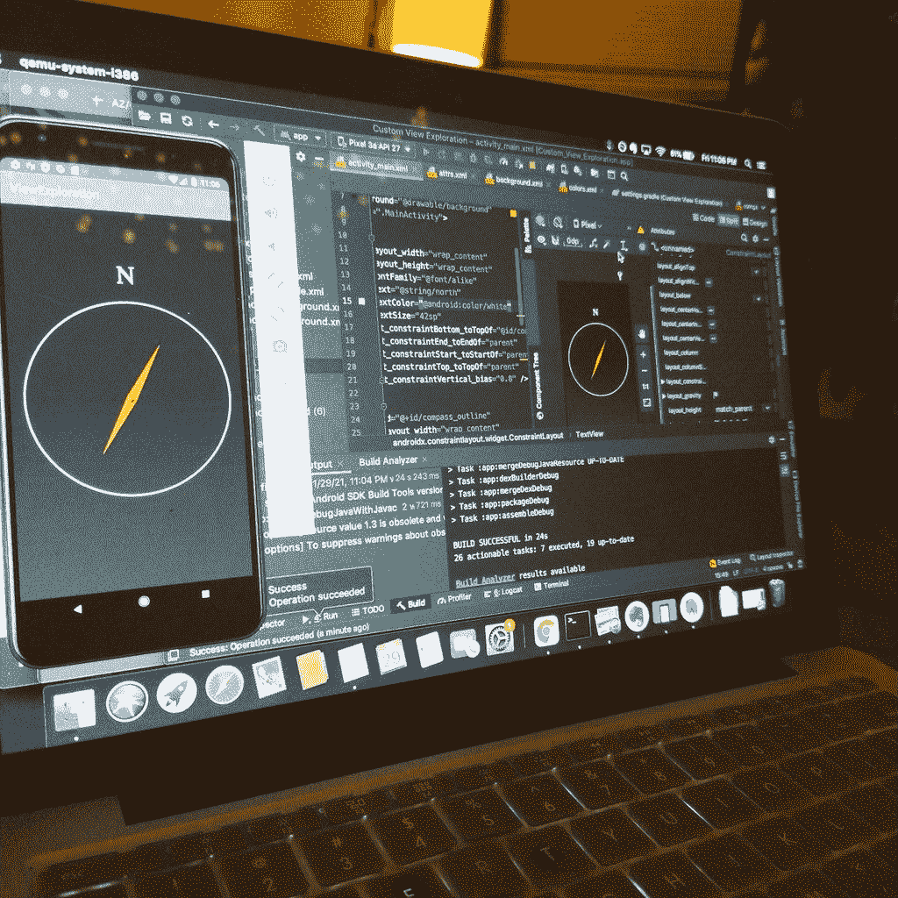
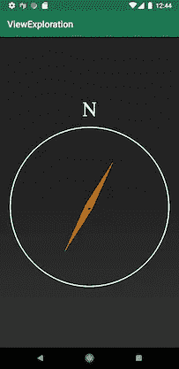
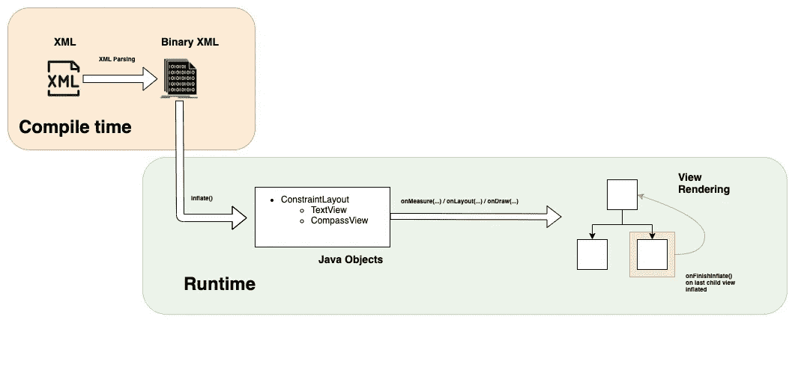

# 使用 Android 自定义视图探索 Kotlin 初始化

> 原文：<https://medium.com/google-developer-experts/exploring-kotlin-initialization-with-android-custom-views-cde06e915e8d?source=collection_archive---------2----------------------->

## 仔细看看 Kotlin 和程序/动态视图膨胀之间的关系



今天，我们探讨“在视图的生命周期中，初始化发生在哪里？”这是我的队友们激烈争论了几个月的话题，所以我决定亲自看看。本文介绍了两种扩展自定义视图进行比较的方法:通过布局资源和以编程方式。



在这个探索中，我们看一个小的指南针应用程序。为了方便起见，您可以在 Github 上下载[代码，以便在您自己的设备上跟随/运行该应用程序。](https://github.com/ahinchman1/Custom-View-Exploration-Compass)

这个应用程序使用[视图绑定](https://developer.android.com/topic/libraries/view-binding)和一个自定义视图，根据用户设备的朝向来旋转指针。这两个不同的案例存在于来自`main`分支的不同分支上。

## Kotlin 构造函数和 init 块什么时候调用？

像 Java 一样，Kotlin 可以声明多个构造函数，但是区分了*主*和*次* *构造函数。*都用关键字`constructor`表示。

大多数情况下，一个 Kotlin 类只会使用一个*主* *构造函数。*如果没有可见性修饰符或注释，那么一个类可以省略`constructor`关键字。没有主构造函数的 Kotlin 类会生成一个什么都不做的类。

一个*主构造函数*也可以包括一个用关键字`init`表示的*初始化程序块*。作为主**构造器*的一部分，一旦类被初始化，初始化器块就执行逻辑。*

**二级构造器*多用于 Java 互操作。对于下面的`CompassView`的情况，没有声明*主构造函数*，但是有多个*次构造函数*为:*

*这些*次级构造函数*将委托给超类中适当的构造函数，或者找到一个这样做的构造函数。但是，具体来说，一个*二级构造函数*相对于*一级构造函数*会以什么顺序执行呢？*

*来自科特林官方[文档](https://kotlinlang.org/docs/classes.html#secondary-constructors):*

> *对主构造函数的委托发生在次构造函数的第一条语句中，因此所有初始化器块和属性初始化器中的代码都在次构造函数体之前执行。*

*在`CompassView`中，*初始化块*在*二级构造器*执行之前执行。但是 Kotlin 类初始化在视图生命周期中到底处于什么位置呢？我们通过研究视图是如何膨胀的来回答这个问题。*

# *创建视图时会发生什么？*

*答案取决于如何在树中添加视图。在屏幕上，Android 中的所有视图都存在于单个树中。有两种方法可以将视图添加到树中:*

*   ***以编程方式:**向树中添加一个视图。*
*   ***XML:** 通过 Android 布局文件指定另一棵树。*

*在我们的 compass 应用程序中，我们将自定义的`CompassView`扩展到`MainActivity`上，作为唯一的自定义视图组件。本文展示了通过 XML ( `CompassView(context, attrs)`)和代码(`CompassView(context)`)膨胀定制视图之间的区别。*

## *案例 1:通过 XML 膨胀的定制 Kotlin 视图*

*当您将一个视图元素放入 XML 文件时，Android 将使用一个`LayoutInflater`来解析 XML 中的相应对象并将其映射到展开的视图。`LayoutInflater`通过打开 ResourceManager 并检查其当前配置中所有可能匹配的布局来检索`resource`。Android 将解析回适当的二进制 XML 资源。*

**

*XML uses LayoutInflater, sends the callback onFinishInflate() from the final child inflation back to the root.*

*对于`CompassView(context, attrs)`,第二个参数将利用必要的属性来告诉视图层次如何在树中调整和放置元素。这篇文章并不关注`View`生命周期的这些阶段(测量/布局/绘制)，但有一个来自[的非常棒的演讲:Android 如何渲染(Google I/O '18)](https://www.youtube.com/watch?v=zdQRIYOST64&ab_channel=AndroidDevelopers) ，它深入探究了好奇者的机制。*

*然后，对其子视图及其子视图的子视图重复这一膨胀过程，直到所有视图都被膨胀。当膨胀完成时，`LayoutInflater`从子视图向根视图发送一个回调`onFinishInflate()`,以指示视图准备好进行交互。*

*既然我们已经描述了这个过程，让我们检查用 XML 实例化我们的定制`CompassView`所需的代码:*

*在`MainActivity`中，`CompassView`通过视图绑定从 XML 中引用。以这种方式初始化自定义视图时，会执行默认的辅助构造函数:*

```
*D/Compass_View_Kotlin: Kotlin init block called. **   CompassView(context, attrs) called**D/Compass_View_Kotlin: Inflation started from constructor.D/Compass_View_Kotlin: **onFinishInflate() called.**D/MainActivity: onStart(): Start compass.*
```

*首先调用 Kotlin 初始化块，*然后*调用次级构造函数`CompassView(context, attrs)`。请记住，没有用于扩展视图类的主构造函数(除非您自己创建一个)，所以在次构造函数之前先执行`init`是有意义的。因为调用`CompassView(context, attrs)`使用了`LayoutInflater`，所以当所有视图都完成膨胀时，就会进行`onFinishInflate()`回调。*

# *案例 2:以编程方式膨胀的定制 Kotlin 视图*

*在很大程度上，通过 XML 初始化视图是在 Android 中创建视图元素的首选方式，因为它成为了树视图层次结构的一部分。这样做有好处:使用 XML 对 Android 内存更友好，因为它可以很容易地压缩，并有助于减少编程绘制可能必须做的运行时工作负载。*

*假设您不能在 XML 中包含自定义视图的创建，而是必须只在运行时初始化视图。*

*代码可能是这样的:*

*如您所见，仅仅为了使`CompassView`元素适合 ConstraintLayout，就有大量的工作以编程方式设置 UI。这种特殊情况在现实生活中难以置信地不切实际，但是我们谈论初始化`CompassView(this)`有一个特殊的原因。为了进行演示，我们将运行以下代码:*

```
*D/Compass_View_Kotlin: Kotlin init block called.**CompassView(context) called**D/Compass_View_Kotlin: Inflation started from constructor.D/MainActivity: onStart(): Start compass.*
```

*和前面的例子一样，Kotlin 初始化块首先执行，然后是次级构造函数`CompassView(context)`。但是，你可能已经注意到*没有* `*onFinishInflate()*` *回调曾经做过*。这是因为`CompassView(context)`没有被 XML 实例化，这意味着没有`LayoutInflater`发挥作用。递归实例化不需要等待子进程，因此回调也不需要`onFinishInflate()`。*

*如果您需要为不依赖于该系统调用的不同构造函数调用添加共享逻辑，这可能会给在旧代码和其他与 UI 相关的操作中创建更多的手动视图绑定带来问题。*

# ***推荐***

*您可以用`@[JvmOverloads](https://kotlinlang.org/api/latest/jvm/stdlib/kotlin.jvm/-jvm-overloads/)`注释来注释自定义视图，这告诉 Kotlin 编译器生成重载方法。每个重载都会用默认值替换生成的方法中省略的任何参数，这意味着下面的代码相当于本文开头写的`CompassView`类构造函数:*

*不要依赖系统来调用`onFinishInflate`，你可以使用 Kotlin `init{ }`来共享逻辑(即使视图在代码中动态膨胀)。在初始化块中运行`inflate`方法将保证无论您选择如何初始化您的自定义视图都会发生膨胀。*

*我希望你喜欢这篇简介:在 Android 中，通过 Kotlin 的镜头来看某些概念可以为看似基本的问题提供新的视角。您可以在`main`项目上找到推荐的代码版本，以及下面的其他资源。*

# *其他资源:*

*   *[droid con NYC 2016:LayoutInflater 如何工作](https://www.youtube.com/watch?v=Y06wmVIFlsw&ab_channel=Touchlab)*
*   *布局充气器:[https://developer . Android . com/reference/Android/view/layout Inflater](https://developer.android.com/reference/android/view/LayoutInflater)*
*   *科特林初始化:[https://kotlinlang.org/docs/classes.html](https://kotlinlang.org/docs/classes.html)*