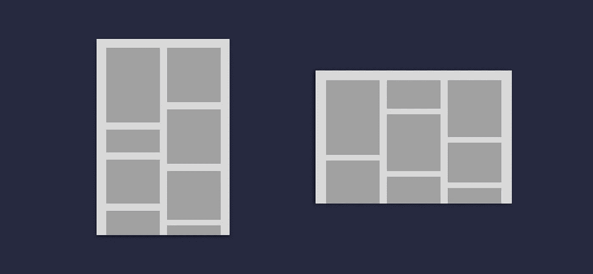
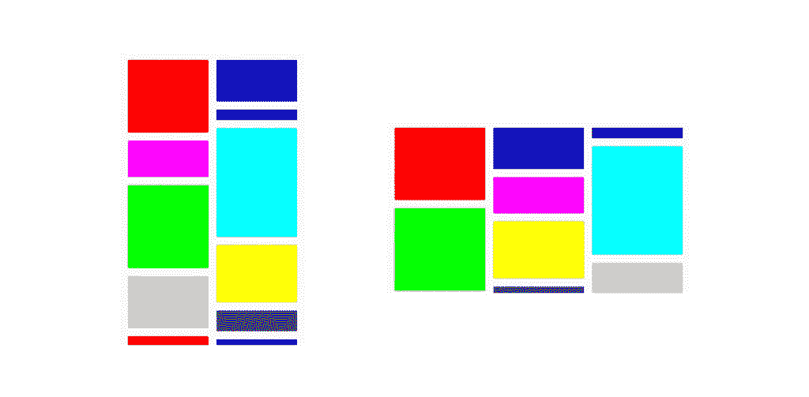
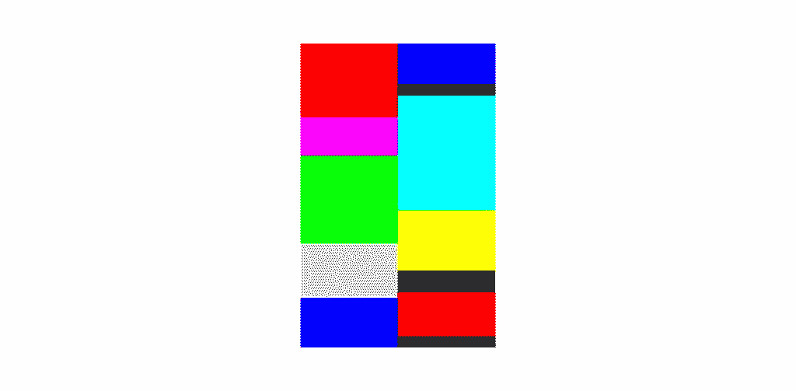
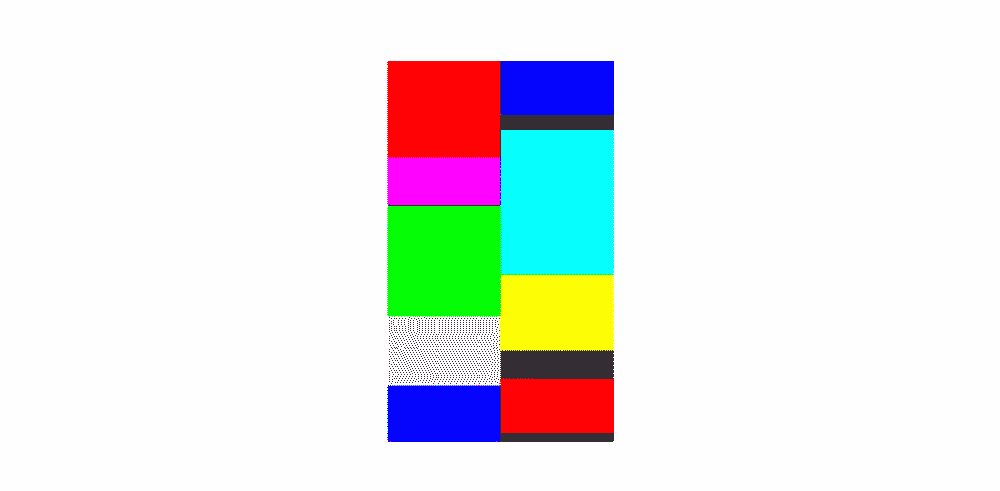
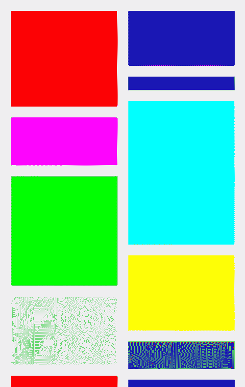
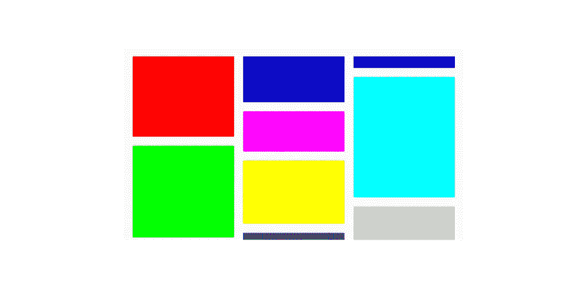
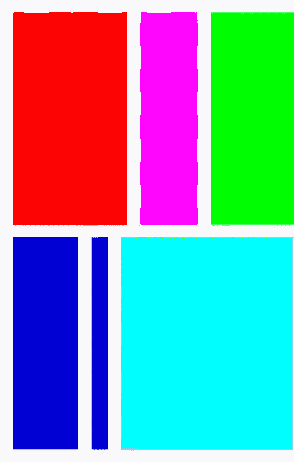

# 探索 Jetpack Compose 中的惰性交错网格

> 原文：<https://medium.com/google-developer-experts/exploring-lazy-staggered-grids-in-jetpack-compose-5940d5a393be?source=collection_archive---------0----------------------->



在 Jetpack Compose 的版本 **1.3.0** 中，我们看到添加了两个受欢迎的组件，即**LazyVerticalStaggeredGrid**和**LazyHorizontalStaggeredGrid**。这两个组件都允许我们以交错的方式组合内容列表，允许我们轻松地组合具有一定高度/宽度范围的项目，同时还支持惰性组合。

> 这最初发布在[joebirch.co](http://joebirch.co/android/exploring-lazy-staggered-grids-in-jetpack-compose/)



在这篇博文中，我们将看看这些新的可组合 API，了解它们给可组合 API 带来了什么，以便我们可以在自己的应用程序中使用它们。

在我们开始研究这些网格组件之前，我们需要将 compose foundation 依赖项添加到我们的项目中。惰性网格支持是在 **1.3.0** 中添加的，当我们在项目中声明使用这些 API 时，我们将在版本中使用它。

```
implementation 'androidx.compose.foundation:foundation:1.3.0'
```

现在我们已经将它添加到我们的项目中，我们将可以访问两个惰性网格组件——LazyVerticalStaggeredGrid 和 LazyHorizontalStaggeredGrid。

```
@Composable
fun LazyVerticalStaggeredGrid(
    columns: StaggeredGridCells,
    modifier: Modifier = Modifier,
    state: LazyStaggeredGridState =    
        rememberLazyStaggeredGridState(),
    contentPadding: PaddingValues = PaddingValues(0.dp),
    verticalArrangement: Arrangement.Vertical = 
        Arrangement.spacedBy(0.dp),
    horizontalArrangement: Arrangement.Horizontal = 
        Arrangement.spacedBy(0.dp),
    flingBehavior: FlingBehavior =
        ScrollableDefaults.flingBehavior(),
    userScrollEnabled: Boolean = true,
    content: LazyStaggeredGridScope.() -> Unit
)

@Composable
fun LazyHorizontalStaggeredGrid(
    rows: StaggeredGridCells,
    modifier: Modifier = Modifier,
    state: LazyStaggeredGridState = 
        rememberLazyStaggeredGridState(),
    contentPadding: PaddingValues = PaddingValues(0.dp),
    verticalArrangement: Arrangement.Vertical = 
        Arrangement.spacedBy(0.dp),
    horizontalArrangement: Arrangement.Horizontal = 
        Arrangement.spacedBy(0.dp),
    flingBehavior: FlingBehavior = 
        ScrollableDefaults.flingBehavior(),
    userScrollEnabled: Boolean = true,
    content: LazyStaggeredGridScope.() -> Unit
)
```

从这些组件的来源我们可以看到，这些组件的参数几乎是相同的。唯一的区别是 **StaggeredGridCells** 参数的参数名，它是为正在编写的网格类型定制的。

*   **行/列**—**staggered grid cells**引用，用于配置网格单元的组成方式。这或者是固定数量的单元，或者是用于计算在当前配置下屏幕上可以容纳多少行/列的维度
*   **修饰符**–应用于可组合组件的修饰符引用
*   **state**–LazyStaggeredGridState 引用，用于保存网格组件的当前状态
*   **内容填充**–应用于网格内容区域的填充
*   **vertical arrangement**–用于声明网格项目在垂直轴上的组成方式
*   **horizontal arrangement**–用于声明网格的项目在水平轴上应该如何组成
*   **fling behavior**–用于指定网格的 fling behavior
*   **userScrollEnabled**–是否可以通过用户输入滚动网格
*   **内容**–网格内要合成的内容

这里只需要 **StaggeredGridCells** 和 **content** 参数，因此您可以用最少的努力启动并运行一个惰性网格布局。在这篇文章的接下来的部分中，我们将探索这些论点中的大部分，并组成一个网格来显示我们提供给它的数据的可视化。

# 设置网格数据

在我们开始编写 UI 之前，我们将设置一个简单的数据类，用于保存要编写的每个单元格项的信息。我们将创建一个新的类 **GridItem** 。这将包含三条信息:

*   **id**–可用于识别物品的唯一标识符
*   **颜色**–合成项目时使用的颜色
*   **尺寸**–用于项目的尺寸，包括高度或宽度

```
class GridItem(
    val id: String,
    val color: Color,
    val size: Dp
)
```

现在我们有了一个表示每个网格项的数据类，接下来我们可以声明将用于该项的可视化表示的 composable。为此，我们将创建一个新的 composable，它将简单地组成一个**框**，使用来自 **GridItem** 引用的**颜色**和**大小**来配置 composable 的样式。

```
@Composable
fun Item(
    modifier: Modifier = Modifier,
    item: GridItem
) {
    Box(
        modifier = modifier
            .background(item.color)
            .height(item.size)
    )
}
```

现在，我们有了一个数据类来保存网格中每一项的信息，还有一个 composable 来在我们的 UI 中组合这些信息。

**注意**:为了让这篇博文简单，我们不会建立一个 **GridItem** 实例的列表。这只是为了举例说明。

# 构成网格

现在我们已经定义了上面的部分，我们可以继续编写**LazyVerticalStaggeredGrid**。现在，我们将只提供所需的参数，这样我们就可以启动并运行我们的可组合组件。我们将从为`columns`参数提供一个值开始，使用 **StaggeredGridCells 将列数固定为 2。修正了**类。

```
LazyVerticalStaggeredGrid(
    columns = StaggeredGridCells.Fixed(2)
) {

}
```

# 构成网格项目

现在我们已经有了 LazyVerticalStaggeredGrid,接下来我们将在网格中组合条目。为此，我们将使用来自 **LazyStaggeredGridScope** 的 **items** 函数，将传递给可组合函数的 **GridItem** 引用列表传递给该函数。然后，我们将使用这个引用为网格中的每个单元格组成一个**项**。

```
val items: List<GridItem> = ...

LazyVerticalStaggeredGrid(
    columns = StaggeredGridCells.Fixed(2)
) {
    items(items) {
        Item(item = it)
    }
}
```

现在这些项目被组合，我们将能够看到一个包含我们的项目的组合网格-这将以交错网格格式组合。



# 应用间距

从上一节我们可以看到，网格中的项目没有应用填充或间距。如果这种可视化表示与您试图实现的设计不匹配，您可能需要对交错网格应用一些额外的配置。这可以使用**内容填充**、**垂直排列**和**水平排列**参数来完成。我们首先使用 **contentPadding** 参数将填充应用到网格的内容区域。

```
LazyVerticalStaggeredGrid(
    columns = StaggeredGridCells.Fixed(2),
    contentPadding = PaddingValues(16.dp),
    verticalArrangement = Arrangement.spacedBy(16.dp),
    horizontalArrangement = Arrangement.spacedBy(16.dp),
)
```

应用此功能后，我们可以看到内容的外部边缘应用了填充，从而在内容边缘和容器之间创建了一些视觉空间。



接下来，我们希望在容器本身中增加一些空间——允许项目之间有视觉间隙，这样它们就不会接触到。为此，我们将利用**垂直排列**和**水平排列**参数。对于每一项，我们需要提供一个**排列**参考，我们将以**排列.空间的形式完成，通过**允许我们指定一个用于项目间距的尺寸值。

```
LazyVerticalStaggeredGrid(
    columns = StaggeredGridCells.Fixed(2),
    contentPadding = PaddingValues(16.dp),
    verticalArrangement = Arrangement.spacedBy(16.dp),
    horizontalArrangement = Arrangement.spacedBy(16.dp)
)
```

因为我们已经提供了垂直轴和水平轴的值，所以我们现在可以看到这个间距应用于我们的网格的子网格。



# 控制单元配置

正如我们之前看到的，惰性网格组件允许您使用 **StaggeredGridCells** 引用来控制要组成的行/列的数量。到目前为止，我们已经使用它来设置固定的列数，但是我们可以使用它来基于设备的当前配置动态地控制列数。这可以通过对 **StaggeredGridCells** 类使用 **Adaptive** 类型来实现，这允许我们为单元格项指定最小大小。在 LazyVerticalStaggeredGrid 的情况下，这意味着子网格的宽度至少需要达到这个大小，剩余的可用宽度在子网格之间分配。

```
val cellConfiguration = if (LocalConfiguration.current.orientation == ORIENTATION_LANDSCAPE) {
    StaggeredGridCells.Adaptive(minSize = 175.dp)
} else StaggeredGridCells.Fixed(2)
```

因此，在这种情况下，如果有 600dp 可用，将有 3 列各为 200dp。

有了这样的配置，我们现在可以将它传递给网格的`columns`参数。

```
LazyVerticalStaggeredGrid(
    columns = cellConfiguration,
    ...
)
```

在编写本例时，我们现在可以看到，在横向模式下，应用了**自适应**逻辑，我们根据设备配置编写了多列。



# 组成水平网格

在这篇文章中，我们一直关注**的 LazyVerticalStaggeredGrid** ，我们也简单提到了**LazyHorizontalStaggeredGrid**的存在。我们可以将这个可组合对象切换出来，我们需要做的就是将参数`columns`的名称改为`rows`。

```
val cellConfiguration = if (LocalConfiguration.current.orientation == ORIENTATION_LANDSCAPE) {
    StaggeredGridCells.Adaptive(minSize = 175.dp)
} else StaggeredGridCells.Fixed(2)

LazyHorizontalStaggeredGrid(
    rows = cellConfiguration,
    contentPadding = PaddingValues(16.dp),
    verticalArrangement = Arrangement.spacedBy(16.dp),
    horizontalArrangement = Arrangement.spacedBy(16.dp),
) {
    items(items, key = { it.id }) {
        item(
            item = it
        )
    }
}
```

然后我们可以看到屏幕上现在有一个水平的惰性网格，允许我们在水平轴上滚动子项目。



# 包扎

在这篇文章中，我们已经看到了 Jetpack Compose 中新的惰性交错网格 API，由**LazyVerticalStaggeredGrid**和**LazyHorizontalStaggeredGrid**组件组成。我们已经学习了如何在这些容器中配置子项的排列，以及如何控制组成子项时使用的行数/列数。

我个人喜欢看到交错网格在应用程序中的使用，所以我很期待看到这些新的组件是如何在应用程序中使用的！