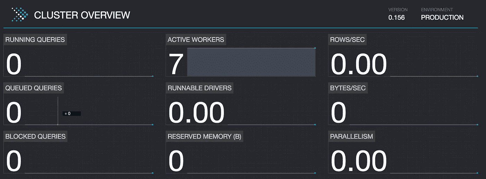
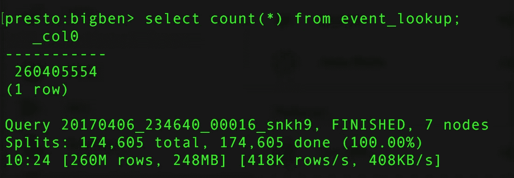
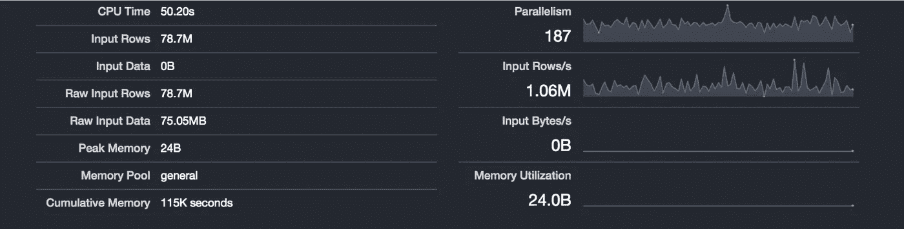
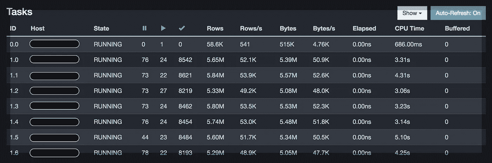
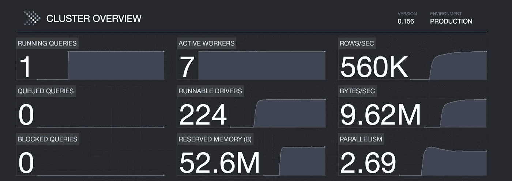
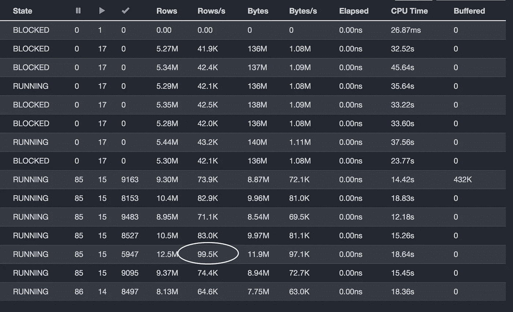
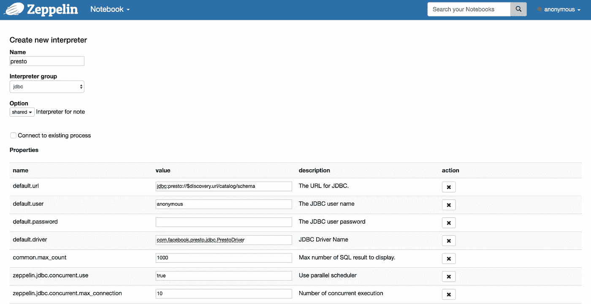
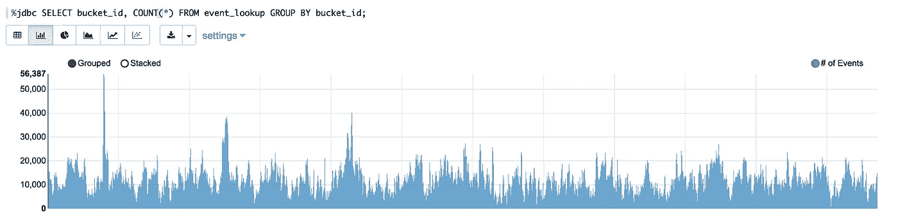
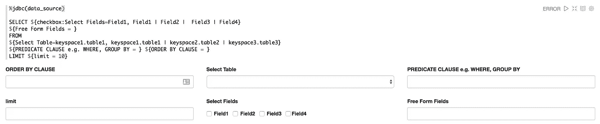

# 探索 Presto 和 Zeppelin 的快速数据分析和可视化

> 原文：<https://medium.com/walmartglobaltech/exploring-presto-and-zeppelin-for-fast-data-analytics-and-visualization-9cb4dca91c3d?source=collection_archive---------0----------------------->


Photo credit [Meditations](https://pixabay.com/en/abstract-blur-britain-british-1239439)

## 介绍

大数据世界乱七八糟！框架、平台和数据源的选择简直令人难以置信。沃尔玛的几个团队混合使用各种堆栈和工具来理解数据。虽然有选择是好事，但当有人希望以一致和统一的方式访问数据时，这确实变得有点令人不知所措。每个系统都公开了一组不同的 API，一种不同的编写查询的语言，以及一种不同的大规模数据分析方法。

我们很早就清楚地认识到，我们需要投资一个技术堆栈，它可以提供对结构化和半结构化数据的访问，以便进行快速分析，并且仍然可以以最小的开销进行管理。还希望查询语言尽可能地接近 SQL，以便可以相对容易地使用它。

我们看到的一些系统是[阿帕奇黑斑羚](https://impala.incubator.apache.org/)、[阿帕奇火花](http://spark.apache.org/)和[普雷斯托](https://prestosql.io)。这些系统都经过了实战测试，支持当今大量的生产系统。我们开始倾向于 Presto，原因如下:

*   支持大量数据源(Hive、Cassandra、Kafka、Elastic Search)
*   极其丰富的 SQL 方言
*   能够交叉连接来自多个不同来源的数据
*   没有像动物园管理员等系统的外部依赖
*   出色的表现

在本文中，我们将探索我们的 Presto 设置，并检查它在一些常见用例中的性能。我们还将关注 [Apache Zeppelin](https://zeppelin.apache.org/) ，它是一个优秀的开源数据可视化工具，用于交互式查询，并帮助团队实时协作。

## 一个分布式 SQL 引擎

[Presto](https://prestosql.io/) 是一个优秀的分布式 SQL 引擎，针对跨多个数据源的大型数据集运行查询进行了优化。它支持跨多个数据源的分布式连接，如 Hive、Kafka、Elastic Search、Cassandra 等，从而允许统一的分析访问模型。

设置 Presto 集群很容易。我们在不到 20 分钟的时间内建立了一个 8 节点(每个节点有 8 个内核和 16G RAM)的 presto 集群。Presto 提供了实时查询计划，这是一大优势。它帮助我们理解如何调优查询以获得更高的性能。Presto 还提供了一个 JDBC 驱动程序，所以从 Java 应用程序访问它也非常方便。

## 快速配置

Presto 需要最少的配置。我们需要在 etc/下提供 node.properties 文件，这需要最少的属性，例如

```
node.environment=prod
node.id=node1
node.data-dir=/var/presto/data
```

每个节点还需要一个 config.properties。

```
coordinator=false
http-server.http.port=8080
query.max-memory=50GB
query.max-memory-per-node=8GB
discovery-server.enabled=true
discovery.uri=http://${coordinator_ip}:8080
```

其中一个节点必须成为协调器，并且需要更多的属性

```
coordinator=true
node-scheduler.include-coordinator=false
http-server.http.port=8080
discovery-server.enabled=true
discovery.uri=http://localhost:8080
```

我们在配置 Presto 时遇到的一个问题是关于 discovery.url 的。 ***我们注意到，在协调器的 config.properties 中，discovery.url 应该指向本地主机，而在所有其他节点中，它应该指向协调器的 IP***

最后，我们需要在 etc/catalog 目录下添加目录(不同数据源的连接器)。下面的例子显示了如何用最少的配置添加 Cassandra 连接器

```
connector.name=cassandra
cassandra.contact-points=<comma separated IPs>
cassandra.consistency-level=LOCAL_ONE
cassandra.username=readonly_u
cassandra.password=readonly_p
cassandra.consistency-level=LOCAL_ONE
cassandra.load-policy.use-dc-aware=true
cassandra.load-policy.dc-aware.local-dc=DC1
cassandra.load-policy.use-token-aware=true
```

如前所述，Presto 可以连接到许多数据源，包括 Cassandra、Hive 和 Kafka 等。连接器的完整列表可以在[这里](https://prestosql.io/docs/current/connector.html)找到

设置好集群后，可以通过 discovery.url 访问控制台



Presto cluster (7 workers + 1 coordinator, 8 cores/16G)

## 测量 Presto 性能

我们着手做的第一个任务是测量查询性能。我们手边有一张近 260 米长的桌子。每行大约有 1 KB 的数据。该表的模式如下:

```
CREATE TABLE event_lookup (
 id text,
 bucket_id timestamp,
 payload text,
 PRIMARY KEY (( id ))
)
```

## 用例 1:计数(*)

在 Cassandra 上启动了一个简单的查询，它返回了 Cassandra 中的分区总数。

```
SELECT COUNT(*) FROM event_lookup;
```

这导致了一次全表扫描，很快就达到了大约 418K 行/秒的惊人速度！流入速率约为 400 千字节/秒。下面的屏幕截图显示了比率和其他指标。



Total counts query performance over 260M rows

在查询执行过程中，偶尔会出现读取速率几乎达到 1 百万行/秒的情况



Max peak performance at 1.06M rows/sec

工作节点的负载分布也几乎相同。从下面的屏幕截图来看，每个工人平均每秒处理 51K 行。



Worker nodes load distribution (Host IPs hidden for privacy)

## 用例 2:分组依据

我们想执行一些比 count(*)查询更复杂的东西来更好地检查性能。我们使用 group by 查询，如下所示:

```
SELECT bucket_id, count(*) FROM event_lookup GROUP BY bucket_id ORDER BY count(*) LIMIT 10;
```

这一次，结果更加令人印象深刻。平均查询速率达到了令人印象深刻的 56 万行/秒！



Presto cluster dashboard view

worker 节点分布有点倾斜，可能是因为“bucket_id”字段在 Cassandra 令牌范围中的划分方式。令人震惊的是，其中一个工作节点达到了大约 100K 行/秒的最高 TPS。



worker nodes load distribution for group by query

获得令人满意的结果后，我们转向了另一个极端，可视化！

## 另一个极端:阿帕奇齐柏林飞艇

如果没有强大的可视化作为补充，数据分析就没有吸引力。可视化在快速导出数据模式和相关性方面大有帮助。虽然有一些工具和库可以提供出色的可视化支持，但它们需要对 JavaScript 和 CSS 有相当好的理解，而这不是数据分析师应该知道的。阿帕奇齐柏林飞艇公司的目标正是填补这一空白。它为分析师提供了一种非常方便的方式来创建交互式 web 笔记本，以编写和执行查询并立即可视化结果。网络笔记本可以实时共享和协作，以获得有价值的反馈。可以对查询进行调度，以便定期执行。像 Presto 一样，Zeppelin 也可以连接到许多数据源。在本文中，我们将重点介绍用于访问 Presto 的 JDBC 连接器。

## 为 Presto 配置 JDBC 连接器

在 Zeppelin 中添加 JDBC 连接器非常容易。我们只需要提供 url、用户、密码和驱动程序属性。下图显示了如何配置 Presto 连接



Adding Presto connector / interpreter to Zeppelin

一旦添加了连接器，我们就可以创建一个笔记本并添加一个新的便笺。在新的注释中，查询可以按如下方式执行，结果可以立即在各种图表中可视化。

```
%jdbc SELECT bucket_id, COUNT(*) FROM event_buckets GROUP BY bucket_id
```

*注意:如果 Presto 没有配置为默认解释器，那么您需要在查询中提供解释器的名称*

```
%jdbc(presto) SELECT bucket_id, COUNT(*) FROM event_buckets GROUP BY bucket_id
```



Zeppelin visualization for Presto query

## 构建 interactive SQL 执行器

Zeppelin 使得构建基于交互表单的 ui 变得非常容易。让我们通过构建一个 SQL 输入表单来尝试一下。通用 SQL 查询执行器需要以下输入:

*   要检索的字段/列的名称
*   表名(FROM 子句)
*   筛选表达式或聚合表达式(WHERE 或 GROUP BY 子句)
*   排序字段(ORDER BY 子句)
*   分页(限制和偏移)

我们编写了一个简单的 zeppelin 查询模板

```
%jdbc
SELECT ${checkbox:Select Fields=Field1, Field1 | Field2 |  Field3 | Field4} ${Free Form Fields = }
FROM 
${Select Table=keyspace1.table1, keyspace1.table1 | keyspace2.table2 | keyspace3.table3} 
${PREDICATE CLAUSE e.g. WHERE, GROUP BY = } 
${ORDER BY CLAUSE = }
LIMIT ${limit = 10}
```

这产生了以下 UI



Zeppelin general SQL query form (with query)

如果我们隐藏查询部分，UI 会变得非常简单


Zeppelin general SQL query form (query hidden)

这就是齐柏林飞艇的力量！在不到 10 分钟的时间里，我们能够创建一个用户界面，用户可以

*   选择字段(通过选择复选框，或在“自由形式字段”中输入，如 Count(*)
*   提供任何 ORDER BY 子句
*   提供任何 WHERE 或 GROUP BY 子句
*   选择任何要连接的表

使用 Zeppelin 强大的显示系统(AngularJS)和可变绑定机制，很容易创建一个段落链，可以连续执行或以任意自定义的方式执行。

## 摘要

在这篇博客中，我们探索了如何利用 Presto 在数据源上运行 SQL 查询。我们还探索了如何将 Presto 与 Zeppelin 连接起来，以创建引人注目的可视化效果并快速分析模式。这导致了不同团队之间的快速分析和协作。在下一篇文章中，我们将探索 Presto 集群如何允许我们跨 Cassandra、Kafka、Hive 等连接数据，以便对快速移动的数据进行即时分析。敬请关注更多更新。