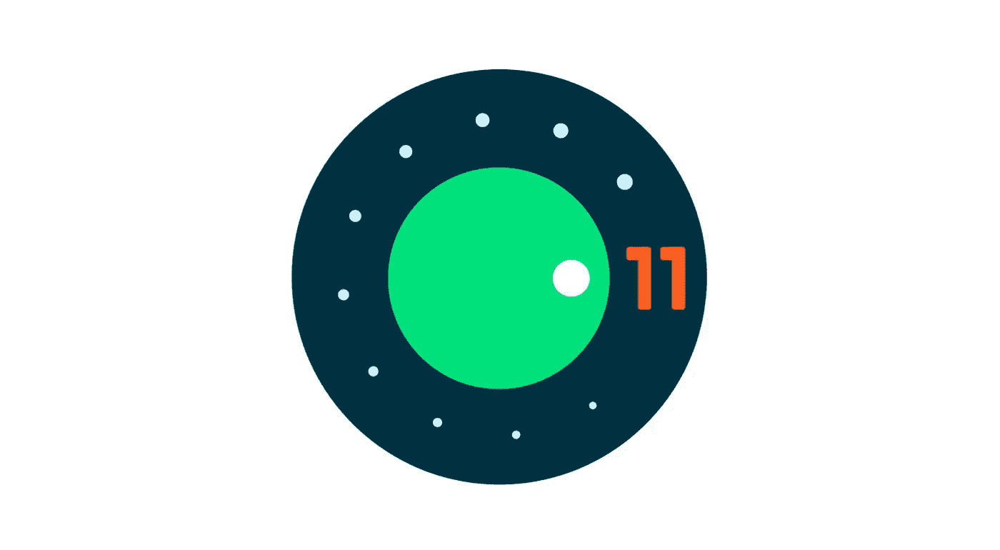
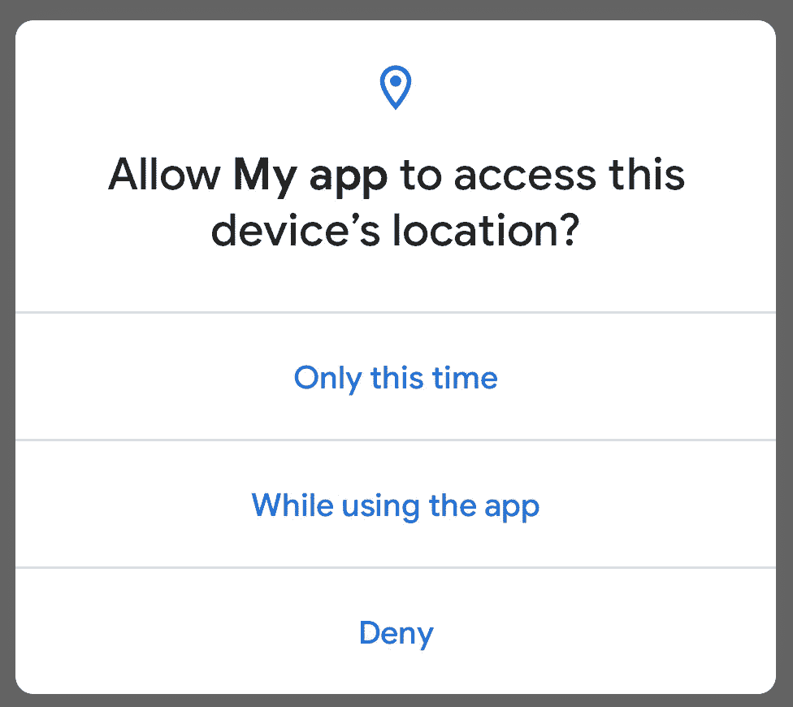
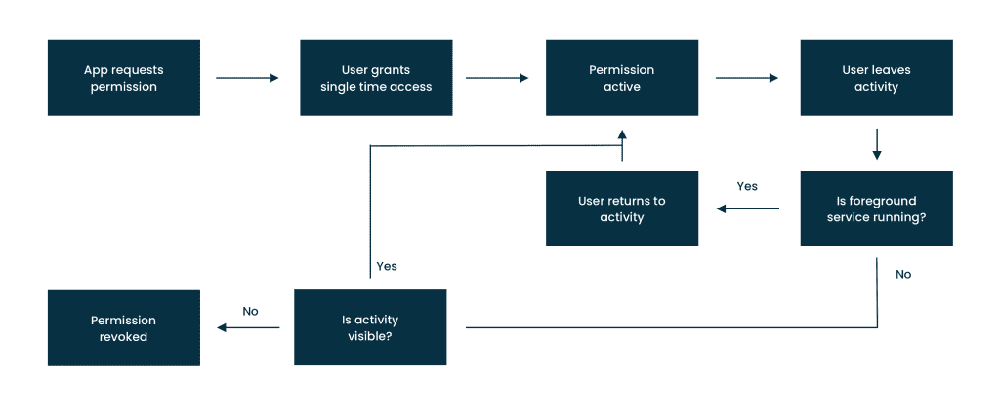
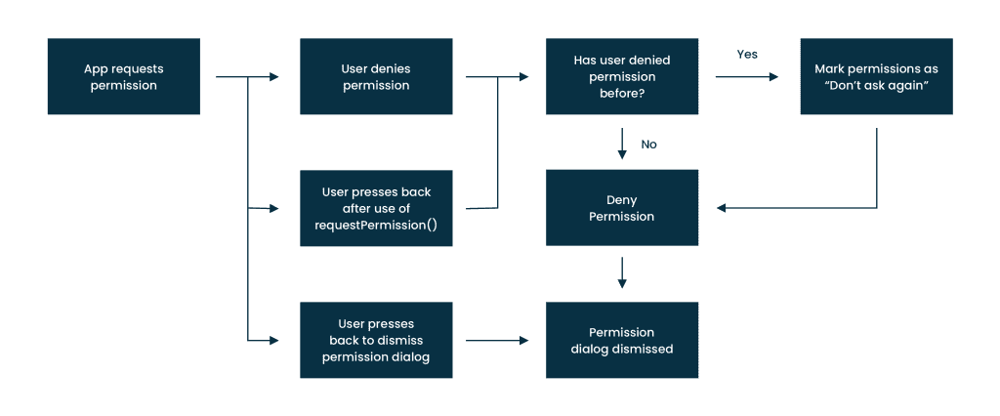
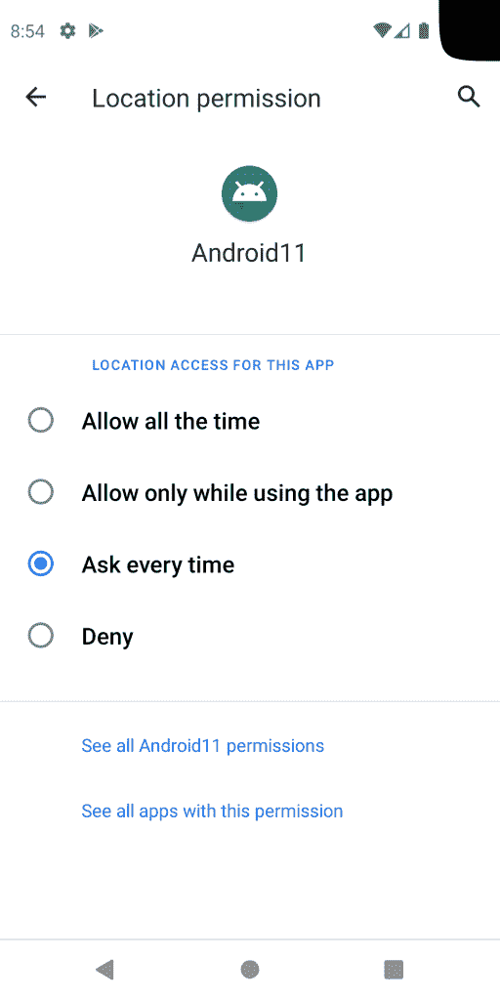
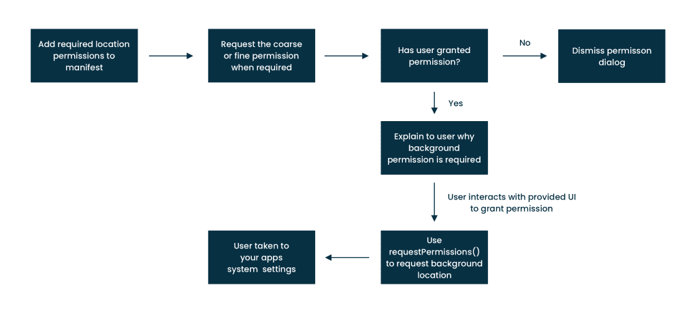

# 探索 Android 11 开发者预览版:权限变更

> 原文：<https://medium.com/google-developer-experts/exploring-the-android-11-developer-preview-permission-changes-61b18fb658?source=collection_archive---------2----------------------->



一年中的这个时候已经到来，一个新的 Android 版本即将出现！正如[在本周早些时候的一篇博客文章](https://android-developers.googleblog.com/2020/02/Android-11-developer-preview.html)中宣布的，Android 11 的第一个开发者预览版现已推出——以及正在发生的一些变化的细节。随着这次发布，系统在权限方面的操作方式发生了一些变化，这将如何影响应用程序——我想借此机会充实这些变化，并分享一些关于它们的想法。

> 这篇文章最初发布在 joebirch.co 的

# 一次性权限

目前，当我们授予一个应用程序访问某些数据(或执行某个任务)的权限时，我们在访问范围上有几个选项。例如，如果一个应用程序想要访问我的位置，那么我可以在应用程序被使用时允许访问，或者拒绝访问。我一直对此感到有点怀疑——虽然我当时使用的功能可能需要我的位置，但我真的不希望应用程序在任何时候都能访问我的位置(当应用程序打开时)。虽然我们可以通过系统进入应用程序设置并撤销访问，但一些用户可能没有意识到这一点。考虑到这一点，选择只授予访问权(也就是说，始终授予访问权)感觉是一个很大的承诺。

在 Android 11 中，增加了一个新选项，该选项只允许当前会话。这意味着，如果在另一个时间再次需要访问，则需要再次请求权限。



但是什么定义了该权限的当前会话呢？对于当前活动，当活动对用户可见时，该权限将是可访问的—如果可见性改变，然后活动返回到，则需要再次请求权限。因此，当您在屏幕中请求这些权限时，值得进行检查。如果您离开并返回到需要权限的功能，您可能需要移动权限检查以确保该功能仍可访问。

有一个条件不满足上述条件——如果您在授予权限后正在运行前台服务，并且用户在前台服务完成之前离开/返回到应用**,则授予的权限将保持可访问。下图概述了这些情况:**



有了上面的更改，它不仅有助于确保应用程序只获得它所需要的权限，而且还大大减少了用户的决策，消除了对所有时间访问做出巨大承诺的感觉。

# 拒绝权限

目前在 Android 中，当我们想要访问媒体、位置等等时，我们可以向用户显示权限对话框。这些对话框是保护用户免受对其设备上某些内容/活动的不必要访问的好方法。不幸的是，应用程序很容易滥用这个对话框——虽然用户可以明确选择“**不要再问**”，但个人认为这是一个大胆的举动。也许这是心理作用，但是我**从来没有**选择这个选项，即使我从来不可能授予给定应用程序的特定权限——很有趣，是吧？与此同时，当一个应用程序再次请求许可时，我也觉得很烦，我不能赢！

Android 11 的一个巧妙之处是，如果用户在一个特定的权限对话框中不止一次选择“**拒绝**，那么这将被视为“**不要再问**”。这意味着频繁请求用户不接受的权限的应用程序将被默认为不能再次请求那些权限，这对用户隐私来说是一个巨大的胜利。

在一些情况下，这些规则可能会有不同的表现。例如，如果用户按下 back 按钮关闭权限对话框，那么这不会被算作一个**拒绝**动作。但是，如果使用 [requestPermission()](https://developer.android.com/reference/androidx/core/app/ActivityCompat#requestPermissions(android.app.Activity,%20java.lang.String%5B%5D,%20int)) 将用户带到系统设置屏幕，则如果按下后退按钮，此**将**计为拒绝操作。下图概述了这些情况:



这些更改将有助于减少任何滥用权限请求的情况，还会促使应用程序更清楚地说明请求权限的原因，并在需要时请求权限，以帮助减少被授予访问权限的机会。

# 后台位置权限

在我看来，位置访问一直是一个重要的隐私点——我从来不想让应用程序一直访问我的位置。但是，它是作为位置许可请求中的一个选项提供的。当针对 Android 11 时，应用程序将不再能够从您的应用程序中请求访问位置数据——该选项已从应用内权限对话框中移除。如果一个应用程序需要在后台始终访问用户位置的权限，则需要在应用程序的系统设置屏幕中授予该权限。

在考虑这种变化时，需要采取几个步骤。我们首先需要向我们的清单文件添加**访问 _ 背景 _ 位置**和**访问 _ 精细 _ 位置**或**访问 _ 粗略 _ 位置**权限。然后，当我们需要访问用户位置时，我们可以首先请求对**精细**或**粗略**位置的许可:

```
requestPermissions(arrayOf(ACCESS_COARSE_LOCATION),    
    REQUEST_CODE_COARSE_LOCATION)
```

我们必须在请求访问**背景**位置之前这样做，没有上述权限这样做将不会在 UI 中显示任何权限对话框。一旦授予了上述权限，我们需要继续向用户显示某种形式的解释，说明为什么我们需要在后台访问他们的位置，以及一个可以用来触发权限流的操作(比如一个按钮)。需要注意的是，这不是系统提供的 UI，必须由您的应用程序提供。当用户单击您提供的操作时，您可以:

*   使用 requestPermissions()请求 ACCESS_BACKGROUND_LOCATION 权限
*   在系统设置中启动应用程序信息页面

当向用户提供上述上下文时，非常清楚地说明您为什么需要该权限非常重要——如果用户在请求了两次后没有授予该权限，后续的权限请求将被忽略。在这一点上，你将不得不求助于手动启动应用程序信息页面-这并不理想，因为你不能直接将用户带到位置权限屏幕，所以一些上下文将会丢失。但是，如果您的应用程序还没有达到许可对话框的限制，那么上面的第一个选项应该是所需的路线。

```
requestPermissions(arrayOf(ACCESS_BACKGROUND_LOCATION), 
    REQUEST_BACKGROUND_LOCATION)
```

当这被触发时，我们的用户将被直接带到我们的应用程序的位置许可系统设置屏幕。从这里，用户授予我们的应用程序他们想要的权限——当返回到我们的应用程序时，我们可以检查我们需要的权限是否已经被授予。



下图显示了上述后台位置权限流的轮廓:



有了这些后台权限更改，应用程序将再次需要确保描述所请求的权限，并对权限流进行后续更改，以确保正确处理上述内容。

在这篇文章中，我们看了一下 Android 11 中与权限相关的一些变化。虽然这些对开发者来说似乎是一个很大的改变，但是它们会让我们的用户体验更加安全和愉快。如果在我们的应用程序中正确处理，我们应该不会看到对用户体验的负面影响。请记住，仅在需要权限时请求权限(如果需要的话)，并给出足够的上下文来说明为什么需要该权限。

敬请关注下一篇关于即将到来的 Android 11 变化的帖子！

[](https://twitter.com/hitherejoe) [## 乔·伯奇

### 乔伯奇的最新推文(@hitherejoe)。Android Lead @Buffer。他/他。GDE 为@Android、@actionsongoogle…

twitter.com](https://twitter.com/hitherejoe)