# 探索 Android 应用捆绑包

> 原文：<https://medium.com/google-developer-experts/exploring-the-android-app-bundle-ca16846fa3d7?source=collection_archive---------1----------------------->


今年的 I/O 大会上宣布了许多令人兴奋的事情，其中最吸引我眼球的是新的应用捆绑包格式。这种格式不仅为我们的应用程序提供了一种新的上传格式，还将有助于影响我们如何以模块化格式构建和组织我们的应用程序。在这篇文章中，我想深入研究 Android 应用捆绑包，这样我们就可以彻底了解它是什么，它的工作方式，以及我们如何在自己的应用程序中添加对它的支持。

[](http://eepurl.com/dIKgiT)

正如我上面提到的，我很高兴听到这种新的上传格式被称为应用捆绑。虽然这个包仍然包含我们的应用程序代码和资源文件，但最大的不同是构建 apk 的责任被转移到了 Google Play 上。从这里开始，新的动态交付可用于创建满足用户设备需求的优化 apk，并在运行时交付安装。

但是我们为什么要考虑使用 Android 应用捆绑包呢？

*   首先，这种方法为您的代码库提供了一个清晰、独立的结构。由于捆绑包的工作方式(尤其是动态交付，我们稍后会谈到)，特性模块化将成为你的应用程序的一部分。这类似于即时应用程序中的模块化方法或一般的按功能模块化方法。无论如何，这有助于分离应用程序的不同部分，并有助于使您的代码库更容易使用。
*   我们以前可能需要构建多个 apk 来针对不同的 API 版本、设备类型等——Android 应用捆绑包意味着我们现在只需上传单个工件和我们所有的应用资源，工具将负责构建并交付给我们的用户。这实质上为我们自动化了这个过程，意味着我们可以将焦点转移到开发过程的其他部分。
*   由于应用捆绑包将构建针对特定设备及其配置的 APK，这意味着交付的 apk 通常会更小。这实际上取决于您的应用程序，因为主要的节省来自密度/地区特定的资源和任何其他未使用的代码。应用捆绑包的早期采用者节省的一些大小显示了一些很好的结果:

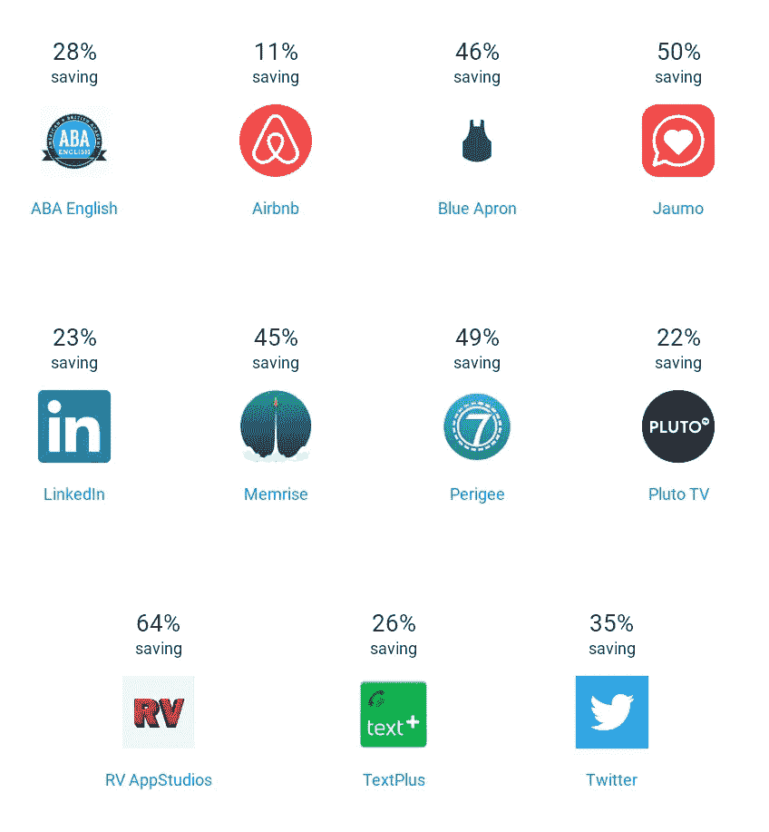

*   App bundles 向我们介绍了一个被称为动态交付的新概念。这允许我们的应用程序向用户提供新的特性，并允许他们在运行时作为应用程序的扩展被下载和安装。这使得我们可以将应用程序的初始大小变得更小，并且只将这些额外的内容提供给可能真正使用它们的用户。
*   很快，应用捆绑包格式将支持捆绑包上的 **instant enable** ，这意味着用户将能够立即启动我们的功能模块，而无需安装我们的应用，类似于即时应用目前的工作方式。

记住所有这些，让我们深入了解应用捆绑包格式以及围绕它的所有概念！

**注意:**要阅读本文的任何 IDE 部分，您需要运行 Android Studio 3.2。

# 应用捆绑包格式

在我们开始研究应用捆绑包之前，理解其格式是很重要的。app bundle 由一个 zip 归档文件组成，该归档文件包含构成该 bundle 的一系列文件。虽然这些文件是我们熟悉的 APK 中的文件，但它的用途与 APK 不同。

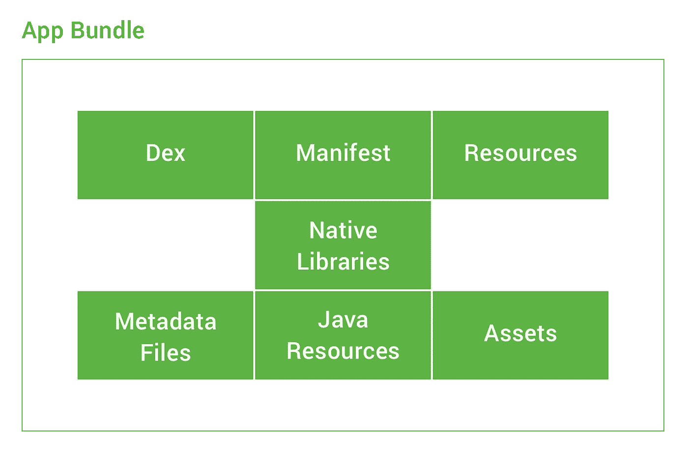

APK 是我们可以直接提供给用户设备的东西，而另一方面，应用捆绑包是一种发布格式，不能单独安装到设备上。虽然它们确实有相似之处，但应用捆绑包确实包含一些我们在 apk 中找不到的内容。例如，工具使用捆绑包中的元数据文件来构建将提供给我们的用户的 apk——这些文件不包含在 apk 本身中。虽然应用捆绑包中的大部分内容您可能已经很熟悉了，但我们还是来看看典型的应用捆绑包可能包含的内容:

*   **manifest.xml** —就像你会在你的 apk 中发现的一样，每个应用捆绑包都有一个 manifest 文件。然而，与 APK 不同的是，它们不是以二进制格式存储的——而是被编译成协议缓冲区格式，这使得工具在需要时更容易转换。
*   **res / assets / libs** —所有资源、资产和本地库都以与 APK 相同的方式存储。这里唯一的区别是，任何资源文件也将作为最后一点以协议缓冲区格式存储。
*   **resources.pb** —与我们当前的 APK 文件中的 resource.arac 文件类似，resources.pb 文件是一个资源表，其中列出了我们应用程序中的资源和目标细节。的。pb 扩展源于协议缓冲区格式，工具使用该格式来转换 app bundle，然后再将其转换为 APK 中使用的二进制格式。
*   **assets.pb** —这相当于应用程序资产的资源表，只有在应用程序中使用资产时才会出现。
*   **native.pb** —这相当于本地库的资源表，只有在应用程序中使用本地库时才会出现。

这里提到的最后 3 个文件是应用捆绑包的关键部分，因为这些表用于描述我们应用的目标。这是动态交付中的一个关键概念，因为它用于描述我们正在服务的设备和/或用户的类型，这允许我们基于此信息交付特定的资源构建。

这些资源、资产和本地表都使用我们在应用程序中已经熟悉的信息来为用户提供内容。我们熟悉使用诸如 **drawable-hdpi** 、 **lib/armeabi-v7a** 或 **values-es** 等目录来将特定资源定位到特定用户——在将特定资源定位到用户和设备时，应用捆绑包使用完全相同的方法。因此，当涉及到这些事情的组织时，我们不需要做任何不同的事情。

# 拆分 apk

在 Android lollipop 中，我们看到平台增加了一个名为 Split APKs 的功能。这允许将多个 apk 添加到一个设备中，同时仍然表现得好像它们是单个应用程序的一部分。这些可以作为不同的组合安装在不同的设备上——同时仍然作为单个 APK 出现。

这些分割的 APK 具有与 APK 完全相同的格式，并且彼此共享相同的包名和版本代码。应用捆绑包格式用于生成这些拆分的 apk，这些 apk 又可以提供给我们的用户设备。首先，应用捆绑包用于分析其所有资源，以找到所有设备配置通用的部分，这将是清单文件、dex 文件和任何其他部分，这些部分是相同的，与所使用的设备、架构或区域设置无关。这些公共部分将构成我们应用程序的基本 APK，从那里开始，split APKs 将用于为可能的不同类型的配置创建拆分。

从这里开始，将生成配置拆分，以便能够为用户提供满足其设备设置要求的拆分 apk 集合:

*   首先，将分析每个支持的屏幕密度，并为每个密度创建一个分割 APK，其中将包含特定于该密度的所有资源。
*   然后，将为每个本机架构生成不同的分割 APK
*   最后，将为您的应用程序的每个支持区域生成不同的拆分 APK

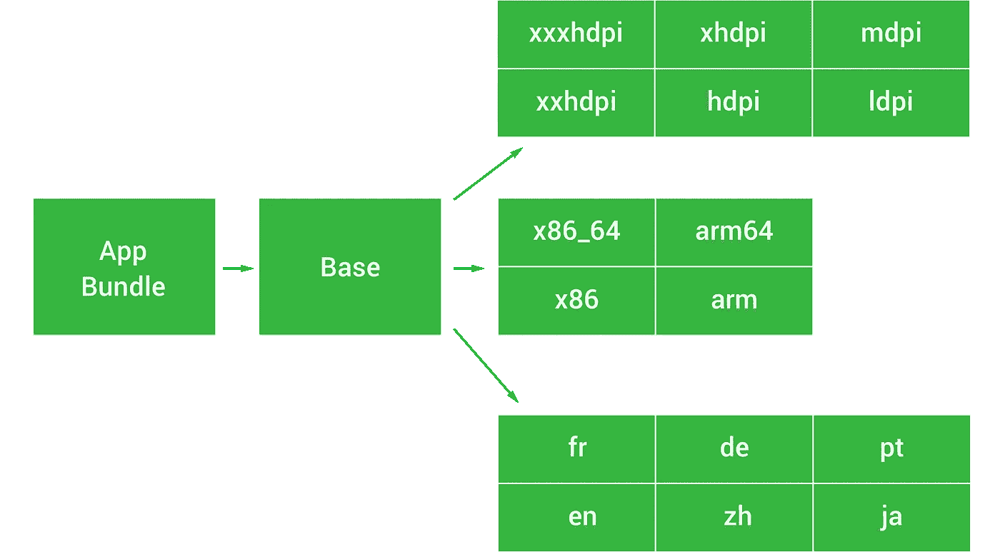

因此，当用户使用我们的应用程序时，这部分 apk 将被发送到他们的设备上。这比当前将每个配置传送给每个用户的配置更有效，因为大多数用户可能不会使用当前传送给他们设备的大量资源。为了客观地看待这一点，下面显示了三种不同的配置，它们可以为三个不同的用户提供服务，只提供他们需要的资源:

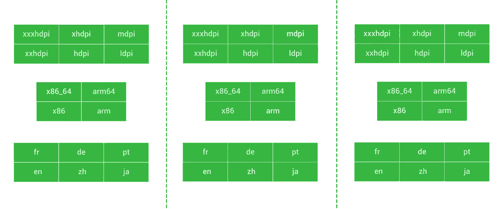

如果用户在任何时候更改他们的设备配置(例如添加另一种语言选择)，那么 play store 将识别这一点，并尝试为所有在其设备上使用拆分 apk 的**应用程序下载新的配置拆分。如果该设备当时不在线，那么将在下一个机会完成。**

现在看来，分裂的 apk 只在 Lollipop 和更高版本上受支持，应用捆绑包仍然可以帮助使用比这更早版本的 Android 的设备实现大小节省。将创建独立的 apk 来匹配不同架构和设备密度组合的矩阵，而不是生成拆分。在这种方法中，所有语言都包含在每个 APK 中，因为有太多不同的组合，矩阵会变得太大。对于这些 pre-L 设备，将为给定设备选择最合适的 APK 并提供给用户。

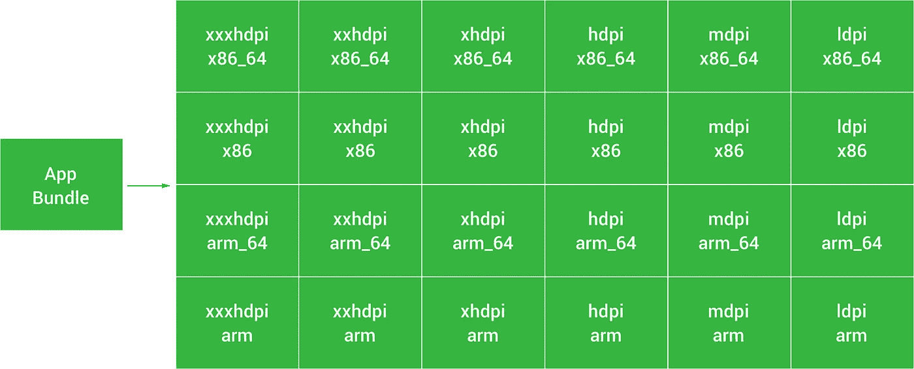

正如您从目前的应用捆绑包中看到的，无论我们支持的 SDK 版本如何，我们都可以在应用规模方面实现节约。这里最棒的是，作为开发人员，我们不需要担心这个过程中涉及的任何细节。我们只需要上传一个应用捆绑包，Google Play 就会生成正确的 APK 拆分，然后选择合适的 apk 提供给每台设备。

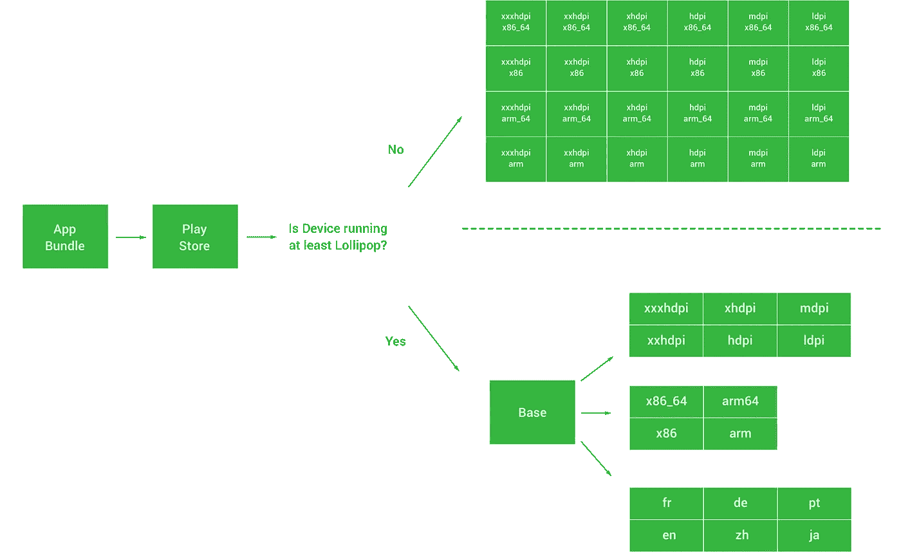

# 构建和分发 Android 应用捆绑包

当涉及到从我们的项目中构建应用捆绑包时，我们可以直接从 Android Studio 中完成。这可以直接从构建菜单中完成，选择**生成签名包/APK**——从这里你会看到下面的对话框:

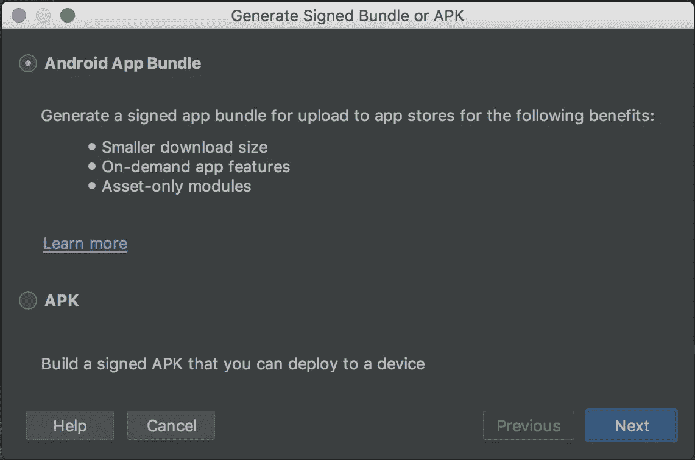

此时，我们可以选择构建 Android 应用捆绑包或 APK。选择这两个选项中的任何一个都会将我们带到密钥库选择/创建对话框，然后向导将从那里构建我们想要的选择。

如果我们在这里构建一个应用捆绑包。将生成 aab 文件，这是代表应用程序包的格式。除了在 IDE 中使用该向导构建应用程序包之外，我们还可以从命令行创建应用程序包，这对于配置项或喜欢从命令行工作的人来说非常有用。

```
./gradlew modulename:assemble./gradlew modulename:assembleVariant
```

在构建包时，默认情况下会生成所有的分割。但是在 build.gradle 文件的 **android** 块中，您可以声明将生成哪些拆分:

```
bundle {
        language {
            enableSplit = false
        }
        density {
            enableSplit = true
        }
        abi {
            enableSplit = true
        }
    }
```

默认情况下，这些属性将被设置为 true。但是，将 1 设置为 false 将意味着不支持指定包的配置，导致该属性的资源将被打包到基本 APK 和所提供的任何动态功能 APK 中。

一旦你建立了你的应用捆绑包，它可以简单地上传到游戏控制台。为了能够通过 Play Store 分发应用包，您首先需要注册 Google Play 应用签名。因为该工具将为您生成不同的 APK 分割，它还需要对它们进行签名的能力——这是必需的，没有它您将无法使用应用程序捆绑包。

现在我们已经通过 Android Studio(或者命令行)构建了我们的应用程序包，我们可以将它上传到 Play 控制台以准备发布。如果你像对待 APK 一样，直接进入发布页面，你会发现你也可以通过同一个上传区域上传一个应用捆绑包:

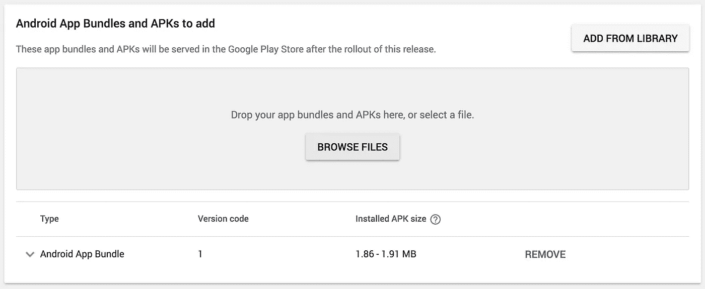

一旦上传了捆绑包，您将能够看到 **Android 应用捆绑包**被添加到上传区域下方的组件列表中。展开我们刚刚上传的 Android 应用捆绑包，将向您显示 APK 提供的所有信息，除了这次我们可以看到一个用于**探索应用捆绑包**的按钮:

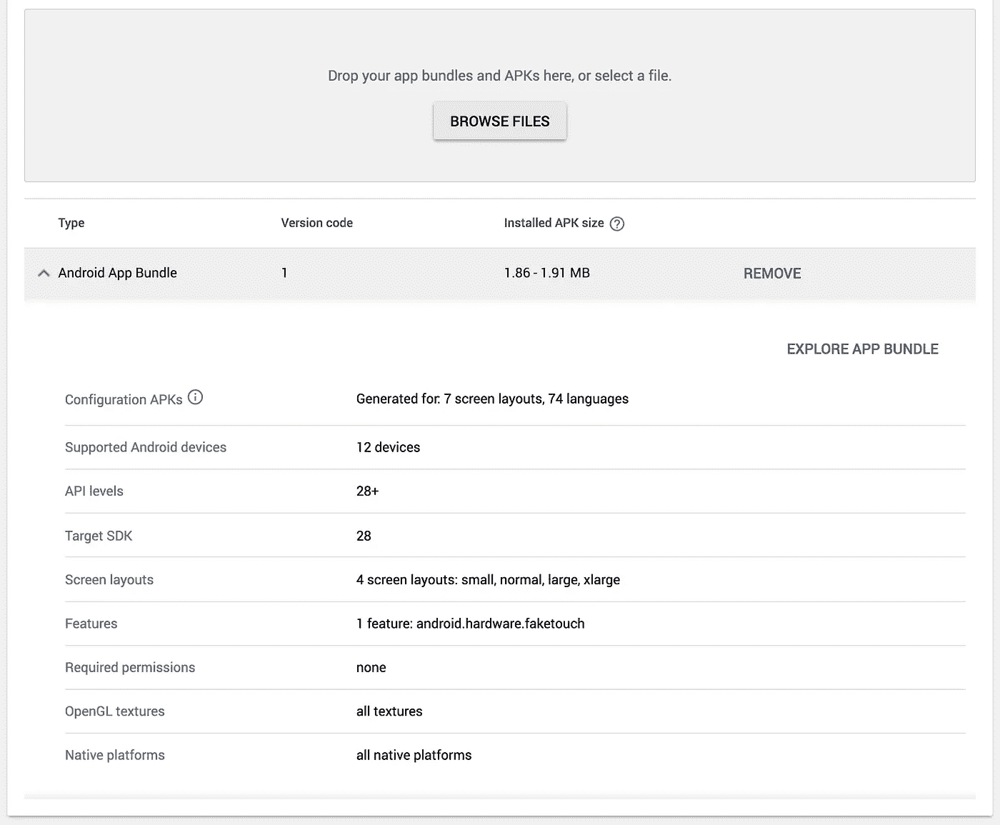

我上传的应用程序只支持一种语言环境(这只是为了举例)，但是支持一系列不同的屏幕密度。因此，App Bundle Explorer 向我们展示了将由给定 App Bundle 提供的不同设备配置 apk 的细分。从这里，我们还将能够下载用于测试目的的不同 APK，以及查看将为每个 APK 配置提供服务的设备。

您会注意到，在顶部，我们还看到了与标准 APK 上传方法相比，使用应用捆绑包格式节省的空间。这将因应用程序而异，因为这只是一个示例应用程序，节省的成本不太可能是您自己的应用程序所能看到的真实情况。

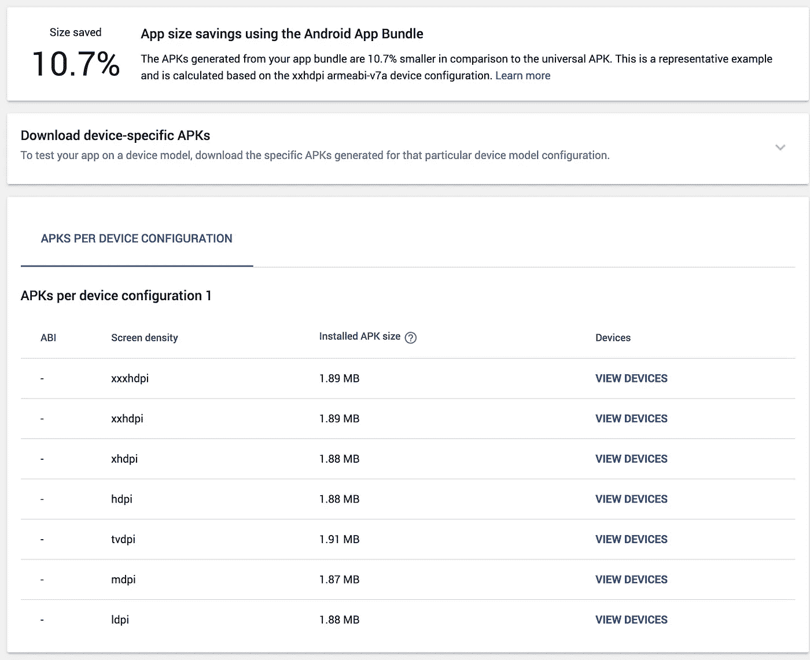

# 捆绑工具

现在，在您将应用捆绑包上传到谷歌 Play 商店之前，对捆绑包进行一些测试非常重要。虽然我们可以使用内部测试赛道来做到这一点，但我们也可以在本地测试，以确保一切都按预期运行。为此，我们可以使用[捆绑工具](https://github.com/google/bundletool)，这将使这个过程变得非常简单。我们的 IDE 和 Google Play 使用这个工具来构建我们的捆绑包，并将其转换为不同的配置拆分，因此我们在本地看到的是用户将得到服务的真实表示。

当我们运行 bundle 工具时，它将根据我们应用程序的配置生成一组 apk。首先，让我们为我们的包支持的所有不同配置创建一组**未签名的**apk:

```
bundletool build-apks --bundle=/Users/joebirch/releases/sample.aab --output=/Users/joebirch/releases/sample.apks
```

注意:如果您希望运行相同的任务，但生成已签名的 apk，则可以通过将密钥库信息添加到命令中来实现:

```
bundletool build-apks --bundle=/Users/joebirch/releases/sample.aab --output=/Users/joebirch/releases/sample.apks
--ks=/Users/joebirch/some_keystore.jks
--ks-pass=file:/Users/joebirch/some_keystore.pwd
--ks-key-alias=SomeAlias
--key-pass=file:/Users/joebirch/some_key.pwd
```

现在我们已经生成了这些 apk，我们希望将它们提供给本地设备——bundletool 可以为我们做到这一点。

```
bundletool install-apks --apks=/Users/joebirch/releases/sample.apks
```

假设我们连接了一台至少运行 Android 5.0 的设备。当我们运行该命令时，Bundletool 会将基本 APK 以及任何动态特性和配置 apk 推送到特定于该设备配置的设备上——与从 Play Store 为用户提供我们的应用程序的方式相同。如果我们连接不同的设备，比如说不同的密度/场所，那么不同的配置 apk 集将被提供给该设备。如果连接的设备运行的是 Android 5.0，那么最合适的多 APK 将被安装到设备上。当处理多个设备时，您可以使用`--device-id=serial-id`来描述应用程序应该安装到哪个设备上。

当 bundletool 为连接的设备生成安装内容时，您可以检索设备规范 JSON 格式。然后，这可以用于从生成的 APK 中提取特定的 APK。首先，我们需要运行命令:

```
bundletool get-device-spec
```

现在我们已经有了特定设备配置的 JSON 文件，我们可以继续使用额外的特定配置分割:

```
bundletool extract-apks
--apks=/Users/joebirch/releases/someApkSet.apks
--output-dir=/Users/joebirch/releases/device_APK_set.apks
--device-spec=/Users/joebirch/releases/some_configuraton.json
```

您还可以手动创建自己的设备配置 JSON 文件，并使用它来提取特定配置的 APK。这对于测试您可能没有权限访问的设备配置非常有用。

```
{
  "supportedAbis": ["arm64-v8a"],
  "supportedLocales": ["en", "es"],
  "screenDensity": 640,
  "sdkVersion": 21
}
```

# 动态服务功能

应用捆绑包的另一个关键部分是所谓的动态交付。此功能允许您定义首次安装应用程序时可能不需要的模块。在我们的项目中，我们可以定义这些模块，然后在需要时使用新的 [Play 核心库](https://developer.android.com/guide/app-bundle/playcore)按需安装。这可能是一项并非所有应用程序用户都会使用的功能，或者可能不是一项核心功能。同样，这允许从初始下载中节省大小，并且 Google Play 可以在请求时为我们提供动态功能。

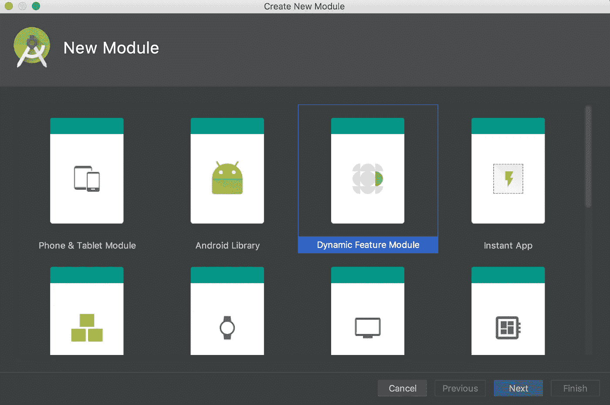

为了能够添加对此的支持，让我们快速浏览一下在我们的应用程序中创建一个动态特性模块。我们可以通过右键单击我们项目的根模块并选择 **New Module** 来开始创建新模块向导。在这里，我们可以选择动态功能模块，然后点击**下一步**。

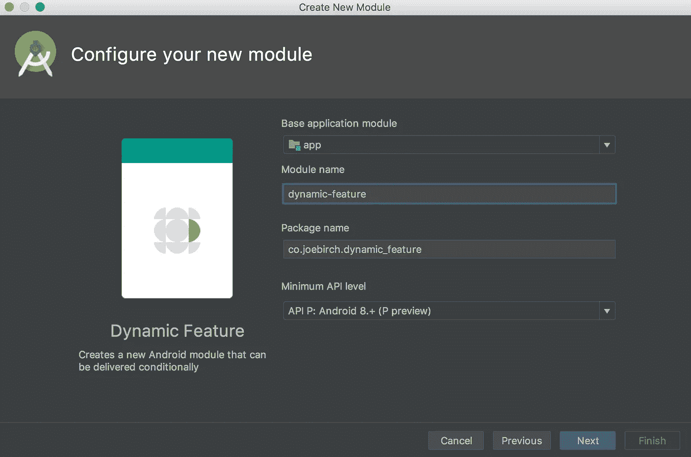

现在我们需要选择应用程序的基本模块——这将是这个动态特性模块所依赖的可安装模块。填写完所需信息后，系统会提示我们命名模块，然后我们就可以完成动态特征模块的设置，该模块将被添加到我们的应用程序中。

一旦你创建了这个模块，就值得快速浏览一下。这是为了让您了解动态功能模块的配置差异，了解事情的工作方式总是很重要的，此外，如果您将来需要转换模块，您也知道需要添加什么信息。

如果你打开模块 build.gradle 文件，你会注意到一个不同的插件正在被使用:

```
apply plugin: 'com.android.dynamic-feature'
```

与我们可能看到的用于即时应用的功能模块略有不同，这个插件是你的模块被归类为动态功能模块所必需的。虽然在这个文件中，你应该知道有一些动态特性 build.gradle 文件不使用的属性，例如 versionCode、vesionName、minification 和 signing 属性都取自基本模块。

接下来，如果打开基本模块 build.gradle 文件，您会注意到我们的动态特性已经添加到 dynamicFeatures 属性的数组中:

```
dynamicFeatures = [":first-dynamic-feature"]
```

这声明了可用于您的应用程序的动态特性，并且每当您添加对新的动态特性的支持时都必须更新，以便您的基本模块知道它们。最后，如果您打开动态功能模块，您可以打开该模块的清单文件来查找以下内容:

```
<manifest xmlns:dist="http://schemas.android.com/apk/distribution"
    package="co.joebirch.first_dynamic_feature">

    <dist:module
        dist:onDemand="true"
        dist:title="@string/title_first_dynamic_feature">
        <dist:fusing include="true" />
    </dist:module></manifest>
```

*   **onDemand** —如果该属性设置为 true，则该模块将可用于按需下载。当设置为 false 时，动态特性将在用户首次下载和安装应用程序时下载。
*   **标题** —当用户确认模块下载时，标题将用于识别模块。为此，字符串资源应该存储在应用程序的资源中，以便它可以针对应用程序支持的不同地区进行翻译。
*   **融合包括** —将此属性设置为 true 将意味着旧设备(4.4 及更低版本)将能够以多 apk 的形式接收这些动态功能。要使用此功能，您必须启用 onDemand 属性。

# 动态提供功能

既然我们已经在应用程序中添加了一个动态特性模块，我们希望在用户请求时能够真正地为他们提供服务。为此，我们将利用 [Play 核心库](https://developer.android.com/guide/app-bundle/playcore)，它为我们提供了这样做的功能。这个库允许用户打算与一个可能还没有安装的特性进行交互，此时我们的应用程序将请求这个特性，下载它，然后在它安装后处理它的状态。


为了能够开始利用这个功能，我们需要通过依赖项将 play core 库添加到我们的项目中:

```
implementation 'com.google.android.play:core:1.3.4'
```

现在我们有了可用的库，我们需要在适当的地方使用它。为了在运行时下载动态特性，我们将使用 [SplitInstallManager](https://developer.android.com/reference/com/google/android/play/core/splitinstall/SplitInstallManager) 类。虽然我们的应用程序是在前台，这将用于请求动态功能，然后下载安装。

```
val splitInstallManager = SplitInstallManagerFactory.create(this)
```

现在我们有了这个类，我们将创建一个 [SplitInstallRequest](https://developer.android.com/reference/com/google/android/play/core/splitinstall/SplitInstallRequest) 实例来下载我们的模块:

```
val request = SplitInstallRequest
        .newBuilder()
        .addModule("someDynamicModule")
        .build()
```

该实例将包含请求信息，该信息将用于从 Google Play 请求我们的动态功能模块。在这个请求中，我们可以声明我们希望被请求的多个模块，这可以通过简单地链接对请求构建器的多个 **addModule()** 调用来完成。

最后，我们将使用我们的 install manager 实例来运行我们刚刚创建的请求。这里，我们将使用管理器上的 startInstall()函数，传递我们之前创建的请求，并添加安装完成、成功或失败时的回调，以便可以相应地处理 UI。

```
splitInstallManager
        .startInstall(request)
        .addOnSuccessListener **{  }** .addOnFailureListener **{  }** .addOnCompleteListener **{  }**
```

这里的 stateInstall 函数调用将尽快触发安装过程。但是，如果您希望将安装过程推迟到应用程序已经后台化的时候，那么您可以使用 [deferInstall()](https://developer.android.com/reference/com/google/android/play/core/splitinstall/SplitInstallManager#deferredinstall) 调用来实现。

当您调用这些函数中的任何一个时，将返回一个 Int 值，该值代表拆分安装的会话 ID。如果在请求安装的过程中，您想要取消它，那么您可以通过调用 [cancelInstall()](https://developer.android.com/reference/com/google/android/play/core/splitinstall/SplitInstallManager#cancelInstall(int)) 函数，为相应的请求传入会话 ID。

在安装过程中，可能会出现一系列不同的错误，让我们快速了解一下这些错误可能是什么:

*   [ACCESS_DENIED](https://developer.android.com/reference/com/google/android/play/core/splitinstall/model/SplitInstallErrorCode.html#ACCESS_DENIED) —给定当前设备环境，不允许当前下载
*   [ACTIVE _ SESSIONS _ LIMIT _ EXCEEDED](https://developer.android.com/reference/com/google/android/play/core/splitinstall/model/SplitInstallErrorCode.html#ACTIVE_SESSIONS_LIMIT_EXCEEDED)—当前应用程序运行的会话太多
*   [API_NOT_AVAILABLE](https://developer.android.com/reference/com/google/android/play/core/splitinstall/model/SplitInstallErrorCode.html#API_NOT_AVAILABLE) —拆分安装 API 目前不可用
*   [与现有会话不兼容](https://developer.android.com/reference/com/google/android/play/core/splitinstall/model/SplitInstallErrorCode.html#INCOMPATIBLE_WITH_EXISTING_SESSION) —请求的会话包含现有会话的模块以及新模块
*   [INTERNAL_ERROR](https://developer.android.com/reference/com/google/android/play/core/splitinstall/model/SplitInstallErrorCode.html#INTERNAL_ERROR) —尝试处理分割 APK 的安装时出错
*   [无效请求](https://developer.android.com/reference/com/google/android/play/core/splitinstall/model/SplitInstallErrorCode.html#INVALID_REQUEST) —执行的请求无效
*   [模块不可用](https://developer.android.com/reference/com/google/android/play/core/splitinstall/model/SplitInstallErrorCode.html#MODULE_UNAVAILABLE) —请求的模块当前不可用
*   [网络错误](https://developer.android.com/reference/com/google/android/play/core/splitinstall/model/SplitInstallErrorCode.html#NETWORK_ERROR) —尝试获取给定拆分的详细信息时出现网络错误
*   [无错误](https://developer.android.com/reference/com/google/android/play/core/splitinstall/model/SplitInstallErrorCode.html#NO_ERROR) —没有可用的错误
*   [SERVICE _ dead](https://developer.android.com/reference/com/google/android/play/core/splitinstall/model/SplitInstallErrorCode.html#SERVICE_DIED)—处理拆分安装的服务已经死亡
*   [SESSION_NOT_FOUND](https://developer.android.com/reference/com/google/android/play/core/splitinstall/model/SplitInstallErrorCode.html#SESSION_NOT_FOUND) —找不到请求的会话

现在，当这个请求发生时，没有任何形式的 UI 覆盖，我们可能已经习惯了，例如计费库或其他 Google Play 集成。因此，当下载和安装动态特性时，用户知道应用程序中正在发生什么是很重要的——为此，我们可以使用[SplitInstallStateUpdatedListener](https://developer.android.com/reference/com/google/android/play/core/splitinstall/SplitInstallStateUpdatedListener),它将允许我们监控请求的状态。

```
val stateListener = *SplitInstallStateUpdatedListener* **{** state **->** when (state.status()) {
        *PENDING* -> { }
        *DOWNLOADING* -> { }
        *DOWNLOADED* -> { }
        *INSTALLED* -> { }
        *INSTALLING* -> { }
        *REQUIRES_USER_CONFIRMATION* -> { }
        *FAILED* -> { }
        *CANCELING* -> { }
        *CANCELED* -> { }
    }
}splitInstallManager.registerListener(stateListener)
```

在这里，您可以看到正在定义的侦听器的实例，以及安装可能处于的不同状态——您应该在应用程序中使用它来处理 UI。例如，您可能希望显示某种形式的进度条，让用户知道这些状态正在发生，但是当流程在每个状态中传播时，要更改所使用的消息。

拆分安装可能处于一系列不同的状态，让我们快速了解一下这些状态:

*   [取消](https://developer.android.com/reference/com/google/android/play/core/splitinstall/model/SplitInstallSessionStatus.html#CANCELED)——被分割的 APK 下载被取消
*   [取消](https://developer.android.com/reference/com/google/android/play/core/splitinstall/model/SplitInstallSessionStatus.html#CANCELING)——目前正在取消下载分割的 APK
*   [已下载](https://developer.android.com/reference/com/google/android/play/core/splitinstall/model/SplitInstallSessionStatus.html#DOWNLOADED) —分割 APK 已下载，但当前未安装
*   [下载](https://developer.android.com/reference/com/google/android/play/core/splitinstall/model/SplitInstallSessionStatus.html#DOWNLOADING) —当前正在下载分割的 APK
*   [失败](https://developer.android.com/reference/com/google/android/play/core/splitinstall/model/SplitInstallSessionStatus.html#FAILED) —分割 APK 下载或安装失败
*   [已安装](https://developer.android.com/reference/com/google/android/play/core/splitinstall/model/SplitInstallSessionStatus.html#INSTALLED) —分离式 APK 的安装已经完成，可用于应用程序
*   [安装](https://developer.android.com/reference/com/google/android/play/core/splitinstall/model/SplitInstallSessionStatus.html#INSTALLING) —目前正在安装分体式 APK
*   [待定](https://developer.android.com/reference/com/google/android/play/core/splitinstall/model/SplitInstallSessionStatus.html#PENDING) —分割 APK 的下载目前待定
*   [需要 _ 用户 _ 确认](https://developer.android.com/reference/com/google/android/play/core/splitinstall/model/SplitInstallSessionStatus.html#REQUIRES_USER_CONFIRMATION)——分割 APK 下载需要用户确认，因为它太大了
*   [未知](https://developer.android.com/reference/com/google/android/play/core/splitinstall/model/SplitInstallSessionStatus.html#UNKNOWN) —当前状态未知

一旦安装了动态功能模块，仍然可以执行一些操作来管理它们。例如，我们可以使用 [deferredUninstall()](https://developer.android.com/reference/com/google/android/play/core/splitinstall/SplitInstallManager.html#deferredUninstall(java.util.List%3Cjava.lang.String%3E)) 函数卸载一个模块——传递一点我们想从应用程序的用户安装中删除的模块名。

```
splitInstallManager
        .deferredUninstall(*listOf*("someDynamicModule"))
        .addOnSuccessListener {  }
        .addOnFailureListener {  }
        .addOnCompleteListener {  }
```

我们还可以通过在 manager 实例上使用 [getInstalledModules()](https://developer.android.com/reference/com/google/android/play/core/splitinstall/SplitInstallManager.html#getInstalledModules()) 函数来检索已安装模块的名称列表，这对于在应用程序中设置任何 UI 以及在执行任何删除请求之前检查模块安装状态非常有用。

```
val installedModules = splitInstallManager.*installedModules*
```

# 我实际上会节省多少空间？

现在，说您将节省应用程序大小是很好的，但是对于您实际上将节省什么有某种指导是有帮助的。根据谷歌的说法，使用应用捆绑包格式的应用程序的大小平均要小 20%——这意味着每次下载或更新应用程序时，所涉及的数据传输量要少 20%。

谷歌还对 Play Store 中下载量至少达到 100 万次的所有应用程序进行了分析，从中他们发现:

*   当涉及到区域资源使用的资源时，语言拆分将实现超过 95%的节省
*   密度分割有助于在支持多种密度的应用中实现高达 45%的节省
*   当涉及到架构支持时，使用本地库的应用程序将能够实现高达 20%的节省

将所有这些放在一起，发现如果所有这些应用程序都使用应用程序捆绑格式，每天将节省 10PB 的数据**。这是令人难以置信的大量数据！**

谷歌还分享了一些应用程序的样本数据，这些应用程序是应用程序捆绑格式的早期采用者。例如，虽然 Android 的 Twitter 之前已经提供了多个 apk，但应用捆绑包使它们的大小减少了约 20%。该应用程序支持许多不同的语言和密度，这是他们节省大量成本的原因。使用 App Bundle 还意味着他们不再需要为他们希望支持的配置手动创建和上传单独的 apk，因为 App Bundle 工具会自动处理这些。

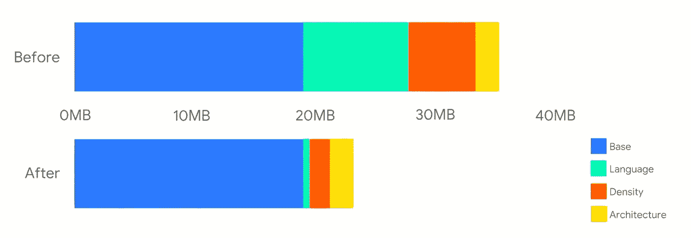

另一方面，Text Plus 应用程序不支持不同配置的多个 apk。当涉及到不同的密度和架构时，应用程序有大量的资源，因此应用程序捆绑包使他们的应用程序实现了大约 26%的节约。

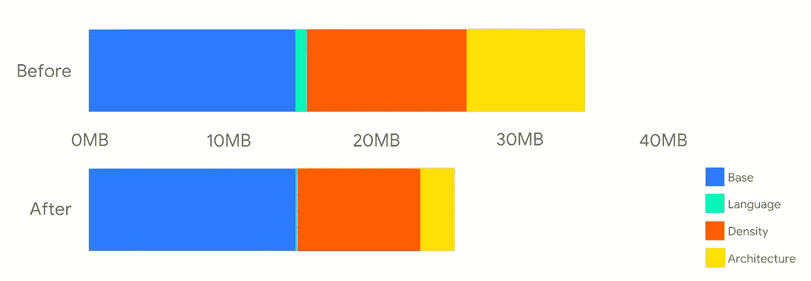

最后，当团队增加了对 App Bundle 的支持时，Jamo 应用程序能够将原来的应用程序大小减半。该应用使用许多不同的大型本地库来支持不同的架构——应用捆绑包现在允许他们优化这些要求，以便可以为用户提供更小的 apk。

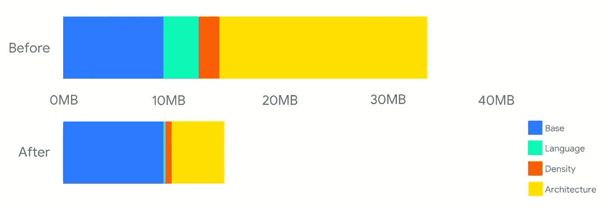

我希望通过阅读这篇文章，您对什么是应用捆绑包、它们如何工作以及我们如何将它们与动态交付结合起来以改进我们如何为用户提供应用有所了解。我很高兴在生产中使用应用捆绑包，并了解更多关于我们如何使用它们来改善我们的应用规模和交付。您正在使用应用捆绑包吗？或者您有什么问题吗？请随意回复或联系我们🙂

[](https://twitter.com/hitherejoe) [## 乔·伯奇(@hitherejoe) |推特

### 乔伯奇的最新推文(@hitherejoe)。Android 主管和高级工程师。@缓冲。谷歌开发专家…

twitter.com](https://twitter.com/hitherejoe) [](http://eepurl.com/dIKgiT)