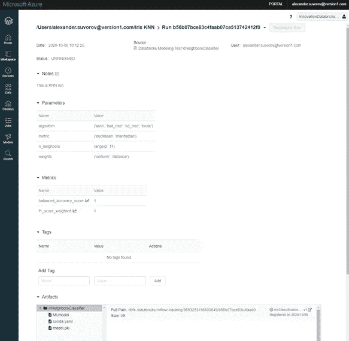
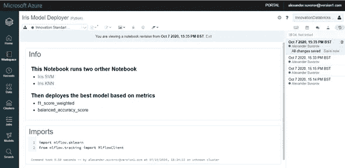
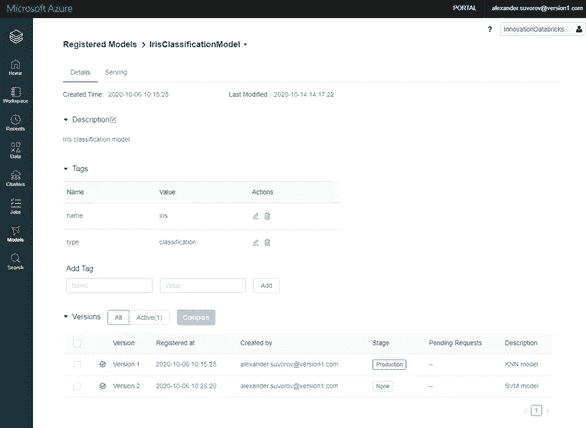
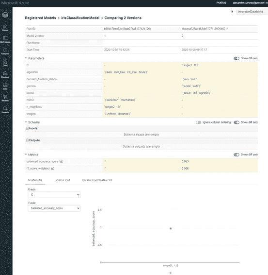
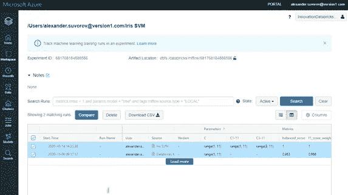
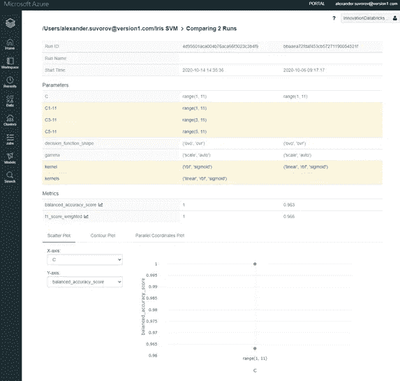

# 用 Databricks 和 MLflow 探索机器学习模型的生命周期

> 原文：<https://medium.com/version-1/exploring-the-machine-learning-model-lifecycle-with-databricks-and-mlflow-b7f82aad6fd7?source=collection_archive---------0----------------------->

Photo by [Kevin Ku](https://unsplash.com/@ikukevk?utm_source=medium&utm_medium=referral) on [Unsplash](https://unsplash.com?utm_source=medium&utm_medium=referral)

开发和管理机器学习模型与传统的软件开发有很大的不同，也更加困难。挑战不仅出现在开发阶段，也出现在开发的生产阶段。这篇中期文章将探索机器学习模型周期以及我在使用这些模型时遇到的一些关键差异。

传统软件和机器学习在开发阶段的差异可以概括为我们试图实现的目标、影响我们质量的因素以及我们使用的工具。

# 主要差异

**目标:**传统软件开发的目标是满足规范，功能性的和非功能性的，确认一个应用是否满足需求是很直接的。在机器学习中，目标是随着时间的推移改善模型指标，因为模型性能的退化或改善意味着企业的损失或收益。这也意味着模型是不断变化的，永远不会真正完成- **一个移动的目标。**

**质量**:软件开发中的产品或应用的质量很大程度上取决于所产生的代码的质量。对于机器学习开发，质量取决于输入和训练数据，以及需要根据可用数据进行调整的超参数。

在软件开发中，团队通常会挑选一个添加了库的软件栈来实现目标。对于机器学习开发，几个堆栈、模型和算法可以组合成一个解决方案。深度学习栈可以与传统的 ML 库以及不同的语言相结合。

**生产挑战:**机器学习的生产挑战在产品上线后并没有减少，主要挑战与新数据、开发流程和模型生命周期的复杂性有关。

**数据:**机器学习的本质需要历史数据，随着时间的推移，数据也需要历史数据。一段时间后，积累的新数据成为历史数据，作为新数据获取的结果，产品面临着过时的风险，需要重新构建模型。

与传统的软件开发相比，只要没有人接触它或更新它所依赖的系统，产品就会工作——产品的稳定性很少受到质疑。

**过程:**开发机器学习模型的过程是一个复杂的过程，涉及几个具有不同技能的人。模型的设计由数据科学家管理，数据准备由数据工程师监督，最终产品的开发由应用程序开发人员处理。开发传统软件开发的过程通常由具有相似技能的同质开发人员组来处理。

# 模型生命周期

在机器学习模型管理中存在独特的挑战，例如结果和代码库修改控制的一致性、模型谱系、模型度量、超参数优化和模型分级。

在运行期间，我们需要运行的一致结果，以及运行和修改的历史记录。有了模型谱系，我们需要保持一个模型版本化系统，并将模型的版本化与模型产生的度量联系起来。希望存储用于记录和用于进一步自动化和分析的超参数。此外，我们希望对所有提到的功能进行编程访问，并在没有人工干预的情况下，在我们的代码中执行从测试到生产的模型阶段。

# ML 管理平台

几年来，出现了许多 ML 管理平台来解决上述问题。有一些产品，如 Airflow 和 Luigi，是通用的编排平台，还有一些更专业的平台，如 Kuberflow 和 MLflow，专门从事机器学习编排。下一节将重点介绍 Databricks 和 MLflow 的结合，以及它们可能带来的好处。

# 实验管理

**MLflow** 的支柱之一是实验跟踪。通过 Databricks 集成到 Azure 中，这允许我们记录和查询实验，管理代码库中的更改，跟踪输入数据，比较消耗的参数，发出的度量和产生的结果。

该组件允许我们跟踪实验执行、用于实验的超参数、产生的度量模型和实验产生的模型。我们可以用图形或编程的方式跟踪变化，也可以用编程的方式访问这个概念的所有属性。

系统的这一部分允许我们跟踪代码的版本，以及谁何时修改了代码，并允许我们在需要时恢复到所需的版本。代码库不存储在外部，对代码库的访问由 Databricks 和 Azure security 管理。

系统的这一部分允许我们手动管理模型，我们可以根据指标比较模型，管理模型是否投入生产。

在系统的这一部分，我们可以比较实验运行，并以编程方式手动评估哪些运行良好，哪些运行不良。

适用于系统的所有部分，所有功能、访问、修改和比较都可以在其他笔记本中以编程方式完成。

# 可重复执行

MLflow 的第二个支柱是引入一种以可重用方式打包数据科学代码的格式。其核心是定义良好的元数据，用于组织和描述代码，以允许自动化工具运行代码。该组件包括用于多种语言的 API 以及 CLI 接口，因此可以作为一个协调器将多个项目链接在一起。所有这些的潜在信息是，MLflow 和 Databricks 构建了一种从 Git repo 获取代码和工件并在 Databricks 上运行它的简单方法。

# 模型包装

目前很多机器学习库的厂商，比如 TensorFlow，Sklearn，Spark 等。使用专有格式存储数据。如果您不使用不同的框架来寻找最佳模型，这种方法可以很好地工作。然而，一旦使用不同的机器学习堆栈，互操作性的问题就会出现。为了减轻这一点，MLflow 创建了一个包装器格式，支持大多数供应商和模型的抽象内部表示，以支持更通用的 MLflow 风格。在模型部署和生命周期的工业化道路上，模型表示的抽象是一个非常宝贵的举措，因为一周内我们可能会让 Sklearn 模式产生合理的结果，然后过一段时间，TensorFlow 可能会产生更好的结果，但对于模型中的其他应用程序和产品更改变得透明和模型不可知。

# 结论

Azure、Databricks 和 MLflow 的结合提供了一个出色的框架和一套工具来管理机器学习项目的许多方面，特别是模型生命周期的管理。总结 Azure、Databricks 和 MLflow 共生的可用功能:

**代码版本** —集成到笔记本中的代码版本。

**实验运行跟踪**——实验持续存在并可搜索。

**超参数跟踪** —系统跟踪模型参数。

**模型指标跟踪** —由系统跟踪的模型发出的指标。

**模型跟踪** —系统跟踪实验产生的模型。

**程序化访问** —我们可以程序化访问以上所有内容。

**支持 MLOps**—允许协调多个项目。

**与格式无关的模型** —生产的模型与供应商格式无关。

也许这三者的一个缺点是，Databricks 和 Azure 是一个纯云解决方案，对一些人来说，这不是一个选项。然而，MLflow 能够安装在 Kubernetes 和 OpenShift 平台上。

这三者的第二个缺点是价格，如果你不小心使用它，成本会很快上升。幸运的是，Databricks 中有自动关闭功能，允许您在特定的空闲时间后关闭集群。

然而，要实现上面框架中现有的实验和模型跟踪功能，需要付出很大的努力。考虑到本概述只涉及了环境和可用功能的某些方面，可以肯定地说，这是一个值得投入时间的好产品。

**关于作者**

*亚历山大·苏沃罗夫是一名高级数据科学家和高级开发人员，自 2019 年以来一直在 Version 1 创新实验室工作。*