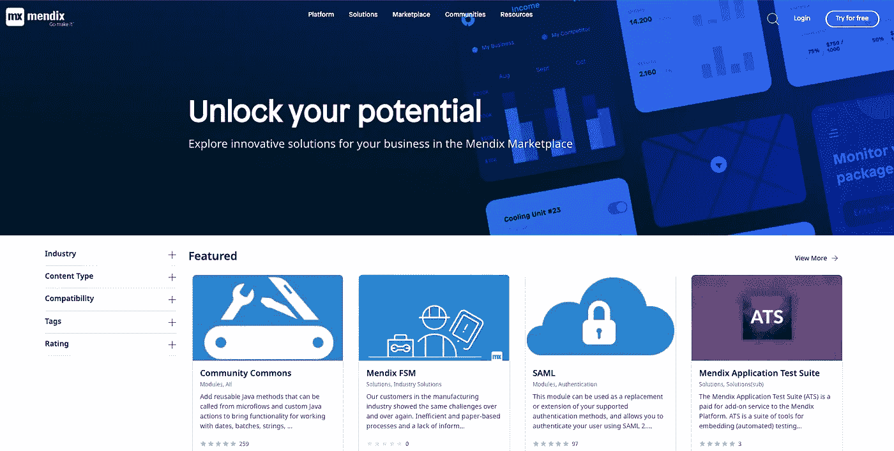
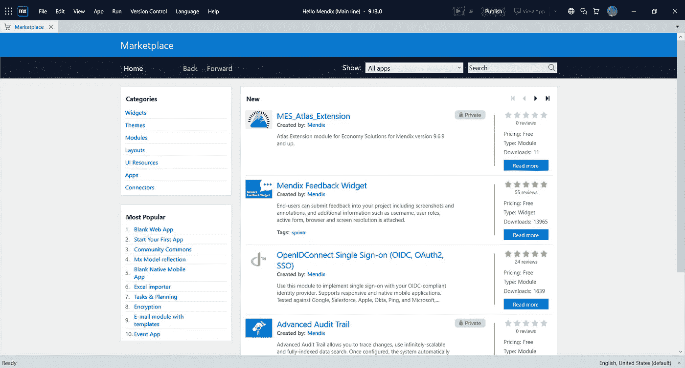
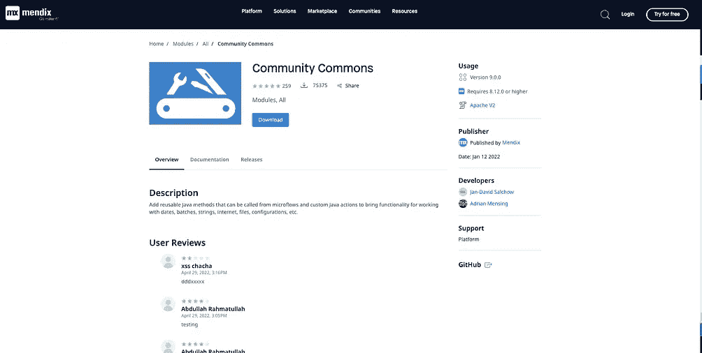
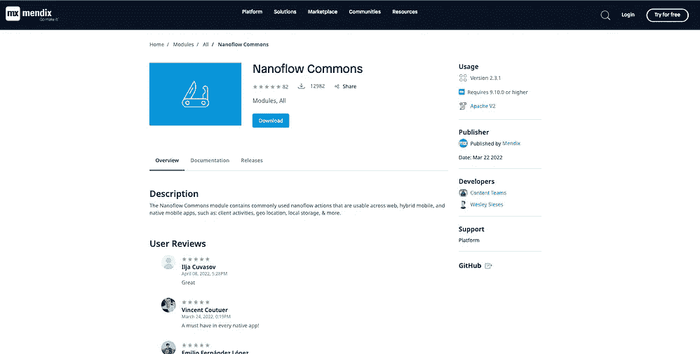
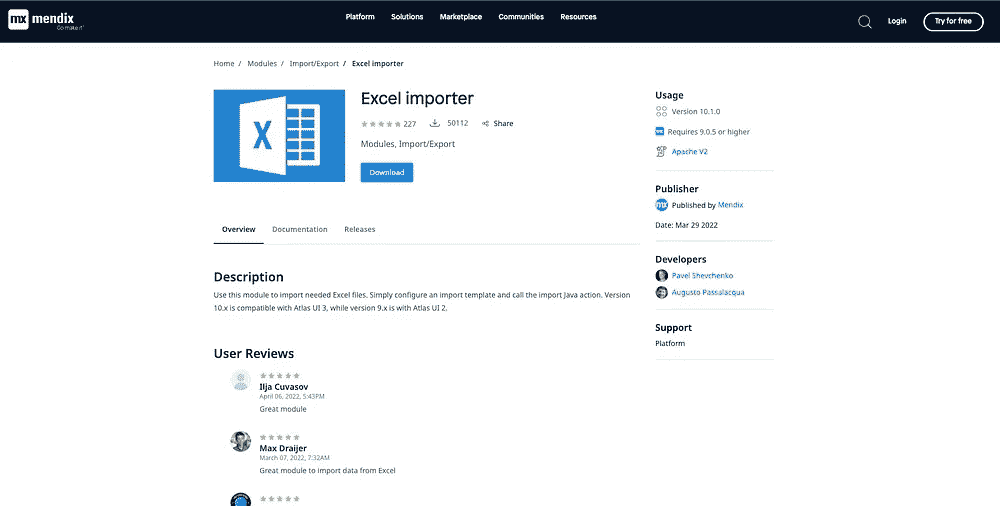
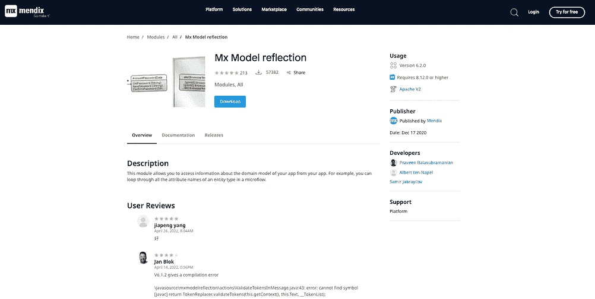
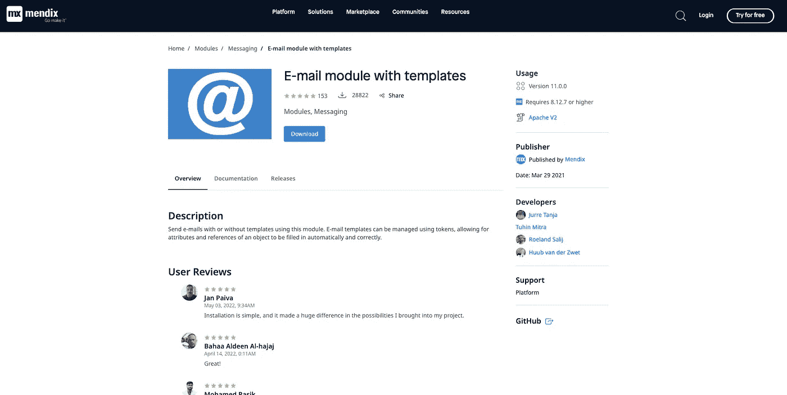
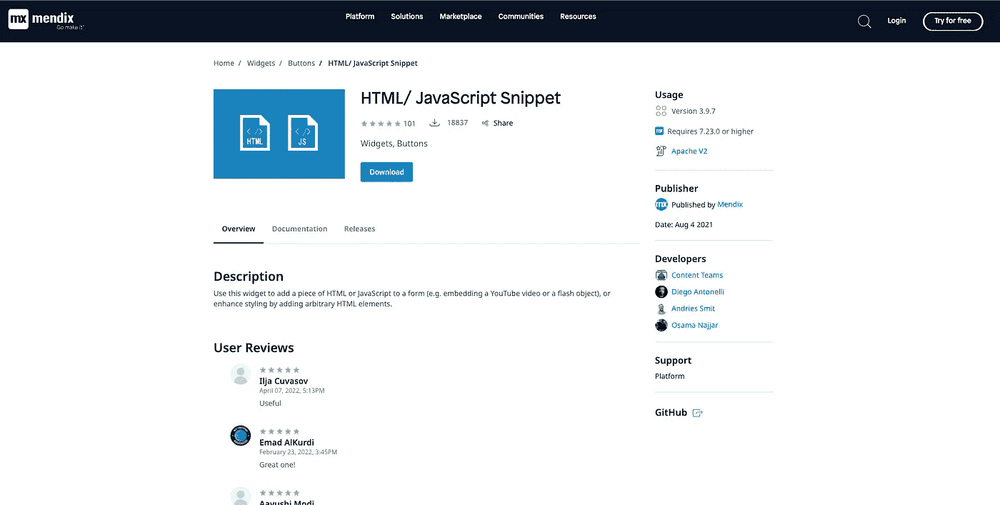

# 探索 Mendix 市场

> 原文：<https://medium.com/mendix/exploring-the-marketplace-8ce2bcc25fb7?source=collection_archive---------3----------------------->

Exploring the Mendix Marketplace

# 你好，门迪克斯——第三部分

# 这是 Hello Mendix 系列的继续——在这个系列中，我解释了 Mendix 开发的要点，并试图尽快填补您的知识空白。

# 在本系列的第 3 部分，我将向您展示 Mendix 市场，如何在您的应用程序中包含其中的模块，以及我在自己的应用程序中使用的一些我最喜欢的模块。

Hello Mendix — Exploring the Marketplace on Youtube

## 首先，什么是市场？

市场是 Mendix 和我们社区的开发人员创建、上传和维护供我们所有人在应用中使用的可下载功能的地方。我们的新应用服务套件还提供付费功能。您也可以提交自己的作品供他人使用，并通过 Mendix Marketplace 供应商计划从中获利。

Mendix Marketplace home page

在我介绍我的个人收藏之前，我们先来看看如何将市场内容下载到您的应用程序中。最简单的下载方式是从 Studio Pro 下载。您可以点击右上角的购物车打开市场。只需浏览或搜索你想要的，然后点击下载。Mendix 将自动检测您的 studio pro 版本，并选择合适的版本进行下载。如果您有一个不兼容的版本，那么下载按钮将被禁用。

The Marketplace, open inside Mendix Studio Pro

> **这是不是意味着我不能使用这个功能？**
> 
> 不。它只是意味着你有一些额外的工作要做。您仍然可以下载。mpk 文件，然后通过更改代码或升级 Studio Pro 兼容性来自己更新它。

当下载内容时，任何需要的 jar 文件也会随之下载，并放在**应用程序目录**中的**用户库**文件夹中。对其他市场内容的任何依赖都不会自动解决，您必须自己去下载。

请记住，在尝试下载之前，请务必阅读并理解文档。所有的文档要么在市场上提供，要么在内容创建者拥有的 GitHub 页面上提供。此外，一定要订阅你最喜欢的内容的更新，并为你用过的内容留下评论。

## 我的热门下载

现在，让我们来看看我为新项目下载的一些资料，从“**社区公共资源**”和“**纳流公共资源**”模块开始。

Community commons and Nanoflow Commons

这两个模块都是为社区创建的动作集合。这两者都包含了在开发时非常有用的 Java 和 Javascript 动作。

接下来我们有' **Excel 导入器**和' **Mx 模型反射**模块。这些可以在运行时一起用于将数据导入您的应用程序。使用“excel 导入器”，您可以将 Excel 文档导入到应用程序的数据库中，并使用“Mx 模型反射”定义您希望数据去哪里，这允许您在运行时检查您的模型。

Excel Importer and Mx Model Reflection

这里我要提到的最后一个模块是带有模板的**电子邮件模块。这个模块，以及 Mx 模型反射将允许您从您的应用程序发送电子邮件，使用模板和占位符为电子邮件的数据提供填充点。**

E-mail module with templates

此外，确保浏览小部件库。我个人最喜欢的一个是 **HTML 片段**，它允许你在页面中添加原始的 HTML 元素。

HTML/ Javascript Snippet

## 如果我在市场上找不到我想要的东西怎么办？

你可以自己做。Mendix 中的所有小部件，无论是 web 还是本地移动设备，都内置了 React。开发人员可以选择从头开始创建一个小部件，或者他们可以使用小部件构建器命令行界面来生成一个样板小部件，并从那里开始定制。不要忘记将您创建的任何定制组件提交给供应商计划，并开始为您的代码赚取一些现金。

## 阅读更多

 [## 市场指南

### 介绍有关配置和使用平台支持的组件的最新版本的文档。

docs.mendix.com](https://docs.mendix.com/appstore/)  [## 创建内容

### 如何为 Mendix 市场创建内容？

docs.mendix.com](https://docs.mendix.com/appstore/creating-content/)  [## Mendix 供应商计划

### 描述如何加入 Mendix 供应商计划，在 Mendix 市场中销售您的内容。

docs.mendix.com](https://docs.mendix.com/appstore/creating-content/vendor-program/)  [## 应用服务

### 介绍 Mendix 市场中可用的应用服务的详细信息。

docs.mendix.com](https://docs.mendix.com/appstore/app-services/) 

*来自发布者-*

*如果你喜欢这篇文章，你可以在我们的* [*中页*](https://medium.com/mendix) *找到更多喜欢的。对于精彩的视频和直播会话，您可以前往*[*MxLive*](https://www.mendix.com/live/)*或我们的社区*[*Youtube PAG*](https://www.youtube.com/c/MendixCommunity/community)*e .*

*希望入门的创客，可以注册一个* [*免费账号*](https://signup.mendix.com/link/signup/?source=direct) *，通过我们的* [*学苑*](https://academy.mendix.com/link/home) *获得即时学习。*

有兴趣更多地参与我们的社区吗？加入我们的 [*闲散社区频道*](https://join.slack.com/t/mendixcommunity/shared_invite/zt-hwhwkcxu-~59ywyjqHlUHXmrw5heqpQ) *。*