# 探索材料导航轨道

> 原文：<https://medium.com/google-developer-experts/exploring-the-material-navigation-rail-fe0c82dadc98?source=collection_archive---------0----------------------->

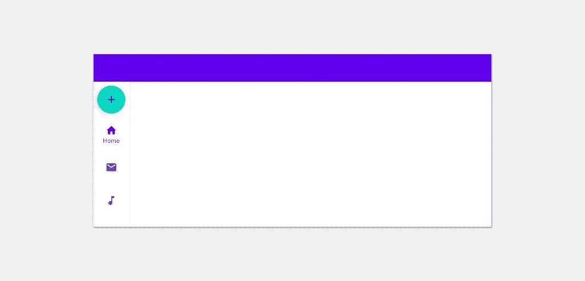

在本周的谷歌 I/O 大会上宣布了许多令人兴奋的消息——我一直期待的事情之一就是听到关于[大屏幕体验](https://www.youtube.com/watch?v=Qkiz3QIPJzk)的消息。虽然这些设备和设计原则已经并存了一段时间，但总感觉对开发人员的支持从来没有完全实现过。然而，随着本周 I/O 上的一些公告，在更大的设备上支持这些体验开始获得更多的开箱即用支持。

在围绕这个话题的谈话中，我看到几次提到[导航条](https://material.io/components/navigation-rail)，这是一个垂直导航条，是材料设计的一部分。在看到提到这一点后，我对能够在应用程序中使用这一点感到非常兴奋，所以我直接潜入 Android Material Components 库进行尝试。在这篇文章中，我将与你分享这些经验，这样你就能明白如何在你自己的应用中使用它们！

这个故事最初发表在 joebirch.co 的[上](https://joebirch.co/android/exploring-the-material-navigation-rail/)

# 什么是导航轨？

如上所述，[导航条](https://material.io/components/navigation-rail)本质上是一个垂直导航条。在应用程序中，你可能已经使用和/或看到过[底部导航条](https://material.io/components/bottom-navigation)，它位于屏幕底部，用于显示包含在水平条中的导航目的地。该栏用于显示 3 到 5 个导航项目，允许用户在应用程序的不同高级区域之间移动。

当谈到底部导航栏时，这在大多数情况下非常有用。然而，当你开始在风景模式或更大的设备上使用应用程序时，我觉得事情似乎不太顺利。例如，底部导航跨越整个屏幕宽度，因此当您开始在具有更宽视窗(如横向)的设备上使用应用程序时，底部屏幕的一小块被该导航条保留——占用了可以用作可消费内容的空间。因为底部的导航栏经常在它的上方有一个浮动的动作按钮，所以我们最终在屏幕底部的这个区域总是被这两个组件占据。与顶部应用程序栏配对，我们最终得到一个受限的内容区域，包含在顶部和底部导航元素之间。

有了导航条，屏幕开始感觉更开阔了。我们的内容不再夹在这些导航组件之间，而是位于内容区域内显示的目的地控制器旁边。除了支持 3 到 7 个导航项目之外，导航轨道还支持一个标题组件。这意味着我们可以在这个*中包含浮动操作按钮，而不是将它锚定到视图的*——这简化了我们屏幕的内容区域，并为可消费的内容保留了空间。

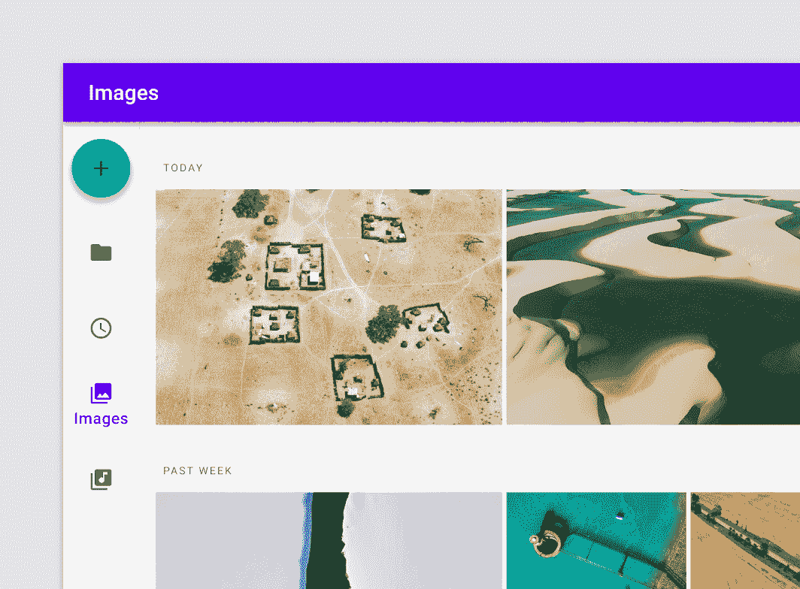

# 添加依赖关系

在我们开始之前，您需要为 Android Material Components 库添加依赖项。导航滑轨目前仅在 1.4.0 的最新测试版中可用。

```
implementation 'com.google.android.material:material:1.4.0'
```

# 铺设导航轨道

导航条采用 **NavigationRailView** 的形式，可以直接添加到您的 XML 布局中:

```
<com.google.android.material.navigationrail.NavigationRailView
    android:id="@+id/navigation_rail"
    android:layout_width="wrap_content"
    android:layout_height="match_parent"
    app:headerLayout="@layout/layout_header"
    app:menu="@menu/menu_rail" />
```

将此视图添加到布局中时，应该遵循一些典型的指导原则。这些很可能取决于您的视图层次结构由什么组成，但作为一般指南:

*   导航栏应该位于当前屏幕的顶栏下方。这个横杆应该**不要**与顶栏重叠或者显示在顶栏下面。它的高度应该填充顶部应用程序栏底部和屏幕底部之间的空间
*   导航条应该显示在当前屏幕主要内容区域的一侧。它不应该显示在这个内容的上面，相反，内容区域应该显示在导航条的**旁边。**

为了举例，让我们看一个例子，看看导航条是如何位于布局内部的:

```
<androidx.constraintlayout.widget.ConstraintLayout 
    ...
>

    <com.google.android.material.appbar.AppBarLayout
        android:id="@+id/appbar"
        ...>

        <androidx.appcompat.widget.Toolbar
            android:id="@+id/toolbar"
            ... />

    </com.google.android.material.appbar.AppBarLayout>

    <include
        layout="@layout/content_main"
        app:layout_constraintBottom_toBottomOf="parent"
        app:layout_constraintEnd_toEndOf="parent"
        app:layout_constraintStart_toEndOf="@id/navigation_rail"
        app:layout_constraintTop_toBottomOf="@id/appbar" />

    <com.google.android.material.navigationrail.NavigationRailView
        style="@style/Widget.MaterialComponents.NavigationRailView.Colored.Compact"
        android:id="@+id/navigation_rail"
        android:layout_width="wrap_content"
        android:layout_height="0dp"
        app:headerLayout="@layout/layout_rail"
        app:layout_constraintBottom_toBottomOf="parent"
        app:layout_constraintStart_toStartOf="parent"
        app:layout_constraintTop_toBottomOf="@id/appbar"
        app:menu="@menu/menu_rail" />

</androidx.constraintlayout.widget.ConstraintLayout>
```

这将给我们带来类似以下的结果:

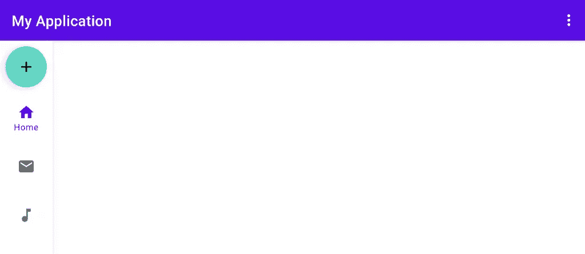

Navigation Rail displayed underneath the top bar and at the start of the content area

# 显示菜单

为了显示导航轨道内部的项目，我们需要使用 NavigationRailView 的 **menu** 属性分配一个菜单引用。

```
<com.google.android.material.navigationrail.NavigationRailView
    android:id="@+id/navigation_rail"
    app:menu="@menu/menu_rail" />
```

这个菜单看起来与你在应用程序中见过或创建的其他菜单非常相似。菜单中的每一项都成为我们导航轨道中的一个目的地，标题作为目的地的标签，图标作为目的地的视觉表示。本文示例截图中使用的菜单如下所示:

```
<menu xmlns:android="http://schemas.android.com/apk/res/android">
    <item
        android:id="@+id/home"
        android:icon="@drawable/ic_baseline_home_24"
        android:title="@string/label_home"/>
    <item
        android:id="@+id/email"
        android:icon="@drawable/ic_baseline_email_24"
        android:title="@string/label_email"/>
    <item
        android:id="@+id/music"
        android:icon="@drawable/ic_baseline_music_note_24"
        android:title="@string/label_music"/>
    <item
        android:id="@+id/gallery"
        android:icon="@drawable/ic_baseline_image_24"
        android:title="@string/label_gallery"/>
</menu>
```

# 添加标题

除了在我们的导航栏中显示一个菜单，我们还可以为视图的 **headerLayout** 属性提供一个布局参考。

```
<com.google.android.material.navigationrail.NavigationRailView
    android:id="@+id/navigation_rail"
    app:headerLayout="@layout/layout_rail"
    ... />
```

对于这个 **layout_rail** 文件，我们可以简单地以浮动操作按钮的形式提供一个视图组件:

```
<com.google.android.material.floatingactionbutton.FloatingActionButton 
    xmlns:android="http://schemas.android.com/apk/res/android"
    xmlns:app="http://schemas.android.com/apk/res-auto"
    android:layout_width="wrap_content"
    android:layout_height="wrap_content"
    android:contentDescription="@string/cd_create_item"
    app:fabSize="mini"
    app:srcCompat="@drawable/ic_baseline_add_24" />
```

有了这个，导航条就会在它的容器顶部显示这个浮动的动作按钮:


现在，需要注意的一件重要事情是，导航栏对于可以为这个标题布局提供的视图类型没有任何限制。例如，您可以提供某种形式的自定义按钮，希望在导航栏中使用，或者提供一个代表应用程序徽标的图像组件。虽然这两种情况都有可能，但是一定要提供一个能够给用户带来价值的标题，而不是在 rail 中添加任何混乱或者浪费空间。

# 设计导航轨道的样式

谈到导航条的外观，有几种捆绑样式可以用来控制导航条在屏幕上的显示方式。

我们将从默认样式开始——如果您没有声明要应用到导航栏的样式，默认情况下将使用默认样式。

```
style="@style/Widget.MaterialComponents.NavigationRailView"
```


应用此默认样式后，导航轨道的不同部分会应用以下属性:

*   轨宽: **72dp**
*   铁轨背景:**彩色表面**
*   选中图标颜色:**原色**
*   未选中的图标颜色:**colorOnSurface**(60%)

下一个样式稍微混合了一下，使用我们主题的原色作为栏杆的表面颜色。

```
style="@style/Widget.MaterialComponents.NavigationRailView.PrimarySurface"
```

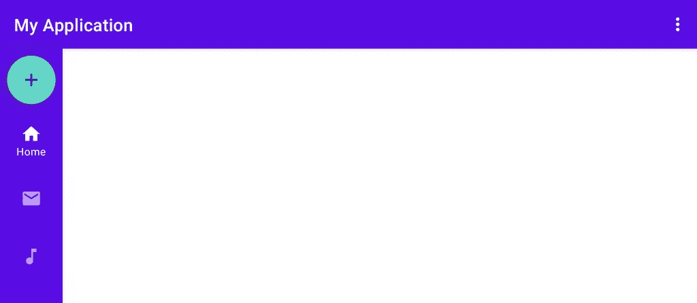

这里我们看到导航栏的宽度保持不变，但是包含的组件的外观通过使用我们的主题颜色发生了巨大的变化。

*   轨宽: **72dp**
*   轨道背景: **colorPrimary**
*   所选图标颜色: **colorOnPrimary**
*   未选中的图标颜色:**colorOnPrimary**(60%)

这种风格无疑让我们的 Rail 感觉更大胆，与屏幕上使用的顶部应用程序栏的主题相匹配。

在某些情况下，我们可能希望导航条在屏幕上占据更少的宽度。如果默认宽度占用的空间比需要的多，可以使用以下样式来减少宽度:

```
style="@style/Widget.MaterialComponents.NavigationRailView.Compact"
```

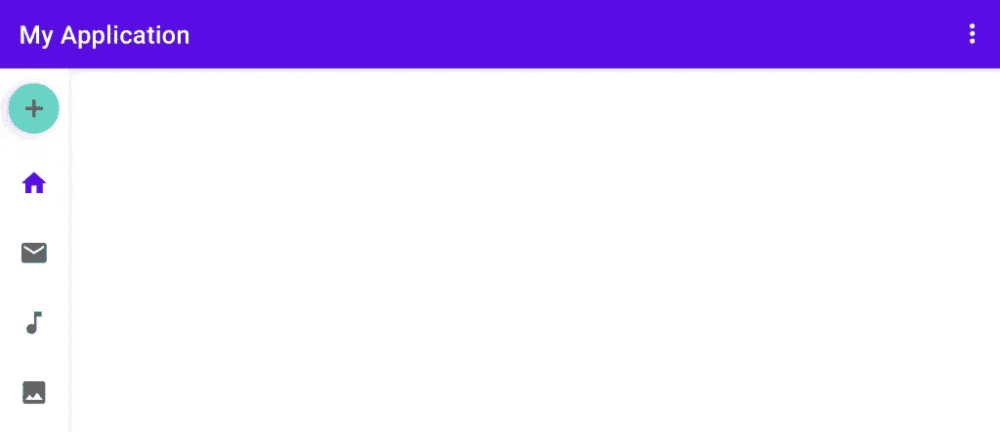

与我们看到的初始(默认)样式类似，轨道具有以下属性，主要区别在于应用于视图的宽度:

*   轨宽: **52dp**
*   铁轨背景:**彩色表面**
*   选中图标颜色: **colorPrimary**
*   未选中的图标颜色:**colorOnSurface**(60%)

最终支持的样式提供了对这种紧凑外观的支持，但使用了我们之前看到的主题中的更大胆的颜色:

```
style="@style/Widget.MaterialComponents.NavigationRailView.Colored.Compact"
```

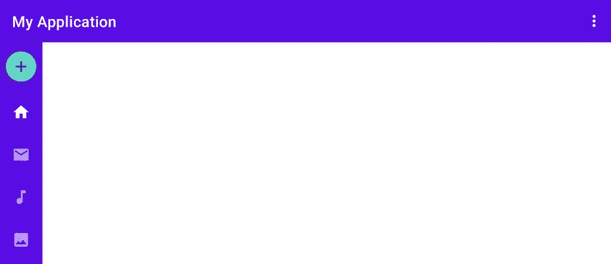

类似于我们之前提到的**主面**样式，**是彩色的。紧凑型**风格在此使用相同的属性，宽度略有变化:

*   轨宽: **52dp**
*   铁轨背景:**原色**
*   所选图标颜色: **colorOnPrimary**
*   未选中的图标颜色:**colorOnPrimary**(60%)

# 控制标高

默认情况下，导航条将显示高度，这样它看起来是分层的，并与我们屏幕的内容区域分开。但是，如果您希望手动调整该值，您可以使用**海拔**属性。

```
<com.google.android.material.navigationrail.NavigationRailView
    ...
    app:elevation="4dp" />
```

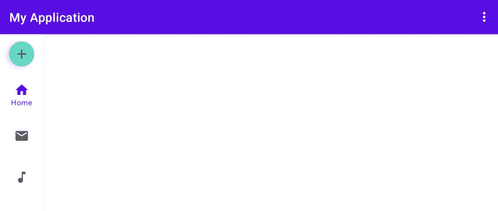

Navigation Rail showing a customised elevation value

# 菜单重心

当指定一个菜单在轨道中显示时，我们可能希望控制它在容器中的位置。为此，我们可以使用**菜单重力**属性来控制菜单项的重力。

```
<com.google.android.material.navigationrail.NavigationRailView
    ...
    app:menuGravity="center" />
```

这可以设置为**顶部**、**中心**或**底部** —应用时，导航项目将使用导航轨道内部的可用空间进行定位。

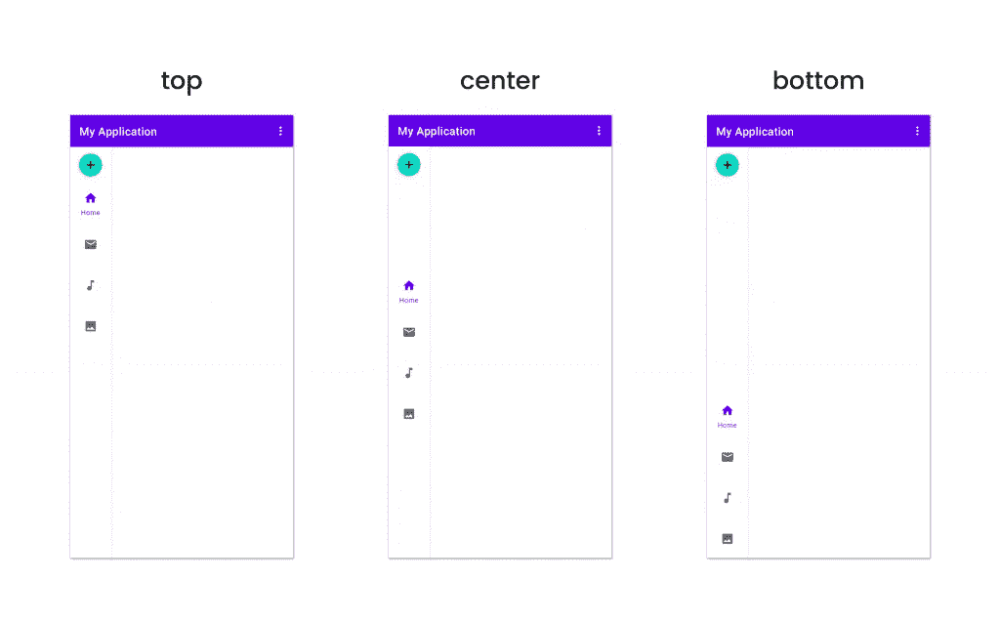

# 标签可见性

在上面的所有例子中，我们已经看到标签只显示在轨道中当前选中的项目上。这是标签可见性的默认行为，我们可以使用 **labelVisibilityMode** 属性来控制。

```
<com.google.android.material.navigationrail.NavigationRailView
    ...
    app:labelVisibilityMode="selected" />
```

该属性有四个不同的选项可以应用:

*   **标签化** —所有菜单项都将显示其标签，无论选择的状态如何
*   **未标记的** —无论选择的状态如何，没有菜单项会显示它们的标签
*   **选中的** —只有当前选中的菜单项才会显示其标签
*   **自动**——当超过 3 个项目时，轨道将使用**选择的**选项，否则将应用标有的**选项。**

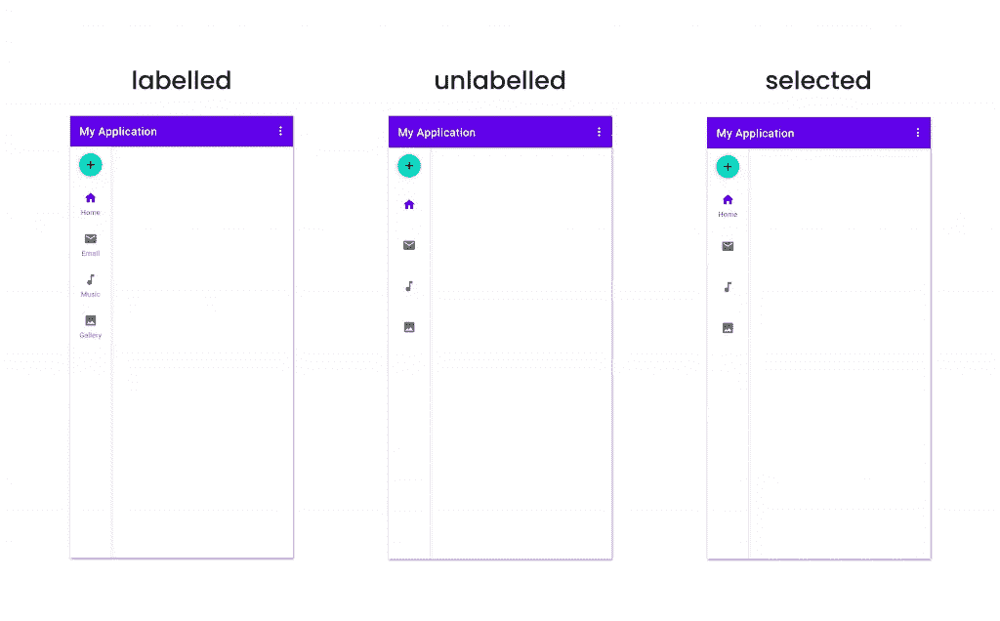

Example showing the different labelling options for the Navigation Rail

**注意:**如果在这里使用未标记的选项，为了可访问性的目的，仍然要在菜单文件中证明 title 属性，这一点很重要。

# 展示徽章

导航条的一个有趣特性是能够在导航项目上显示徽章——如果您需要向用户显示某种形式的通知(如果该区域的内容有未决通知),这很有帮助。

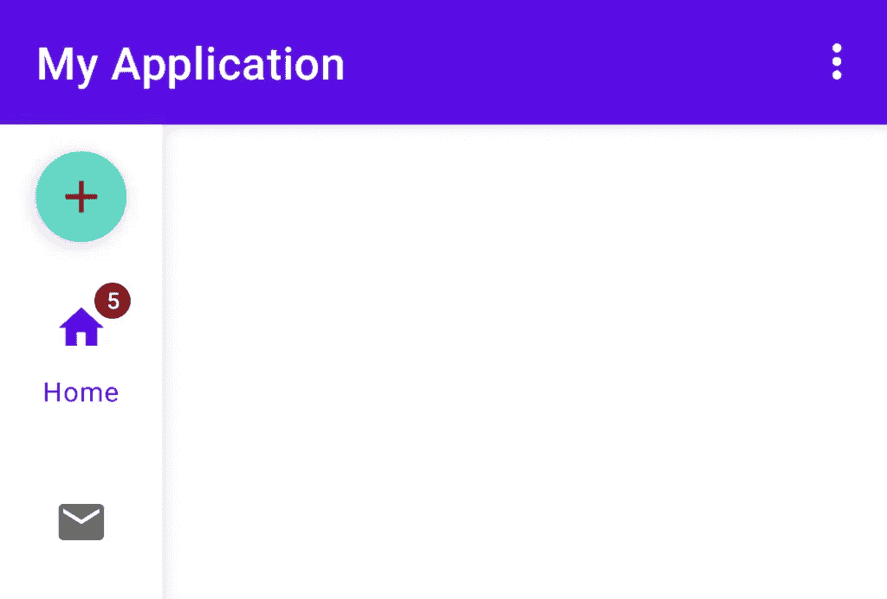

Navigation Rail showing a badge

此徽章可以按导航项目单独显示。要应用徽章，我们需要在我们的导航栏上使用 **getOrCreateBadge** 函数，为我们想要应用徽章的导航项目提供 ID——该函数将返回一个 BadgeDrawable 实例。

```
var badge = navigationRail.getOrCreateBadge(R.id.home)
```

还有一个 **getBadge** 函数，它返回一个对 BadgeDrawable 的可空引用，但是， **getOrCreateBadge** 帮助我们处理给定菜单 ID 的标记可能尚不存在的情况。一旦我们有了对这个 BadgeDrawable 的引用，我们就可以控制它的可见性，并分配一个要在其中显示的值:

```
badge.isVisible = true
badge.number = 5
```

使用完徽章后，我们可以使用 removeBadge 功能将其从我们的导轨上移除:

```
navigationRail.removeBadge(menuItemId)
```

## 徽章重力

如果您想要控制徽章相对于导航项目的位置，那么您可以使用 BadgeDrawable 的 **badgeGravity** 属性来实现。

```
badge.badgeGravity = BadgeDrawable.BOTTOM_START
```

这可以设置为四个不同值之一( **TOP_END** 、 **TOP_START** 、 **BOTTOM_END** 、 **BOTTOM_START** )，每个值用于在导航项目区域内定位徽章。

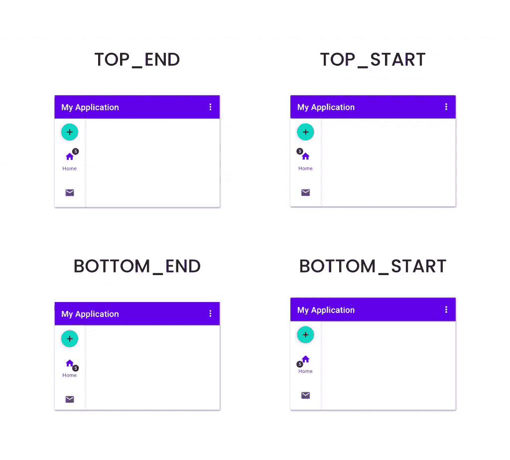

The different gravity options for a navigation item badge

## 徽章颜色

在前面的示例中，我们可以看到工卡在显示时使用默认颜色——这些颜色实际上是我们的应用程序主题中的 **colorError** 和 **colorOnError** 值。如果您希望覆盖这些，或者为每个工卡单独设置颜色，那么您可以通过在任何 BadgeDrawable 引用上使用 **backgroundColor** 和 **badgeTextColor** 来实现:

```
badge.backgroundColor = Color.BLACK
badge.badgeTextColor = Color.WHITE
```

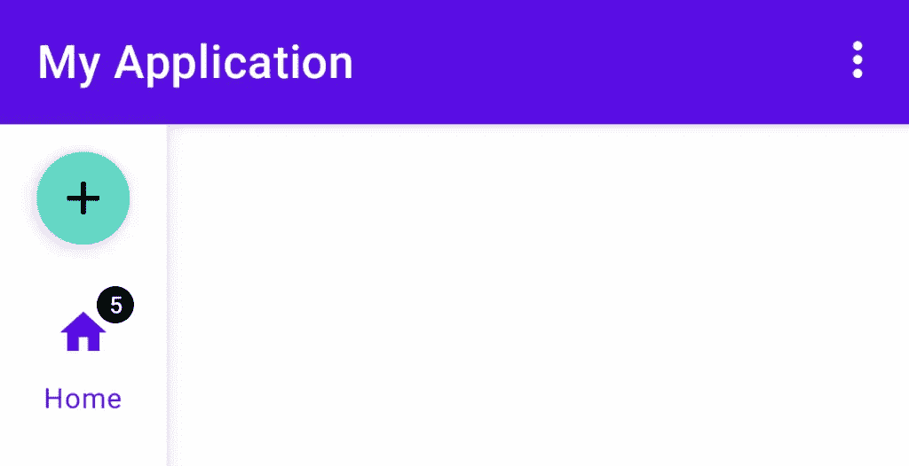

Navigation Rail showing a styled badge

## 徽章溢出

默认情况下，徽章最多显示 4 个字符，这样做时，它会自动处理任何溢出。这意味着显示诸如“999999”的徽章值将导致使用“999+”。正如我们所看到的，在某些情况下，这在我们的 Rail 中可能看起来不太好:

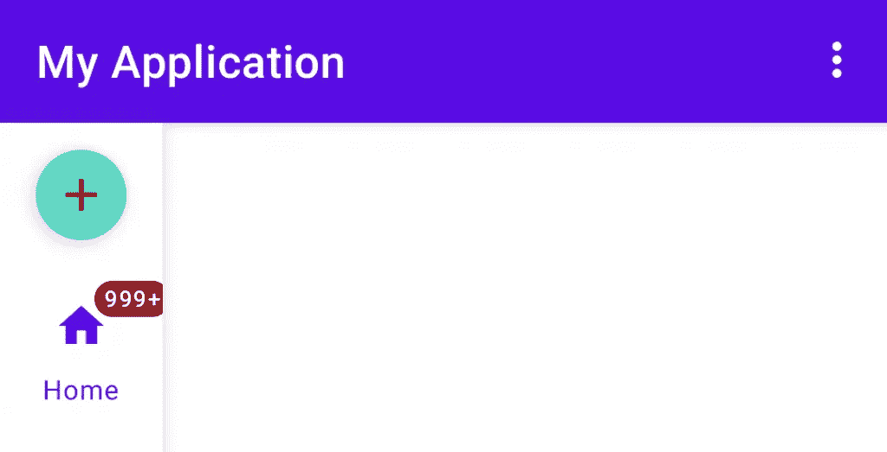

Navigation Rail showing a badge that exceeds the end of the container

如果我们想要手动调整工卡中显示的最大字符数，我们可以使用 **maxCharacterCount** 属性。这将仍然允许徽章为我们处理溢出，但更允许我们控制溢出处理应该起作用的点。

```
badge.maxCharacterCount = 3
```

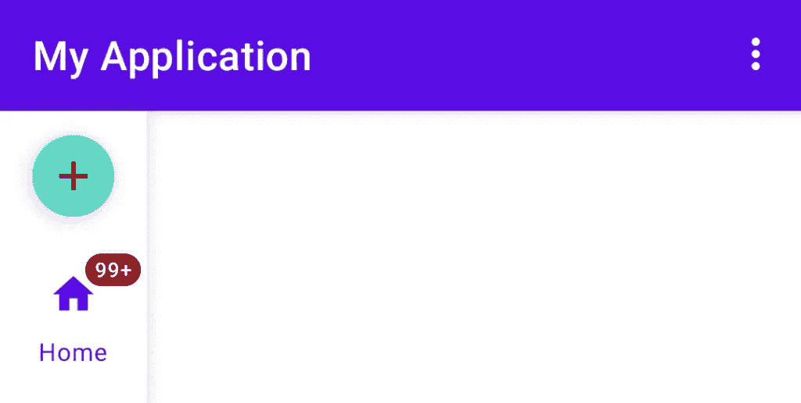

Navigation Rail showing a badge with overflowing data

## 徽章偏移量

从上面显示的示例来看，导航徽章显示在图标区域之外，有足够的空间不会造成任何重叠。在某些情况下，我们可能希望定位我们的徽章稍有不同——在这些情况下，**垂直偏移**和**水平偏移**属性都可以用来为我们的导航徽章提供像素值偏移。

```
badge.verticalOffset = verticalOffset
badge.horizontalOffset = horizontalOffset
```

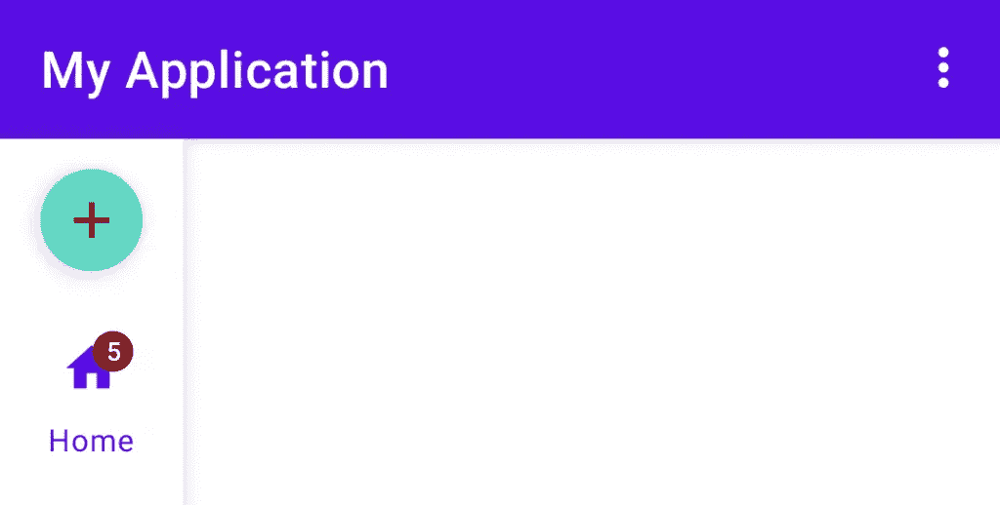

Navigation Rail showing an offset badge

# 处理项目选择

现在，我们已经在应用程序中显示并样式化了导航条，我们将想要处理与它的任何交互。与 Android 应用程序中其他组件的其他菜单项处理类似，我们可以在导航栏上设置一个项目选择监听器，并使用它来响应与菜单项的任何交互——使用菜单项的 id 来处理相应的菜单项。

```
navigationRail.setOnItemSelectedListener {  menuItem ->
    when (menuItem.itemId) {
        R.id.home -> {
            ...
            true
        }
        else -> false
    }
}
```

需要注意的是，只有当一个项目最初被选中时，才会触发这个项目选定侦听器，也就是说，当一个项目从未选中状态变为选中状态时。如果用户已经选择并重新选择了一个项目，则不会触发该侦听器。在用户重新选择一个项目的情况下(就像在中一样，当单击该项目的时候它已经被选中了)，可以使用第二个侦听器来注册这些事件。

```
navigationRail.setOnItemReselectedListener {  menuItem ->
    when (menuItem.itemId) {
        R.id.home -> {

        }
    }
}
```

现在有了这个辅助侦听器，我们就能够侦听已经处于选中状态的项目的任何交互并对其做出反应。

# 处理导航

当利用某种形式的导航栏时，我们希望允许用户在当前屏幕的不同视图之间导航。这是来自材料组件库的 BottomNavigationView 的一个常见用例——虽然从视觉上看，这与导航条略有不同，但在行为上它们非常相似。

这种相似性让我思考导航组件如何支持设置带有 NavController 引用的 BottomNavigationView。这基本上允许你使用一个 BottomNavigationView 在导航图上导航，我希望在导航栏上也有类似的支持。我很高兴看到导航组件库最近增加了对此的支持。有了这些，您就可以使用下面的代码来设置一个带有 NavController 的导航轨道参考:

```
NavigationUI.setupWithNavController(
    navigationRailView,
    navController
)
```

# 包扎

唷，那可真让人受不了！我希望通过这篇文章，你已经获得了足够的关于导航条的知识，能够将它添加到你的应用程序中，根据用户使用的设备/屏幕来改善他们的体验！就我个人而言，我真的很兴奋能够将它应用到我的应用程序中，并开始在我的设备上安装的应用程序中亲自体验它！

更多 Android 开发者相关内容，请在 twitter 上关注我！[https://twitter.com/hitherejoe](https://twitter.com/hitherejoe)