# 探索 v28 Android 设计支持库的新增功能

> 原文：<https://medium.com/google-developer-experts/exploring-the-v28-android-design-support-library-2c96c6031ae8?source=collection_archive---------0----------------------->

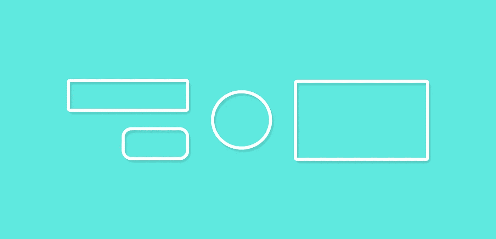

Android 支持库的第 28 版最近发布了——在当前的 alpha 版本中，有一系列令人兴奋的新组件，我们现在可以访问它们了。在本文中，我想看看以材料视图组件的形式添加到支持库中的内容。

[](http://eepurl.com/dIKgiT)

# 材料按钮

材质按钮是一个小部件，可用于在应用程序用户界面中显示材质样式按钮。这个类是从你可能已经在你的项目中使用的 AppCompatButton 类扩展而来的，但是这有什么不同呢？开箱后，该按钮将采用材质的外观和感觉进行设计，无需使用样式标志进行定制。我们可以直接使用 MaterialButton 类，在我们的视图中，它已经有了我们想要的材质外观——把它看作一个方便的类。

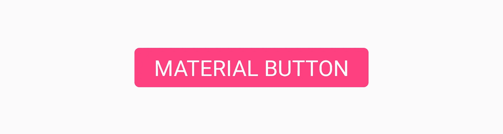

我们可以将这个按钮添加到布局文件中，如下所示:

```
<android.support.design.button.MaterialButton
    android:layout_width="wrap_content"
    android:layout_height="wrap_content"
    android:text="MATERIAL BUTTON"
    android:textSize="18sp"
    app:icon="@drawable/ic_android_white_24dp" />
```

默认情况下，这个类将使用主题的强调色作为按钮填充的背景色，白色作为按钮文本的颜色。如果按钮没有被填充，那么你的主题的强调色将会和透明的背景一起作为按钮文本的颜色。

如果我们希望自己添加一些样式，那么我们可以通过使用 **MaterialButton** 样式的属性集合来实现。

*   **app:图标**——用于定义在按钮的**开始**处显示的可绘制

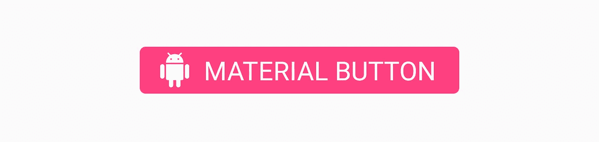

*   **app:iconTint** —用于给app:icon 属性中正在使用的图标着色
*   **app:iconTintMode** —定义用于图标着色的模式

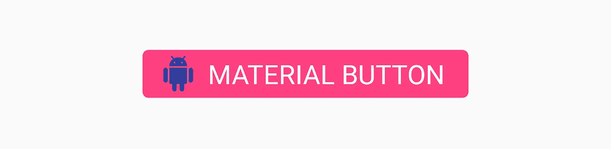

*   **app:iconPadding** —应用于app:icon 属性中正在使用的图标的填充

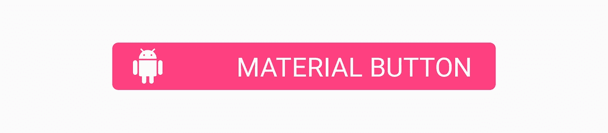

*   **app:additionalPaddingLeftForIcon**—从app:icon 属性中定义要应用于正在使用的图标左侧的填充

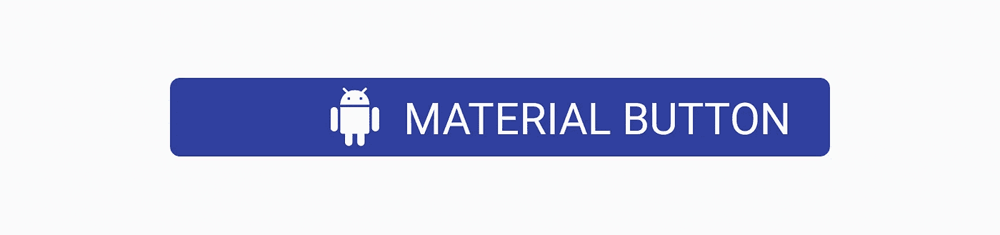

*   **app:additionalPaddingRightForIcon**—从app:icon 属性中定义要应用于正在使用的图标右侧的填充

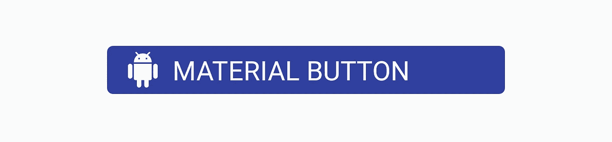

*   **app:rippleColor**
*   **app:backgroundTint** —用于给按钮的背景应用色调。如果您希望更改按钮的背景颜色，请使用此属性而不是背景，以避免破坏按钮样式
*   **app:backgroundTintMode***—*用于定义背景色调的模式

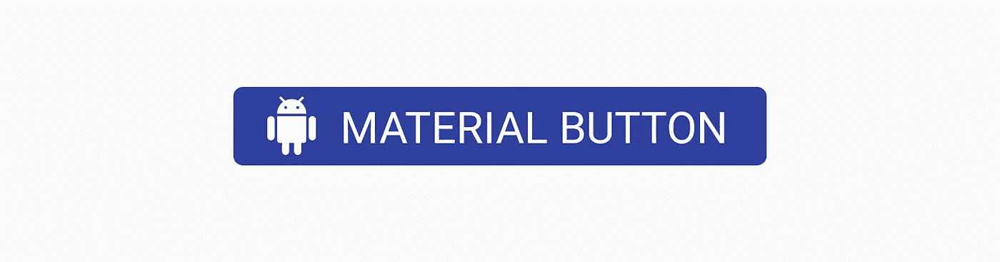

*   **app:strokeColor** —用于按钮笔划的颜色
*   **app:strokeWidth** —按钮笔画使用的宽度

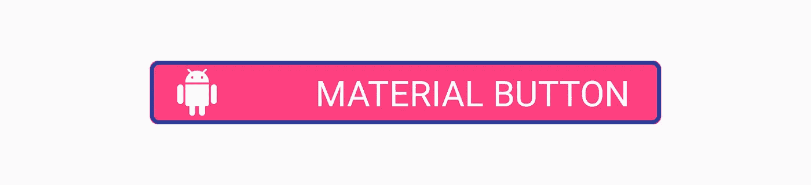

*   **app:cornerRadius** —用于定义按钮边角的半径


# 芯片

芯片组件允许我们在布局中显示芯片视图。这实际上是一些给定了圆形背景的文本——其目的是向用户显示某种形式的文本集合，这些文本集合可能是可选的，也可能是不可选的。例如，这些可以用来根据应用程序中的当前上下文向用户显示可选建议的列表。

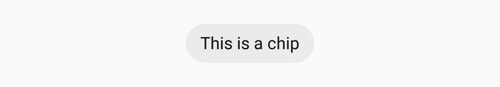

我们可以像这样向我们的布局添加一个芯片，使用 **app:chipText** 属性来设置要在芯片上显示的文本:

```
<android.support.design.chip.Chip
    android:id="@+id/some_chip"
    android:layout_width="wrap_content"
    android:layout_height="wrap_content"
    app:chipText="This is a chip" />
```

还有一组其他属性可用于进一步设计芯片:

*   **app:可勾选** —用于声明芯片是否可以切换为选中/不选中。如果禁用，复选标记的行为与按钮相同
*   **app:chipIcon** —用于显示芯片内的图标

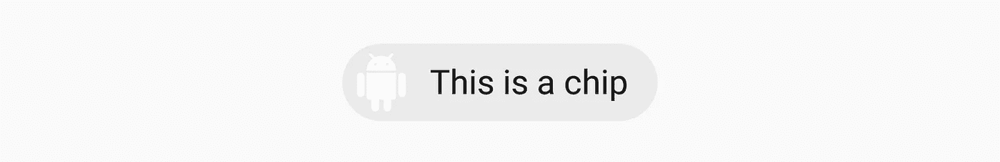

*   **app:closeIcon** —用于显示芯片内的关闭图标

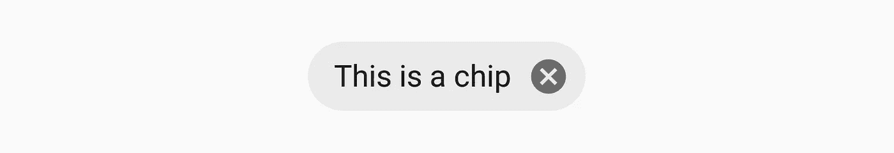

我们还可以在我们的芯片实例上设置一些监听器，这对于监听用户的交互很有用。如果我们的芯片是可检查的，很可能我们想要监听这个检查状态何时被改变。我们可以使用**setOnCheckedChangeListener**监听器来实现:

```
some_chip.setOnCheckedChangeListener **{** button, checked **->  }**
```

同样的道理也适用于当关闭图标被使用时，我们想要监听它的交互。为此，我们可以利用**setOnCloseIconClickListener**函数来注册近距离交互事件:

```
some_chip.setOnCloseIconClickListener **{  }**
```

# 芯片组

如果我们向用户显示一组芯片，我们希望确保它们在我们的视图中被正确地分组在一起。为此，我们可以利用芯片组视图组件:

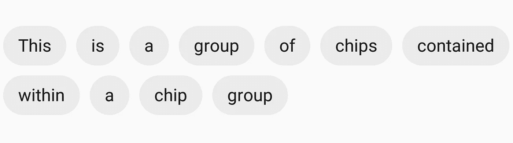

如果我们希望使用芯片组，我们只需要将我们的芯片视图包装在一个父芯片组组件中:

```
<android.support.design.chip.ChipGroup
    android:layout_width="wrap_content"
    android:layout_height="wrap_content">

    <android.support.design.chip.Chip
        android:layout_width="wrap_content"
        android:layout_height="wrap_content"
        app:chipText="This" />

    <android.support.design.chip.Chip
        android:layout_width="wrap_content"
        android:layout_height="wrap_content"
        app:chipText="is" />

    // more chips...

</android.support.design.chip.ChipGroup>
```

默认情况下，您的芯片视图可能会显得有点拥挤。如果是这样，您可以使用芯片组本身的以下属性为子视图增加一些间距:

*   **app:芯片间距**-增加水平轴和垂直轴的间距
*   **app:chips pacing horizontal**—增加水平轴的间距
*   **app:chips pacing vertical**—增加垂直轴的间距

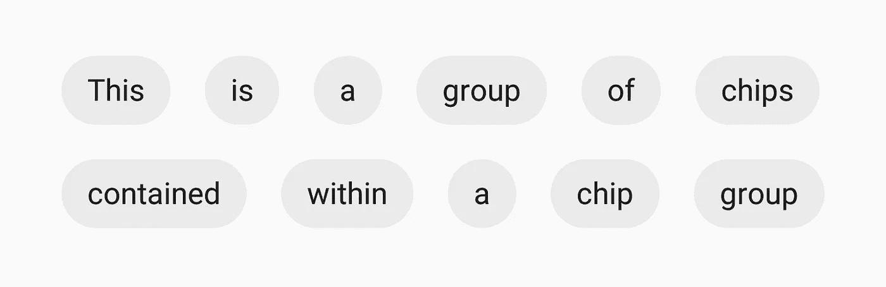

我们还可以声明我们的子芯片视图在我们的芯片组容器中的一行中显示。使用 **app:单线**属性:

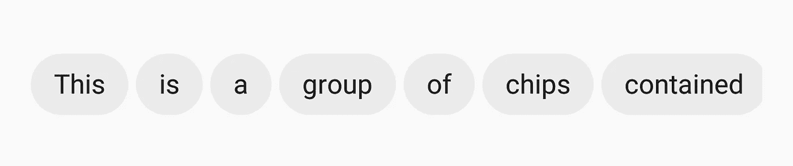

这样做时，您需要在滚动视图(如 HorizontalScrollView)中包装芯片组，以便您的用户可以滚动显示芯片:

```
<HorizontalScrollView
    android:layout_width="wrap_content"
    android:layout_height="wrap_content">

    <android.support.design.chip.ChipGroup
        android:layout_width="wrap_content"
        android:layout_height="wrap_content"
        app:singleLine="true">

        <android.support.design.chip.Chip
            android:layout_width="wrap_content"
            android:layout_height="wrap_content"
            app:chipText="Some chip" />

        // more chips... </android.support.design.chip.ChipGroup>

</HorizontalScrollView>
```

# 材料卡片视图

在我们的应用程序中，我们可能在某个时候使用了 CardView 组件。支持库现在包含一个名为 Material Card View 的组件，它为我们提供了一个现成的 Material 风格的 Card View 实现。

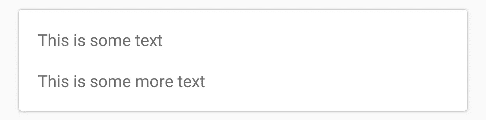

cardview 可以添加到您的布局中，如下所示:

```
<android.support.design.card.MaterialCardView
    android:layout_width="match_parent"
    android:layout_height="wrap_content"
    android:layout_margin="16dp"> ... child views ...</android.support.design.card.MaterialCardView>
```

您可以使用附带的两个属性来进一步设计 cardview 的样式:

*   **app:strokeColor** —用于给定笔画的颜色，必须设置该颜色以显示笔画
*   **app:strokeWidth** —应用于视图描边的宽度

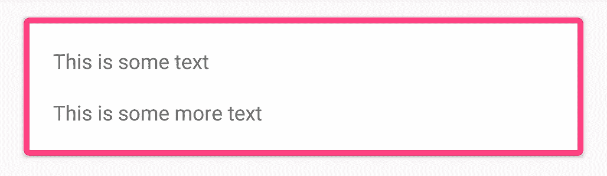

除了这两个属性之外，您还可以使用原来可用的属性(如 app:cardBackgroundColor 等)来设置 cardview 的样式。

# 底部应用程序栏

底部的应用程序栏是一个新的组件，它允许我们在布局的底部显示一个类似工具栏的组件。这允许我们以一种比标准工具栏更容易交互的方式向用户显示组件。

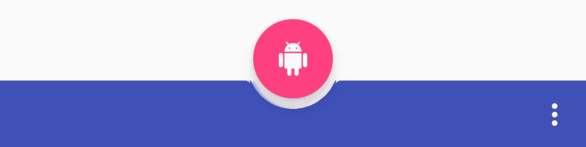

您可以将 BottomAppBar 添加到布局文件中，如下所示:

```
<android.support.design.bottomappbar.BottomAppBar
    android:layout_width="match_parent"
    android:layout_height="wrap_content"
    android:layout_gravity="bottom"
    app:backgroundTint="@color/colorPrimary"
    app:popupTheme="@style/ThemeOverlay.AppCompat.Light"
    app:theme="@style/ThemeOverlay.AppCompat.Dark.ActionBar">
```

似乎底部的应用程序栏**必须**分配有菜单才能在屏幕上显示。这可以通过编程实现，如下所示:

```
bottom_app_bar.replaceMenu(R.menu.main)
```

当设计底部应用程序栏的样式时，有几个属性可以利用。

*   **app:fabAttached** —表示一个 FAB 是否已经连接到底部 app 栏。您可以通过使用底部应用程序栏的 ID，在您想要连接的 fab 组件上使用 **app:layout_anchor** 来连接 FAB。如果连接了 FAB，它将被插入到底部应用程序栏中，否则 FAB 将保持在底部应用程序栏上方。

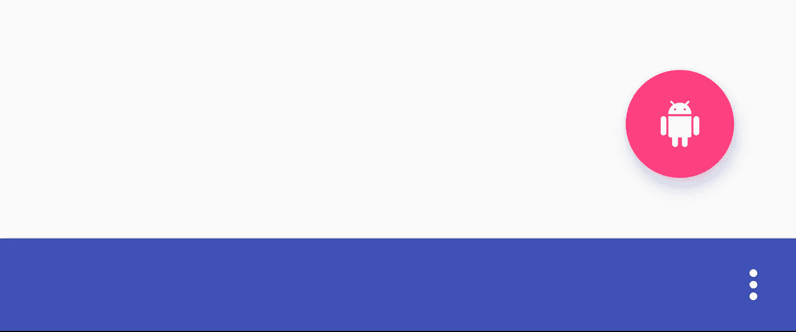

*   **app:fabAlignmentMode** —声明已经贴在底部 app 栏上的 FAB 的位置。这可以是**结束**:

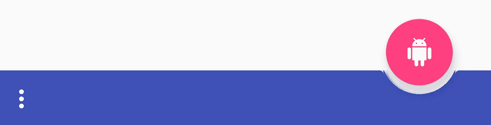

或**居中**:


*   **app:fabscradleverticaloffset**—声明用于附加 fab 的垂直偏移。默认情况下，这是 0dp:

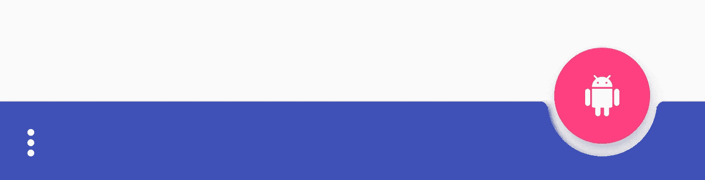

然而，设置 dp 值将允许 FAB 垂直向上移动:


*   **app:backgroundTint** —用于对视图的背景应用色调。如果你想设置视图的背景颜色，那么应该在 android:background 属性上使用。这样做将确保视图的主题保持稳定。

# 结论

在我看来，这些是对支持库的一些巧妙的补充——我期待着能够使用开箱即用的材料主题组件。我也很高兴能找到底部应用程序栏的使用案例，但我相信在支持库版本稳定之前还有一段时间。像往常一样，我很乐意听到您对这些新组件的想法或评论！

[](https://twitter.com/hitherejoe) [## 乔·伯奇(@hitherejoe) |推特

### 乔伯奇的最新推文(@hitherejoe)。Android Lead &高级工程师@Buffer。谷歌开发专家…

twitter.com](https://twitter.com/hitherejoe)