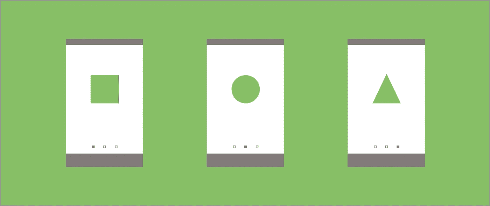

# 浏览视图页面 2

> 原文：<https://medium.com/google-developer-experts/exploring-the-view-pager-2-86dbce06ff71?source=collection_archive---------0----------------------->



> 这是最初张贴在 joebirch.co

[](https://joebirch.co/2019/02/22/exploring-the-view-pager-2/) [## 浏览视图页面 2

### 在 Android 领域工作时，您可能会在某个时候遇到 ViewPager 类。这种观点允许我们…

joebirch.co](https://joebirch.co/2019/02/22/exploring-the-view-pager-2/) 

在 Android 领域工作时，您可能会在某个时候遇到 ViewPager 类。这个视图允许我们以可滑动的格式向用户显示片段或视图的集合——在车载和内容显示屏中特别流行。这个组件已经在 Android 世界中存在了一段时间，它甚至被移植到了 androidx 库——但现在我们有了这个组件的更新版本，即 [View Pager 2](https://developer.android.com/jetpack/androidx/releases/viewpager2#1.0.0-alpha01) ，它最近发布了 alpha 版本。让我们来看看这次迭代到底有什么不同。

在某些情况下，对于用户来说，这些视图页面组件中的每一个都可能有相同的感觉。显示一个视图，在视图中滑动另一个视图，等等。但是如果我们想在一个视图页面中显示同一个视图的多个实例…即使使用了视图实例，我们仍然会遇到一些效率低下的问题。这就是 View Pager 2 的一个关键不同之处——它的不同之处在于利用了 RecyclerView。这意味着，就像我们已经在使用回收器视图显示内容流一样，现在让我们的视图随着我们的前进而回收允许我们能够利用完全相同的行为来查看页面。在我看来，这是一个巨大的消息，不仅会给我们的用户带来更流畅的体验，还会让我们作为开发者更容易实现这个组件。

在这一点上，recycler 视图的其他特性也变得可用——如果您已经使用了 DiffUtil 功能，那么您就会知道它有多么强大。因为我们现在使用了 RecyclerView，所以我们现在能够使用这个类执行不同的操作，在处理视图页面组件中的动态或更新内容时会更有效。

我们还有一些其他的特性，这些特性现在也在 View Pager 2 中引入了——从右到左的支持和垂直方向是其中的两个。这使我们能够创建更具包容性的应用程序，并将该组件用于特定的屏幕设计。

别担心，我们使用回收器视图并不意味着我们不能使用片段。我们可以利用 FragmentStateAdapter 在视图 pager 2 中处理我们的片段——这取代了 FragmentStatePagerAdapter，并将使如何在这个组件中处理片段变得更加清晰。

另外，对于 Android 团队来说，维护起来会容易得多。不仅仅是回收器视图现在正在提升和经历重用，而且视图分页器类已经从 **3169** 行代码减少到 **583** 。如果您曾经深入查看过视图页面的源代码，那么您可能会记得其中有许多复杂性——边缘检测、手势检测、状态持续、偏移和定位计算、边距绘制、视图绘制和许多自定义计算。对于团队来说，消除维护一个有自己逻辑的类的需求将是一个巨大的胜利。

# 在后台

在使用组件时，很好地理解组件内部的情况通常会很有帮助。这不仅有助于您理解组件的能力，而且当遇到 bug 时，您将有更好的知识来解决发生的问题。就像视图分页器一样，视图分页器 2 从视图组类扩展而来——从那里，事情看起来有点不同。除了一些省略之外，这就是 View Pager 2 的核心部分:


# 回收器视图

View Pager 2 使用 RecyclerView 组件来处理您分配给它的内容的显示。这给我们带来了很多好处，我已经在这篇文章中概述了。—但本质上，这意味着我们现在可以利用我们已经熟悉的大多数回收器视图组件。

# 布局管理器

这与您之前在应用程序中与 RecyclerView 组件一起使用的 LayoutManager 类完全相同。布局管理器由视图页面管理器管理，因此开发人员能够设置组件的方向。虽然您无法控制使用什么样的布局管理器(LinearLayoutManager 是自动分配的)，但您可以设置管理器使用的方向。使用视图页面 2 上的 **setOrientation()** 函数，我们可以传入一个方向值，这将允许我们为布局管理器设置方向。最初的视图页面只提供了水平方向，所以对于以垂直方式显示页面内容的应用程序来说，这将非常有用。

# 页面更改回调

您可以在我们的 view pager 2 上注册一个页面更改回调(以 **OnPageChangeCallback** 类的形式)。这将允许您监听所选页面上的更改。在此回调中，我们可以监听:

*   **onpagesulved()**—当前页面发生滚动事件时触发
*   **onPageSelected()** —当新页面被选中时触发
*   **onPageScrollStateChanged()**—当滚动状态改变时触发

# 适配器

就像我们在其他地方为 RecyclerView 组件设置适配器一样，我们现在可以为 ViewPager 做同样的事情。这与我们习惯使用 RecyclerView 适配器没有什么不同。

# 寻呼机快照帮助程序

这是我们无法配置的，但我想指出它的用法，因为它不同于最初的视图页面。在这里，ViewPager 使用 PagerSnapHelper 类来模拟在满足选定项的滚动位置要求时捕捉该项。您可能以前在自己的 RecyclerView 中使用过这个类，但是这显示了重用已经存在的组件来改进框架中的某些东西。


除了上面提到的功能，我们仍然可以从原始视图页面访问我们可能熟悉的其他部分。这些事情包括:

*   **setCurrentItem()** —设置应在屏幕上显示的当前项目
*   **getCurrentItem()** —获取屏幕上显示的项目的当前项目索引
*   **setpage transformer()**-设置一个转换器，以便在页面发生变化时应用自定义转换

# 实现视图页导航

要将视图 Pager 2 添加到我们的项目中，我们需要首先将所需的依赖项添加到 build.gradle 文件中:

```
implementation 'androidx.viewpager2:viewpager2:1.0.0-alpha01'
```

添加后，我们现在可以访问 View Pager 2 组件，这意味着我们可以继续将它添加到我们的布局文件中:

```
<androidx.viewpager2.widget.ViewPager2
        android:id="@+id/view_pager"
        android:layout_width="match_parent"
        android:layout_height="match_parent"/>
```

现在我们已经在布局中定义了视图分页器，我们需要通过创建一个从 RecyclerView 扩展的适配器，为它分配一些数据，以便在屏幕上显示给用户。适配器类。然后，我们可以将这个适配器分配给我们的 view pager 实例:

```
val adapter = WelcomeAdapter()
adapter.welcomeItems = listOf(WelcomeItem.WELCOME_ONE, WelcomeItem.WELCOME_TWO, WelcomeItem.WELCOME_THREE)
view_pager.adapter = adapter
```

现在我们已经显示了内容，我们可能想要调整视图页面的方向。默认情况下，视图分页器使用**水平**方向:

```
androidx.viewpager2.widget.ViewPager2.ORIENTATION_HORIZONTAL
```


如果这是您想要的方向，您不需要在这里做任何改变。但是，如果您希望使用垂直方向，那么您可以通过调用 setOrientation()并传入 **ORIENTATION_VERTICAL** 值来更改它:

```
view_pager.orientation = ORIENTATION_VERTICAL
```


我们还可以从视图页面中监听事件，因为我们可能希望根据用户选择的页面来调整我们的 UI 或数据。同样，这里我们可以观察到**onpagesrolled()**、 **onPageSelected()** 和**onPageScrollStateChanged()**:

```
view_pager.registerOnPageChangeCallback(object : ViewPager2.OnPageChangeCallback() { // override desired callback functions})
```

我们还可以对数据执行 DiffUtil 操作，以动态更新视图页面中的内容，这意味着我们不需要重新加载和设置整个数据集，只需要更改数据。您可以使用 DiffUtil here 检查文档中的[，但是作为一个例子，我们将上面 GiIFs 中显示的内容作为我们的数据集。如果我们随后对相同的数据执行 DiffUtil 操作，其中只有最后一个屏幕的标题不同，我们将能够利用来自 diff 结果的 change 有效负载来只更新那段内容——这在涉及 view pager 组件中的动态内容时效率会高得多。](https://developer.android.com/reference/android/support/v7/util/DiffUtil)

我希望这已经让您深入了解了新的 View Pager 组件，以及使用它后我们能够实现的功能。虽然它仍处于 **alpha** 阶段，但它承诺了一种更有效的方法来显示和管理我们的内容——这反过来将为我们的用户带来更好的体验。结合由回收器视图(动画等)支持的 DiffUtil 和其他功能，View Pager 2 承诺在实现和使用方面都有改进的体验。您目前是否正在使用 View Pager，您将如何使用 View Pager 2？请在下面的评论区告诉我🙌

[](https://twitter.com/hitherejoe) [## 乔·伯奇(@hitherejoe) |推特

### 乔伯奇的最新推文(@hitherejoe)。Android Lead @Buffer。谷歌开发专家为@Android，@GooglePay &…

twitter.com](https://twitter.com/hitherejoe)