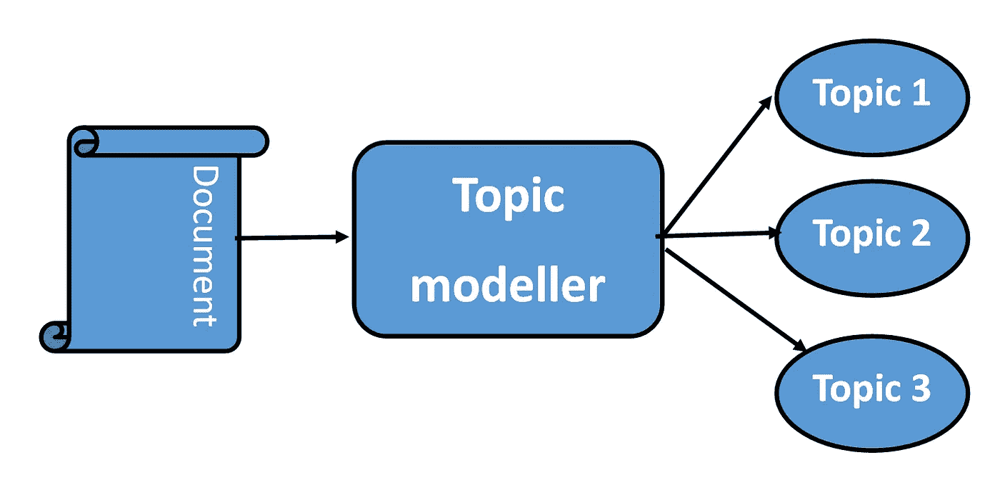
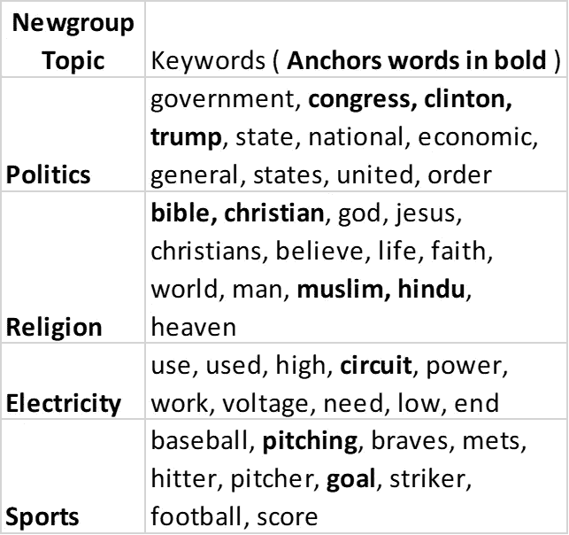

# 使用半监督学习探索主题建模(相关性解释)

> 原文：<https://medium.com/version-1/exploring-topic-modelling-using-semi-supervised-learning-correlation-explanation-b81d2603c9a2?source=collection_archive---------0----------------------->


Photo by [Markus Spiske](https://www.pexels.com/@markusspiske?utm_content=attributionCopyText&utm_medium=referral&utm_source=pexels) from [Pexels](https://www.pexels.com/photo/crowd-reflection-color-toy-1679618/?utm_content=attributionCopyText&utm_medium=referral&utm_source=pexels)

在当今世界，[数字化转型](https://www.version1.com/it-service/digital-services/)是每个行业都在追求的东西，而数据驱动的洞察力是它的核心。每秒钟都会以不同的形式生成和收集数据，所有组织都努力确保拥有完整的数据视图，以提供实时见解，并能够采取数据驱动的行动。任何数据驱动流程的挑战部分都是在短时间内获得相关和所需的信息。开发了许多算法和技术来获取人们正在寻找的信息。在本文中，我们将探讨自然语言处理领域中的一种流行技术，即主题建模，以及增强这一领域的一个特定包。

# **什么是话题造型？**



主题建模是识别文档中主题的过程。随着电子邮件、推文、书籍、期刊、文章等数字化文本的增加，主题建模仍然是识别和自动将这些文档分类为类别或主题的最重要的技术之一。有许多标准方法来处理主题建模，其中一些流行的方法是 [**【潜在狄利克雷分配(LDA)**](https://scikit-learn.org/stable/modules/generated/sklearn.decomposition.LatentDirichletAllocation.html) 和 [**非负矩阵分解(NMF)**](https://scikit-learn.org/stable/modules/generated/sklearn.decomposition.NMF.html) 。

LDA 和 NMF 都是 python scikit 库中的标准实现，在数据科学社区中被广泛使用。这些方法是无监督的学习算法，生成各种相互关联的主题，并高度依赖于它对数据集做出的假设。然而，这些方法在概括底层细节和围绕数据生成过程的复杂假设时有局限性。在某些情况下，由于人类输入数据的高维性，这些模型最终会得出错误的假设。

在本文中，我们将探索 CorEx 包，它允许对模型生成的主题进行某种程度的控制。

# **相关性解释(CorEx)**


CorEx uses keywords to anchor topics

[**关联解释(CorEx**](https://ryanjgallagher.github.io/code/corex/overview) **)** 是一个灵活的框架，由 Greg Ver Steeg 开发，用于主题建模，以识别最大化文本语料库中可用信息的主题。CorEx 模型允许通过用户特定的锚词来整合领域知识，锚词将模型导向感兴趣的主题。这使得模型能够表示不自然出现的主题，并提供分离关键字的能力，从而允许识别不同的主题。

例如，下表显示了与新组中的主题相关的一些关键字，以及将用于识别这些主题的锚词。



Table created from examples in [https://www.aclweb.org/anthology/Q17-1037.pdf](https://www.aclweb.org/anthology/Q17-1037.pdf)

# **如何使用 CorEx？**


Photo by [Anna Tarazevich](https://www.pexels.com/@anntarazevich?utm_content=attributionCopyText&utm_medium=referral&utm_source=pexels) from [Pexels](https://www.pexels.com/photo/sign-abstract-typography-business-6230975/?utm_content=attributionCopyText&utm_medium=referral&utm_source=pexels)

CorEx 的 python 实现在[**Github 上有。**](https://github.com/gregversteeg/corex_topic)

您可以使用 pip 命令在 python 上安装 CorEx。

```
pip install corextopic
```

以下是使用标准无监督方法(如 LDA 和 NMF)的主题建模示例。

**使用 LDA 的主题建模**

```
from sklearn.decomposition LatentDirichletAllocation as LDA

no_of_topics = 4
tfidf = TF-IDF matrix of your documents# Run LDA
lda = LDA(n_topics=no_of_topics).fit(tfidf)# Display top n words for each topic identified
def display_topics(model, features, words_count):
    for topic_no, topic in enumerate(model.components_):
        print("Topic %d:" % (topic_no))
        print(" ".join([features[i] for i in topic.argsort()[:-words_count - 1:-1]])

words_count = 10# Display top 10 words for each topic
display_topics(lda, tfidf_feature_names, words_count)
```

**利用 NMF 进行话题建模**

```
from sklearn.decomposition import NMF

no_of_topics = 4
tfidf = TF-IDF matrix of your documents# Run NMF
nmf = NMF(n_components=no_of_topics).fit(tfidf)# Display top n words for each topic identified
def display_topics(model, features, words_count):
    for topic_no, topic in enumerate(model.components_):
        print("Topic %d:" % (topic_no))
        print(" ".join([features[i] for i in topic.argsort()[:-words_count - 1:-1]])

words_count = 10# Display top 10 words for each topic 
display_topics(nmf, tfidf_feature_names, words_count)
```

上面的两个例子都没有从用户那里获取任何输入来识别主题。主题纯粹是根据基础概念选择的，可能无法捕捉复杂数据集中跨主题的始终关联或始终用于独立概念的关键字之间的任何关系。

使用相关性解释的主题建模通过使用**锚关键词**克服了这一限制，如下例所示:

```
from corextopic import corextopic as ct

no_of_topics = 4
anchor_strength = 3
tfidf = TF-IDF matrix of your documents# Anchor Keywords
keywords =   [
              ["congress", "clinton", "trump"],
              ["bible", "christian", "muslim", "hindu"],
              ["circuit"],
              ["pitching","goal"]
             ]# Run Anchored CorEx
topic_model = ct.Corex(n_hidden=no_of_topics)
topic_model.fit(tfidf, anchors = keywords, anchor_strength = anchor_strength);# Display top n words for each topic identified
def display_topics(model, words_count):
     for i, topic_words in enumerate(model.get_topics(n_words = words_count)):
         topic_words = [words[0] for words in topic_words if words[1] > 0]
         print("Topic #{}: {}".format(i+1, ", ".join(topic_words)))words_count = 10# Display top 10 words for each topic 
display_topics(topic_model,words_count)
```

锚关键词是分配给每个主题的一组关键词。在上面的例子中，关键字被用来标识诸如政治、宗教、体育和电力(公用事业服务)等主题。CorEx 模型还有一个强度参数，它定义了生成的主题对锚关键词的偏向。这个值应该总是大于 1，值越大表示越倾向于锚关键词。

瑞安·加拉格尔的 CorEx 笔记本示例可点击此[链接获得。](https://github.com/gregversteeg/corex_topic/blob/master/corextopic/example/corex_topic_example.ipynb)

# 我们在版本 1 中做了什么？


Photo by [Shotkit](https://www.pexels.com/@shotkit-3551620?utm_content=attributionCopyText&utm_medium=referral&utm_source=pexels) from [Pexels](https://www.pexels.com/photo/white-and-black-love-print-on-white-snow-5355642/?utm_content=attributionCopyText&utm_medium=referral&utm_source=pexels)

在第 1 版中，我们通过季度调查了解客户的满意度。这有助于我们了解客户需要什么，这是一个可以改进的领域，也有助于我们发现创新和增值的机会。

Corex 主题建模器有助于识别客户在关键领域的主题，使我们能够改进，并确保我们始终提供卓越的服务。