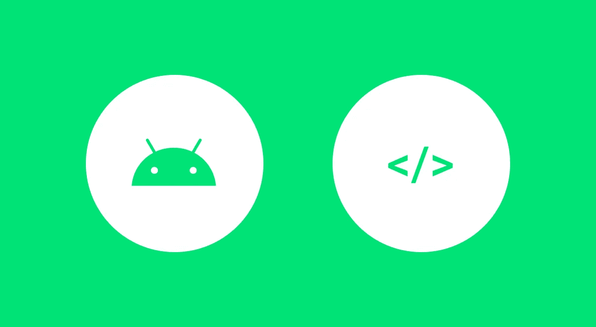
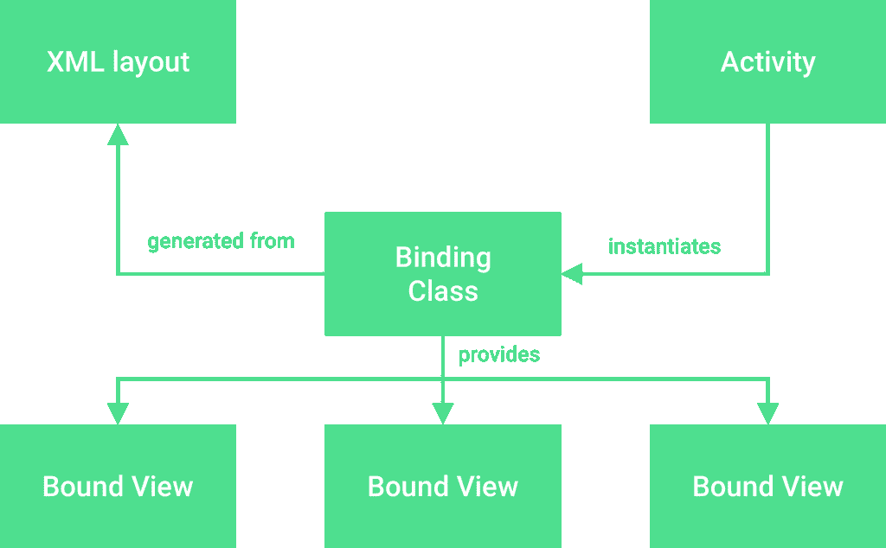

# 探索 Android 上的视图绑定

> 原文：<https://medium.com/google-developer-experts/exploring-view-binding-on-android-44e57ba11635?source=collection_archive---------1----------------------->



当谈到在 Android 应用程序中操作我们的用户界面时，我们可以采用几种方法。在这些情况下，我们需要获得这些视图的引用，以便以某种方式操纵它们。为此，我们要么使用 findViewById()，然后将视图转换为相应的类型。或者，如果我们使用 kotlin，那么我们将使用 kotlin android 扩展从我们的布局文件中执行对视图的综合访问。虽然这两种方法都非常好，但是它们也有一些潜在的缺陷:

*   使用 findViewById 时，视图类型的转换不是类型安全的。这意味着，虽然我们可能认为我们正在访问一个特定类型的视图，但我们从布局中引用的视图实际上可能是不同的类型。这种情况比您想象的更常见——可能是您在熟悉的文件中犯的一个简单错误，或者是对 XML 文件中错误视图组件的不正确引用，如果进行适当的强制转换，这将导致类强制转换异常。
*   无论我们是使用 findViewId 还是 kotlin synthetics 引用视图，这些方法都不是空安全的。这意味着，如果一个视图在一个布局中还不可用，或者我们使用了一个不正确的 ID，而这个 ID 在我们的活动/片段的布局中并不存在，那么就会抛出一个空指针异常，因为在访问时引用的视图不可用。
*   在某些情况下，我们可能会在一个屏幕上使用多个布局文件，这可能是为了处理不同的布局配置，如横向和纵向布局。在这些情况下，我们可能会显示不同的视图组件，这意味着在横向布局中可用的组件可能在纵向布局中不可用。例如，如果我们在纵向布局中访问一个视图，然后在视图不可用的情况下切换到横向布局并尝试访问它，我们将看到一个空指针异常，因为在编译时和运行时我们可能不知道所讨论的视图是可空的。

为了缓解上述问题，[视图绑定](https://developer.android.com/topic/libraries/view-binding)向我们介绍了绑定类，它将把 XML 布局中定义的视图绑定到一个生成的类，该类可以在我们的活动/片段中使用。使用这个生成的类，我们可以从绑定中访问可用的视图，这给了我们以下一些好处。**注意:**需要注意的是，视图绑定不同于数据绑定——我们不使用视图绑定来绑定布局和 XML 中的数据。

*   我们的绑定类中的绑定视图是用它们对应的类型生成的，这意味着通过这个类对视图的任何引用都是完全类型安全的。这消除了执行不正确转换的任何可能性，消除了遇到类转换异常的风险。
*   因为绑定类是基于附加的布局文件生成的，所以这个类中的所有视图都是空安全的，可以从我们的活动/片段中访问。这意味着我们不能从其他可能不可用的布局或视图中引用不正确的 id，这意味着我们可以访问视图而不用担心导致空指针异常。
*   视图绑定类能够将视图引用标记为@Nullable，以防视图在所有布局配置中不可用。这意味着我们可以在知道视图可能为空的情况下访问视图，允许我们在访问指定的视图时采取适当的预防措施。

综上所述，我们可以看到视图绑定为我们提供了一种方法，使得访问视图不容易出错——允许我们减少用户崩溃的机会。

当谈到视图绑定时，有几个概念结合在一起以提供这种功能。首先，我们将在我们的 XML 布局中进行同样的工作，主要的区别是我们需要在我们的活动中声明一个类，该类将创建创建



**注意:**你至少需要使用 Android Studio 3.6 Canary 11 才能使用视图绑定

要开始将视图绑定添加到我们的 android 应用程序中，我们需要将以下内容添加到相应的 build.gradle 文件中:

```
android {
   …
   viewBinding {
      enabled = true
   }
}
```

视图绑定是特定于模块的，所以您需要将它添加到您希望为其提供视图绑定的每个模块中。如果您要在每个模块中使用它，那么您可以将它放在项目 build.gradle 文件中，以便在整个项目中重用它。

当涉及到我们的 XML 文件时，我们实际上不需要做任何不同的事情就可以从生成的绑定类中访问视图——大部分更改将来自访问这些绑定的类内部。假设我们有一个名为 add_profile.xml 的活动布局文件，看起来有点像这样:

```
<?xml version=”1.0" encoding=”utf-8"?><androidx.constraintlayout.widget.ConstraintLayout
     xmlns:android=”[http://schemas.android.com/apk/res/android](http://schemas.android.com/apk/res/android)"
     xmlns:app=”[http://schemas.android.com/apk/res-auto](http://schemas.android.com/apk/res-auto)" 
     xmlns:tools=“[http://schemas.android.com/tools](http://schemas.android.com/tools)"
     android:layout_width=”match_parent”
     android:layout_height=”match_parent”><TextView
     android:id=”@+id/text_title”
     android:layout_width=”wrap_content”
     android:layout_height=”wrap_content”
     app:layout_constraintBottom_toTopOf=“@+id/button_authenticate”
     app:layout_constraintEnd_toEndOf=”parent”
     app:layout_constraintStart_toStartOf=”parent”
     app:layout_constraintTop_toTopOf=”parent” /><Button
     android:id=”@+id/button_add_profile”
     android:layout_width=”wrap_content”
     android:layout_height=”wrap_content”
     android:padding=”16dp”
     android:text=”[@string/label_authenticate](http://twitter.com/string/label_authenticate)”
     android:layout_marginBottom=”24dp”
     app:layout_constraintBottom_toBottomOf=”parent”
     app:layout_constraintEnd_toEndOf=”parent”
     app:layout_constraintStart_toStartOf=”parent”/></androidx.constraintlayout.widget.ConstraintLayout>
```

我们将希望从我们的活动中访问这些视图，以便我们可以为它们分配相应的内容。为此，我们需要为布局文件声明一个绑定类。当我们想要声明这个绑定类时，我们需要遵守由视图绑定 API 定义的命名约定—例如，对于 add_profile.xml，应该是这样的:

`private lateinit var binding: AddProfileBinding`

首先，API 将获取布局文件的名称，删除所有下划线，然后将由这些下划线分隔的单词区分大小写。最后，您可以在这里看到单词`Binding`已经被添加到我们的文件名的末尾——这是必需的，并且将被添加到生成的每个视图绑定类中。现在我们已经声明了这个绑定类，我们需要给它分配一个引用。为此，我们将在活动中使用 LayoutInflator 引用，并在绑定类上调用静态 inflate()方法。这样做将把我们的布局膨胀到我们的绑定类中，这样我们的绑定视图就可以被使用了。

```
[@Override](http://twitter.com/Override)
fun onCreate(savedInstanceState: Bundle) {
    super.onCreate(savedInstanceState)
    binding = AddProfileBinding.inflate(layoutInflater)
    setContentView(binding.root)
}
```

您还会注意到，我们将屏幕的内容视图设置为绑定中的这个根属性。创建的每个绑定都有一个根——这个根代表了我们在绑定类中展开的布局文件中的根组件。这是我们能够完成屏幕显示的便捷方式。

此时，我们有了绑定类，最后可以用它来设置我们的屏幕。查看上面的 add_profile.xml 文件，您可能会想起看到一个 textview 和 button。现在，我们将从绑定类中访问它们，并对它们进行配置以供显示:

```
binding.textTitle.text = getString(R.string.some_string)
binding.buttonAddProfile.setOnClickListener {
 // do something
}
```

您可以看到，我们正在访问布局文件中定义的组件(删除了下划线并应用了 camelcase)。不管 XML 中的视图如何，我们在这里访问它们的方式将适用于所有视图类型。这里您可以看到没有适当的转换—当我们访问 textTitle 字段时，它被引用为 TextView，因为这是绑定类分配给它的。这同样适用于 addProfileButton——在没有任何适当转换的情况下，我们避免了不正确的转换，也使代码更具可读性。除此之外，我们还获得了前面提到的视图绑定的优势。另一点是可空视图，允许我们适当地处理这些情况:

```
binding.buttonAddProfile?.setOnClickListener {
 // do something
}
```

在某些情况下，您可能不希望为某些组件创建绑定——可能您不希望这些组件可以通过相应的绑定类进行操作。在这里，您可以利用 XML 布局中的 viewBindingIgnore 属性将该视图排除在生成的绑定类之外。

```
<TextView
    …
    tools:viewBindingIgnore=”true” />
```

虽然这只是对 Android 上视图绑定的一个简单介绍，但我希望这足以展示这种视图操作方法在我们的应用程序中给我们带来的优势。无论是类型安全、空安全还是在我们的代码中使用更简洁的方法来查看引用，视图绑定提供了所有应用程序都可以利用的功能。

你试过视图绑定吗？或者对这里概述的内容有什么想法/问题？如果是这样，我很乐意收到你的来信！

[](https://twitter.com/hitherejoe) [## 乔·伯奇

### 乔伯奇的最新推文(@hitherejoe)。Android Lead @Buffer。GDE 为@Android、@actionsongoogle、@FlutterIO &…

twitter.com](https://twitter.com/hitherejoe)