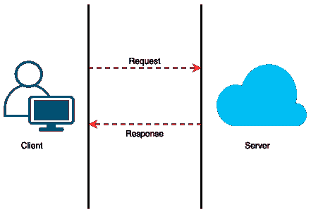
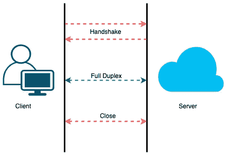

# 探索 WebSocket 及其在 Android 上的简单实现

> 原文：<https://medium.com/walmartglobaltech/exploring-websocket-and-its-brief-implementation-for-android-cc461597e1dc?source=collection_archive---------0----------------------->

Photo by [Kenny Leys](https://unsplash.com/@kennyleys?utm_source=medium&utm_medium=referral) on [Unsplash](https://unsplash.com?utm_source=medium&utm_medium=referral)

[Source](https://i.pinimg.com/originals/4c/1b/13/4c1b13dc576174d7f9cfa5f50f4fd20e.jpg)

想象一下，你想和你的朋友谈论一些紧急的事情，所以你写了一封信，寄出去，然后等待他们的回复几天，而不是打电话或在短信应用程序上给他们发短信。听起来像是老方法，对吗？我们在生活中面临着需要立即解决的问题，在目前，我们希望技术能够实现实时信息流来解决这些问题。传统的 HTTP 协议是基于请求-响应模型的，这在实时通信中可能是一个障碍并导致延迟。这就是实时通信协议的用处。在本文中，我们将探讨 WebSocket 作为一种实时通信协议及其在 Android 客户端的实现。你可以在这里找到更多实时通信协议[。](https://stackoverflow.com/questions/14499282/what-are-the-realtime-communication-protocols-available-for-the-web)

# **什么是 WebSocket？**

让我们从 WebSocket 的简史开始。关于 WebSocket 协议的讨论始于 2008 年，并于 2011 年由 **IETF** 标准化为 [RFC 6455](https://datatracker.ietf.org/doc/html/rfc6455) 协议。它在 HTML5 中第一次被称为**基于 TCP 的套接字 API** 。

*维基百科将 WebSocket 定义为:*

> WebSocket 是一种计算机通信协议，通过单一 TCP 连接提供全双工通信通道。

我可以用一个简化的类比向你解释这个定义。假设你再次想和你的朋友谈论一些紧急的事情，这一次你用一种明智的方式解决了这个问题，决定给他们打电话。你一拨他们的号码，就会有一个请求发送给他们，当他们接起电话时，你和他们之间就建立了联系。现在你和你的朋友可以想聊多久就聊多久。除非任何人关闭连接，在我们的例子中是挂断电话，否则连接保持建立。WebSocket 协议**是双向的、双工的，并且支持单一的 TCP 连接**。现在您已经理解了 WebSocket，您可能想要找出 WebSocket 客户端的列表。嗯，我可以简化一下。[这里的](https://helpx.adobe.com/coldfusion/developing-applications/coldfusion-and-html-5/using-coldfusion-websocket/browser-support-for-websocket.html)是支持 WebSockets 的浏览器列表。

# **HTTP vs WebSocket 协议**

HTTP 代表超文本传输协议。它是**应用层协议**，被**万维网**广泛用于数据通信。HTTP 服务器的端点表示为 http://或 https://。在客户机-服务器通信模型中，它充当一个**请求-响应**协议。HTTP 是一个**单向**协议。首先，成功建立客户端和服务器之间的连接，然后客户端向服务器发送请求消息。服务器接收消息，对其进行处理，并向客户端返回一个成功或错误代码。最后，连接被关闭。对于每个请求或者说 100 个请求，建立一个新连接或者 100 个新连接，然后关闭。

HTTP client-server connection

WebSocket 是一个双向协议。WebSocket 端点表示为 ws://或 wss://。通过 WebSocket 连接的客户机和服务器保持连接，除非它被任何一方终止(还记得电话呼叫的类比吗！！).一旦客户机和服务器之间成功建立连接，它们中的任何一方都可以相互独立地发送数据，除非任何一方关闭连接，否则这种情况会持续下去。现在，对于 100 条消息，一旦客户机和服务器之间建立了新的连接，它们就可以相互发送 100 条消息，然后连接关闭。

WebSocket client-server connection

# **WebSocket 用例:**

WebSocket 使得**事件驱动的**编程更加容易，它允许客户端或服务器发送消息。它可用于需要实时更新的应用程序，其中一些应用程序包括:

1.  聊天/聊天机器人应用。
2.  游戏应用。
3.  股票申请。
4.  多用户应用程序。
5.  体育应用。
6.  新闻应用。
7.  定位服务。

对于上面的一些用例，HTTP 可能会导致不必要的延迟和无法伸缩。

# Android 的 WebSocket 实现:

[ENIAC: First Electronic Programmable Computer](https://en.wikipedia.org/wiki/Computer#/media/File:ENIAC-changing_a_tube.jpg)

在过去的几十年里，电子机器发生革命性变化的方式仅仅是一件令人惊讶的事情。曾经有一个时代，需要很大的空间来存放计算机系统，而在今天，我们有可以轻松握在手中的 android 手机。在通过 Android 应用程序提供对各种网络应用程序的访问方面，Android 手机已经不亚于计算机。我已经讨论了足够多的 Android 手机带来的成功奇迹。本节将交流一些关于为 Android 客户端实现 WebSocket 的信息。如果你想学习和探索 Android 之外的东西，请使用这个[链接](https://developer.android.com/guide)。

[**OkHttp**](https://square.github.io/okhttp/) 是 Square 开发的开源库。开发 WebSocket android 客户端的选项之一是使用 [OkHttp3](https://square.github.io/okhttp/4.x/okhttp/okhttp3/-web-socket/) 。它有一个 **WebSocketListener** **类**，实现创建 WebSocket 连接、发送消息、处理错误和最终关闭 WebSocket 连接所需的所有方法。关于这个类及其方法的更多细节可以在[这里](https://square.github.io/okhttp/4.x/okhttp/okhttp3/-web-socket-listener/)找到。

# 外卖:

对速度和访问便利性的需求变得越来越重要。带有 WebSocket 的 Android 应用程序可能是实现这一点的好方法。HTTP 和 WebSocket 有不同的用例。作为开发人员，我们需要分析最适合我们用例的解决方案。在这篇文章的最后，我希望您尝试实现 WebSocket。起初这似乎很难，但正如纳尔逊·曼德拉所说的那样，“在完成之前，这似乎总是不可能的”。

# 参考资料:

 [## WebSocket -维基百科

### WebSocket 是一种计算机通信协议，通过单个 TCP 提供全双工通信通道

en.wikipedia.org](https://en.wikipedia.org/wiki/WebSocket)  [## web sockets——一个概念上的深度挖掘

### 深入探究 WebSocket 协议:它是什么，它是如何工作的，WebSockets 和 realtime 等等。

ably.com](https://ably.com/topic/websockets)  [## Java WebSocket 编程

### 选自 Java WebSocket 编程[图书]

learning.oreilly.com](https://learning.oreilly.com/library/view/java-websocket-programming/9780071827195/cover.html)  [## 实时通信技术

### 生活是实时发生的，信息交换也应该如此。事实证明，这说起来容易做起来难…

www.telerik.com](https://www.telerik.com/blogs/real-time-communication-techniques)