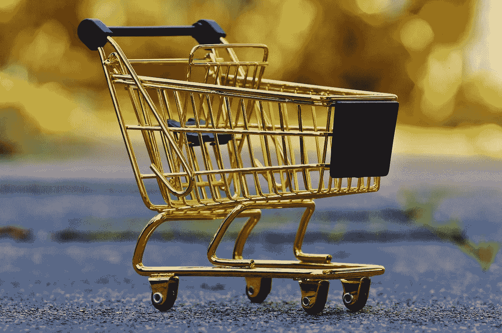

# 世博实验故事 2

> 原文：<https://medium.com/walmartglobaltech/expo-experiment-stories-2-88779a879771?source=collection_archive---------1----------------------->

这是围绕我们在沃尔玛实验室 Expo 上运行的有趣实验以及我们如何分析结果的一系列文章中的第二篇。*请注意，实际指标已经更改，并不代表实际现场性能，除非指明方向性。*

Image by [Alexas_Fotos](https://pixabay.com/users/Alexas_Fotos-686414/?utm_source=link-attribution&amp;utm_medium=referral&amp;utm_campaign=image&amp;utm_content=1080840) from [Pixabay](https://pixabay.com/?utm_source=link-attribution&amp;utm_medium=referral&amp;utm_campaign=image&amp;utm_content=1080840)

# 网上购物的客人推车

**By**[**Arpit Kumar**](https://www.linkedin.com/in/itsarpitkumar/)**，产品分析高级经理**

## **概述**

客人购物车遵循一个简单的前提:用户在构建购物篮时遇到的摩擦越小，他们下单的倾向就越高。换句话说，用户在订购漏斗中的位置越靠下，他们就越忠诚，也就越有可能忍受不得不登录或创建账户的摩擦，而不太可能放弃。

## **游客推车第一轮—A/B 测试**

在客人购物车功能向所有人推广之前，来到网上杂货店的用户在试图:a)向他们的购物车添加东西，b)改变他们的商店时都被迫登录。在上述假设的支持下，我们在 2018 年 Q1 奥运会上推出了第一批客人推车，将签到需求下移到结账处:

**控制:** 在他们尝试向购物车添加任何东西或更改商店之前，需要登录

**变体:** 自由执行以上两个动作，没有签到的摩擦，只有在用户发起结账时才签到

然而，第 1 轮游客推车未能达到预期效果。该特性性能不佳的主要原因是:

1.  用户启动结帐后的登录页面:用户不是被集中到结帐流程中，而是在登录后登录到主页或任何其他他们启动结帐的页面，这导致了高的掉线率。
2.  当用户同时登录购物车和访客购物车时，没有明确的信息表明商品会发生什么情况

想象一个场景，您正在向游客购物车中添加物品:

*嘉宾购物车商品(数量):香蕉(8)，苹果(4)，橙汁(2)嘉宾购物车商店:加利福尼亚州米尔皮塔斯*

但是如果你的登录购物车中已经有商品了呢？

*登录购物车商品(数量):香蕉(2)、鳄梨(4)、橙汁(2)登录购物车商店:加州桑尼维尔*

我们应该如何处理上述情况，有多少人面临这种情况？

## **游客推车第 2 轮—学习并重复**

从上述使用案例中，我们在 Q2 推出了第二轮游客推车，并对该车型进行了以下修改:

1.  当用户在客人购物车变体中启动结帐时，他将被引导到结帐流程(库存页面)，而不是在登录后登录到主页。
2.  如果用户已经有了访客购物车和登录购物车(上面解释的场景)，我们将合并这两个购物车，并将商店更改为登录商店(合并场景)。
3.  向用户显示清楚的信息，一旦他从访客购物车变体登录，他的购物车中的商品或商店可能已经改变。

*合并购物车- >添加客人购物车和已签名购物车中的商品，并将已签名商店保留为结账商店*

*合并购物车商品(数量):香蕉(10)，苹果(4)，橙汁(4)，鳄梨(4)
合并购物车商店:加州桑尼维尔*

桌面上的合格人群和移动上的合格人群面临合并的购物车场景。

在测试过程中，我们发现，与没有看到合并购物车消息的用户相比，遇到合并场景的用户在开始结账后下单的概率更低。

经过进一步分析，我们发现大多数面临合并购物车场景的用户在开始结账后会从购物车中删除商品或更换商店，这给下订单增加了很多麻烦，从而影响了我们的整体转化率指标。

这次迭代带来的一个积极的结果是，创建新账户的用户下的订单数量略有增加。

## **游客推车第 3 轮—学习、迭代、成功**

第二轮游客购物车证明了将游客购物车与已登录购物车合并可能不是最佳解决方案。因此，我们在第三季度引入了第三个变体，对来宾购物车进行了一次迭代。这个新变体不会合并访客购物车和登录购物车中的商品。我们称之为*扫描场景*。

如果用户在客人购物车和登录购物车中都有商品，客人购物车将覆盖登录购物车中的商品，用户的结账店将保持其在客人购物车中的结账店。

*客人购物车物品(数量):香蕉(8 个)、苹果(4 个)、橙汁(2 个)
客人购物车商店:加利福尼亚州米尔皮塔斯*

*登录购物车商品(数量):香蕉(2)、鳄梨(4)、橙汁(2)登录购物车商店:加州桑尼维尔*

**控制:** 在添加到购物车或更改商店之前，要求用户登录

**变型 1(合并):** *合并后的购物车商品(数量):香蕉(10)、苹果(4)、橙汁(4)、鳄梨(4)*
*合并后的购物车商店:加州森尼维尔*

**变型 2(扫货):** *扫货车商品(数量):香蕉(8)、苹果(4)、橙汁(2)
扫货车店铺:美国加州米尔皮塔斯*

经过 2 周的测试，变体 2 被证明是一个明显的赢家，并导致每位游客的购物车添加和结账次数都有所增加。

增加的结帐开始转换为放置 GMV 的电梯，为测试的合格人群购买项目并为每个访问者下订单。

## **继续迭代，继续测试**

尽管第三轮游客推车对我们的所有业务指标都产生了积极影响，但我们相信我们仍能改善用户体验。可能会有一部分人更喜欢合并体验而不是横扫体验。

为了解决他们的情况，我们假设了一个第 4 轮来宾购物车，旨在进一步改善用户体验，让登录的用户不必丢失他们之前登录的购物车中的物品。相反，即使发生访客购物车清扫场景，用户仍然可以访问登录的购物车商品。我们乐观地认为，这种迭代也将为我们的在线杂货用户带来更好的客户体验。

这种迭代测试允许我们应用从以前的测试中学到的知识，并对用户体验进行增量改进。如果没有 A/B 测试，我们将无法准确地测量变更的影响。