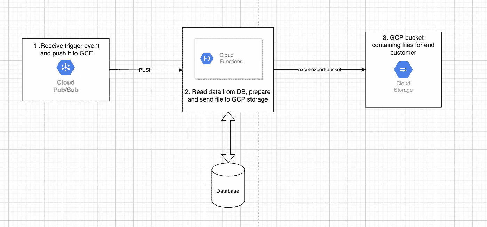

# 通过谷歌云功能和 Java 导出功能

> 原文：<https://medium.com/globant/export-functionality-via-google-cloud-functions-and-java-12a34df00458?source=collection_archive---------0----------------------->

> 使用的技术:Java，Gradle，GCP

Google Cloud Function (GCF)是一个无服务器架构，你可以在其中构建小型云服务。服务可以用不同的语言编写，包括 Python、Node.js、Java、PHP 和其他一些语言。GCF 旨在服务于一个目的，因此我们创建的服务不应该有很大的功能。我的感觉是，我们应该把大的功能分解成更简单、更小的服务，这些服务可以写在它们自己的 GCF 中。

GCF 由不同的事件触发。这些事件可以是 HTTP 触发器、基于事件的触发器或一些附加触发器。我将重点关注基于事件的触发器，尤其是发布/订阅触发器。

> **注意**:截至目前，HTTP 驱动函数的最大函数执行时间为 3600 秒(60 分钟)，事件驱动函数的最大函数执行时间为 540 秒(9 分钟)，之后函数超时。

其他触发器包括云存储触发器(基于事件)、云日志、云调度器、云任务和 gmail。

这里我举一个导出功能的例子，它是我们在 GCF 中作为服务创建的。这个 GCF 将通过订阅一个发送到 GCP 主题的事件来触发。

# 导出功能

我创建的导出功能包括将数据导出到 excel 文件中。然后，我将这个 excel 文件存储到云存储中。

然后，可以使用预先签名的 url 从存储中下载该 excel 文件。(我不打算在这里讨论这一部分)

我们在 GCF 中使用 Java，对于 excel 生成，我使用 Apache POI 依赖。

**设计**:



End to End Export Functionality

一旦事件从源发布到发布/订阅主题，比如说**导出主题**，它将被我们的订阅订阅，比如说**导出到 excel-sub** ，只要它通过所需的过滤器(如果有的话)。该订阅将是推送订阅。因此，在订阅事件时，它将触发我们的 GCF。

要部署 GCF，可以使用以下命令:

```
gcloud functions deploy export-function --entry-point functions.ExportToExcel --runtime java17 --trigger-http --memory 512MB --allow-unauthenticated
```

其中`ExportToExcel`是 GCF 的限定类名，就像 SpringBoot 应用程序类名一样。

我们 GCF 的端点可以从 GCF 部署日志中获取，也可以在部署后通过 google cloud 控制台上的这个命令获取:

```
gcloud functions describe export-function
```

这里，`export-function`是注册到 google cloud 的 GCF 的名称。

这是一个端点想要的:

```
https://GCP_REGION-PROJECT_ID.cloudfunctions.net/export-function
```

以下是我的 GCP 订阅使用 GCF 推送端点的示例:


GCP subscription — export-to-excel-sub

要在本地测试 GCF，可以使用下面的命令来生成端点:

```
gradle runFunction -Prun.functionTarget=functions.ExportToExcel
```

这为我们提供了一个本地端点，[*http://localhost:8080/*](http://localhost:8080/)，可以用来测试功能。

# 定义依赖关系

我一直在使用 Gradle，这就是我的构建中的依赖部分。

```
dependencies {
  // Necessary to have Functions Framework API.
  compileOnly 'com.google.cloud.functions:functions-framework-api:1.0.4'

  // Necessary to run function locally
  invoker 'com.google.cloud.functions.invoker:java-function-invoker:1.1.0'   // Needed to access Microsoft format files (Excel in our case)
  implementation 'org.apache.poi:poi-ooxml:5.2.2' // Only needed by the tests.
  testImplementation 'com.google.cloud.functions:functions-framework-api:1.0.4'
  testImplementation 'junit:junit:4.13.2'
  testImplementation 'com.google.truth:truth:1.1.3'
  testImplementation 'org.mockito:mockito-core:4.5.1'

}
```

要在本地运行 GCF，需要在 build.gradle 中注册该函数，如下所示:

```
// Register a "runFunction" task
tasks.register("runFunction", JavaExec) **{** main = 'com.google.cloud.functions.invoker.runner.Invoker'
    classpath(configurations.invoker)
    inputs.files(configurations.runtimeClasspath, sourceSets.main.output)
    args(
            '--target', project.findProperty('run.functionTarget') ?: 'functions.**ExportToExcel**',
            '--port', project.findProperty('run.port') ?: 8080
    )
    doFirst **{** args('--classpath', files(configurations.runtimeClasspath, sourceSets.main.output).asPath)
    **}
}**
```

# 创建源文件

在我们项目的源文件目录中，我创建了我们的源文件:ExportToExcel.java。

```
src/main/java/functions/ExportToExcel.java
```

这是初始文件的样子:

```
package functions;

import com.google.cloud.functions.HttpFunction;
import com.google.cloud.functions.HttpRequest;
import com.google.cloud.functions.HttpResponse;
import java.io.BufferedWriter;
import java.io.IOException;

public class ExportToExcel implements HttpFunction {
  // Cloud function to create an Excel containing some data and upload it onto cloud storage
  @Override
  public void service(HttpRequest request, HttpResponse response)
      throws IOException {
    BufferedWriter writer = response.getWriter();
    writer.write("Excel Exporter");
  }
}
```

每个 Http 触发的 GCF 实现 HttpFunction 接口，这是一个函数接口。因此，需要向服务方法提供一个动作。调用服务方法来处理 Http 请求。

从`request`读取数据，在我们的操作完成后，响应应该被写入`response`。

在读取输入请求时，我尝试连接到数据库并获取所需的数据。然后结果集被处理并存储在 excel 文件中。

apache poi 库的 **HSSFWorkbook** 或 **XSSFWorkbook** 或 **SXSSFWorkbook** 类可以用来创建 excel 文件。

XSSFWorkbook 比较慢，因为它将所有单元格都保存在内存中，直到 excel 被保存。因此，在某个时间点之后，它耗尽了堆内存。另一方面，SXSSFWorkbook 是 XSSFWorkbook 的流式扩展。

> **注意:** SXSSFWorkbook 实现了一种策略，允许在不耗尽内存的情况下写入非常大的文件，因为在任何时候都只有可配置的一部分行保留在内存中。

SXSSFWorkbook 在刷新之前要在内存中保留的行数，可以在其对象创建期间通过名为' **rowAccessWindowSize** '的整数参数来完成。

假设我有一个从数据库中提取的大型结果集，下面是我的示例代码，说明如何将数据导出到 excel 中:

**createExportFileForData***方法用于填充 Excel 文件并上传到 GCS bucket。它返回“EXPORTED”或“FAILED”字符串消息，以传递给 http 响应。它是我们功能的入口点，并将要导出的数据作为输入。*

```
public String **createExportFileForData**(ResultSet data) {
        //Default file status
        String file_status = "EXPORTED";
        //Default_Window_Size is 100
        try (SXSSFWorkbook workbook = new SXSSFWorkbook(SXSSFWorkbook.*DEFAULT_WINDOW_SIZE*)) {
            //Sheet name as parameter
            Sheet sheet = workbook.createSheet("SHEET_NAME");
            *createSheetHeader*(workbook, sheet);
            *createSheetBody*(workbook, sheet, data); //To upload the file to GCS, we need byte array, hence we write the workbook to ByteArrayOutputStream.
            ByteArrayOutputStream outputStream = new ByteArrayOutputStream();
            workbook.write(outputStream);
            uploadToBucket(outputStream.toByteArray(), "FileName.xlsx");
        }
        catch (Exception e) {
            *LOGGER*.info("Failed to generate and upload file to storage");
            *LOGGER*.warning("Error : " + e);
            file_status = "FAILED";
        }
        return file_status;
    }
```

**createSheetBody** *方法用于将数据写入 Excel 表中。它是从 createExportFileForData 方法调用的。*

```
private void **createSheetBody**(SXSSFWorkbook workbook, Sheet sheet, ResultSet data) throws SQLException {

        //Row 0 would be the header row
        int rowNumber = 1;
        while(data.next()) {
            Row dataRow = sheet.createRow(rowNumber++);
            *createSheetCell*(dataRow, 0, data.getObject("name", String.class));
            *createSheetCell*(dataRow, 1, data.getObject("address", String.class));
//            .
//            .
//            .
            *createSheetCell*(dataRow, *N*, data.getObject("phone_no", String.class));
        }
    }
```

**createSheetHeader** 方法为数据表创建标题行。它是从 createExportFileForData 方法调用的。

```
private void **createSheetHeader**(SXSSFWorkbook workbook, Sheet sheet) {
        //Creating an SXSSFRow for row number 0 (index starts from 0)
        Row headerRow = sheet.createRow(0);
        Font headerFont = workbook.createFont();
        headerFont.setBold(true);

        *fillHeaderData*(headerRow);
    }
```

**fillHeaderData** *方法用于填充标题行(列名)。它是从*createshetheader*方法中调用的。*

```
private void **fillHeaderData**(Row headerRow) {
        //Passing columnNo and value to the createSheetCell method
        *createSheetCell*(headerRow, 0, "Name");
        *createSheetCell*(headerRow, 1, "Address");
        //Similar n cells
//        .
//        .
//        .
        *createSheetCell*(headerRow, *N*, "Phone Number");
    }
```

**createSheetCell** *方法用于创建每一行的单元格。从*createshetheader*方法调用。*

```
private void **createSheetCell**(Row row, int columnNo, Object value) {
    Cell cell = row.createCell(columnNo);
    if (value == null) {
        cell.setCellValue("");
    } else if (value instanceof String) {
        cell.setCellValue((String) value);
    } else if (value instanceof Timestamp) {
        cell.setCellValue(((Timestamp) value).toLocalDateTime().format(DateTimeFormatter.*ISO_LOCAL_DATE_TIME*));
    } else if (value instanceof BigInteger) {
        cell.setCellValue(((BigInteger) value).doubleValue());
    } else if (value instanceof UUID) {
        cell.setCellValue(value.toString());
    } else if (value instanceof BigDecimal) {
        cell.setCellValue(String.*valueOf*(value));
    }
}
```

***uploadToBucket****方法是从 createExportFileForData 方法中调用的，用于将我的导出文件上传到 GCP 桶中。*

```
private void **uploadToBucket**(byte[] bytes, String fileName) {
        String bucketName = "BUCKET_NAME";
        //Using the google cloud lib classes to insert the byte data of the file into the blob and upload it to GCS bucket
        BlobId blobId = BlobId.*of*(bucketName, fileName);
        //BlobInfo will contain the info about in GCS
        BlobInfo blobInfo = BlobInfo.*newBuilder*(blobId).build();
        Storage storage = StorageOptions.*newBuilder*().setProjectId("PROJECT_NAME").build().getService();
        storage.create(blobInfo, bytes);
    }
```

# 结论

GCF，即服务功能(FaaS ),在执行功能以响应事件触发时非常有用。对于旨在实现单一行动/目的的小型请求，GCF 非常有用。

> 更多的语言和触发器正在被不断添加到谷歌云功能中。

## 参考

[*https://cloud.google.com/functions/docs/*](https://cloud.google.com/functions/docs/)

[*https://poi.apache.org/apidocs/4.0/org/apache/poi/xssf/*](https://poi.apache.org/apidocs/4.0/org/apache/poi/xssf/)

[*https://andriymz . github . io/misc/Apache-poi-slow-excel-generation/*](https://andriymz.github.io/misc/apache-poi-slow-excel-generation/)

# Google cloud function # Java # Apache poi # export data # excel file generate # FAAS # GCF