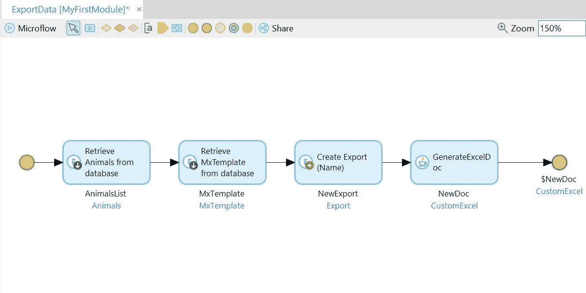

# 使用 Mendix REST 服务导出 CSV 数据

> 原文：<https://medium.com/mendix/exporting-csv-data-using-mendix-rest-service-18203e66bc88?source=collection_archive---------0----------------------->

我一直是一名 Mendix 开发人员，作为一名开发人员，我们每天都要面对新的挑战，并打破常规探索新的可能性。谢天谢地，门迪克斯在那里救援！

在我的一个开发任务中，我遇到了一个需要通过 REST 以 CSV 格式公开数据的情况。但是要通过 REST 服务返回一个对象，我们需要首先定义一个导出映射，到目前为止可以是 JSON 或 XML 映射。第三个选项是返回一个文件。

现在，这里的挑战是通过 REST 返回对象，但是需要 CSV 格式。为了解决这个问题，因为直接映射成 CSV 格式是不可能的，我想到了一个扭转！

通过这个博客，我想和大家分享我用 REST 服务实现 CSV 文件格式数据的经验，希望你能从中学习。为了在上下文中更好地解释实现的解决方案，我将使用一个关于动物的示例服务。

# 让我们开始吧:

# 1.准备需要公开的数据

我们将从 REST 服务返回一个文件文档，一个微流将被用作请求的源。

首先，在领域模型中，我们需要创建想要公开的对象的实体和一个通过 REST 调用返回的文件文档类型的实体。

Domain Model

# 2.通过扭转获得结果

我想到的一个想法是，如果有一个返回文件文档类型的选项，那么为什么不创建一个 csv 格式的文件文档，其中包含要公开的对象，并通过 REST 服务返回，最终达到输出 CSV 数据的目标。

Microflow depicting the twisted solution

为了实现这一点，使用从数据库返回的对象作为输入来生成 CSV 类型的文件文档。“GenerateExcelDoc”Java 操作接受 3 个输入 CSV 类型的导出模板(应该使用 Excel 导出模块创建),文件文档类型的对象——我们在步骤 1 中创建该模板以存储数据作为输出，以及需要公开的对象(我们从数据库中检索的对象)。

最后，微流的结束事件被设置为返回从 Java 操作生成的“CustomExcel”类型的“NewDoc”。

# 3.发布 REST 服务以公开数据

在 Mendix 中创建一个 REST 服务，并定义 GET 操作和用于获取数据的路径。

GET 操作可以根据您的需要进行定制。例如，如果每个用户都希望根据自己的需要从特定的开始和结束日期获取数据，那么可以在 GET 请求中向开始日期和结束日期传递一个参数。

在我的例子中，我使用了简单的 GET 操作，如下所示:

Publish REST Service

在这个 GET 操作中，我们需要定义这个数据的来源，这里我们将使用我们在步骤 2 中创建的微流作为输入源。因为我们公开了一个文件文档，所以 REST 调用的响应类型将是一个定制的 excel 文件(二进制)。

GET Operation

而且，就是这样！我们已经完成了对 REST 服务的调用，并以 CSV 格式查看结果。

# 4.使用 Postman 来可视化我们的结果

我使用 Postman 来获得结果，因为 REST 服务返回一个文件文档类型，我们无法通过 Swagger 来可视化它。

要向我们的 REST 服务发送请求，需要在 Postman 中进行一些小的设置，包括:

a)将请求类型设置为“GET ”,提及我们从 REST 服务中创建的 URL/路径

b)在标题下将内容类型设置为多部分/格式数据

Postman configurations

我们都准备好点击“发送”按钮，给我们的服务打电话。

# 结果

请求成功返回了 CSV 格式的数据，我们完成了！

CSV data received as result

# 结论

总结:我发现了另一种通过 REST 服务返回/公开 CSV 格式数据的方法。总而言之，这是一次很好的学习经历，学习如何“通过 REST 暴露 CSV”是一个值得思考的问题。

REST 服务支持更多类型的操作，需要特定的支持格式和映射。但是，通过探索这一点，有一件事是肯定的，有时可能没有直接/直接的方法来实现结果，但肯定有一个最终的解决方案，它会带来更多扭曲的思想和努力。目前，这是可行的，这让我成为一个快乐的开发者！