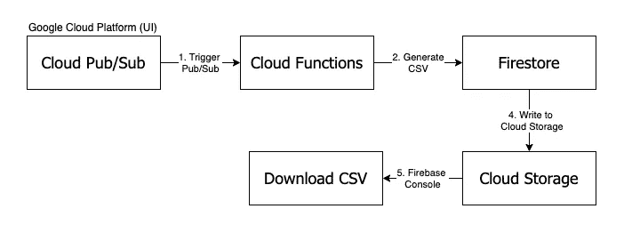
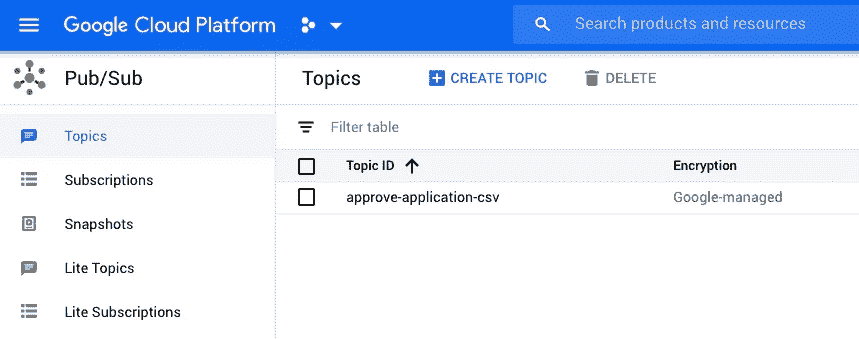
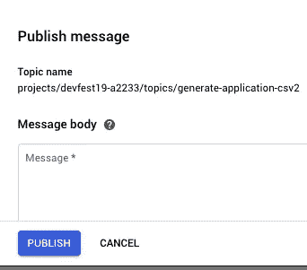
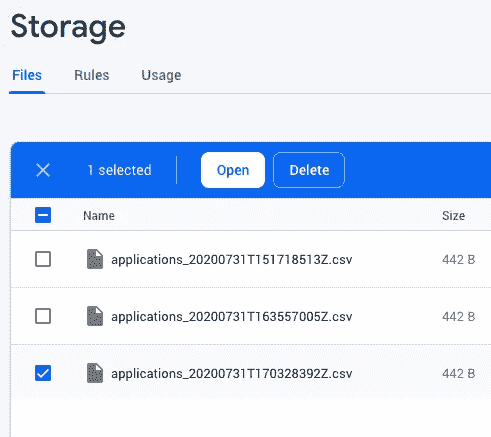
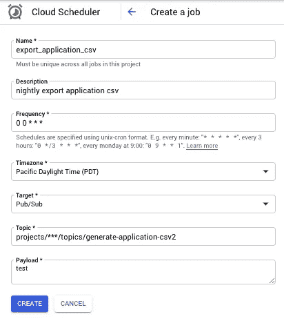

# 按需将 Firestore 收藏以 CSV 格式导出到云存储，这是一种简单的方法

> 原文：<https://medium.com/google-developer-experts/exporting-firestore-collection-csv-into-cloud-storage-on-demand-the-easy-way-4a4a08c664ab?source=collection_archive---------0----------------------->


假设我们有一个 Firestore 收藏，出于某种原因需要导出为 CSV，我们希望随时随地按需轻松下载 CSV。

通常，在编写代码下载 CSV 之前，我们需要开发一些先决条件，例如:

1.  开发下载 CSV 的用户界面。
2.  编写一个云函数 API 来返回 CSV，然后在您的首选客户机上调用它。
3.  处理 UI / API 云功能的认证和权限。

如果您不想构建 UI 或 API 来下载 CSV，本文将指导您如何尽快从 Firestore 收藏中获取 CSV 文件。**唯一要写的代码是生成 CSV，并将其转储到 Firebase 的云存储中。**如果你是一个图表爱好者，这里有一个图解说明了整个过程。我们将在本文中详细介绍每个过程。



# 步骤 1:编写发布/订阅触发器

让我们创建一个云函数，它将从 Firestore 中读取一个集合，然后将其转换为 CSV 格式并上传到云存储中:

上面的云函数是一个**发布/订阅触发器**函数，可以通过向主题`generate-application-csv`发送消息来执行。可以通过[谷歌云平台> Pub/Sub](https://console.cloud.google.com/cloudpubsub/topic/list) 触发。该功能使用 [Json2CSV](https://mircozeiss.com/json2csv/) 将 firestore 文档转换为 CSV，然后上传到您的云存储桶。

# 步骤 2:部署功能

通过 Firebase CLI 部署该功能。部署完成后，您就完成了所有需要的编码工作！

```
firebase deploy --only functions:generateApplicationCsv
```

# 第 3 步:触发发布/订阅功能以生成 CSV

要触发该功能，请前往[谷歌云平台>发布/订阅](https://console.cloud.google.com/cloudpubsub/topic/list)。(确保选择与 Firebase 项目相同的项目)。您应该看到主题`generate-application-csv`是我们在云函数中定义的内容:



单击主题，然后选择发布消息，并输入任何消息。我们的云函数中不使用这个消息字段。点击发布，触发云功能。



# 🎉最后一步:通过 Firebase 控制台从云存储中下载 CSV 文件

转到存储> Firebase 控制台，你应该看到你的文件在那里！要下载，请检查 CSV 并单击打开。



# 🎁好处:将 CSV 创建为批处理作业

通过这种方法，您可以将此功能扩展到**创建批处理作业**，将 Firestore 收藏转换为 CSV。当 CSV 生成时，您可以使用 [**计划功能**](https://firebase.google.com/docs/functions/schedule-functions) 创建固定计划，或者使用发布/订阅，您可以使用 [**云调度器**](https://console.cloud.google.com/cloudscheduler) **灵活地计划/暂停/停止您的批处理作业。**

Scheduled Function



Schedule CSV generation nightly

# 底线/一线希望

有了这个设置，您就不必担心构建 ui/API 时可能出现的安全问题，*当然，除了保护您的云存储免受未经授权的读取之外！*这是因为设置存在于 Google 云平台和 Firebase 环境中，您可以方便地使用它们的工具。

和往常一样，这只是从 Firestore 生成 CSV 的众多方法之一，应该有所保留。请尝试一下，看看它是否符合您从 Firestore 快速获得 CSV 的需求。

**此外，提醒一下，从 Firestore 中提取大量收藏也会导致额外的阅读量。**

如果你觉得这有用，请给这篇文章一些急需的👏👏👏