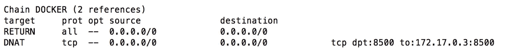
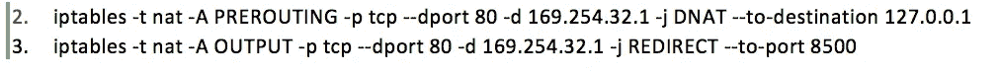
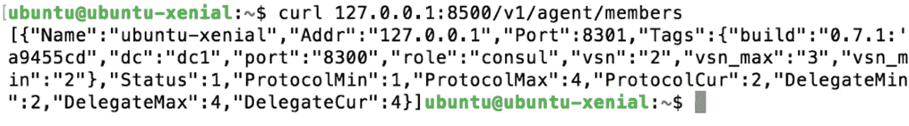
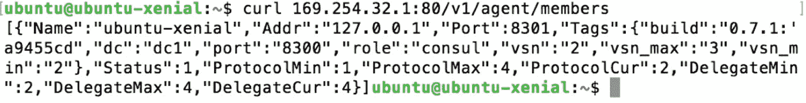
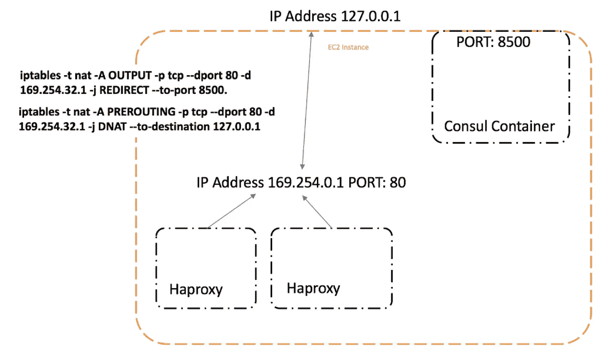
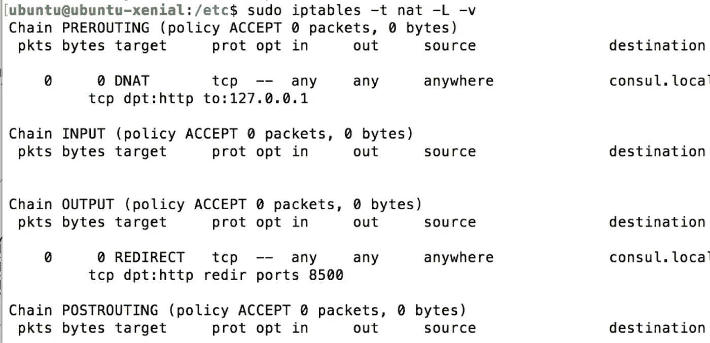

# 向桥接网络公开容器服务

> 原文：<https://medium.com/capital-one-tech/exposing-container-services-to-a-bridge-network-aa5fe17a9332?source=collection_archive---------5----------------------->

## 在未链接的容器之间共享信息

容器被设计为独立运行，并与共享操作系统的其余部分隔离，但是在某些情况下，信息需要在容器之间共享。在分布式环境中使用容器时尤其如此，比如分布式缓存或分布式 k/v 存储。一种常见的方法是在主机模式下运行所有容器，这将容器置于主机网络中。这种方法的一个缺点是，由于网络不是集装箱化的，并且可以直接访问集装箱的每个端口，所以集装箱现在不是真正隔离的。此外，容器将无法在主机模式下公开相同的端口，因此默认情况下，拥有多个公开端口 80 的容器将不起作用。尽管为了隔离容器并避免使用端口映射，以桥接模式运行容器可能更好，但如果容器必须在彼此之间共享信息，这确实会增加复杂性。然而，这不应该成为在主机模式下运行容器的理由，因为我们将展示一个简单的解决方案来在桥模式下共享容器上的服务。

我们在本演练中介绍的是一种替代方法，可以与运行在同一虚拟机上的其他容器共享容器化的服务，而任何容器都不必共享主机网络的命名空间。我们将通过几个简单的步骤演示如何使用 docker 的端口转发标志、iptables 规则和 extrahosts 在桥接网络上的容器之间公开服务信息。如果您不熟悉 iptables，请随意查看附加资源部分，因为 iptables 是我们解决方案的重要组成部分。如果您已经对 iptables 有了很好的理解，可以跳过这一节，直接进入我们的工作示例，在这个示例中，我们展示了在桥接网络上，运行 Consul 的容器如何通过运行带有 consul-template 的 HAProxy 的容器来访问。

# 使用 Consul 和 iptables 的示例

您的容器主机是否包含大量运行共享服务的 Docker 容器？这些容器需要相互之间以及其他人的容器可以访问。为了在不链接或不使用主机的网络名称空间的情况下实现这一点，我们设置了 iptables 规则来转发往来于一个众所周知的链路本地地址的流量。让我们看一个简单的例子，运行领事的容器如何被运行带有领事模板的 HAProxy 的容器访问。

[Consul](https://www.consul.io/) 是一个用于服务发现的分布式高可用工具，而 [HAProxy](http://www.haproxy.org/) 是一个高可用负载平衡器，它利用 consul-template 在 Consul 发现新服务时动态创建其配置文件。正如你所看到的，为了让这个设置工作，在 HAProxy 容器中运行的 consul-template 需要监听来自 consul 的新事件。虽然我们可以简单地在主机模式下运行两个容器，而 consul-template 可以在端口 8500 上监听，但是我们将描述一个两个容器都在桥模式下运行的替代方案。

首先，在端口 8500 上运行带有端口转发的 Consul 容器:

1.  码头运行–p 8500:8500 领事

这将在网桥网络上运行 Consul 容器，同时允许其端口 8500 在主机网络上可见。Docker 实际上是在幕后使用 iptables 来实现这一点的，它创建了一个规则，将数据包从主机网络的端口 8500 转发到容器的端口。如果在您的主机上运行下面的命令，您可以看到这一点。

您将看到一个名为 Docker 的链，它具有上面提到的规则。

接下来，在 CIDR 块 169.254.0.0/16 中选择一个链路本地地址，该地址会将流量转发到 localhost:8500，这是 Consul 正在侦听的地址。我们使用链路本地地址，因为这些地址是本地保留的，不能从主机网络外部直接路由到。在本例中，我们使用地址 169.254.32.1。

然后在 iptables 中定义以下两条规则:

第一条规则将在 169.242.32.1:80 收到的 TCP 请求路由到主机网络。然而，由于 Consul 监听端口 8500，我们在输出链中创建第二个规则，从端口 80 重定向到端口 8500。

下面你可以看到***GET/v1/agent/members***现在在 localhost:8500 和链接本地地址 169.254.32.1:80 上都能工作了:

这种设置的一个问题是链路本地地址不太可读。为了解决这个问题，在每个应用程序容器上的 ***/etc/hosts*** 中添加一个条目，将地址 consul.local 指向 196.254.32.1。您可以手动完成此操作，或者在 docker run 命令中添加–add-host 标志。

现在，容器中的应用程序可以通过地址 consul.local 访问 Consul。

下面的截图显示了我们设置的 iptables 规则

**ECS Cluster Configuration**

**iptable rules we created along with the extrahost mapping**

# **结论**

总之，在本演练中，我演示了如何在桥接网络上运行 Consul，然后使用 Docker 的端口转发标志来创建 iptable 规则，以使其端口在主机网络上可见。接下来，我选择了一个链接本地地址，并创建了两个 iptable 规则，将在该地址收到的 TCP 请求路由到特定端口的主机。最后，我展示了如何使用 extrahosts，这样就可以使用可读性更好的地址，比如 consul.local，而不是实际的链接本地地址。现在，您可以从 HAProxy 容器向 consul.local 发送请求，并与 consul 容器连接，而不需要任何一个容器位于主机网络上。

我希望本演练对您有所帮助，并且您现在已经知道了主机和桥模式之间的区别，以及如何在每种模式下的服务之间共享信息。

# **附加信息:**

http://www.iptables.info/en/iptables-contents.html

【https://wiki.archlinux.org/index.php/Iptables 

*声明:这些观点仅代表作者个人观点。除非本帖中另有说明，否则 Capital One 不属于所提及的任何公司，也不被其认可。使用或展示的所有商标和其他知识产权均为其各自所有者所有。本文为 2017 首都一。*