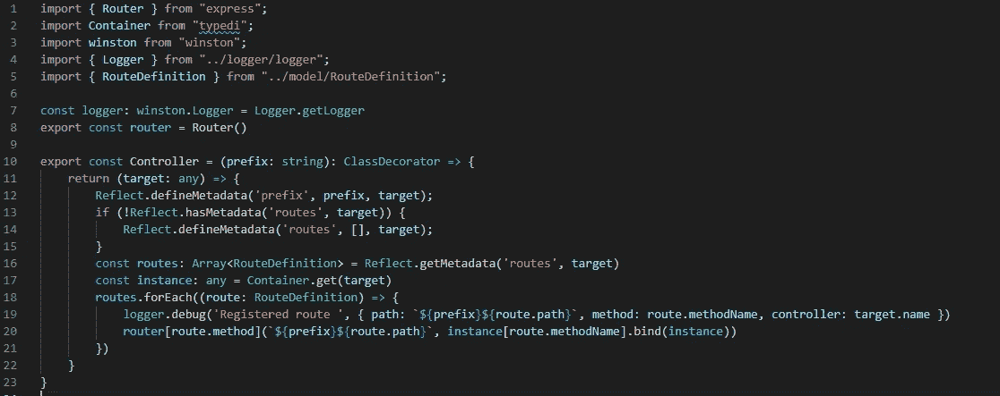

# 带有装饰器、依赖注入和反射元数据的 ExpressJS 路由

> 原文：<https://medium.com/globant/expressjs-routing-with-decorators-dependency-injection-and-reflect-metadata-945f92e15a06?source=collection_archive---------0----------------------->


> **TypeScript** 是一种强类型编程语言，它构建在 JavaScript 之上，在任何规模下都能为您提供更好的工具——[TypeScript](https://www.typescriptlang.org/)

本文的目标是帮助使用 Node.js，TS 构建开箱即用的解决方案，在传统的路由注册上使用 decorators 定义路由。

这个故事的目标是展示如何在 express 服务器上定义、注册和使用路由装饰器。

## **背景**

[TypeScript](https://www.typescriptlang.org/docs/) 是 JavaScript 的类型化超集。当谈到用 JavaScript 进行面向对象编程时，TypeScript 确实很出色。它支持 OOPS 支柱，如类、继承、多态和封装。

**依赖注入**是将依赖传递给其他对象或框架(依赖注入器)。

随着 TS 和 ES6 的引入，在某些方面需要一些额外的特性来支持注释和修改类和类成员。油漆工为我们工作。

> 装饰器是 JavaScript 的第二阶段提案，是 TypeScript 的一个实验性特性。— [打字稿](https://www.typescriptlang.org/)

***先决条件***

1.  确保您已经安装了 Node.js
2.  JavaScript、TypeScript、Node.js、ExpressJS 和 decorators 的基础知识
3.  代码编辑器(VSCode)

## **什么是依赖注入？**


Dependency Injection

在深入研究依赖注入之前，我们需要了解第一个 **IoC** **容器**。

**控制反转**是反转整个程序流程，所以程序管理所有的程序依赖。这个容器负责构造每个对象。当一个类需要一个对象来实例化时，IoC 容器提供所需的依赖。

在依赖注入中，我们需要理解四种不同类型的角色:

*   服务:服务是我们公开的东西。这些类被 IoC 容器实例化和使用。
*   客户端:通过 IoC 容器使用这些服务。
*   接口:确保客户端和服务保持一致。
*   注入器:提供实例化服务。

例子:这个例子演示了使用 typescript 的依赖注入。


Example of Dependency Injection and IoC Container

> 为了使服务可注入，我们使用了来自[的**@服务**装饰器**TypeDI**](https://www.npmjs.com/package/typedi)

## [简介**反映-元数据**简介](https://www.npmjs.com/package/reflect-metadata)

> [向 ECMAScript 添加元数据的提案](https://rbuckton.github.io/reflect-metadata/#introduction)

我们将使用 reflect-metadata 包进行元数据反射，以定义与每个控制器相关联的访问路由。TypeScript 已经扩展了 [reflect-metadata](https://www.npmjs.com/package/reflect-metadata) ，这允许我们与[emitedecoratormetadata](https://www.typescriptlang.org/tsconfig/emitDecoratorMetadata.html)同时获取函数、参数和返回类型。

> **注意:**只有当类上有装饰器时，才会为服务或组件发出元数据。哪个装修工不重要。任何装饰器都会导致元数据被发出。

让我们看看如何让它与 TypeScript 一起工作。我们需要在 tsconfig.json 中启用它


tsconfig.json changes to support relection

```
*// define metadata on an object or property* Reflect.defineMetadata(metadataKey, metadataValue, target); Reflect.defineMetadata(metadataKey, metadataValue, target, propertyKey);*// check for presence of a metadata key on the prototype chain of an object or property* 
**let** result = Reflect.hasMetadata(metadataKey, target); 
**let** result = Reflect.hasMetadata(metadataKey, target, propertyKey);*// get metadata value of a metadata key on the prototype chain of an object or property* 
**let** result = Reflect.getMetadata(metadataKey, target); 
**let** result = Reflect.getMetadata(metadataKey, target, propertyKey);
```

# **装修工**

在开始装修之前，请记住一些事情，

> decorator 是在声明类时调用的，所以在使用 decorator 时，我们只有类声明而没有实例化。

装饰器是一种设计模式，它允许动态地将行为添加到一个单独的对象中，而不会影响同一个类中其他对象的行为。它只是一个函数的包装器，用于增强功能而不修改底层函数。

装饰器已经在 Python、C#等语言中使用，现在也在 JS 和 TS 中使用。

示例:这实现了日志装饰器。

```
function Log() {
  return function (target: any, propertyKey: string, descriptor: PropertyDescriptor) {
    console.log("Log called")
  };
}class Logger {
 [@Log](http://twitter.com/Log)
 info(){}
}
```

参见[此处](https://www.typescriptlang.org/docs/handbook/decorators.html#decorator-evaluation)了解装饰工评估订单的详细信息。

# 用装饰者创建路线

**路线定义**

这是一个定义我们路线形状的界面


RouteDefinition interface

## **路线装饰者**

每个 HTTP 方法都有一个装饰器会很方便，为了简单起见，我们在这里只看到`@Get`。重要的是设置目标`target.constructor`而不仅仅是`target`来正确处理元数据。

1.  这里，目标是拥有其参数已被修饰的方法的对象。在本例中，它是 UserController。
2.  propertyKey:它是签名已被修饰的方法名。下例中的 propertyKey 是来自 UserController 的`get`。

> 我们正在使用来自 TypeDI 的`@Service`装饰器，使服务可注入控制器

下面的例子演示了 Get decorator 的定义和一个使用 Get 修饰的路由。


@Get decorator

执行`/api/user`应该会返回所有用户的列表。但是在这完全起作用之前，我们需要注册路由。

按照下一节关于**控制器装饰器**的内容查看路由注册。

# **创建控制器装饰器**

我们的控制器将用这个装饰器来装饰，并包含这个控制器的前缀。

下面的例子演示了控制器装饰器的定义，其中我们使用 reflect-metadata 来定义前缀和带有控制器元数据的路由。除了我们的控制器没有修饰过的方法之外，路由几乎不应该是未定义的。


Controller Decorator

## 使用控制器和路由装饰器定义路由

**步骤:**

1.  定义快速路由器
2.  访问前缀和反射路由。
3.  对于路由中的每个路由定义，向快速路由器注册路径和处理程序。
4.  导出路由器以向 index/app.ts 中的应用程序注册



Controller Decorator

在上面的例子中，我们可以看到以下内容

*   控制器装饰定义
*   反射以保存前缀的元数据，如果不存在，则初始化路由(路由几乎不应该是未定义的，除非我们的控制器没有修饰的方法)
*   IoC 容器用于获取**控制器**实例
*   快速路由器的路由注册


Use router

> **注意:**使用 index.js 中控制器装饰器导出的路由器作为`app.use(router)`

## **结论**

正如您所看到的，通过 TypeScript Decorators 管理快速路由非常容易。reflect-metadata 是 TypeScript 的扩展，有助于维护与装饰器相关的元数据。因此，这个元数据用于存储路由，因为在声明类时会调用 decorator。

完整的代码可以在 [CodeSandbox](https://codesandbox.io/s/expressjs-routing-with-decoratos-1l723) 中找到。