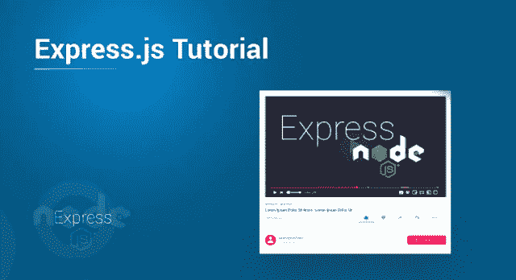

# Express.js 基础

> 原文：<https://medium.com/edureka/expressjs-tutorial-795ad6e65ab3?source=collection_archive---------0----------------------->

Express.js 是一个快速的轻量级框架，主要用于 web 应用程序开发，全世界的 Node.js 开发人员都非常喜欢这个框架。Express.js 提供了 web 应用程序的所有功能，而没有掩盖 Node.js 的功能。通过这篇文章，我将让您对 Express.js 的基础有一个完整的了解，这将帮助您开始使用它。以下是主题…