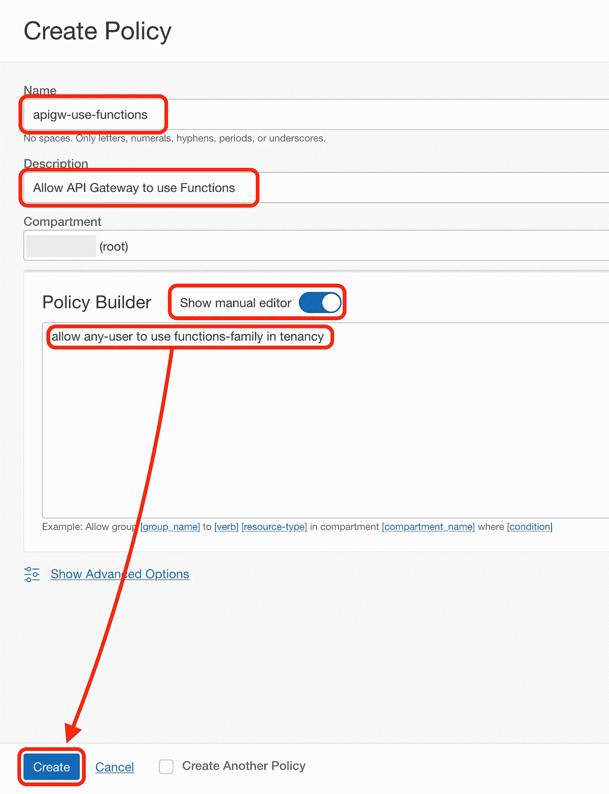
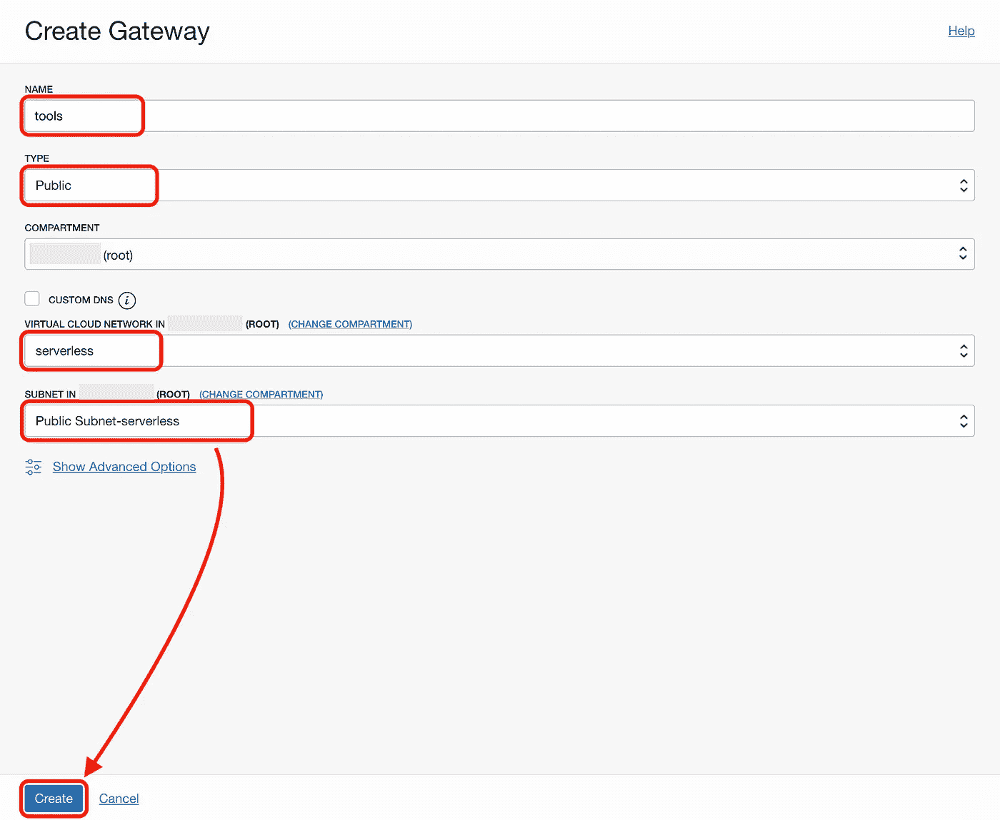

# 使用无服务器功能和 API 网关扩展您的 API

> 原文：<https://medium.com/oracledevs/extend-your-api-with-serverless-functions-and-api-gateways-2a383561ef5c?source=collection_archive---------0----------------------->

从这里开始，探索如何用 **API 网关**和**无服务器功能**扩展您的 API。优势在于您将使用最新的库和技术，而不必担心配置和扩展来满足您的工作负载需求。

> 无服务器技术将继续存在。
> 
> 无服务器是云的未来。


在我的上一篇文章中了解更多关于 API 网关以及为什么需要一个 API 网关的信息:

[](https://vmleon.medium.com/what-is-api-gateway-and-why-you-need-one-9fe8087f5ece) [## 什么是 API gateway，为什么需要它？

### 我们可以说现在 API 无处不在。很可能你现在开发的任何应用程序都会消耗其他应用程序的数据，不管是你自己的还是来自…

vmleon.medium.com](https://vmleon.medium.com/what-is-api-gateway-and-why-you-need-one-9fe8087f5ece) 

我们将构建一个无服务器函数，它接受文本文件并用 gzip 文件响应。我们将通过一个安全的 API 网关端点来访问您的函数。


我们将使用甲骨文云基础设施(OCI)，特别是甲骨文功能和 OCI API 网关。它们都在 Oracle 云的免费层中。

**您有甲骨文云账户吗？**如果没有，您可以在这里创建一个:

> *请记住，除非您明确要求按需付费升级，否则 Oracle Cloud 不会向您收取任何费用。没有惊喜。*
> 
> [*甲骨文云免费注册*](http://bit.ly/34TzwGf)

# 网络与安全

让我们从基础开始:网络和安全。

## 政策

我们需要创建一个**策略**来使 API Gateway 使用 Oracle 函数。


点击 ***创建策略*** 。设定一个 ***名称*** ，和 ***描述*** 。勾选 ***显示手动编辑器*** ，编写如下策略，点击 ***创建*** :

```
allow any-user to use functions-family in tenancy
```



## 建立工作关系网

我们需要创建一个**虚拟云网络(VCN)** 来代表 API Gateway 将要驻留的网络结构。


Menu for Virtual Cloud Network

点击 ***启动 VCN 向导*** 并创建一个 ***具有互联网连接*** 。选择一个 ***VCN 名字*** (我的名字是`serverless`)，其他都保持默认。点击 ***下一个*** 和 ***创建*** 。

创建完成后，您将拥有两个子网(一个公共子网和一个私有子网)。

单击您的公共子网:


点击 ***无服务器默认安全列表*** 。然后点击 ***添加入口规则*** 。按如下方式设置值:

来源:`0.0.0.0/0`

目的地端口范围:`443`

描述:`Allow ingress traffic on TCP/443`


**API 网关将监听端口 443** 。我们刚刚创建的入口规则将允许来自互联网的流量进入公共子网。

# 无服务器功能

假设你有几个无服务器的功能，它们分布在几个有界的上下文或应用中。这就是为什么您需要在 Oracle Functions 中创建一个**应用程序**来聚合类似的无服务器函数。就这么办吧。


点击 ***创建应用*** ，设置**名称**、 **VCN** 和**私有子网**。


我们将点击侧面菜单上的**入门**，并使用**云外壳**指南来配置和部署我们的无服务器功能。到达第七步时停止，并确保将第四步中的`[OCIR-REPO]`更改为您喜欢的注册库名称，例如`tools`。


此时，我们将创建无服务器函数来接收传入的文本文件，并用文本文件 gzipped 进行响应。最后，我们将部署该功能。

首先在**云外壳**中构建函数:

```
fn init --runtime python zipper
```

确保您更改了新功能`zipper`的目录:

```
cd zipper
```

用以下代码编辑`func.py`文件:

```
import io
import logging
import gzipfrom fdk import responsedef handler(ctx, data: io.BytesIO = None):
    logging.getLogger().info("gzipping body")
    gz_data = gzip.compress(data.getvalue())
    logging.getLogger().info("sending response")
    return response.Response(
        ctx,
        response_data=gz_data,
        headers={"Content-Type": "application/gzip"}
    )
```

使用以下命令部署函数:

```
fn deploy --app tools
```

# API 网关

是时候创建一个 OCI API 网关了。


点击 ***创建网关*** 并设置以下值:

名称:`tools`

类型:`Public`

虚拟云网络:`serverless`

子网:`Public Subnet-serverless`



当 ***网关处于活动状态时，*** 是时候创建部署了。

部署只是一个 API 运行时的表示，所有路由到后端 API。

在新的`tools`网关的侧面菜单上单击 Deployments 点击 ***创建部署*** 。

选择`From Scratch`并设置一个名称(例如`tools`)。

确保路径前缀为`/tools/v1`。


点击 ***下一个***；然后，我们将创建一个 ***路线*** 指向我们的 ***拉链*** 无服务器功能。

路径:`/zipper`

方法:`POST`

类型:`Oracle Functions`

申请:`tools`

功能名称:`zipper`


# 调用您的无服务器功能

我们将使用`cURL`向您的 API 网关发出一个 HTTPS 请求，该请求将被重定向到您的无服务器函数。

从 API 网关部署的详细信息页面复制 API 网关端点的 URL:


在**云外壳**中，我们将使用以下命令创建一个内容为`Hello`的`file.txt`:

```
echo "Hello" > file.txt
```

然后，我们将执行请求(用您的 ***API 网关端点*** 的值替换`<APIGW_ENDPOINT>`):

```
curl -XPOST -H "Content-Type: text/plain" -d @file.txt <APIGW_ENDPOINT>[/tools/v1/zipper](https://gjvduecrsv5hbdqemmojzl2itq.apigateway.uk-london-1.oci.customer-oci.com/tools/zipper) > response.txt.gz
```

结果将是一个`response.txt.gz`，我们可以用下面的命令解压它:

```
gzip -d response.txt.gz
```

然后我们可以检查新文件的内容，它应该说`Hello`:

```
cat response.txt
```

恭喜你！请随意将现有请求重定向到您的现有 API，并使用 Oracle 功能扩展您的 API，以忘记低级 IaaS 供应。按需扩展和缩减，并且只为您使用的部分付费。

# 想了解更多？

专家和 Oracle 云倡导者会定期提供大约 1 小时的免费培训。这些是教师指导的培训。您可以跟随我们的团队现场解决您的问题。

> *加入我对* [*甲骨文云基础设施不和谐频道*](https://bit.ly/3upz9Rh) *的任何疑问。*

敬请关注更多关于 Oracle 云的精彩文章。

> 我是维克多·马丁，一名软件开发人员。我部署在 Oracle 云基础架构上。
> 
> *随时在*[*LinkedIn*](https://bit.ly/3bRk83W)*上与我联系。*
> 
> 我也对潜水和太空工程感兴趣。乐意帮忙，一切都比火箭科学容易！