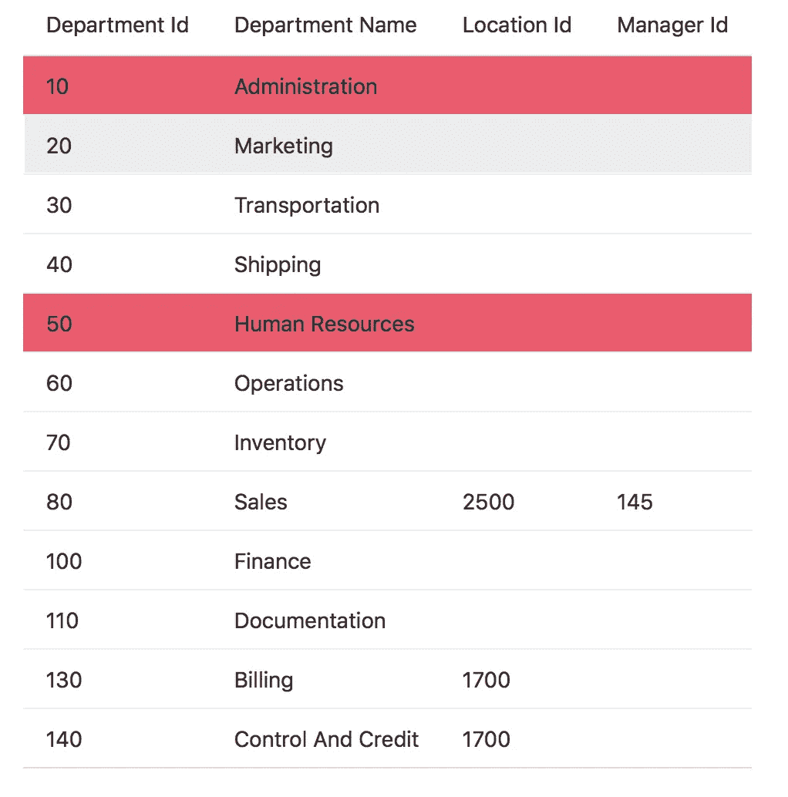

# 扩展 JSON 响应以在 Oracle JET 中包含动态(瞬时)属性

> 原文：<https://medium.com/oracledevs/extending-json-responses-to-include-dynamic-transient-attributes-in-oracle-jet-67366d56c6a3?source=collection_archive---------0----------------------->

当您需要在表中包含一个不是从 API 返回的列时，会发生什么呢？也许该列将由现有数据在运行时处理的一些信息组成，比如串联(名和姓)，或者它可能是条件逻辑。

简单的连接可以包含在视图的表模板中，但是可能会出现业务逻辑太复杂而无法计算这个额外的列的情况，或者数据可能来自另一个服务。在这些场景中，最好给模型添加一个额外的属性——动态属性。在 ADF 中，我们过去称这些为瞬态属性。

我在一个项目中遇到了这个用例，它调用一个服务来对表中的一行或多行执行操作。如果该服务由于某种原因未能处理这些行，我希望向用户直观地突出显示失败的行。



在我下面描述的例子中，用例被剥离回来，我只是简单地扩展我的模型以包括一些条件逻辑。如果条件逻辑为真，那么我们通过在 JSON 响应中添加一个额外的属性，并用这个额外的列来切换行的颜色，从而用红色突出显示该行。

虽然这是一个简单的例子，但是对于更复杂的场景来说，这是一个很好的起点。

# 模型数据解析示例

从 cookbook*中，通过解析响应来扩展您的模型:

**viewModel**

```
self.parseDept = function (response) {
  if (response['DepartmentId'] == 10 || response['DepartmentId'] == 50) {
     response['failed'] = true;
  }  else {
     response['failed'] = false;
  }
  return response;
};self.Department = oj.Model.extend({
    urlRoot: self.serviceURL,
    parse: self.parseDept,
    idAttribute: 'DepartmentId'
});
```

**查看**

```
<oj-table id="table" aria-label="Departments Table" 
          data='[[datasource]]'
          selection-mode='{"row": "multiple", "column": "multiple"}'
          columns='[{"headerText": "Department Id",
                     "field": "DepartmentId",
                     "id": "column1"},
                    {"headerText": "Department Name",
                     "field": "DepartmentName",
                     "id": "column2"},
                    {"headerText": "Location Id",
                     "field": "LocationId",
                     "id": "column3"},
                    {"headerText": "Manager Id",
                     "field": "ManagerId",
                     "id": "column4"}]'
    row-renderer='[[oj.KnockoutTemplateUtils.getRenderer("row_tmpl", true)]]'>
</oj-table><script type="text/html" id="row_tmpl">
<tr data-bind="css: { highlight: failed == true }">
  <td data-bind="text: DepartmentId"></td>
  <td data-bind="text: DepartmentName"></td>
  <td data-bind="text: LocationId"></td>
  <td data-bind="text: ManagerId"></td>
</tr></script>
```

**css**

```
.highlight {
    background-color:#ea5b6e;
}
```

在 [Oracle JET](http://oraclejet.org) 中扩展您的模型比在 [ADFBC](https://docs.oracle.com/cd/E15051_01/web.1111/b31974/bcintro.htm#ADFFD123) 中使用瞬态属性提供了更多的灵活性。您不再局限于 groovy 代码，因此可以包含更高级的业务逻辑。

— DC

本文使用了以下食谱示例:

*   [oracle.com/webfolder/technetwork/jet/jetCookbook.html?component = table&demo = customRowTable](http://www.oracle.com/webfolder/technetwork/jet/jetCookbook.html?component=table&demo=customRowTable)
*   [oracle.com/webfolder/technetwork/jet/jetCookbook.html?component = table&demo = ojCollectionTable](http://www.oracle.com/webfolder/technetwork/jet/jetCookbook.html?component=table&demo=ojCollectionTable)