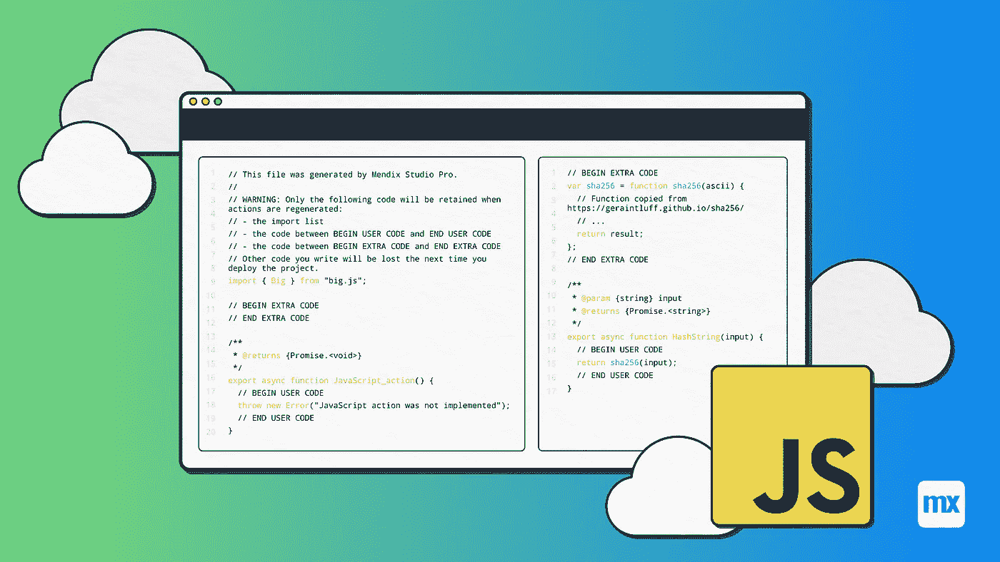

# JavaScript 动作的威力

> 原文：<https://medium.com/mendix/extending-the-mendix-platform-the-power-of-javascript-action-f8ae6d3bfbd4?source=collection_archive---------3----------------------->

## 扩展 Mendix 平台

## 低代码构建速度快！但是当标准组件不符合要求时会发生什么呢？没问题，大家都可以扩展 Mendix 平台。通过 JavaScript 操作，可以向客户端应用程序添加新的功能。

我们喜欢低代码平台 Mendix 的原因是，与传统编码相比，我们可以更快地完成许多事情。它有一套很棒的功能；然而，这并不能完全满足你的需求。在这种情况下，你可以延长平台，并转移到高代码，这是一个逃生舱口。更好的是，Mendix 允许您封装这些高级代码，并允许开发人员以一种简单、可重用的方式与每个人共享他们的工作。

Mendix 的前端技术是 JavaScript，在 web 和原生应用中都可以使用。让我们仔细看看这为应用程序带来的各种可能性。

有时候，设计需要开发人员构建一个在 Mendix 生态系统中不存在的可视化 UI 组件。当它没有与 Mendix Studio Pro 一起出厂，并且在[市场](https://marketplace.mendix.com/)中不可用时，开发人员可以选择构建一个小部件。通常，他们可以重用互联网上现有的库，并将它们封装在一个[可插拔小部件](https://docs.mendix.com/apidocs-mxsdk/apidocs/pluggable-widgets)中。但是，一些客户端活动不需要可视化组件，而是由用户(点击)动作或定时事件触发。这些动作可以用 JavaScript 动作来实现，并在 Nanoflow 中使用。

**我们可以做什么类型的 JavaScript 动作？**

*   浏览器功能- [焦点](https://github.com/mendix/widgets-resources/blob/master/packages/jsActions/web-nanoflow-actions/src/FocusNext.ts)，滚动
*   本机设备功能、[摄像头](https://github.com/mendix/widgets-resources/tree/master/packages/jsActions/native-mobile-resources/src/camera)、[存储](https://github.com/mendix/widgets-resources/tree/master/packages/jsActions/nanoflow-commons/src/local-storage)、[位置](https://github.com/mendix/widgets-resources/tree/master/packages/jsActions/nanoflow-commons/src/geolocation)
*   Mendix API 的。[进度、签到、对象处理](https://github.com/mendix/widgets-resources/tree/master/packages/jsActions/nanoflow-commons/src/client)
*   外部服务呼叫；休息服务
*   加工；加密

在我们深入一些例子之前，让我们解释一下每个 JavaScript 动作中使用的框架代码。JavaScript 可以按照[文档](https://docs.mendix.com/refguide/javascript-actions)中的描述来编写，这取决于用例，它可以接受一些输入参数，也可以返回数据。新的 JavaScript 操作将生成以下模板代码:

JavaScript Action Skeleton code

JavaScript 动作导出异步函数。完整的客户端应用程序是用 JavaScript 编写的，运行在同一个线程中；因此，我们不应该阻止其他进程。不应阻止示例网络调用、计算、并行动作、布局和浏览器绘画中的其他进程，以防止负面的用户体验。在可能的情况下，所有处理都应该异步完成。JavaScript 中有三种实现异步代码的方法。

1.  传统[回叫模式](https://subscription.packtpub.com/book/web_development/9781783287314/1/ch01lvl1sec10/the-callback-pattern)
2.  更新的[承诺](https://developer.mozilla.org/en-US/docs/Web/JavaScript/Reference/Global_Objects/Promise)。
3.  现代[异步等待](https://developer.mozilla.org/en-US/docs/Learn/JavaScript/Asynchronous/Async_await)。

> 并非所有的浏览器都支持`*async*`和`*await*`，Mendix 平台将转换代码以兼容该平台支持的所有浏览器。

为了启发和展示 JavaScript 动作的威力，我们想与您分享一些例子来展示其功能和通用模式。

[https://www.mendix.com/mendix-world/?utm_medium=referral&utm_source=Employee&utm_campaign=GL-CE-2021-09-06-Mendix-World](https://www.mendix.com/mendix-world/?utm_medium=referral&utm_source=Employee&utm_campaign=GL-CE-2021-09-06-Mendix-World)

## 示例 1，Mendix 客户端—验证反馈

Mendix 在微流中有一个针对[验证反馈](https://docs.mendix.com/refguide/validation-feedback)的动作，但是在纳流中却没有。这可以用两行代码创建。

JavaScript action for validation feedback ([full action](https://gist.github.com/Andries-Smit/9b74886e8d9afb4e7876f050bb1b251e#file-validationfeedback_full-js))

当搜索 Mendix 客户端 API 时，我们可以找到[对象验证](https://apidocs.rnd.mendix.com/9/client/mendix_lib_ObjectValidation.html)。通过对简化的 Mendix 客户端代码进行一些研究，您可以发现验证是如何应用的。

> 警告:当使用 [Mendix 客户端 API](https://docs.mendix.com/apidocs-mxsdk/apidocs/client-api) 时，强烈建议只使用有文档记录的 API，没有文档记录的 API 被认为是私有的和不受支持的。Mendix R & D 团队可以在两次发布之间更改或删除 API。升级时依赖不受支持的 API 可能会有风险。

## 示例 2，浏览器 API —滚动到顶部

有浏览器 API 和 HTML 特性可以派上用场。不是所有的都可以作为一个动作。例如，滚动到顶部。

Scroll action ([full action](https://gist.github.com/Andries-Smit/9b74886e8d9afb4e7876f050bb1b251e#file-scrolltotop_full-js))

通过一个操作，我们可以访问文档中的所有元素。所有可滚动容器都由类名“mx-scrollcontainer-wrapper”标识。

“getElements*”函数将返回一个[节点列表](https://developer.mozilla.org/en-US/docs/Web/API/NodeList)，要遍历节点列表，必须将其转换为一个数组。

这个动作展示了一个链接函数的例子，部分是[函数式编程](https://opensource.com/article/17/6/functional-javascript)，一个有趣且更科学的方法。

> 动作不应该操纵 DOM，因为渲染是由 React 完成的，React 将以不可预知的方式更新并删除更改。
> 
> 注意:这个动作只会影响“滚动容器”部件，如果部件或其他 html 元素溢出并使用滚动，它们将不会被重置。

## 示例 3，外部依赖关系—本机文件系统创建文件

在开发原生移动应用时，Mendix 在核心[原生模板](https://docs.mendix.com/howto/mobile/native-build-locally#3-getting-the-native-template)中提供了一组原生能力。这些功能可以通过额外的 React 本机模块进行扩展，并在实际中使用。此示例访问文件系统。

Native file systems action ([full action](https://gist.github.com/Andries-Smit/9b74886e8d9afb4e7876f050bb1b251e#file-writefile_full-js))

这个 JavaScript 动作看起来微不足道，尽管本地动作开发人员必须记住 JavaScript 依赖于 JavaScript 模块和本地模块。JavaScript 模块可以安装在项目的“javascriptactions/ <mendix module="">”文件夹中。本机模块需要添加到本机模板中，参见[如何构建本机操作](https://docs.mendix.com/howto/extensibility/create-native-javascript-action)一文。</mendix>

> 使用 Mendix 9，decencies 管理变得更容易，请参见[https://docs . Mendix . com/API docs-mxsdk/API docs/native-dependencies](https://docs.mendix.com/apidocs-mxsdk/apidocs/native-dependencies)但是，您仍然需要在 action 文件夹中安装 JavaScript 模块作为依赖项。

## 示例 4，额外功能—数字签名 SHA256

有些文本永远不能更改，为了证明内容没有更改，可以创建一个数字签名。一个众所周知的散列签名是 SHA256。JavaScript 实现可以在[这里](https://geraintluff.github.io/sha256/)找到。让我们用它来创建一个动作。

Shortened sample Hash String action using SHA 256 ([full action](https://gist.github.com/Andries-Smit/9b74886e8d9afb4e7876f050bb1b251e#file-hashstring_full-js))

要使用 sha256 函数，可将其复制到“额外代码”部分。在操作中，我们调用复制的函数并返回结果。

> 请注意，该函数不是异步的，返回值是在一个承诺中传递的，并被解析为符合所请求的签名。虽然从技术上讲，当 action 函数直接返回字符串时，它也可以工作。

## 问题 5，承诺回电—获取位置

许多异步库使用回调参数而不是承诺。回调函数可以是嵌套的，但这可能会使代码难以阅读。一个好的做法是将回叫功能包装到承诺中:

Get location ([full action](https://gist.github.com/Andries-Smit/9b74886e8d9afb4e7876f050bb1b251e#file-getlocation_full-js))

虽然这个示例返回一个带有经度和纬度的字符串，这对许多用户来说没有用，但是它演示了如何从一个使用 call back 参数的函数创建一个承诺。

> 还要注意，在拒绝承诺时，必须传递一个错误，而不是一个平面文本字符串。

## 最优方法

在 Mendix 文档中，你会找到一篇关于 JavaScript 动作的[最佳实践的完整文章。一些一般性建议:](https://docs.mendix.com/howto/extensibility/best-practices-javascript-actions)

*   永远不要相信用户的输入，总是在运行之前验证输入。
*   优雅地处理错误，确保抛出描述性错误。
*   用可重复使用的小组件设计您的动作。
*   对于本机模块，使用安全导入。如果所需的模块不可用，应该怎么办？用标准的 Mendix Make Native(开发人员应用程序)优雅地处理丢失的模块是保持应用程序(部分)功能的有用实践。

## 那么…你打算建什么？

当平台没有提供你需要的现成的东西，市场没有为你提供解决方案时，没有理由停下来。你可以扩展平台；你只是被你自己的想象力所限制。例如，Mendix 9 中新的渐进式 Web 应用程序。对于 PWA 来说，一些很棒的新功能可以通过 JavaScript 操作解锁！

那么，你会建什么？请在评论中告诉我们，在[论坛](https://mxforum.mendix.com/)上分享，并在[市场](https://marketplace.mendix.com)上发布。如果您需要帮助，请通过 [Mendix 社区 Slack 频道“javascript-actions](https://mendixcommunity.slack.com/archives/CKFS6HC3U) ”联系我们。

## 学习资源

*   举一反三:[https://github . com/mendix/widgets-resources/tree/master/packages/jsActions](https://github.com/mendix/widgets-resources/tree/master/packages/jsActions)
*   什么是 JavaScript 动作？https://docs.mendix.com/refguide/javascript-actions
*   如何构建原生 JS 动作？[https://docs . mendix . com/how to/extensibility/build-JavaScript-actions](https://docs.mendix.com/howto/extensibility/build-javascript-actions)
*   Mendix 客户端 API 文档[https://apidocs.rnd.mendix.com/9/client/index.html](https://apidocs.rnd.mendix.com/9/client/index.html)
*   你不懂 JavaScript！[https://github.com/jumaschion/You-Dont-Know-JS-1](https://github.com/jumaschion/You-Dont-Know-JS-1)

关于作者，Andries Smit 是 CLEVR 的首席技术官，为 Mendix [市场](https://marketplace.mendix.com/)贡献了 40 多件商品。

*来自发布者-*

*如果你喜欢这篇文章，你可以在我们的* [*媒体页面*](https://medium.com/mendix) *或者我们自己的* [*社区博客网站*](https://developers.mendix.com/community-blog/) *找到更多喜欢的。*

*希望入门的创客，可以注册一个* [*免费账号*](https://signup.mendix.com/link/signup/?source=direct) *，通过我们的* [*学苑*](https://academy.mendix.com/link/home) *获得即时学习。*

有兴趣更多地参与我们的社区吗？你可以加入我们的 [*Slack 社区频道*](https://join.slack.com/t/mendixcommunity/shared_invite/zt-hwhwkcxu-~59ywyjqHlUHXmrw5heqpQ) *或者想更多参与的人，看看加入我们的* [*遇见 ups*](https://developers.mendix.com/meetups/#meetupsNearYou) *。*