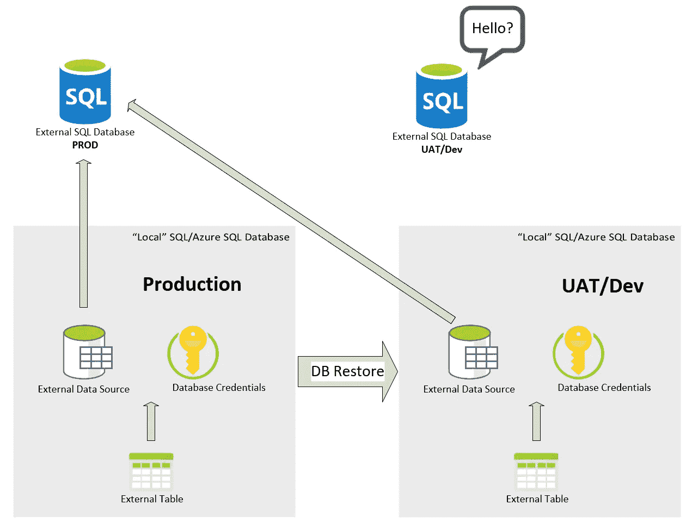

# 外部表可能会带来安全风险

> 原文：<https://medium.com/version-1/external-tables-can-be-a-security-risk-b758024d08d2?source=collection_archive---------0----------------------->

SQL Server 外部表是一个很好的资源，也是一个潜在的可怕的安全风险。

Photo by Pixabay

## **总结**

*   这是一种不好的做法，但是出于开发\UAT 的目的，人们经常将一个生产数据库恢复到另一个服务器。
*   恢复的生产数据库中外部表的外部数据源仍将**引用生产**

## 外部表在 SQL Server 中如何工作？

外部表是一个很好的特性，它允许我们查询不同数据库中的数据，就像它是我们正在处理的数据库中的本地表一样。

它们通过一个“外部数据源”工作，该数据源定义了我们想要查询的远程服务器和数据库，以及一个“数据库范围的凭证”，该凭证安全地保存了远程服务器/数据库的认证细节。

## 怎么会全部出错呢？

***外部数据源*** 和 ***凭证*** 作为对象**存储在数据库中。**

因此，如果我们将 prod 数据库恢复到 UAT/Dev，我们也将恢复 ***数据源*** & ***凭证*** 。这给下面的场景带来了风险:我们有一个 UAT/开发数据库，但是**外部表正在引用生产。**

OOpps — UAT is accessing PRODUCTION tables, this is VERY bad.

显然，如果我们遵循最佳做法& Prod 位于不同的网络上，没有到 UAT/开发的路由，我们只会看到一个错误，但情况并非总是如此。

## 结论

请注意将生产数据库恢复到 UAT/开发环境的后果。

在版本 1 中，我们强烈主张并实施一个强大的仅向前的 CI/CD 流程，其中 UAT/开发配置可以升级到生产，但生产不能降级到 UAT/开发。

将 data 开发分开&如果绝对必要，只移动数据，而不是整个数据库及其所有意想不到的负担。

理想情况下，在开发/UAT 使用数据匿名化流程或合成数据。

**关于作者:**
Mike Knee 是这里 1 版的 Azure 数据开发者。