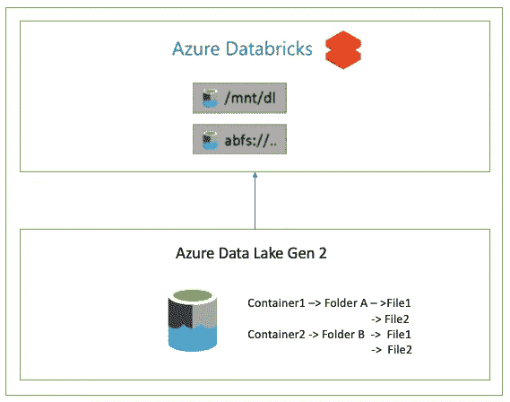

# Azure 数据块中的外部表和 Azure 数据湖 gen2 中的底层数据

> 原文：<https://medium.com/walmartglobaltech/external-tables-in-azure-databricks-with-underlying-data-in-azure-data-lake-gen2-c45b9d81c6d5?source=collection_archive---------1----------------------->



我们可以通过多种方式在 Azure Databricks 中创建外部表格。这篇博客将试图涵盖不同的方式，每种方式的利弊，以及它们适用的场景。

Databricks 接受 SQL 语法或 HIVE 语法来创建外部表。在这篇博客中，我将使用 SQL 语法来创建表格。

注意:我没有使用凭证传递特性。

# **方法一。使用挂载点**

第一种方法是使用 location 字段中的挂载点。在 ADLS 2 中，使用服务主体在所需的文件夹级别创建挂载点。将使用服务主体和 OAuth 2.0 进行身份验证

例如:

```
**CREATE TABLE** db_name.table_name(
col_name1 col_type1,....
)**LOCATION** "dbfs:/mnt/mount_name/......"
```

我们不需要在 create 命令中指定 external，因为我们正在指定位置，它会自动创建一个外部表。

这种方法的优点是它是开始访问和操作数据的最简单的方法。假设数据所有者创建了挂载点，它在整个工作空间中都是可用的。业务用户和数据工程师可以使用这些挂载点并操作表数据。

这种方法的缺点是存在未经授权访问数据的高风险。有权访问工作区的每个人都可以查询此表。假设业务用户“a”无权访问表(ADLS2 位置)，但有权访问工作区，那么“a”仍然可以查询表，因为身份验证是通过服务主体进行的。

# 方法二。使用完整的 ADLS2 路径

在这种方法中，我们在位置字段中使用完整的 abfss 路径。身份验证仍然通过服务主体进行。

例如:

```
**CREATE** **TABLE** db_name.table_name(
col_name1 col_type1,
...
)  
**USING** data_source
**LOCATION** "abfss://container_name[@s](mailto:hnw-exec-dashboard-write@pd21522c1spstg.dfs.core.windows.net)torage_account/..."
```

或者

```
**CREATE TABLE** db_name.table_name(
col_name1 col_type1,
...
)
**USING** data_source 
**OPTIONS**(**path** "abfss://container_name[@s](mailto:hnw-exec-dashboard-write@pd21522c1spstg.dfs.core.windows.net)torage_account/...")
```

完整的创建表语法可以在[这里](https://docs.databricks.com/spark/latest/spark-sql/language-manual/create-table.html)找到

这种方法的主要优点是只有知道授权码的用户才能访问这些表。这些代码需要在同一个会话中执行。在前面的方法中，即使我们不共享授权码，由于服务主体的原因，未授权用户仍然能够访问，而这里用户需要在每个会话中指定代码。

缺点是如果暴露了服务主体细节，用户就可以访问这些表。

# 结论

在这篇博客中，我们已经介绍了在 Azure Databricks 中创建外部表的方法。每种方法都有优点和缺点，选择适合您的生产场景的方法。