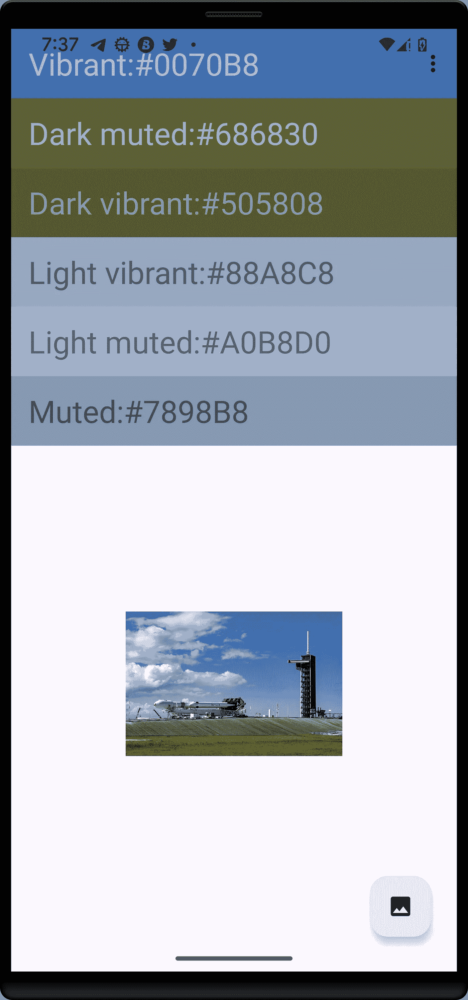

# 使用调色板 API Android 从图像中提取颜色

> 原文：<https://blog.kotlin-academy.com/extracting-colors-from-an-image-using-the-palette-api-android-ac319aaadac6?source=collection_archive---------0----------------------->


Photo by [Lucas Kapla](https://unsplash.com/@aznbokchoy?utm_source=medium&utm_medium=referral) on [Unsplash](https://unsplash.com?utm_source=medium&utm_medium=referral)

从图像中提取颜色并不是什么新鲜事，但是如果你注意到一些媒体播放器根据当前播放的媒体项目的插图来改变它们的主题(工具栏、工具栏标题文本颜色、状态栏颜色和其他属性),那么从图像中提取颜色在主题应用中被广泛使用。这是怎么做到的或者怎么做到的？

## 创建 Android 项目并添加依赖项

为此，我们将首先打开 Android Studio IDE，并创建一个从 Material2 或 Material3 扩展而来的新 Android 项目。接下来要做的是在你的应用级 *build.gradle* 文件中添加组件面板 API 依赖，如下所示；

```
implementation "androidx.palette:palette-ktx:1.0.0"
```

我们要做的下一件事是在我们的 *activity_main.xml* 文件中添加 6 个工具栏和一个 FAB，它将用于从用户的图库中挑选图像。下面是 *activity_main.xml.* 的代码

activity_main.xml 文件有 6 个 *MaterialToolbars* ，一个 *FAB，*和一个 *ImageView。*当点击 FAB 时，我们将从图库中选择一幅图像，并使用所选图像设置 ImageView 的位图，我们将进一步从位图创建所谓的调色板。我们将使用调色板的不同样本来设置各种材料工具栏的背景颜色。

## 样本

样本代表从图像调色板生成的颜色样本。样本有三个我们感兴趣的重要属性:样本的 *RGB* 值、*标题文本颜色、*和*正文文本颜色*。这三个属性有我们将使用的 getter 方法。

我们感兴趣的颜色配置文件(样本)有六种，它们包括*鲜明*、*亮鲜明*、*暗鲜明*、*柔和*、*亮柔和、*和*暗柔和*样本。我们的每个工具栏的背景将被设置为一种特定的颜色，标题将是名称加上背景颜色的十六进制值，标题颜色将是样本的标题颜色。

## 从位图生成调色板

我们将从编写从图像位图生成调色板的函数开始，我们将提取我们感兴趣的六个颜色配置文件(假设它们都存在)。这是使用 *Palette.from(位图位图)完成的。generate()* 同步生成调色板。

上面的代码解释了它自己，因为我们只是设置每个工具栏的背景并改变它们的标题。颜色的整数值是使用样本获得的。扩展函数 *Int.hextString()* 简单地返回 Int 颜色的十六进制值。

## 实现从图库中选择图像

为了从图库中选择图像，我们将使用 ActivityResult APIs 并注册一个启动器，当 FAB 被单击时启动它。下面是源代码

我们将调用`onCreate`中的`registerImagePicker`函数，并从输入流中创建一个位图。然后我们使用位图来调用函数`createPalette`，这样就完成了。调用的结果如下所示。我们需要调用`contentLaunch.launch("image/*")`来从图库中获取图片。这里，当点击浮动操作按钮时，调用完成。



Screenshot of Pixel 4XL with chosen image from gallery

从所选的图片来看，主色调是蓝色，这就是为什么鲜艳的颜色是蓝色。标题的颜色是从函数调用`Swatch.getTitleTextColor()`中得到的标题文本颜色。选择不同的图像，各种颜色会相应地改变，但请注意，不能保证这些颜色在图像中都可用。这就是我们在对样本进行各种调用之前检查可空性的原因。

[](https://kotlin-academy.us17.list-manage.com/subscribe?u=5d3a48e1893758cb5be5c2919&id=d2ba84960a)