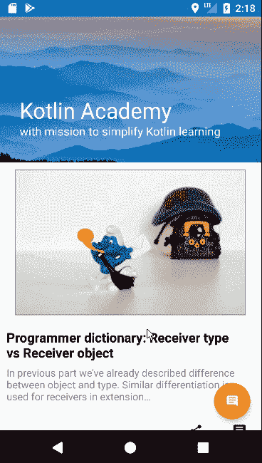
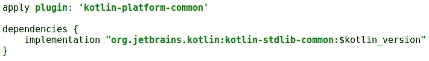
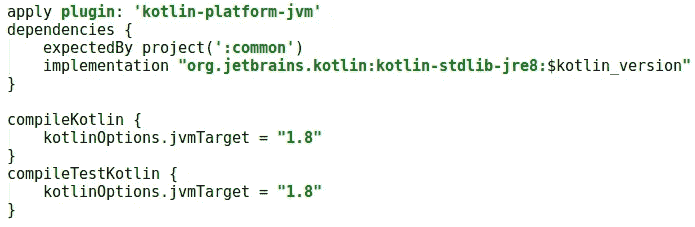
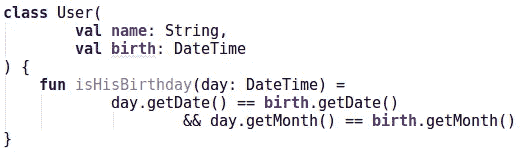
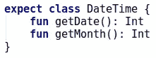
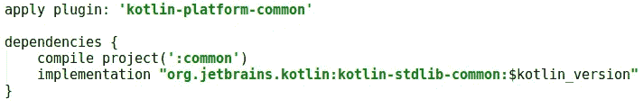
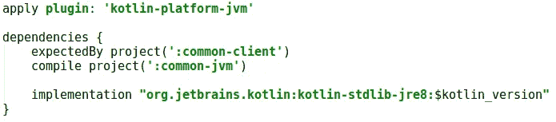
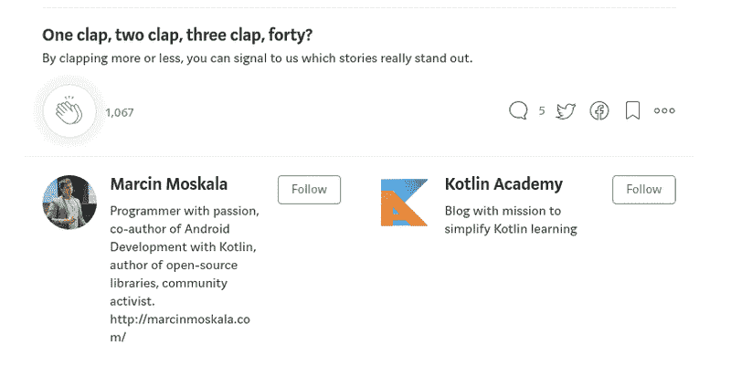

# Android 中多平台通用模块的提取

> 原文：<https://blog.kotlin-academy.com/extracting-multiplatform-common-modules-in-android-4a564cc03e0a?source=collection_archive---------7----------------------->

你知道如何制作 Android 项目，但现在你想让它们多平台化。你听说了 Kotlin 提供的新的可能性，你想了解一下。是时候学习如何用[坚固的多平台架构](/architecture-for-multiplatform-development-in-kotlin-cc770f4abdfd)制作一个 Android 部件了。

# 演示

要查看示例，请查看 [Kt。学院申请](https://play.google.com/store/apps/details?id=org.kotlinacademy.mobile)。它是更大的开源多平台 Kotlin 项目的一部分，该项目包括更多其他平台的客户端。

# 科特林

第一步是将 Android 项目移入 Kotlin。[这里的](/cleaning-up-android-project-using-kotlin-7265b24901)是一个如何做到这一点的例子。别担心，不会影响应用程序的工作方式。相反，它会帮助你使代码更具表现力、可读性和可靠性。

# 创建公共模块

接下来，您需要提取公共模块。通用模块是 Kotlin 模块，其代码不特定于任何平台。它可以编译成 Kotlin/JVM、Kotlin/JS 或 Kotlin/Native。因此，它可以在所有其他模块中重用。(你可以在[科特林文档](https://kotlinlang.org/docs/reference/multiplatform.html#multiplatform-project-structure)中了解更多信息)

要创建*公共*模块，请在项目根目录下添加名为`common`的空文件夹。在其中，您应该创建`build.gradle`配置文件。这是您可以开始使用的基本配置:

build.gradle in common module

你也应该为你的来源做一个文件夹`common/src/main/kotlin`。你将把所有的`common`模块代码放在那里。你还需要在你的`settings.gradle`里`include 'common'`。如果您现在同步，那么您的项目中将会有空的公共模块。这是您将放置代码的模块，这些代码将在所有其他模块之间共享。问题是你还不能在你的 Android 项目中使用它，因为你仍然需要*平台模块*。

# 创建平台模块

您不能在您的 Android、iOS 或 web 模块中直接使用 *common* 模块，因为它不是特定于任何平台的(我们所说的平台是指 JVM、JS 或 Native)。首先，我们需要通用模块的特定于平台的变体，这些变体指定了区分平台的小事情(如果有的话)。

目前我们只需要 Kotlin/JVM 变体，因为我们只实现了 Android，所以需要定义`common-jvm`。添加以下最小化的`build.gradle`文件(它使用 Java 8):

build.gradle in common-jvm module

这个项目将包括所有特定于 Kotlin/JVM 的代码。它可以依赖于 JVM 库，如 Gson、Retrofit 或 JUnit。你也应该为它的来源制作文件夹`src/main/kotlin`。

现在，您可以回到您的 Android 并添加对`common-jvm`的依赖:

当您同步项目时，您应该已经完成了所有设置。让我们最后提取数据模型。

# 提取数据模型

[数据模型](https://en.wikipedia.org/wiki/Data_model)是一组表示我们如何在应用程序中查看数据的类。通常还有代表 API 如何看待数据的 DTO 对象。它们都不应该包含任何逻辑，而应该只包含用于保存和获取数据表示的属性和函数。它们不应该依赖于平台，因此可以很容易地移动到`common`模块。要移动它们，我们只需要将文件从`android`源移动到`common`模块源。只要包没有改变，项目中的其他一切都应该运行良好。如果你的数据模型不依赖于任何平台相关的类，那么你不需要添加任何东西到`common-jvm`中，一切都会好的。

更大的问题是当一些类转移到`common`模块时依赖于平台特定的类或库。经常的例子是当他们使用 Java 标准库中的`Calendar`或`Date`时。这样的类会抛出错误，因为公共模块不能使用平台特定的特性。简单的解决方法是将这样的声明隐藏在接口后面，或者用原语替换它们(比如本例中用 millis 替换`Long`)。尽管我们将不得不在整个项目中改变我们如何使用它们。更好的方法是在`common`模块中为这些类实现*预期声明*，在`common-jvm`模块中实现*实际声明*。一般预期的类声明是需要在每个平台模块中实现的类及其方法的定义(目前只有`common-jvm`)。

只要我们不在*公共*模块上使用任何方法，我们就可以用`common`中定义的`DateTime`替换`Date`声明:

我们可以这样指定`common-jvm`中的*实际申报*:

如果我们需要在*公共*模块中使用它们，我们也可以在这个期望类中添加一些期望方法。假设我们需要得到年份:

虽然 Java date 有`getDate`和`getMonth`方法，但我们只需将它们添加到预期声明中，一切都会运行良好:

尽管我们可能不喜欢 Java `Date`接口，相反我们可能希望指定新的类来覆盖它。查看我对这些实现的描述[这里](/architecture-for-multiplatform-development-in-kotlin-cc770f4abdfd)或者[这里](/multiplatform-native-development-in-kotlin-now-with-ios-a8546f436eec?source=collection_detail----e57b304801ef-----13----------------)。这样，我们可以使整个数据模型变得清晰，并且独立于平台类。

# 为什么会这样？

现在，您可以轻松地添加其他模块，使它们依赖于`common`，并从共享数据模型的事实中获益。例如，你可以制作`backend`或者制作更多的客户端(网络、桌面、iOS、浏览器插件和几乎所有你能想到的其他客户端)。尽管它只是数据模型，而且您可能有兴趣提取更多信息。尤其是不同的客户共享相同的业务逻辑，这非常重要，需要进行单元测试。让我们现在提取它。

# 创建客户端通用的模块

类似地，我们已经创建了`common`和`common-jvm`，现在我们应该创建`common-client`和`common-client-jvm`。它们将用于保存业务逻辑。Android 项目要依赖`common-client-jvm`，`common-client`要依赖`common`，`common-client-jvm`既要依赖`common-client`又要依赖`common-jvm`。

build.gradle in common-client module

build.gradle in common-client-jvm module

如果现在刷新 project，将会配置两个附加模块。

# 最有价值球员

有许多不同的开发架构，但大多数都没有制作业务逻辑独立于平台实现的部分。尽管这是清洁建筑最重要的基本要求之一。这也是 MVP 架构背后最重要的思想之一。这就是为什么我认为它是具有共享客户端逻辑的多平台 Kotlin 项目的最佳候选。如果你对它不熟悉，那就看看这个演示文稿或者一些关于它的文章。多平台 Kotlin 开发环境中的一般概念也在[这里](/architecture-for-multiplatform-development-in-kotlin-cc770f4abdfd)描述。

# 提取业务逻辑

在 MVP 中，所有的业务逻辑都应该放在*展示者*或者*用例*中。它们应该只依赖于*视图*和*存储库*接口，所以这三个元素可以一起移动到`common-client`。

如果您使用了一些依赖于平台的支持库，如 RxJava 或 Guava，那么您需要消除这种依赖性，或者您需要为每种用法创建预期的声明。对于 RxJava 来说，一个很好的多平台替代品是 Kotlin 协程(查看这里的如何在公共模块中使用它)。

您可以在演示应用程序的[代码中看到演示者和视图是如何实现的。](https://github.com/MarcinMoskala/KotlinAcademyApp)[在这里](/architecture-for-multiplatform-development-in-kotlin-cc770f4abdfd)你可以找到其中一个演示者的详细描述，以及如何处理生命周期事件(我不想重复)。一般的想法是，每个活动、服务或片段都应该使用一个或多个呈现者。当某个事件发生时，它应该调用它的生命周期方法或其他方法。它还应该使用接口公开自己的一些方法。这样*视图*和*演示者*就可以沟通了。

更大的问题在于仓库。如果您通过隐藏在接口后面的构造函数将它们传递给演示者，那么一切都没问题。如果你使用依赖注入来提供它们，那么你就有更大的问题了。目前还没有支持公共模块的依赖注入库(尽管 Kodein 可能很快就会开始支持它)。在演示应用程序中，我们选择了轻量级依赖注入(这里也描述了[和](/architecture-for-multiplatform-development-in-kotlin-cc770f4abdfd#Demo))。为了使用它，我们需要用提供存储库的函数来定义预期的声明。因此，需要在`common-client-jvm`模块中定义存储库。

# 摘要

本文展示了我们如何使用 Kotlin *common* 模块提取 Android 中的公共元素。它强烈引用了[在 Kotlin](/architecture-for-multiplatform-development-in-kotlin-cc770f4abdfd#Demo) 中介绍有效多平台开发架构的文章。当我们开始实现另一个客户端或模块并重用这些元素时，所有这些步骤都是有意义的。这将在 Kt 的下一篇文章中描述。学院。订阅以获得最新信息。如果你现在想看看，那么你可以找到在[演示项目](https://github.com/MarcinMoskala/KotlinAcademyApp)上实现的 web、桌面和 Wear 客户端。也可以安装[安卓 app](https://play.google.com/store/apps/details?id=org.kotlinacademy.mobile) 或者访问[网页](http://portal.kotlin-academy.com/)。

下一篇文章:

 [## 多平台 Kotlin 项目中的共享客户端逻辑

### 我们已经展示了多平台 Kotlin 项目的架构。它的核心思想是我们如何定义客户逻辑…

blog.kotlin-academy.com](/shared-client-logic-in-multiplatform-kotlin-project-2509bc36ff51) 

## 学到了什么？单击👏说“谢谢！”并帮助他人找到这篇文章。

如果你认为这很重要，与他人分享。

你需要 Kotlin 工作室吗？请访问我们的网站，看看我们能为您做些什么。

要在 Twitter 上提到我，请使用 [@marcinmoskala](https://twitter.com/marcinmoskala) 。

