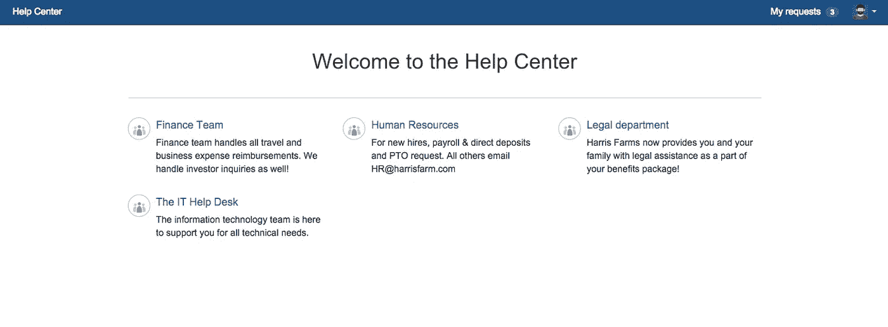
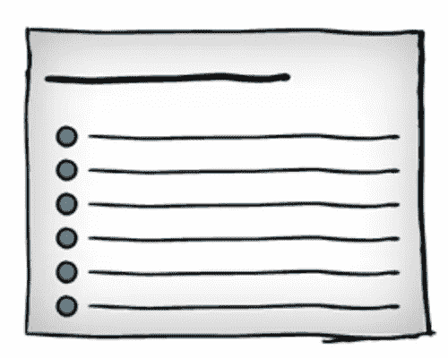

# Få et effektivt system for henvendelser til HR på under en uke med Jira Service Desk

> 原文：<https://medium.com/compendium/f%C3%A5-et-effektivt-system-for-henvendelser-til-hr-p%C3%A5-under-en-uke-med-jira-service-desk-a020c41234fb?source=collection_archive---------1----------------------->

I en virksomhet er det mange forretningsenheter som yter tjenester for andre deler av organisasjonen, og som løpende mottar forespørsler fra både interne og eksterne “kunder”. De fleste enheter er berørt av dette, typiske enheter som vil kjenne seg igjen i stor grad er HR, salg, finans og marked — og la oss ikke glemme IT.

> HR, salg, finans og marked kan alle få fordeler fra en effektiv håndtering av henvendelser

Målet er vanligvis å tilby en så rask og brukervennlig håndtering av saken som mulig. En arbeidsgiver vil også være opptatt av å gi sine saksbehandlere gode verktøy for effektiv samhandling som sparer tid og bryderi.

Behovet for løsninger som kan støtte og effektivisere slike prosesser er stort.

# E-post for håndtering av henvendelser

E-post er et svært vanlig verktøy for mottak av henvendelser. Dessverre er dette en kanal som ikke er spesielt egnet for samhandling rundt oppgaver.

Kommunikasjonen begrenses for det meste til en person internt som besvarer oppgaven. Skal man se historikken i en sak eller andre saker fra samme innmelder, må man ofte ty til søk i e-posthistorikk eller bruke omfattende strukturering av e-poster. Blir en saksbehandler syk eller slutter han er det vanskelig for andre å få oversikt i de sakene vedkommende jobbet med for å ta dem videre.

> E-post bidrar ikke til effektiv samhandling rundt henvendelser

# Bruk en servicedesk-løsning

Arbeidet vil forenkles betraktelig ved å ta i bruk ett verktøy som samler alle henvendelser ett sted, og hvor alle saksbehandlere jobber som ett team for å håndtere alt. De som behandler saker ønsker å kunne se alle mottatte henvendelser, historikk, relaterte saker og status på håndtering. Det er behov for at en av dem når som helst kan kommunisere med innmelder i saken og ta den videre i prosessen.

En utmerket måte å håndtere dette på er via en servicedesk-løsning, en brukervennlig portal for mottak av alle henvendelser. Saksbehandlerne kan holde orden på alle henvendelser, se hvem som har svart hva og følge status via et felles grensesnitt. E-poster mottas som før og lagres automatisk som henvendelser i systemet.

Atlassian tilbyr en servicedesk-løsning under navnet Jira Service Desk. Denne passer for både SMB og store bedrifter. En av styrkene til denne løsningen er at man kan velge mellom forskjellige standardoppsett og få mye ferdig konfigurert. Dermed sparer man tid til oppsett. Prismessig er løsningen gunstig, spesielt for mindre grupper.

En klar fordel er ett innebygget oppfølgingssystem, Jira, for oppgaver som skal rutes videre innover i organisasjonen. En enkel integrering med Confluence lar deg samle kunnskapsartikler og veiledninger ett sted. Disse kan vises dynamisk for brukere i portalen så snart de begynner å beskrive hva de trenger hjelp til. På denne måten kan mange henvendelser bli selvbetjente og dermed frigjør man tid og kapasitet i tjenesteteamet.

# Hvordan gå frem for å få en slik løsning?

Det er fullt mulig å få en løsning som er klar til bruk på under en uke når man har den rette ekspertisen og kravene ikke er for store. Computas er Atlassian Gold Partner og har sertifisert eksperter som gjerne hjelper med kartlegging av behov og oppsett av Jira Service Desk. Vi er selv aktive brukere av løsningen internt!

Start **dag en** med en workshop hvor det deltar nøkkelpersoner fra berørte enheter, samt en servicedesk-ekspert som har erfaring med gode mønstre for samarbeid i slike verktøy. Se på hvilke typer henvendelser og saker teamet typisk må løse, og hvordan de løses. Hvordan ser arbeidsflyten ut, og hvilke behov har kundene, saksbehandlerne og organisasjonen som helhet? Oppsummer innsikten og avklar spørsmål som dukker opp i etterkant.

**Dag to** utføres neste workshop hvor fokus er på fremtiden. Basert på dagens situasjon og ønsker pluss innspill fra ekspertene utforsker man mulighetene og utarbeider et forslag til løsning.

En plan utarbeides på **dag tre** . Denne beskriver mer detaljert hvordan løsningen skal settes opp og rulles ut blant brukere og hvilken opplæring som er nødvendig for saksbehandlerne i teamet. Planen kan med fordel oppdateres underveis med endringer og vil så fungere som dokumentasjon i etterkant.

Etter **dag fire** med implementering, er på **dag fem** tiden inne for å motta de første henvendelsene. En ny hverdag starter!

I den første fasen vil våre rådgivere følge med og gjøre fortløpende tilpasninger slik at man får en mest mulig hensiktsmessig løsning.

Lykke til med ny servicedesk-løsning!

**Er dette interessant for deg og ønsker du å vite mer? Se** [**https://computas.com/tjenester/atlassian**](https://computas.com/tjenester/atlassian)