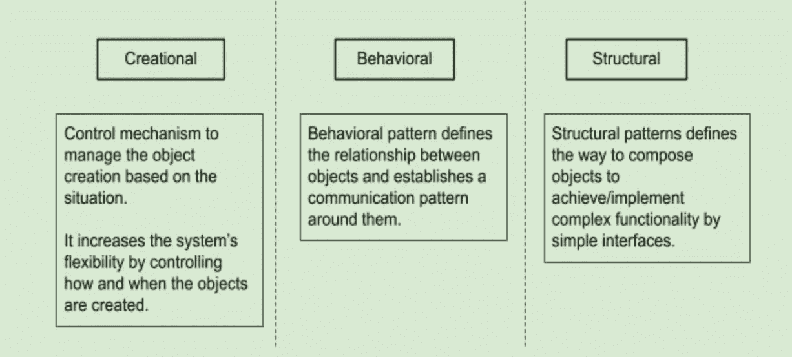

# 外观设计模式——自动化测试

> 原文：<https://medium.com/globant/facade-design-pattern-automation-testing-5a19e48883eb?source=collection_archive---------0----------------------->

# 什么是设计模式:

设计模式是帮助我们将项目规划转化为高效结构的模块。对于任何自动化测试框架来说，实现正确的设计模式对于实现代码的可读性、可靠性和可维护性是非常重要的。

**设计模式的类型:**

在自动化测试中，常用的设计模式有
1)页面对象模型

2)工厂设计模式

3)立面图案

4)单例模式

5)流畅的页面对象模型

**在这篇博客中，我们将讨论 Facade 设计模式，它有助于轻松、可重用地实现复杂而冗长的用户操作。**

**什么是立面设计模式？**

立面模型属于结构设计模式。它建议使用简单的接口来实现复杂/冗长的代码。当在自动化中实现时，我们设计一个 facade 类，它使用一个页面对象模型来实现组合在不同页面上执行的动作的方法。

再说说网购。作为一名客户，当我试图购买一件商品时，我需要浏览多个页面来输入送货地址、账单地址、付款信息、审核订单并最终下订单等。作为一名顾客，我唯一看到的是我的订单被保存了地址和支付信息，这对我来说是一个门面。

在自动化中，这种设计模式可以被看作是对页面对象模型的扩展，以创建不那么冗长、更简单和可读性更高的测试用例。

我们可以通过下面的例子来理解这个设计。

**这里我们有:**

1.  测试应用程序中不同页面的页面对象。
2.  一个 facade 类，它组合了前面提到的页面对象的动作。
3.  测试类，它们将与 facade 交互，只是为了在 UI 上完成动作。

**我们为什么需要门面？**

不断增加的测试自动化覆盖率和复杂的测试应用程序通常会导致冗长且不可维护的自动化测试。

示例:假设许多测试用例需要在多个页面上执行一系列操作，以到达测试范围开始的特定页面。

为了理解这一点，让我们以一个在线购物体验为例，作为一个用户，我想验证我的订单历史并与之交互。

**不使用 Facade 模式实现:**

上面这段代码的缺点是:

*   测试变得太长
*   如果在 UI 中引入了任何附加页面以到达最终页面，那么实现该流程的所有测试都需要更新。

例如，在上面的例子中，在点击订单历史链接之后，如果我们需要在导航到另一个页面之前执行一些操作(例如，选择下订单的时间范围),那么我们将不得不更新两个测试，这也增加了冗余代码行。

**使用 Facade 模式实现:**

我们可以通过在测试自动化框架中使用 Facade 模型来避免这种情况。作为一名 QA 工程师，我需要在我的 facade 类中适应这种变化，并且所有实现流程的测试都将有有效的变化。

**立面设计模式的优势:**

*   它提供了每个层次的用户操作所需的入口点。
*   当实现复杂的操作时，它增加了代码的可读性。
*   测试将会变得简单和简短，因为我们将 facade 类用于动作。
*   由于 Facade 是一个结构设计变更，它可以很容易地与任何现有的模式和/或方法集成，如 TDD、BDD 等。

为了理解这些优势，让我们考虑另一个网上购物体验的例子。作为最终用户，我想购买一件商品，并提供我对网站整体购物体验的反馈。

**立面缺点:**

*   增加了一个额外的间接层，这可能会影响性能
*   如果对于任何系统改变，类的结构被改变，那么外观层也需要被更新。

**总结:**

使用设计模式，增加代码的有效性和自动化。同时，它减少了复杂性和维护工作。在门面模式的情况下，工作量和效率可以直接与 LOC 矩阵相关联。

例如，对于订单历史场景:

无正面的~ 17

与正面锁定~ 14

我们能够将 LOC 降低约 17%,相应地，我们的维护工作量也会减少。

在 Facade 模式的帮助下，我们可以将复杂的实现与多个动作结合起来，并提供一个易于访问的简单接口来实现相同的操作。