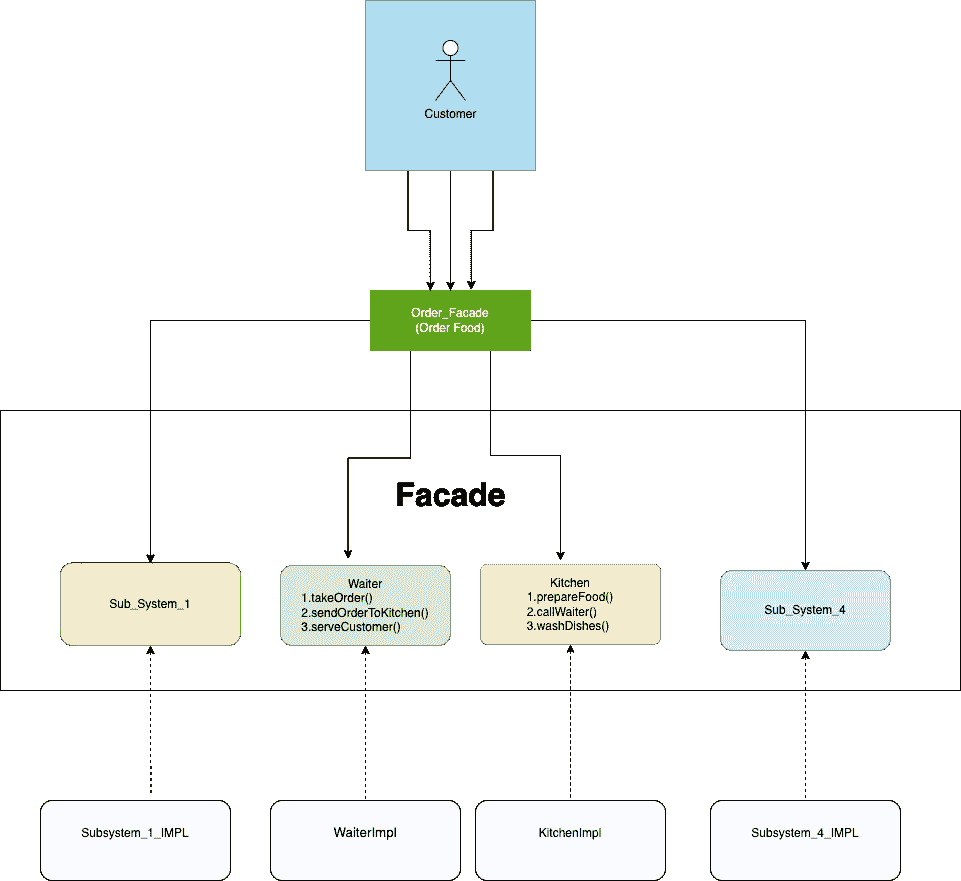

# Android 中的外观设计模式

> 原文：<https://medium.com/globant/facade-design-pattern-in-android-71ed37551087?source=collection_archive---------0----------------------->


Image Credit [Unsplash](https://unsplash.com/s/photos/waiter)

你好，神奇而热情的程序员。

在日常的编程生活中，您可能遇到过在项目级别同时使用多个库或多个组件，并试图让它们一起工作的情况。但是我们中的一些人可能在实现**抽象**的时候遇到了一些问题，这有助于**降低复杂性。**所以**为了避免**复杂性**或者**复杂的逻辑我们可以使用 facade 设计模式。****

**立面设计模式**是**结构设计模式**的一种。这种设计模式主要关注更容易地重新安排对象的结构。

下面我们试着对门面设计模式**做一个简单的简要说明。**

***什么是*** ***立面设计图案？***

*   门面就是面具的意思。它隐藏了客户端类的任何对象的复杂实现。
*   外观是为更复杂的逻辑或功能提供简化接口的对象。这意味着它提供了更高级别的接口，使得一组其他接口更容易使用。

*******立面设计模式的用例是什么？*******

*   **当有一个**复杂系统**需要更容易地暴露给客户时。**
*   **将应用程序代码与库代码分离。**
*   **在新的应用程序中重用遗留代码。**

*****立面设计模式有什么优势？*****

*   **这种模式避免或让用户远离子系统组件的复杂性。**
*   **我们可以实现子系统和它们的用户之间的松散耦合。**

*****代码片段及示例*****

**让我们举一个餐馆的简单例子。顾客只是简单的点菜单上的菜，顾客并不想知道谁来接单，谁来做饭，谁来洗碗。顾客只是想点餐并用餐。因此，菜单作为一个门面，使顾客更容易避免来自厨房甚至来自服务员的复杂性。**

****

1.  **现在你已经知道外观是做什么的了，它将为复杂的子系统提供简单的接口逻辑。所以让我们有两个界面服务员和厨房。**

```
**interface Waiter {     
     fun takeOrder()     
     fun sendOrderToKitchen()     
     fun serveFood() 
}interface Kitchen {    
    fun prepareFood()      
    fun callWaiter()      
    fun washesDishes()  
}**
```

**2.让我们为这两个接口创建一个实现类。**

```
**class WaiterImpl : Waiter {    
     fun takeOrder() {       
         Logger.d("Taking order from customer")    
     }    
     fun sendOrderToKitchen() {      
         Logger.d("Sending order to kitchen")    
     }    
     fun serveFood() {       
         Logger.d("Serving food to customer")    
     }
}class KitchenImpl : Kitchen {    
     fun prepareFood() {         
         Logger.d("Preparing food")     
     }     
     fun callWaiter() {         
         Logger.d("Calling waiter")     
     }
     fun washesDishes() {        
         Logger.d("Washing dishes")     
     }
}**
```

**3.现在我们将创建一个类作为 OrderFood，它将扮演菜单服务器的角色。**

```
**class OrderFood { val waiter: Waiter = WaiterImpl()  
   val kitchen: Kitchen  = KitchenImpl()  

   fun orderFood(oderId: String) {       
      waiter.takeOrder()     
      waiter.sendOrderToKitchen()       
      kitchen.prepareFood()       
      kitchen.callWaiter()       
      waiter.serveFood()       
      kitchen.washesDishes()   
   }  
}**
```

**4.**最后，顾客类，顾客打算在这里订购食物。****

```
**class Customer {
   private val orderFood = OrderFood()        fun main() {       
     orderFood.orderFood("ORD123456789")
   } 
}**
```

*****外卖*****

**在开发应用程序时，我们添加了一些第三方库，这些库在我们的项目中有一些类，并提供一些可重用的代码。在将库包含在项目中之后，开发人员可以直接将库中的这些类添加到应用程序中。**

**但是直接引用库并不是一个好的解决方案，因为应用程序代码与库紧密耦合，有时与库的特定版本紧密耦合。如果应用程序更加依赖这个库，那么用新版本的库替换这个库就更加困难。这是因为开发人员在用新的库替换旧库时需要更加小心。**

**所以我们可以使用外观设计模式来解决这个问题。使用外观设计模式，我们可以将应用程序代码从库代码中分离出来。facade 对象就像是库的包装器。当开发人员需要用新的库版本替换旧的库版本时，开发人员只需要专注于修改 facade 对象内部的代码。**

**在库代码上使用 facade 模式时，最好限制在应用程序中直接引用或直接使用库代码。幸运的是，这很容易通过以下步骤实现**

*   **通过在应用程序中创建单独的项目并向其中添加 facade 对象。**
*   **将具有外观的项目中的引用添加到第三方库。**
*   **仅使用 facade 从应用程序向项目添加引用。**

**我希望这篇文章对你有所帮助。还要特别感谢 [Rohit Chandekar](https://medium.com/u/c82347902bcd?source=post_page-----749339e32a7d--------------------------------) ！帮我写这篇文章。**

**谢谢你👏🏽**