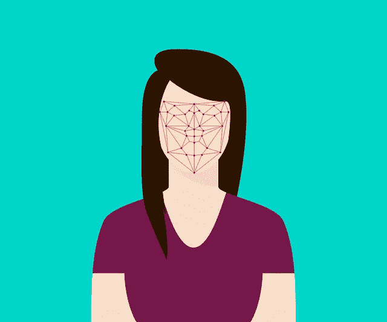

# 人脸识别——浏览器的诀窍！

> 原文：<https://medium.com/globant/face-recognition-the-browsers-knack-c445869e0cbf?source=collection_archive---------1----------------------->

Image by [teguhjati pras](https://pixabay.com/users/teguhjatipras-8450603/?utm_source=link-attribution&utm_medium=referral&utm_campaign=image&utm_content=3252983) from [Pixabay](https://pixabay.com/?utm_source=link-attribution&utm_medium=referral&utm_campaign=image&utm_content=3252983)

如果我告诉你，当你在笔记本电脑上处理一些敏感信息时，你的背后也可以有一双眼睛，你会怎么样？如果有人偷看你的笔记本电脑，你可以模糊你的数据，那会怎么样？想象一下，当你看着笔记本电脑屏幕的时候，你能看到背后发生的活动。听起来不可能，不是吗？其实不是。我在这里解释你如何只用你的浏览器就能做到这一切！

Image by [ErikaWittlieb](https://pixabay.com/users/ErikaWittlieb-427626/?utm_source=link-attribution&utm_medium=referral&utm_campaign=image&utm_content=534103) from [Pixabay](https://pixabay.com/?utm_source=link-attribution&utm_medium=referral&utm_campaign=image&utm_content=534103)

你觉得这可能是另一篇文章，给你一个解决方案，有很高的实施成本，大量的数据存储，等等？消除你的忧虑。我将向您展示一个完全在客户端和浏览器中的解决方案！

# 好了，浮华够了！让我们看看我们在谈论什么..

> 通过 face-api.js，我们开发出了**,一个支持人脸识别的智能银行仪表板。**

> ***你问什么是支持人脸识别的智能仪表盘？***

支持人脸识别——智能仪表板是与银行应用仪表板的信息安全相关的用例，由 Globant India 的智能 UI 计划团队开发，在 UINxt 2020 活动中演示。

> **这款智能仪表盘到底做了什么，让它变得足够智能？**

这个仪表板在两个方面都很智能，从技术实现和用例的角度来看。

从技术角度来看，它很聪明，因为它完全在客户端的浏览器中进行人脸识别

从用户的角度来看，它为用户的机密数据提供了更好的信息安全性。

> **智能仪表盘如何工作？**

如果一个人(授权用户)登录了一个银行帐户，正在查看他/她的仪表板数据，突然，除了登录用户之外的任何人不知不觉地从后面来到这里查看数据，只有在那个时候，这个智能仪表板才会识别到一个入侵者或其他人进入框架，并自动模糊显示，保护用户的机密数据。

# **好了，该看些代码了！**

> 这个智能仪表板是用 **face-api.js** 构建的，并使用了它和**模型**中可用的各种**API 来用用户图像进行预训练。我们使用了来自 **face-api** 的各种 api**

## **1。检测人脸**

检测图像中的所有人脸并返回数组<facedetection></facedetection>

检测图像中具有最高置信度得分的单个人脸，并返回 FaceDetection | undefined

## 2.**检测 68 个人脸标志点** -

在面部检测之后，我们预测每个检测到的面部的面部标志。

检测图像中的所有人脸+为每个检测到的人脸计算 68 个点人脸标志，并返回一个数组。

检测图像中具有最高置信度得分的面部+为该面部计算 68 个点面部标志。用 FaceLandmarks <withfacedetection>> | undefined 返回:</withfacedetection>

## 3.**计算面部描述符-**

在面部检测和面部标志预测之后，可以如下计算每个面部的面部描述符:

检测图像中的所有面部+为每个检测到的面部计算 68 个点面部标志。返回数组<withfacedescriptor>> > >:</withfacedescriptor>

检测图像中具有最高置信度得分的面部+计算 68 点面部标志和该面部的面部描述符。返回

WithFaceDescriptor <withfacelandmarks>>> |未定义:</withfacelandmarks>

## 4.**通过匹配描述符进行人脸识别-**

为了执行人脸识别，我们使用了 **faceapi。面部匹配器**将参考面部描述符(通过网络摄像头视频输入检测到的面部描述符)与查询面部描述符(在提供给预训练模型的图像中检测到的面部描述符)进行比较。

面部匹配器使用**欧几里德距离**作为两个面部描述符之间的相似性度量。

# **让我们现在就开始把所有东西放在一起吧！**

## 第一步:**包含 face-api.js**

包含 face-api.js 非常简单，您只需要使用 script 标记来包含它。简单地包括来自 [dist/face-api.js](https://github.com/justadudewhohacks/face-api.js/tree/master/dist) 的最新脚本

## 步骤 2 : **加载模型**

通过 **faceapi.nets 加载 face-api.js 提供的模型。**根据您的应用需求，您可以专门加载您需要的模型，但是要运行完整的端到端模型，我们需要加载人脸检测、人脸标志和人脸识别模型。

模型文件可以简单地作为静态资产在您的 web 应用程序中提供，或者您可以将它们托管在其他地方，并且可以通过指定文件的路径或 URL 来加载它们。假设您在模型目录中提供它们，以及 public/models 下的资产

## 步骤 3: **从一个图像或视频元素创建一个画布元素。**

## 步骤 4: **创建带标签的面部描述符**

## 步骤 5: **比较面部描述符&识别面部**

现在我们已经完成了识别，为包含敏感信息的 HTML 元素提供了一个“sensitive information”类。然后，我们在该元素上切换了一个“textshadow”类，以便在检测到入侵者时模糊敏感数据。

# 让我们把这些放在一起，在你的应用中形成一个基本的人脸识别设置

# 好吧！我们都设定了代码。现在是激动人心的演示！

在这里，您可以看到，一个人从后面走过来，窥视用户的笔记本电脑屏幕。一旦仪表板识别到另一个人(入侵者)进入框架，它会自动模糊用户的敏感数据，如帐户余额，贷款信息等。

这就是 smart dashboard 的全部内容，我现在要走了，我希望您会对此感兴趣…我希望收到您的来信…请在下面的评论中分享您的反馈。

祝你度过美妙的一周&阅读愉快！！！