# 使用 OIDC 模块的 Mendix 中的脸书单点登录

> 原文：<https://medium.com/mendix/facebook-sso-integration-in-mendix-using-the-oidc-module-eca7781fa78c?source=collection_archive---------1----------------------->

## 本博客将解释使用社交平台作为身份提供者进行身份认证的好处，以及我们如何在 Mendix 应用中使用脸书实现单点登录(SSO)。

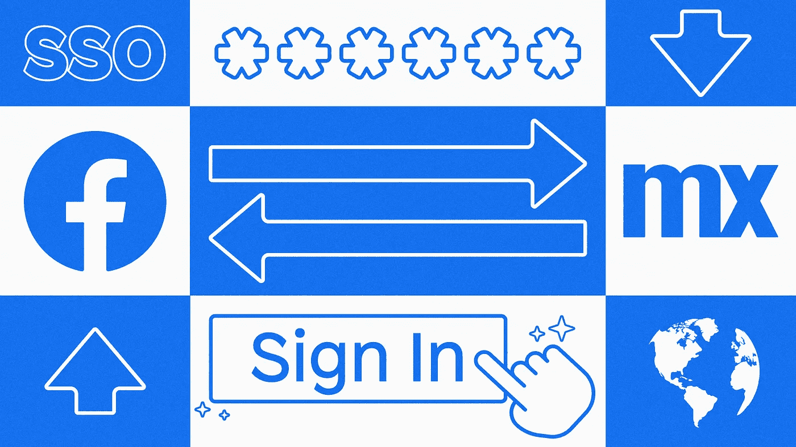

**Facebook SSO Integration in Mendix using the OIDC Module**

使用**“登录脸书”**或**“登录脸书”**的网站或 app 超过百万。你知道他们为什么使用脸书登录和它是如何有利于转换吗？

根据 smartinsights.com 的数据，地球上 79.8 亿居民中的 59%至少在一个社交媒体平台上——也就是 47 亿人！

[](https://www.smartinsights.com/social-media-marketing/social-media-strategy/new-global-social-media-research/#:~:text=More%20than%20half%20of%20the,within%20the%20last%2012%20months) [## 2022 年全球社交媒体统计研究摘要[2022 年 6 月]

### 社交网络已经改变了营销，正如这篇文章所显示的，在我们最新的…

www.smartinsights.com](https://www.smartinsights.com/social-media-marketing/social-media-strategy/new-global-social-media-research/#:~:text=More%20than%20half%20of%20the,within%20the%20last%2012%20months) 

# 为什么应该在应用程序中使用 SSO？

最大也是最重要的挑战是**在开发我们的应用程序时，让用户注册和登录变得快速而简单**。注册表单需要大量数据，这些数据需要用户手动填写，这**会导致潜在的用户流失**。

此外，用户需要在登录表单中输入他们的用户名/电子邮件和密码来验证自己，并且还需要记住更多的个人 id 和密码。

社交登录允许客户使用他们现有的**社交身份**和**来注册和登录**，而无需明确创建新的个人资料。

与其他社交媒体平台相比，脸书是最受欢迎的社交媒体提供商，拥有近 30 亿活跃用户，这一数字最近受到了抖音等其他平台的挑战，但脸书和 Meta 日复一日地继续增长和扩大他们的用户群。

在这篇博客中，我将解释如何以一种非常简单的方式在你的 Mendix 应用中实现**“用脸书登录”**功能。

脸书致力于 OAuth 2.0 协议。像谷歌、微软和 LinkedIn 这样的大多数社交提供商都在使用 OAuth 2.0。

## 我们需要什么？

在我们开始之前，检查你是否有你需要的一切。**确保您的脸书开发者账户已经创建**。

[](https://developers.facebook.com/) [## 面向开发人员的元

### 了解更多关于在 Meta Spark Studio 中构建虚拟对象以及在…上使用更新的 Meta Spark 播放器测试它们的信息

developers.facebook.com](https://developers.facebook.com/) 

此外，你的 Mendix 应用程序**必须包含一些市场模块**:

*   [社区公地](https://docs.mendix.com/appstore/modules/community-commons-function-library/)
*   [加密](https://docs.mendix.com/appstore/modules/encryption/)
*   [纳流公地](https://docs.mendix.com/appstore/modules/nanoflow-commons/)
*   [OIDC 模块](https://docs.mendix.com/appstore/modules/oidc/)


# **入门** —创建您的脸书登录应用程序

在这里，您可以找到创建脸书单点登录应用程序的完整分步指南。

## 第一步

前往[脸书开发者](https://developers.facebook.com/)并使用您的脸书证书登录。

> **注意**:请**不要使用商业账户**登录，因为脸书**不会允许你创建应用**。


## 第二步

点击**我的应用**，如下图所示。


## 第三步

点击**添加新应用**，如下图所示。

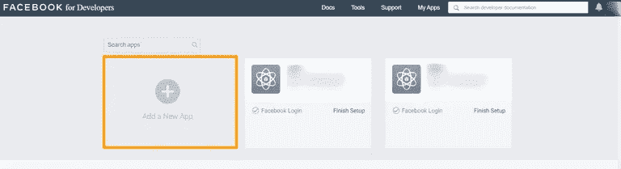

## 第四步

输入显示名称和联系电子邮件。完成后，点击“**创建应用 ID”。**

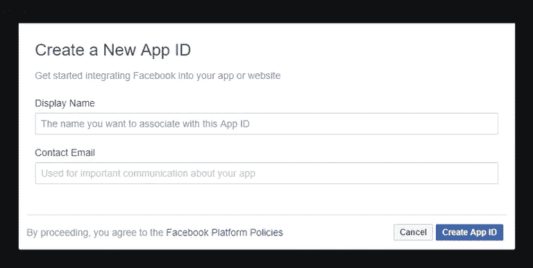

## 第五步

在安全检查中，完成安全步骤并点击“**提交”**按钮。

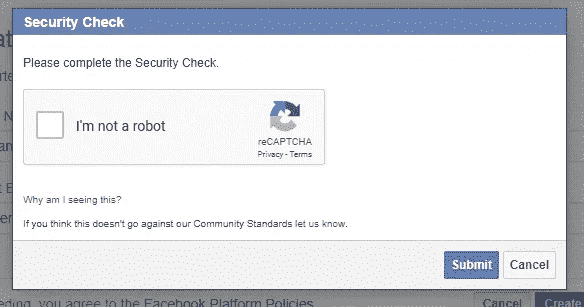

## 第六步

一旦你登陆应用仪表板，选择脸书登录，点击**设置**。

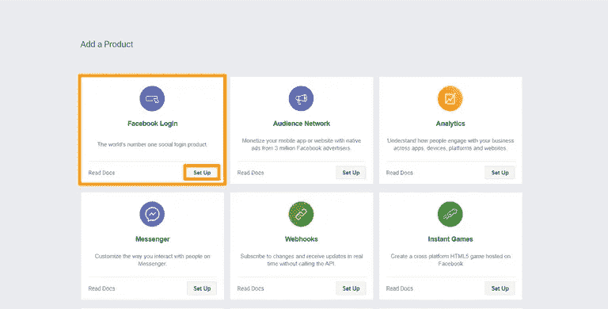

## 第七步

点击脸书登录下侧边栏中的设置。打开“客户端 OAuth 登录”。打开“Web OAuth 登录”。将有效的重定向 URL 放在**“有效的 OAuth 重定向 URIs”**上。

点击“保存”按钮。我用过我的 Mendix 免费云网址(沙盒网址)。

确保您的 URL 以“**/oauth/v2/callback/”**结尾

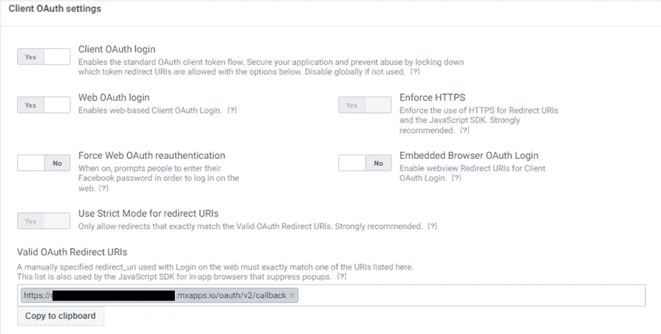

## 第八步

点击工具条中设置下的**基本**。在“应用”下，域名**包括你的网址**。输入所有必需的详细信息。**将应用程序的状态从右上角的“开发”更改为“实时”**。点击**保存修改**按钮。

> **NB！记下 App-ID 和**应用密码**。**

现在你的脸书应用已经准备好了。现在，您可以开始在您的 Mendix 项目中实现脸书登录过程了。

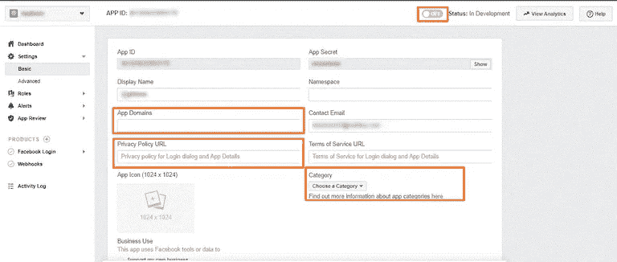

## 数据选择

当用户通过脸书登录登录您的网站或应用程序时，您可以访问存储在脸书上的用户数据。**脸书只允许新脸书 app** 的基本资料数据权限。为了根据您的业务需求获取更多数据，**您需要在您的脸书应用上启用附加权限**。脸书支持大约 42 种不同的权限。你需要选择你想从脸书收集的用户数据。

## 提交您的脸书登录应用程序进行审核

为了获取更多基本的个人资料数据点或向用户请求更多权限，你的脸书应用将经历一个审查过程。有时，企业需要应用程序的一些额外权限，为此，**您需要提交您的应用程序以获得批准，然后才能查询额外的用户信息**。

让我们回到 Mendix Studio Pro

# 在 Studio Pro 中配置你的 Mendix 应用

## **第九步**

**现在是这个构建的 Mendix 部分！为了确保匿名用户可以访问所需的页面，我们需要确保我们的应用程序配置为**将安全性设置为**“**生产**”，并且**允许匿名用户**访问。为此，我们需要一个来宾用户角色，我们可以选择它作为匿名用户。**

**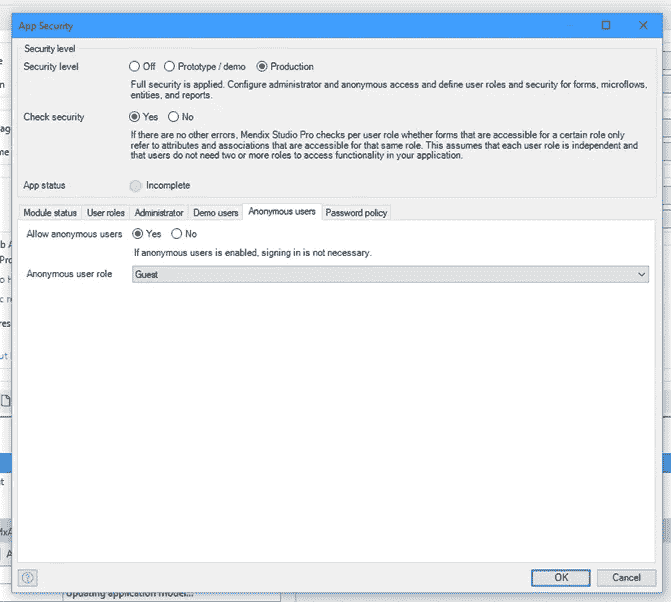**

**还要确保您的**访客用户角色作为匿名模块角色被分配给 OIDC 模块**，并且**管理员需要被给予同一个 OIDC 模块**的管理员用户角色。**

**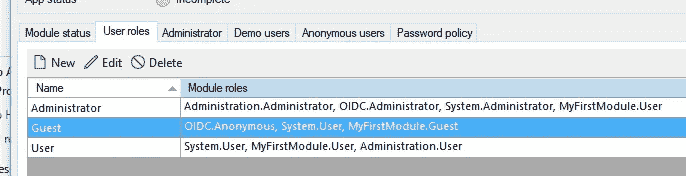**

## **第十步**

**既然已经配置了安全性和用户角色，我们还必须使用户能够访问登录页面。**在项目导航中为来宾添加基于角色的主页**。**

**您可以通过选择 OIDC 模块的“ **OIDC”来完成此操作。登录网页按钮**页面。另外，**为用户**提供一个基于角色的主页。**

**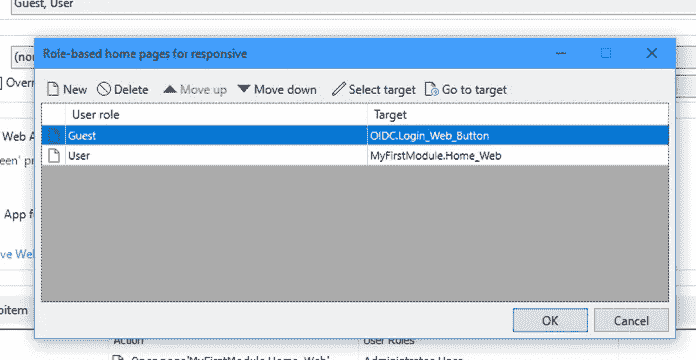**

**将页面**OIDC _ 客户 _ 概述**添加到导航中，并确保管理员可以访问它。**

## **步骤 11**

**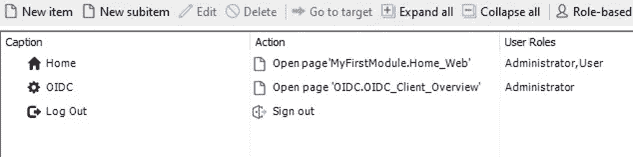**

**在本地运行您的应用程序，并以管理员用户身份登录。导航至 OIDC 客户端概览页面。点击**新建**到**创建一个新的配置。****

## **步骤 12**

**将别名填写为脸书(您可以使用任何名称作为参考)。**

**输入您的**客户端 ID** 并将**状态设置为活动**。最重要的是，你需要为 https://www.facebook.com/.well-known/openid-configuration(**)添加**自动配置 URL** 。****

****点击**导入配置**，模块会自动填充几个字段。****

****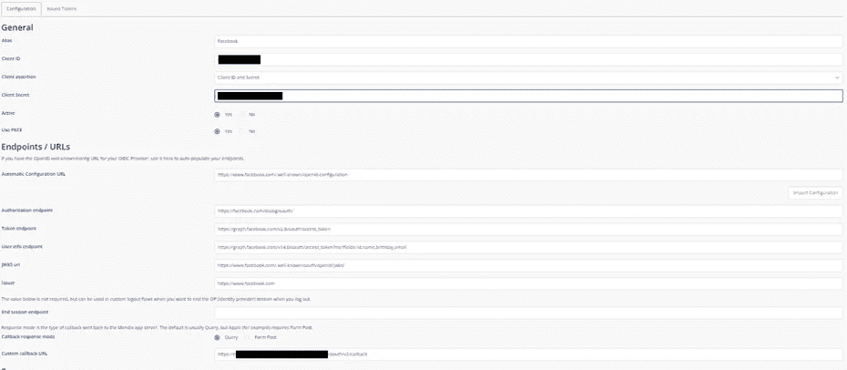****

****Configuration OIDC****

****如果很难放大输入字段，请在此处找到它们:****

```
****Alias Name**: Facebook**Client ID**: {Your client id}**Client secret key**: {Your secret key}**Client Assertion**: Client ID and Secret**Active**: Yes**Use PKCE**: Yes**Endpoint URLs****Automatic configuration URL**: [https://www.facebook.com/.well-known/openid-configuration](https://www.facebook.com/.well-known/openid-configuration)**Authorization endpoint:** [https://www.facebook.com/dialog/oauth](https://www.facebook.com/dialog/oauth)**Token endpoint:** [https://graph.facebook.com/v2.8/oauth/access_token](https://graph.facebook.com/v2.8/oauth/access_token)**User info endpoint**: [https://graph.facebook.com/v14.0/oauth/access_token?me?fields=id,name,birthday,email](https://graph.facebook.com/v14.0/oauth/access_token?me?fields=id,name,birthday,email)**JWKS uri**: [https://www.facebook.com/.well-known/oauth/openid/jwks/](https://www.facebook.com/.well-known/oauth/openid/jwks/)**Issuer**: [https://www.facebook.com](https://www.facebook.com)**Custom call-back URL**: [https://{yourapp}/oauth/v2/callback](https://{yourapp}/oauth/v2/callback)**
```

## ****第十三步****

****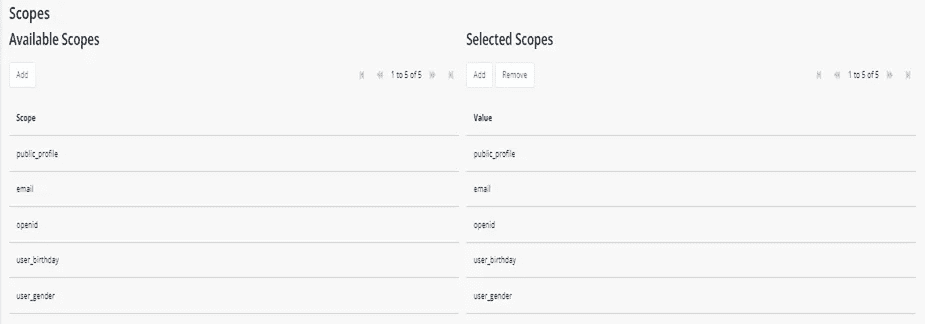****

****Scope****

## ****测试登录****

****当一个访客用户登陆你的网站时，他们会看到下面的页面，用户应该**点击“通过单点登录”。******

****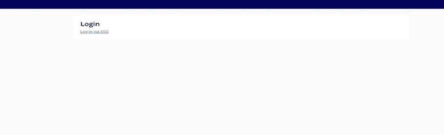****

****接下来，他们将看到这个屏幕，提示用户选择他们想要登录的脸书帐户。****

****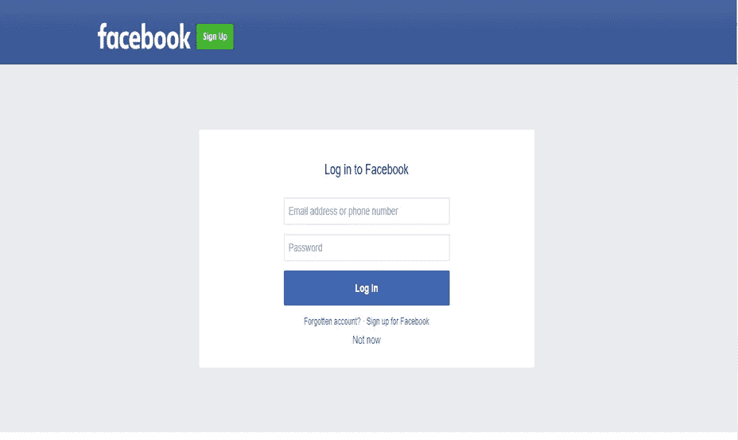****

****Facebook Login****

****如果您的配置成功，用户应该以经过身份验证的用户身份登录主页。****

****为了确保这个设置正常工作，我在主页上添加了一个数据视图，返回登录用户的帐户，并使用标签显示了$Account/Full Name 属性。****

****就这样，你完了。****

****希望有帮助。如果你有任何问题，请在下面留言。谢谢！****

## ****阅读更多****

****[](https://developers.facebook.com/docs/facebook-login/) [## 脸书登录-文档-开发人员脸书

### 如果您是脸书用户，在登录您的帐户时遇到问题，请访问我们的帮助中心。安全、快速且…

developers.facebook.com](https://developers.facebook.com/docs/facebook-login/) [](https://developers.facebook.com/docs/app-review) [## 应用回顾-文档-开发者脸书

### 应用程序审核是应用程序开发的一部分，它使我们能够验证您的应用程序在经过批准的环境中使用了我们的产品和 APIs

developers.facebook.com](https://developers.facebook.com/docs/app-review) [](https://developers.facebook.com/docs/facebook-login/guides/permissions) [## 权限指南-脸书登录-文档-开发人员脸书

### 人们可以向您的应用授予他们在个人级别管理的页面、群组和业务资产的权限。对于…

developers.facebook.com](https://developers.facebook.com/docs/facebook-login/guides/permissions) 

*来自发布者-*

*如果你喜欢这篇文章，你可以在我们的* [*中页*](https://medium.com/mendix) *找到更多喜欢的。对于精彩的视频和直播会话，您可以前往*[*MxLive*](https://www.mendix.com/live/)*或我们的社区*[*Youtube PAG*](https://www.youtube.com/c/MendixCommunity/community)*e .*

*希望入门的创客，可以注册一个* [*免费账号*](https://signup.mendix.com/link/signup/?source=direct) *，通过我们的* [*学苑*](https://academy.mendix.com/link/home) *获得即时学习。*

有兴趣加入我们的社区吗？加入我们的 [*松弛社区频道*](https://join.slack.com/t/mendixcommunity/shared_invite/zt-hwhwkcxu-~59ywyjqHlUHXmrw5heqpQ) *。*****